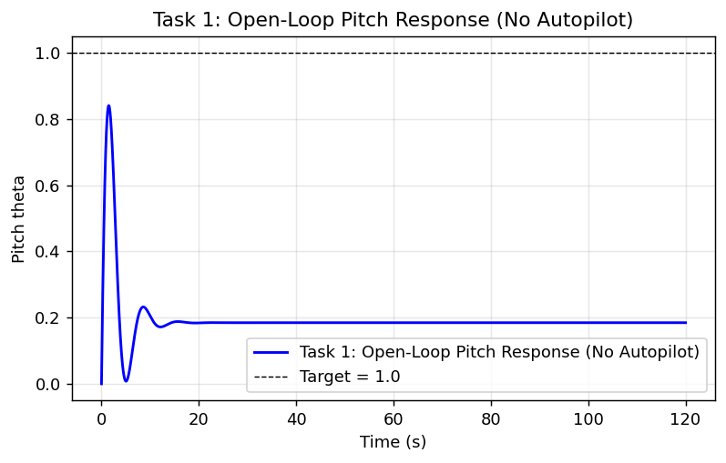
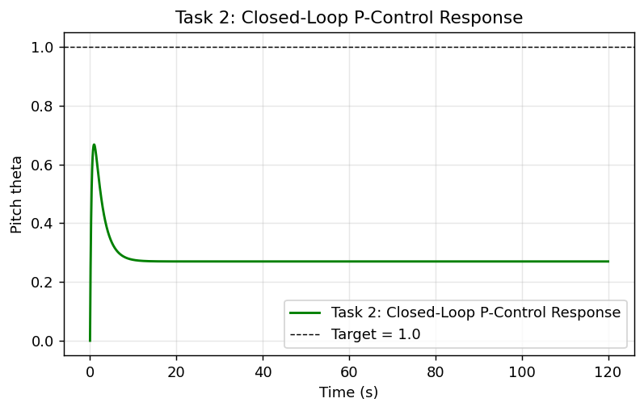
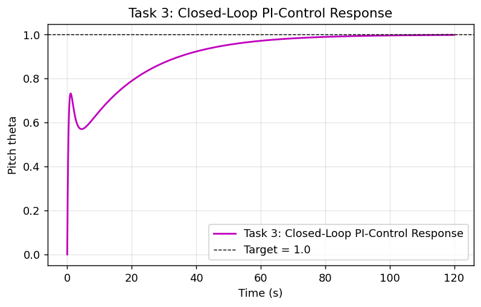
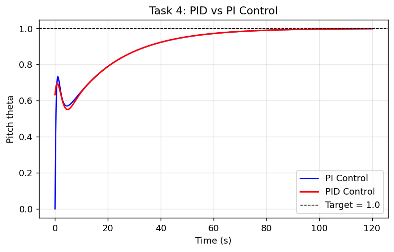
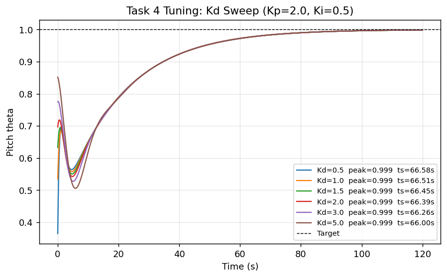

# CEC 300 — Fixed-Wing Aircraft Pitch Controller Lab Report

**Author:** [Your Name Here]
**Date:** 2026-04-22

---

## 1. Introduction

Module 6b introduced classical feedback control as a block diagram: a reference
`r(t)`, a feedback error `e(t) = r(t) − y(t)` fed into a controller, and a
plant whose output `y(t)` is compared back against the reference. This lab
applies that structure to a fixed-wing pitch-hold autopilot.

The plant equation derived in Section 2 of the lab guide,

```text
d²θ/dt² + 0.739 dθ/dt + 0.921 θ(t) = 1.15 dδₑ/dt + 0.17 δₑ(t),
```

contains two aerodynamic effects on the airplane (left-hand) side:

- **Aerodynamic damping (`0.739 dθ/dt`)** — the tail acts like a shock
  absorber. As the nose pitches, the tail moves through the airstream and the
  resulting moment opposes the motion, bleeding energy out of the rotation.
- **Aerodynamic stiffness / restoring force (`0.921 θ`)** — static stability.
  Any pitch deviation produces a moment that pulls the nose back toward the
  trimmed attitude (the weathervane analogy from the lab guide).

The right-hand side is the elevator command: a steady elevator deflection
contributes `0.17 δₑ`, and fast stick motion adds the "whip" term
`1.15 dδₑ/dt`. Taking the Laplace transform gives the plant transfer function

```text
G(s) = (1.15 s + 0.17) / (s² + 0.739 s + 0.921),
```

which the lab guide notes is underdamped (ζ ≈ 0.37) — the aircraft will wobble
before settling on a new pitch. The controller `C(s)` sits in front of `G(s)`
in a unity-feedback loop.

All PID controllers were built with the instructor's corrected coefficient
order `num = [Kd, Kp, Ki], den = [1, 0]`, which comes from writing the
controller as a single rational function `C(s) = (Kd s² + Kp s + Ki)/s`.

The full simulation is in [pitch_control.py](pitch_control.py); metrics table
is cached in [lab_data.json](lab_data.json).

---

## 2. System Plots

### Task 1 — Open-Loop Response



### Task 2 — P-Control (Kp = 2)



### Task 3 — PI-Control (Kp = 2, Ki = 0.5)



### Task 4 — PID vs PI (Kp = 2, Ki = 0.5, Kd = 1.5)



### Task 4 Tuning — Kd Sweep



---

## 3. Data Table

The four columns below correspond to the four tasks: **Open-Loop** is the
raw plant response with no autopilot; **P** is the Task 2 proportional
controller with Kp = 2; **PI** is the Task 3 proportional-integral
controller with Kp = 2 and Ki = 0.5; and **PID** is the Task 4 full
controller with Kp = 2, Ki = 0.5, and Kd = 1.5. Simulation horizon was
120 s so the integral-dominated closed-loop responses had time to reach
steady state; "Settle Time" uses the 2 % criterion.

| Metric                    | Open-Loop |   P    |   PI   |  PID   |
|:--------------------------|:---------:|:------:|:------:|:------:|
| Final Value (Steady State)| 0.1846    | 0.2696 | 0.9986 | 0.9987 |
| Steady-State Error        | 0.8154    | 0.7304 | 0.0014 | 0.0013 |
| Peak Value                | 0.8404    | 0.6675 | 0.9986 | 0.9987 |
| Settle Time (2 %)         | n/a       | n/a    | 66.64 s| 66.45 s|

The open-loop and P-control responses never fall within 2 % of the target —
open-loop levels off at ~0.185 because the plant's DC gain is less than one,
and P-control leaves a steady-state error that pure proportional action
cannot remove (see Q4).

---

## 4. Why Kp alone wasn't enough, and how Ki fixed it

With only proportional control, the elevator deflection is proportional to the
feedback error: `δₑ = Kp · e`. A non-zero deflection is needed to hold the
aircraft at a new pitch against the aerodynamic restoring force, so some error
has to remain. Module 6b describes this directly — as the error shrinks, the
proportional push shrinks with it, so the response lands "near, but not quite
at the commanded state." With Kp = 2 the response settled at 0.27, leaving an
error of 0.73.

Adding the integral term `Ki/s` accumulates past error over time. Even when
the remaining error is tiny, the integrator keeps driving the elevator
command upward until the error is zero. In the simulation this collapsed the
steady-state error from 0.7304 to 0.0014 — essentially eliminated.

---

## 5. How Kᵢ impacted the controller response

- **Steady-state error:** dropped by ~99.8 % (0.7304 → 0.0014). This was the
  dominant effect — the integrator accumulates the residual error and
  continues pushing the elevator until the error is gone.
- **Settle time:** the response now has one at all. Under P-control it
  converged to the wrong value. Under PI, it reaches the 2 % band at 66.64 s.
- **Plot shape:** the initial whip spike (~0.73) is similar to the open-loop
  and P-control transients, but after the natural wobble dips back to ~0.58,
  the integrator slowly winds up and carries the response smoothly to 1.0.

Ki does not itself change the damping of the airframe — the aerodynamic
damping term (0.739) comes from the plant. What Ki changes is whether the
loop is willing to keep pushing when the error is small. The cost is a slow
approach: the integrator at Ki = 0.5 takes time to wind up to the deflection
needed to hold the pitch. Module 6b notes this tradeoff — too small a Ki is
sluggish; too large risks overshoot or oscillation as the integral term
outruns the system.

---

## 6. How Kd impacted the controller response

The derivative term acts as a dampener — it reacts to how fast the error is
changing, not to the error itself. Module 6b describes its purpose as
limiting the rate of change more as the output reaches the set point,
mitigating overshoot.

I swept Kd across {0.5, 1.0, 1.5, 2.0, 3.0, 5.0} with Kp and Ki fixed:

| Kd   | Final  | SS Error | Peak   | Settle (2 %) |
|:----:|:------:|:--------:|:------:|:------------:|
| 0.50 | 0.9987 | 0.0013   | 0.9987 | 66.58 s      |
| 1.00 | 0.9987 | 0.0013   | 0.9987 | 66.51 s      |
| 1.50 | 0.9987 | 0.0013   | 0.9987 | 66.45 s      |
| 2.00 | 0.9987 | 0.0013   | 0.9987 | 66.39 s      |
| 3.00 | 0.9987 | 0.0013   | 0.9987 | 66.26 s      |
| 5.00 | 0.9988 | 0.0012   | 0.9988 | 66.00 s      |

Observations from the sweep plot:

- The **initial transient spike** at t ≈ 0.1 s grows with Kd (~0.37 at
  Kd = 0.5 up to ~0.85 at Kd = 5.0). A step into a `Kd·s` term produces a
  large derivative kick — effectively a sudden elevator punch.
- **Settle time and final value** barely move across a 10× sweep
  (66.58 s → 66.00 s; SSE 0.0013 → 0.0012).
- **Dampening / overshoot:** there is no overshoot above 1.0 in this
  configuration for any Kd, so there is nothing for the derivative term to
  damp. The response is integrator-limited, not damping-limited.

Kd has little to do in this tuning because the base PI loop is already
non-oscillatory. Its role would become meaningful if Kp were raised to
tighten the loop — overshoot would appear, and Kd would suppress it. Here, Kd
mostly just adds an initial control kick without changing the long-term
response.

---

## 7. Tuning results

The assigned gains (Kp = 2, Ki = 0.5, Kd = 1.5) produce an accurate response
(SSE ≈ 0.001) but a slow one (ts ≈ 66.5 s). Within the specified Kd range the
best settle time I reached was **Kd = 5.0 → ts = 66.00 s**, but the
improvement over Kd = 1.5 is less than 1 % (0.45 s out of 66 s) and comes
with a more aggressive initial control input. The assigned Kd = 1.5 is a
reasonable compromise:

- Accuracy: SSE ≈ 0.13 %.
- No overshoot above the commanded pitch.
- Moderate initial elevator deflection (no sharp kick that would feel jerky
  to passengers).
- Settle time ≈ 66.5 s (slow, but acceptable for a pitch-hold autopilot on a
  light aircraft where the restoring force is modest).

Raising Kp (and, proportionally, Ki) would be the more productive direction
if faster response were needed; Kd would then earn its keep by keeping the
tighter loop from ringing.

**Coefficient values used:** Kp = 2, Ki = 0.5, Kd = 1.5.
**Best observed settle time (assigned gains):** 66.45 s.

---

## 8. Lessons learned

1. **Proportional alone leaves the response "near, but not quite" at the
   target** — exactly the language Module 6b used. Seeing the 0.27 final value
   in Task 2 made that statement concrete.
2. **Integral action is what eliminates residual error**, and it does so by
   accumulating past error. That is also what makes it slow — the integrator
   at Ki = 0.5 needed ~60 s to wind up to the deflection required to hold
   pitch.
3. **Derivative action only helps when there is something to damp.** My Kd
   sweep showed almost no change across a 10× range because the base PI loop
   already rose monotonically toward 1.0 without ringing. Kd's role is to
   enable faster tuning, not to be useful on its own.
4. **Simulation horizon matters.** My first run used a 30 s window and the PI
   response looked stuck at 0.87 — it was actually still climbing. Extending
   to 120 s showed the integrator completing its wind-up and landing on 1.0.
   A good reminder to check whether a simulation has actually reached steady
   state before trusting its "final" value.
