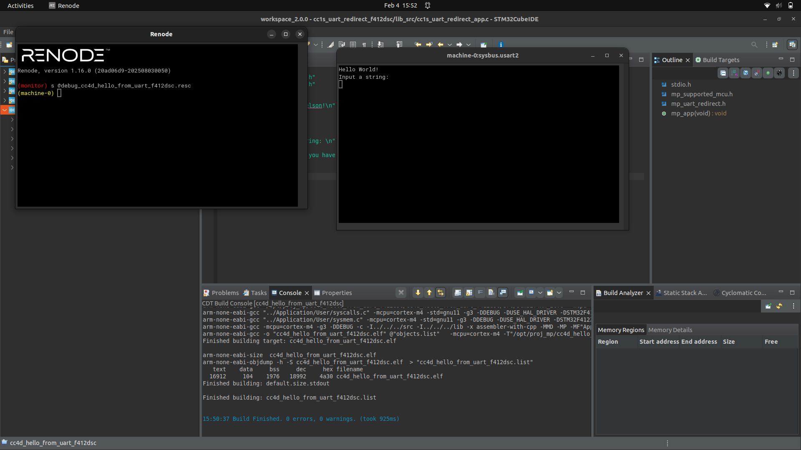
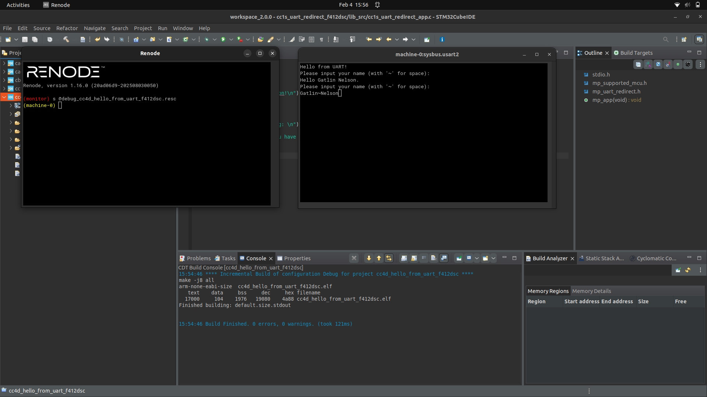

# Lab 01 Report: Creating a "Hello from UART" Project

**Course:** MP-CC4D
**Lab Start Date:** 2026-02-04
**Report Date:** 2026-02-04

---

## Introduction

This lab teaches creating an STM32 project from scratch using three DevTools: CubeMX for MCU configuration and code generation, CubeIDE for project management and building, and Renode for hardware emulation without physical hardware.

---

## Narrative

The main challenge encountered was configuring include paths in CubeIDE. After creating the `lib_src` folder and linking source files, the build failed with "mp_supported_mcu.h: No such file or directory" errors. Investigation revealed that the `lib_src` folder had its own include path settings (`../../lib_src`) that overrode the project-level settings (`../../lib`).

**Resolution:** The `.cproject` file was edited directly to replace the incorrect paths, and the entire `Debug/` folder was deleted to force complete makefile regeneration. Simply deleting `Debug/lib_src/` was not sufficient due to CubeIDE's makefile caching.

This issue and solution are documented in [known_issues.md](../known_issues.md) for future reference.

---

## Artifacts -Code Snippets and Screenshots

### Artifact A1: Initial UART Output



*Figure 1: UART2 window showing "Hello World!" and "Input a string:" output after successful project setup and Renode execution.*

---

### Artifact A2: Name Greeting with Tilde Substitution



*Figure 2: UART2 window showing the Task 3 implementation - user inputs name with tildes for spaces, program outputs greeting with proper spacing.*

---

### Task 3 Code: cc4d_hello_from_uart_app.c

**File:** [cc4d_hello_from_uart_app.c](./cc4d_hello_from_uart_app.c)

```c
#include <stdio.h>
#include "mp_supported_mcu.h"
#include "mp_uart_redirect.h"

static void mp_str2name(char *str, char *name);

void mp_app(void) {
    printf("Hello from UART!\n");

    SET_STDIN_TO_NO_BUFFER;
    char str[50];
    char name[50];
    while (1) {
        printf("Please input your name (with '~' for space): \n");
        scanf("%s", str);
        mp_str2name(str, name);
        printf("Hello %s.\n", name);
    }
}

static void mp_str2name(char *str, char *name) {
    char ch;
    do {
        ch = *str++;
        if (ch == '~') {
            *name++ = ' ';
        } else {
            *name++ = ch;
        }
    } while (ch);
}
```

*Code Snippet 1: Task 3 implementation featuring `mp_str2name()` function that converts tildes to spaces for multi-word name input via UART.*

---

## Discussions and Results

**Key Learnings:**

- CubeMX generates the project skeleton and HAL configuration, but custom source files must be linked manually in CubeIDE
- Eclipse CDT (CubeIDE's base) supports per-folder build settings that can override project-level settings - always verify makefile output
- Renode provides cycle-accurate hardware emulation, enabling development without physical MCU hardware
- The `scanf()` function with `SET_STDIN_TO_NO_BUFFER` enables interactive UART input in embedded applications

**Takeaway:** Understanding the complete STM32 toolchain workflow (CubeMX → CubeIDE → Renode) and its quirks is essential for efficient embedded development.
