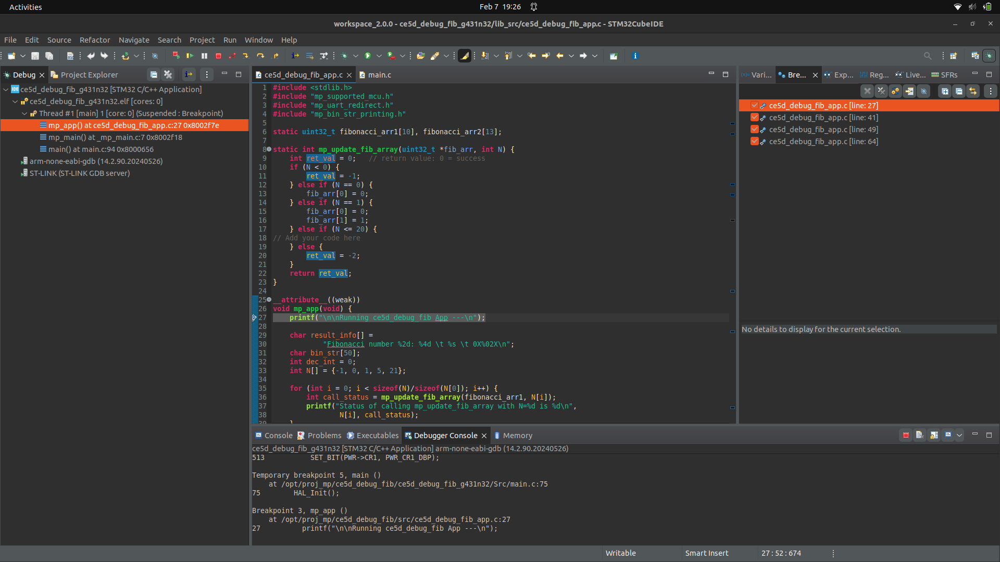
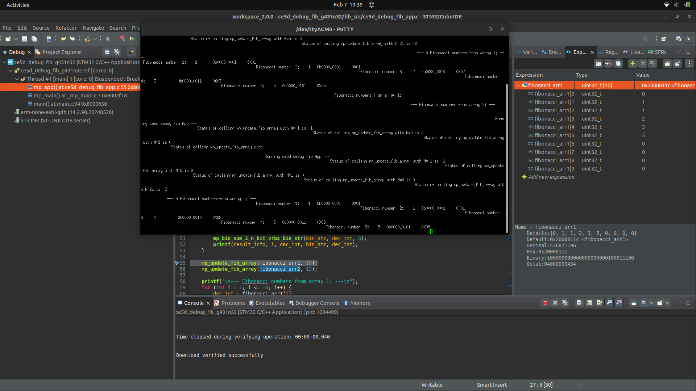
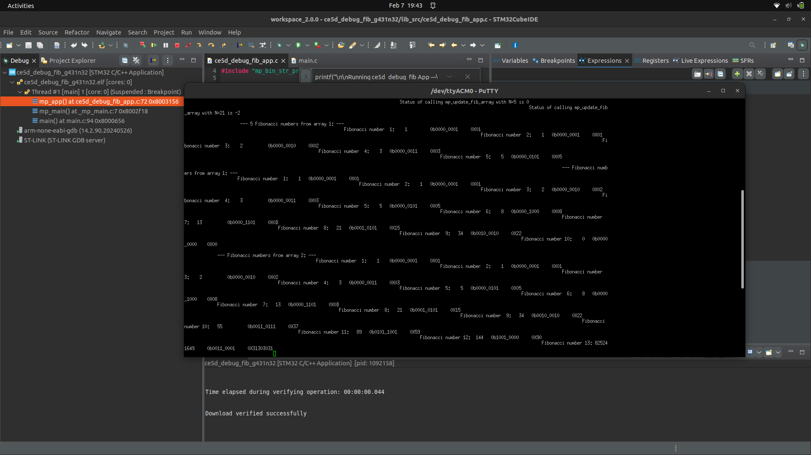
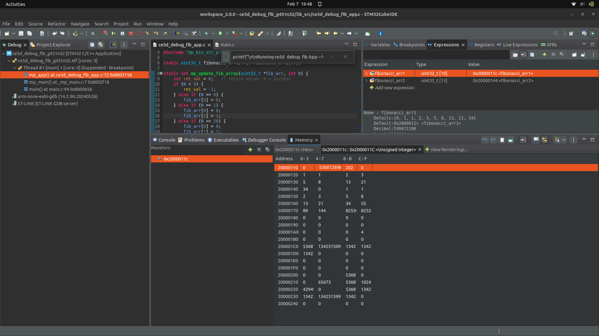
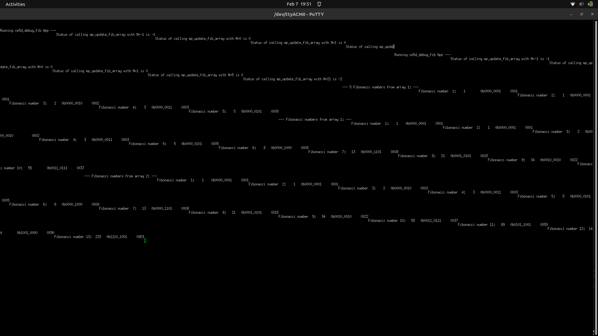

# Lab 02 Report: Debugging with CubeIDE for Fibonacci Number Generation

**Course:** CEC 320 / MP-CE5D
**Lab Start Date:** 2026-02-07
**Report Date:** 2026-02-07

---

## Introduction

This lab introduces debugging with STM32CubeIDE on the NUCLEO-G431KB board. The goal is to implement a Fibonacci number generator, use breakpoints to inspect local and global variables at different program stages, examine memory layout, and identify and fix an intentional array-size bug.

---

## Narrative

The main challenges were operational rather than algorithmic. The initial debug launch targeted the wrong project (`cb4a_str_case_cvt` instead of `ce5d_debug_fib`) because CubeIDE's Debug button re-uses the last debug configuration. This was resolved by using right-click → Debug As → STM32 C/C++ Application. Additionally, the initial build failed with `undefined reference to 'mp_main'` because `_mp_main.c` was not linked into `lib_src` — adding this file resolved the linker error.

The intentional bug was that `fibonacci_arr1[10]` and `fibonacci_arr2[13]` were too small for indices 0-10 and 0-13 respectively. This caused Fibonacci number 10 to read as 0 (out-of-bounds). Changing the sizes to `[11]` and `[14]` fixed the issue, producing the correct value of 55.

---

## Code Snippets and Screenshots

### Artifact A1: Halted Program at BP1

*Figure 1: CubeIDE Debug perspective showing program halted at BP1 on the printf statement. The suspended thread in the Debug view confirms the program has stopped.*

### Artifact A2: Local Variable Inspection at BP2

![A2 - N[] at BP2](./a2.png)

*Figure 2: Variables view showing array N with values {-1, 0, 1, 5, 21}. The array has 5 elements (size = 5).*

### Artifact A3: Global Variable Inspection at BP3

*Figure 3: Expression view showing fibonacci_arr1 = {0, 1, 1, 2, 3, 5, 0, 0, 0, 0} after computing 5 Fibonacci numbers. The array has 10 elements (declared size = 10).*

### Artifact A4: Full Printed Output at BP4

*Figure 4: PuTTY output showing both arrays. Note Fibonacci number 10 shows 0 due to the array size bug.*

### Artifact A5: Memory View

*Figure 5: Memory view at address 0x2000011c showing unsigned integer values. fibonacci_arr1 starts at 0x2000011c and fibonacci_arr2 at 0x20000144. The gap (0x28 = 40 bytes = 10 uint32_t) confirms fibonacci_arr1 has 10 elements. fibonacci_arr2 occupies 13 elements (0x34 = 52 bytes).*

### Artifact A6: Corrected Output

*Figure 6: PuTTY output after fixing array sizes to [11] and [14]. Fibonacci number 10 now correctly shows 55.*

### Source Code

**File:** [c1.c](./c1.c)

The completed `ce5d_debug_fib_app.c` includes:
- PT 1: `mp_update_fib_array` Fibonacci algorithm using a while loop
- PT 2: For-loop print code using `mp_bin_num_2_n_bit_vrbs_bin_str` for binary formatting
- DT 6: Array size fix from `[10]`/`[13]` to `[11]`/`[14]`

---

## Discussions and Results

**Key Learnings:**
- CubeIDE's Debug perspective provides Variables, Expressions, and Memory views for inspecting program state at breakpoints
- Array indexing in C starts at 0, so an array accessed with indices 0 through N needs size N+1
- The Memory view shows contiguous variable layout in SRAM, useful for understanding how arrays are stored
- When multiple projects exist in a workspace, always use right-click → Debug As to target the correct project

**Bug Analysis:** The arrays were declared as `fibonacci_arr1[10]` and `fibonacci_arr2[13]`, but `mp_update_fib_array` writes to indices 0 through N (inclusive). With N=10, index 10 is out of bounds for a size-10 array (valid indices 0-9). The fix increases sizes to N+1: `[11]` and `[14]`.
