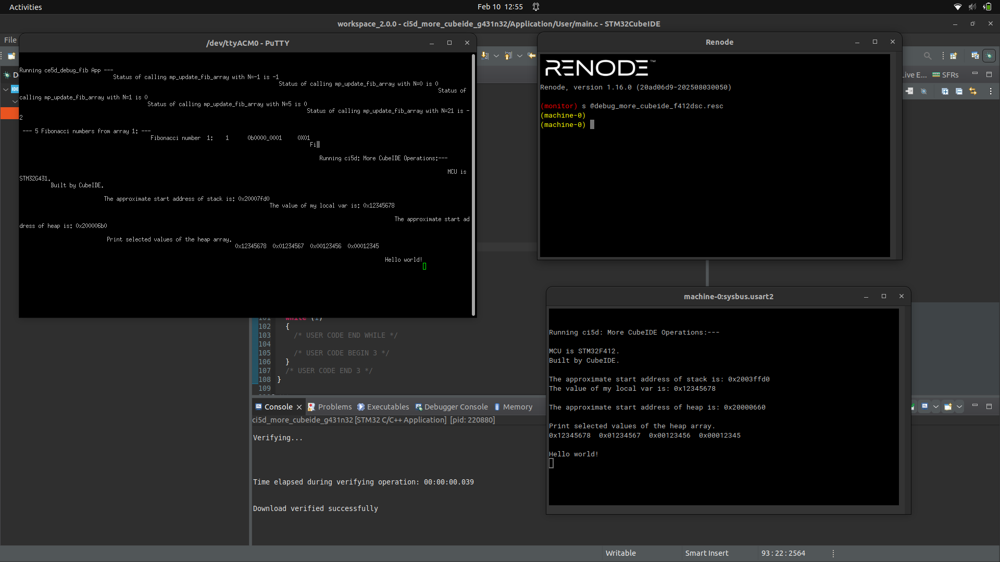
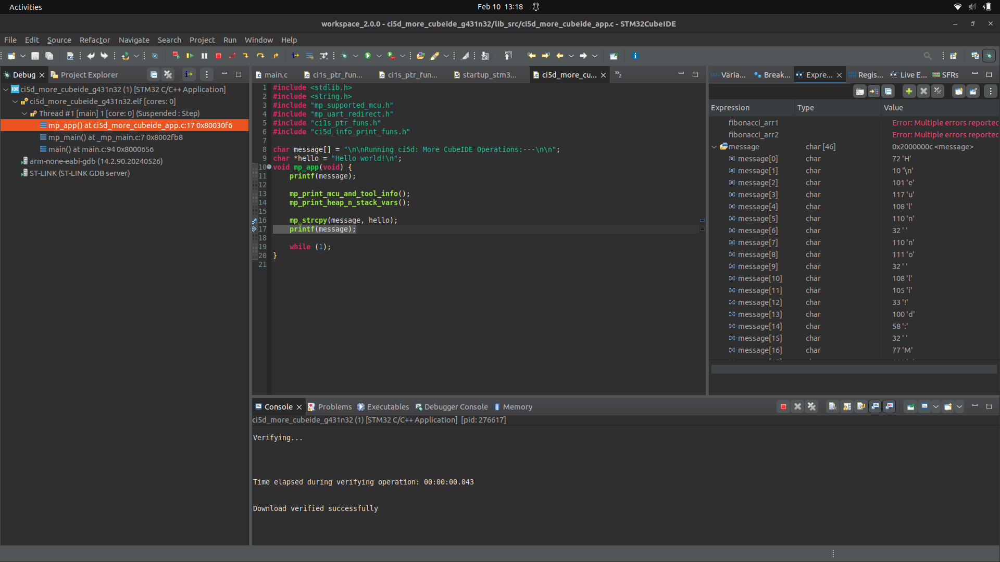
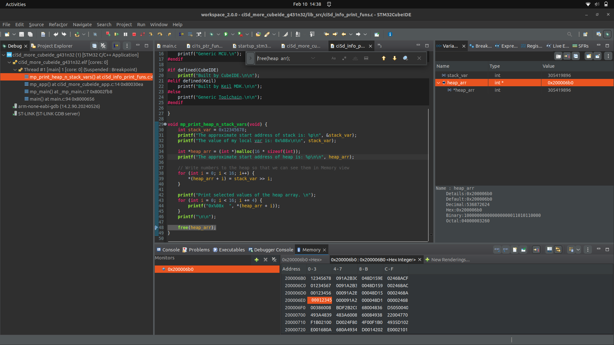
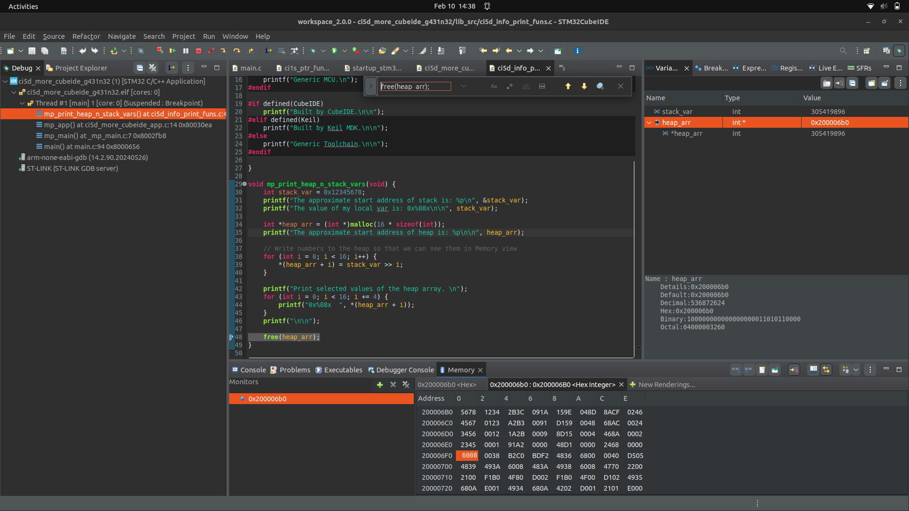
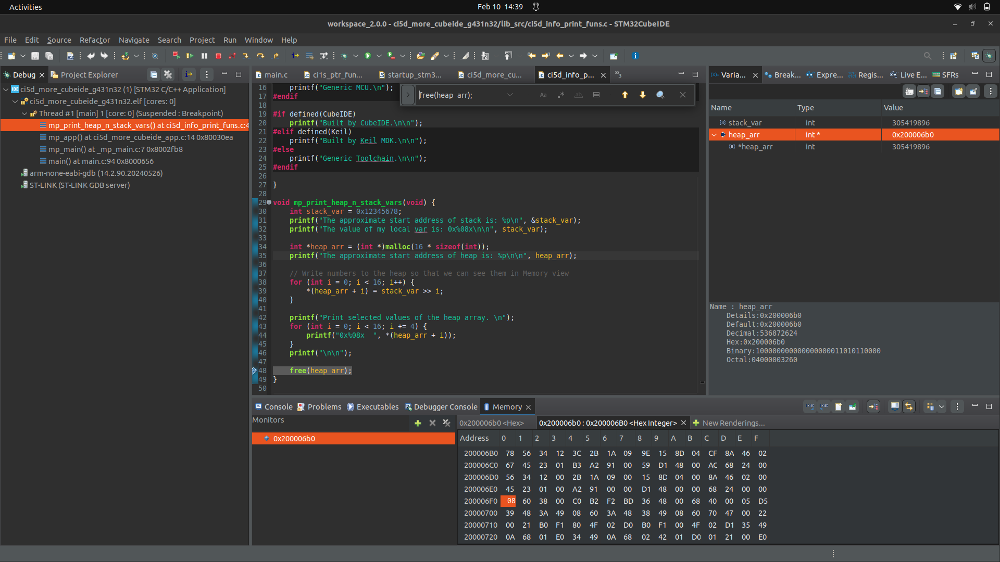

# Lab 03 Findings: More CubeIDE Operations

**Course:** CEC 320 / MP-CI5D
**Student:** ____________________
**Date:** ____________________

> **Related Documents:**
> - Procedure: [lab03_procedure.md](./lab03_procedure.md)
> - Original Manual: `mp-ci5d-lab3-more-cubeide-operations-26-02.pdf`
> - Known Issues: [known_issues.md](../known_issues.md)

---

## Artifact Summary

| ID | Type | Description | Required For | File | Status |
|----|------|-------------|--------------|------|--------|
| A1 | Screenshot | Both MPB outputs side by side | MT3 (5 pts) | `a1.png` | [ ] |
| A2 | Screenshot | First 15 elements of `message` in Expressions view | DT1 (15 pts) | `a2.png` | [ ] |
| A3 | Screenshot | Hover over `message` before and after mp_strcpy | DT2 (5 pts) | `a3.png` | [ ] |
| A4 | Screenshot | Memory word-based view (Col 4) | DT3 (30 pts) | `a4.png` | [ ] |
| A5 | Screenshot | Memory halfword-based view (Col 2) | DT3 (30 pts) | `a5.png` | [ ] |
| A6 | Screenshot | Memory byte-based view (Col 1) | DT3 (30 pts) | `a6.png` | [ ] |
| C1 | Code | Corrected `ci1s_ptr_funs_index.c` | DT1 / Submission | `c1.c` | [ ] |

---

## Screenshot Artifacts

### A1: Both MPB Outputs Side by Side

**Required for:** MT3 - Running code on multiple MPBs (5 pts)

**What to capture:**

- Renode UART window (F412) and PuTTY (G431) side by side
- Both showing: MCU type, "Built by CubeIDE", stack/heap addresses, heap array values, "Hello world!"
- Note: stack addresses will differ significantly between boards (RAM size difference)

**Screenshot:**



**File saved to:** `a1.png`

**Notes:**

---

### A2: Expressions View of `message` During Stepping

**Required for:** DT1 - Stepping through program line by line (15 pts)

**What to capture:**

- DebugIndex build, stepped into `mp_strcpy` function
- Expressions view showing `message` array expanded
- First 15 elements visible, showing how characters are corrupted by the buggy index-based copy
- Should show characters written to every other position (bug effect)

**Screenshot:**



**File saved to:** `a2.png`

**Notes:**

---

### A3: Hover Values Before and After mp_strcpy

**Required for:** DT2 - Checking results without printing (5 pts)

**What to capture:**

- Two screenshots (or one combined):
  - **Before:** Hover over `message` at the `mp_strcpy(message, hello)` line — shows original string
  - **After:** Step Over (F6) the call, hover over `message` — shows "Hello world!"

**Screenshot:**


**File saved to:** `a3.png`

**Notes:**

---

### A4: Word-Based Memory View

**Required for:** DT3 - Displaying memory in different formats (30 pts)

**What to capture:**

- Memory view at `heap_arr` address
- Format: Row Size 16, Column Size 4, Hex Integer rendering
- Should show 4 words per row: `12345678`, `01234567`, `00123456`, `00012345`
- **Report must:** Explain how these values relate to `stack_var >> i` computation

**Screenshot:**



**File saved to:** `a4.png`

**Notes:**

---

### A5: Halfword-Based Memory View

**Required for:** DT3 - Displaying memory in different formats (30 pts)

**What to capture:**

- Same memory address, Column Size changed to 2
- 8 halfwords per row: first two should be `5678` and `1234`
- **Report must:** Explain relationship to word view using **Little Endian** concept

**Screenshot:**



**File saved to:** `a5.png`

**Notes:**

---

### A6: Byte-Based Memory View

**Required for:** DT3 - Displaying memory in different formats (30 pts)

**What to capture:**

- Same memory address, Column Size changed to 1
- 16 bytes per row: first four should be `78`, `56`, `34`, `12`
- **Report must:** Explain relationship to word view using **Little Endian** concept (least significant byte at lowest address)

**Screenshot:**



**File saved to:** `a6.png`

**Notes:**

---

## Code Snippet Artifacts

### C1: Corrected ci1s_ptr_funs_index.c

**Required for:** DT1 (15 pts) + Submission (10 pts)

**File path:** `/opt/proj_mp/ci5d_more_cubeide/src/ci1s_ptr_funs_index.c`

**Artifact file:** [c1.c](./c1.c)

**Bug:** `i` was post-incremented twice per loop iteration (`dst[i++]` and `src[i++]`), causing every other character to be skipped and written to every other position.

**Code:**

```c
// To be populated with corrected code after bug fix
```

**Notes:**

---

## Submission Checklist

### PDF Report

**Filename:** `ci5d-report-lastname-firstname.pdf`

**Required contents:**

- [ ] A1: Both MPB outputs side by side
- [ ] A2: Expressions view — first 15 elements of `message`
- [ ] A3: Hover values before and after mp_strcpy
- [ ] A4: Word-based memory view + Little Endian explanation
- [ ] A5: Halfword-based memory view + Little Endian explanation
- [ ] A6: Byte-based memory view + Little Endian explanation
- [ ] Corrected `ci1s_ptr_funs_index.c` code

### Project ZIP

**Filename:** `ci5d-proj-lastname-firstname.zip`

**Before zipping:**

1. In CubeIDE: Right-click each project → **Build Configurations → Clean All**
2. Do for both `ci5d_more_cubeide_f412dsc` and `ci5d_more_cubeide_g431n32`

**Project location:** `/opt/proj_mp/ci5d_more_cubeide/`

**Zip command:**

```bash
cd /opt/proj_mp/
zip -r ci5d-proj-lastname-firstname.zip ci5d_more_cubeide/
```

---

## Artifact-to-Report Mapping

| Report Section | Artifact ID | File | Description | Analysis Required |
|----------------|-------------|------|-------------|-------------------|
| Screenshot 1 | A1 | `a1.png` | Both MPB outputs | Compare stack/heap addresses |
| Screenshot 2 | A2 | `a2.png` | `message` in Expressions | Identify the bug from character corruption |
| Screenshot 3 | A3 | `a3.png` | Hover before/after | Show mp_strcpy effect |
| Screenshot 4 | A4 | `a4.png` | Word-based memory | Explain values |
| Screenshot 5 | A5 | `a5.png` | Halfword-based memory | Explain via Little Endian |
| Screenshot 6 | A6 | `a6.png` | Byte-based memory | Explain via Little Endian |
| Source Code | C1 | `c1.c` | Corrected `ci1s_ptr_funs_index.c` | Explain the fix |

---

## Notes and Observations

### Issues Encountered

(Document any issues here. Also update [known_issues.md](../known_issues.md) if applicable.)

### Solutions Applied

### Questions for TA/Instructor
