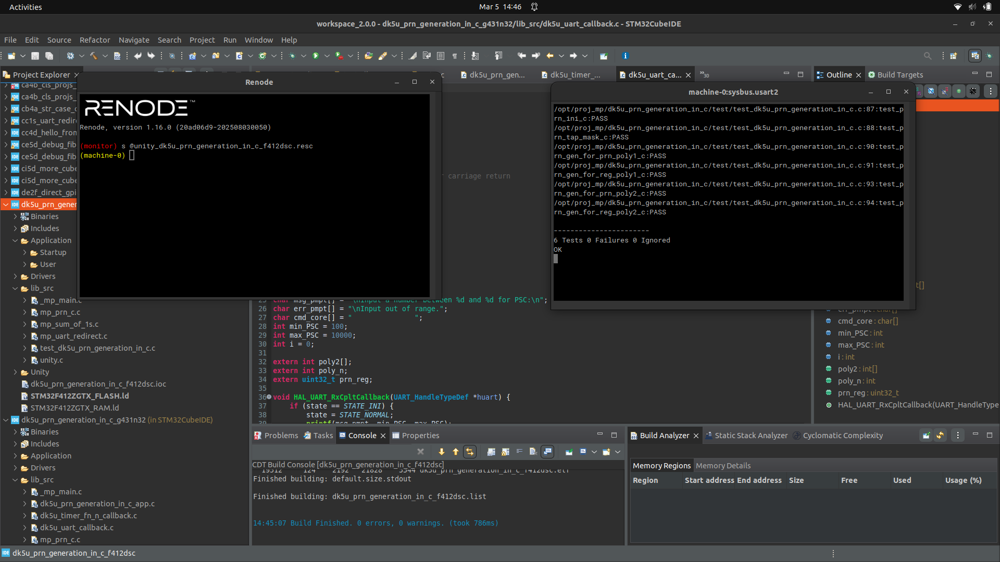
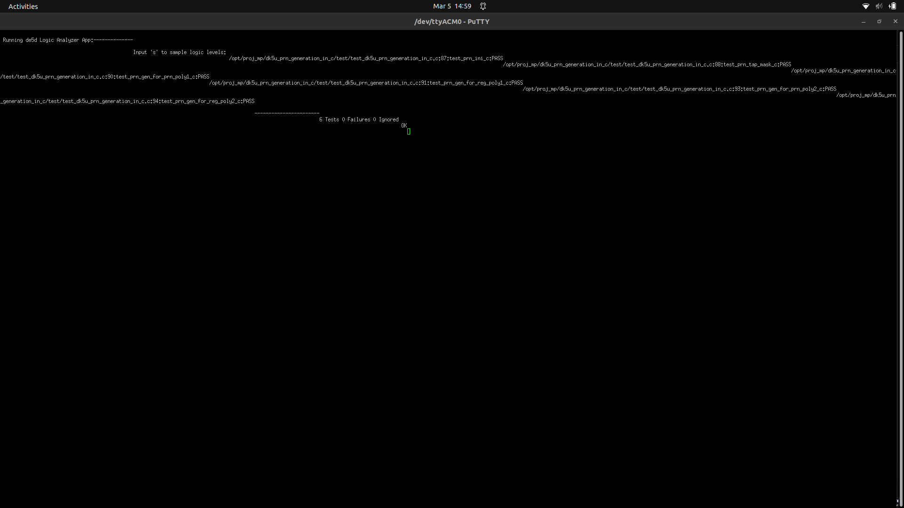
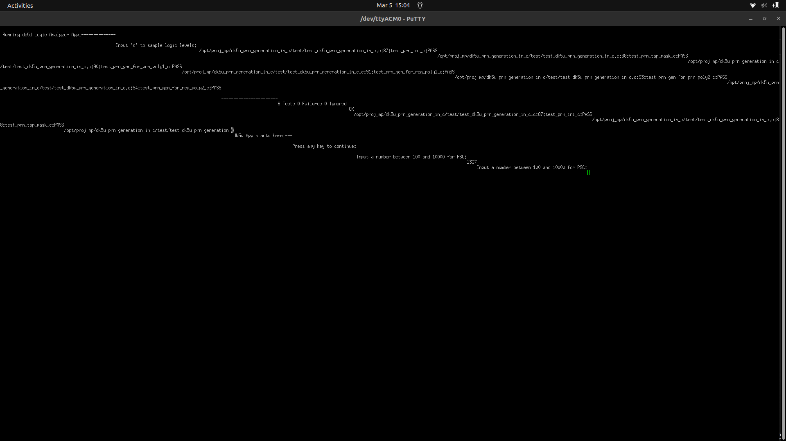

# Lab 05 Report: Pseudo Random Number Generation in C

**Course:** CEC 320 / MP-DK5U
**Lab Start Date:** ____________________
**Report Date:** ____________________

---

## Introduction

This lab implements a pseudo-random noise (PRN) sequence generator using a feedback shift register in C. Three functions were developed: register initialization, tap mask generation, and the PRN generation function itself. The PRN output drives LED4 on a G431 Nucleo-32 board via a Timer 4 interrupt, producing pseudo-random blinking.

---

## Narrative

The project required two board variants: F412dsc for Renode-based unit testing and G431n32 for both unit tests on real hardware and the Timer-driven App. Both needed separate CubeMX generation, CubeIDE configuration with `lib_src` folders, include paths, and Unity build configs with the `UNIT_TEST` preprocessor define.

All three PRN functions passed on the first build. The key insight for `mp_prn_gen_c` was understanding the shift direction (LSB to MSB) and that the XOR feedback equals `mp_sum_of_1s(tapped_bits) & 1` — odd parity of the tapped bits.

---

## Code Snippets and Screenshots

### C1: Three Functions — mp_prn_c.c

**File:** [c1.c](./c1.c)

```c
uint32_t mp_prn_ini_c(uint32_t *prn_reg, int *poly, int poly_n) {
    int max_val = poly[0];
    for (int i = 1; i < poly_n; i++) {
        if (poly[i] > max_val) max_val = poly[i];
    }
    reg_mask = (1U << max_val) - 1;
    *prn_reg = reg_mask;
    return reg_mask;
}

uint32_t mp_prn_tap_mask_c(int *poly, int poly_n) {
    tap_mask = 0;
    for (int i = 0; i < poly_n; i++) {
        tap_mask |= (1U << (poly[i] - 1));
    }
    return tap_mask;
}

bool mp_prn_gen_c(uint32_t *prn_reg) {
    uint32_t val = *prn_reg;
    uint32_t tapped = val & tap_mask;
    uint32_t feedback = mp_sum_of_1s(tapped) & 1U;
    bool output = (val & ((reg_mask + 1) >> 1)) ? true : false;
    val = val << 1;
    val = val | feedback;
    val = val & reg_mask;
    *prn_reg = val;
    return output;
}
```

*Code Snippet 1: Three PRN functions — initialization sets register to all 1s based on polynomial max value, tap mask sets bits at polynomial positions, and gen function shifts left with XOR feedback into LSB.*

### A3: All Tests Pass (F412dsc — Renode)



*Figure 1: Renode UART output showing 6 Tests, 0 Failures, 0 Ignored on F412dsc.*

### A4: All Tests Pass (G431n32 — Real Board)



*Figure 2: Putty serial output showing 6 Tests, 0 Failures on G431n32 Nucleo-32 real hardware.*

### A5: App Running on G431n32



*Figure 3: Putty serial output showing App running on G431n32 with PSC input prompt. LED4 blinks pseudo-randomly driven by Timer 4 interrupt calling mp_prn_gen_c.*

---

## Discussions and Results

**Key Learnings:**

- PRN sequences are generated by feedback shift registers where tapped bits are XORed and fed back to the LSB
- The polynomial `1 + x^3 + x^10` defines which register bits to tap (positions 3 and 10), creating a 10-bit LFSR with period 2^10 - 1 = 1023
- `mp_sum_of_1s() & 1` efficiently computes the XOR of multiple bits (odd parity = 1, even parity = 0)
- Timer prescaler (PSC) controls interrupt rate: low PSC = fast interrupts = LED appears to flicker; high PSC = slow interrupts = visible random blinking

**Takeaway:** Linear feedback shift registers are a compact and efficient way to generate pseudo-random sequences in embedded systems, requiring only bitwise operations and a small shift register.
