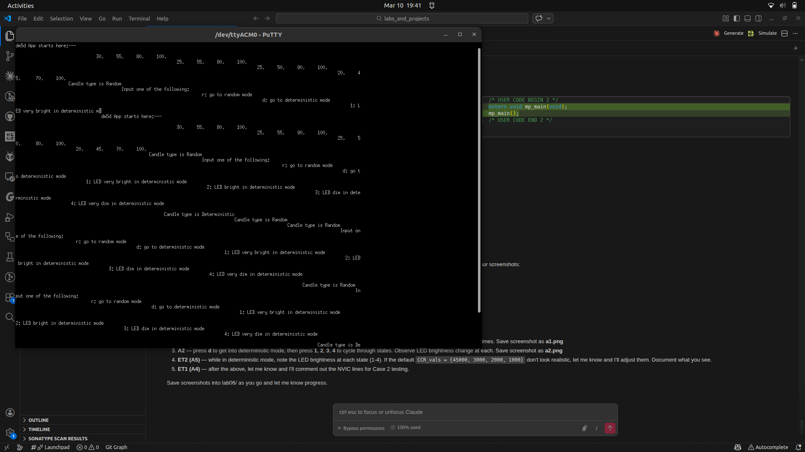
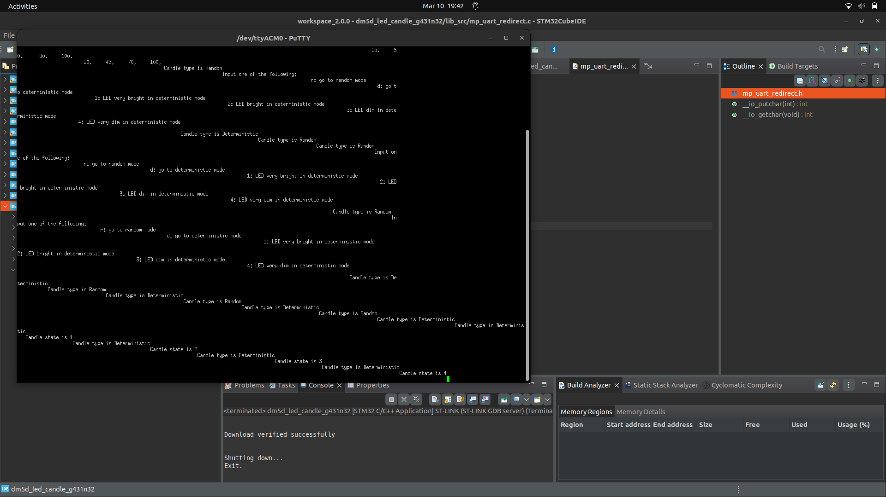
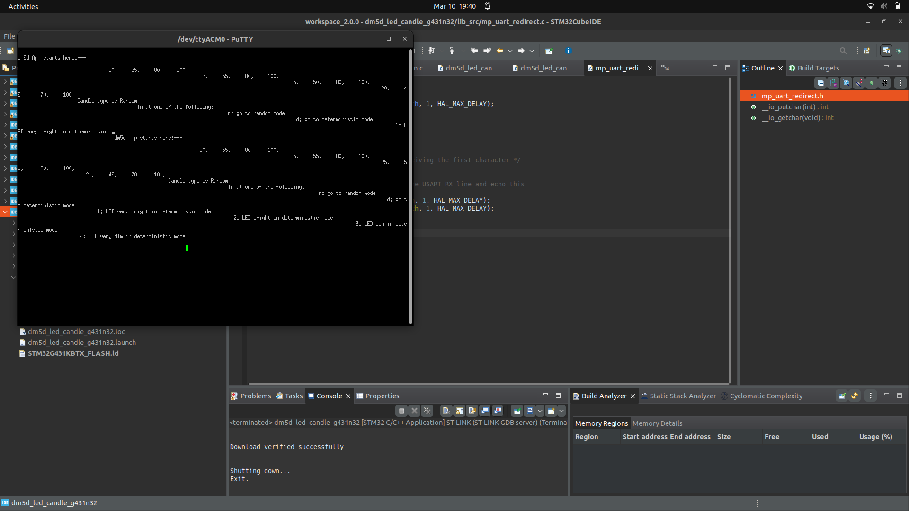

# Lab 06 Report: LED Candle Based on PWM

**Course:** CEC 320 / MP-DM5D
**Lab Start Date:** ____________________
**Report Date:** ____________________

---

## Introduction

This lab implements an LED candle simulator using PWM on the STM32 G431 Nucleo-32 board. The candle has four brightness states (very bright, bright, dim, very dim) controlled by PWM duty cycle via CCR values. The system supports two modes: a deterministic mode where the user selects the brightness state via UART commands ('1'-'4'), and a random mode that uses a Markov chain state machine with a cumulative probability transition matrix to produce realistic flickering. The experimentation tasks explore UART interrupt race conditions and LED intensity tuning.

---

## Narrative

The project was set up by extracting base files to `/opt/proj_mp/dm5d_led_candle/`, generating the CubeMX project from the `.ioc` file, and configuring CubeIDE with include paths and linked source files. Four functions were implemented in `dm5d_led_candle_fns.c`: candle type switching (PT1), deterministic state control (PT2), cumulative transition matrix generation (PT3), and random candle state machine (PT4). After building and deploying to the G431 board, all programming tasks were verified via Putty serial output. The experimentation tasks (ET1 and ET2) were then performed to explore interrupt guarding and LED intensity tuning.

---

## Code Snippets and Screenshots

### C1: Four Functions in `dm5d_led_candle_fns.c`

```c
// PT1. Update type of candle: random or deterministic
void update_candle_type(void) {
    if (!has_new_command) {
        return;
    }
    command = uart2_rxBuffer[0];
    if (is_rdm_candle) {
        if (command == 'd') {
            is_rdm_candle = false;
            has_new_command = false;
        }
    } else {
        if (command == 'r') {
            is_rdm_candle = true;
            has_new_command = false;
        }
    }
    printf("Candle type is %s\n", is_rdm_candle? "Random":"Deterministic");
}

// PT2. Update the deterministic candle state
void update_det_candle_state(void) {
    if (!has_new_command || is_rdm_candle) {
        return;
    }
    command = uart2_rxBuffer[0];
    if (command >= '1' && command <= '4') {
        candle_state = (candle_state_t)(command - '1');
        has_new_command = false;
    }
    printf("Candle state is %d\n", candle_state+1);
}

// PT3. Create the cumulative transition matrix
void create_cumu_trans_matrix(void) {
    for (int i = 0; i < 4; i++) {
        float F = 0.0;
        for (int j = 0; j < 4; j++) {
            F += trans_prob[i][j];
            cumu_trans_matrix[i][j] = lrint(F * STATE_TRANS_RANGE);
            printf("\t%d, ", cumu_trans_matrix[i][j]);
        }
        printf("\n");
    }
}

// PT4. LED candle state machine
void update_random_candle_state(void) {
    if (!is_rdm_candle) {
        return;
    }
    int random_choice = rand() % STATE_TRANS_RANGE;
    if (random_choice < cumu_trans_matrix[candle_state][0]) {
        candle_state = CANDLE_VERY_BRIGHT;
    } else if (random_choice < cumu_trans_matrix[candle_state][1]) {
        candle_state = CANDLE_BRIGHT;
    } else if (random_choice < cumu_trans_matrix[candle_state][2]) {
        candle_state = CANDLE_DIM;
    } else {
        candle_state = CANDLE_VERY_DIM;
    }
    int dwell_time = DWELL_TIM_MIN + rand() % (DWELL_TIM_MAX - DWELL_TIM_MIN + 1);
    HAL_Delay(dwell_time);
}
```

### Figure 1 — A1: Candle Type Transitions (PT1)



Putty output showing switching between Random and Deterministic modes using 'd' and 'r' commands.

### Figure 2 — A2: Deterministic State Changes (PT2)



Putty output in deterministic mode showing state changes via '1'-'4' with corresponding LED brightness changes.

### Figure 3 — A3: Cumulative Transition Matrix (PT3)



Cumulative transition matrix printed at startup, showing expected values: 30,55,80,100 / 25,55,80,100 / 25,50,80,100 / 20,45,70,100.

---

## Discussions and Results

### ET1: UART2 Interrupt Guarding (A4)

The super loop in `dm5d_led_candle_app.c` processes the shared variable `has_new_command` across three functions: `update_candle_type()`, `update_det_candle_state()`, and `print_help_message_if_needed()`. The UART2 receive-complete ISR sets `has_new_command = true` asynchronously.

**Case 1 (with NVIC_DisableIRQ/EnableIRQ guards):** Disabling the USART2 interrupt before processing and re-enabling it afterward ensures that `has_new_command` cannot change mid-processing. All mode switches and state changes work correctly and consistently.

**Case 2 (without NVIC guards):** Without the guards, a race condition exists. If the UART ISR fires between the three processing functions, `has_new_command` could be set to `true` after one function has already cleared it but before the others have checked it. This could cause:
- A command being partially processed (e.g., type updated but help message not suppressed)
- Spurious help message printouts
- Missed state changes in deterministic mode

In practice, the race window is very small (a few microseconds between function calls), so rapid key pressing is needed to trigger the issue. During normal testing, the behavior appeared mostly correct, but the potential for inconsistency exists and would be more problematic in a system with higher interrupt rates or longer processing times.

### ET2: LED Intensity Tuning (A5)

The default `CCR_vals[] = {45000, 3000, 2000, 1000}` were tested with the PWM timer configured with ARR = 49999:

| State | CCR Value | Duty Cycle | Observation |
|-------|-----------|------------|-------------|
| 1 (Very Bright) | 45000 | 90% | LED at near-maximum brightness |
| 2 (Bright) | 3000 | 6% | Noticeably dimmer, moderate glow |
| 3 (Dim) | 2000 | 4% | Low glow, visible but subdued |
| 4 (Very Dim) | 1000 | 2% | Barely visible, faint flicker |

The default values produce a realistic candle effect. The large gap between state 1 and states 2-4 creates the characteristic bright flare followed by dim flickering that mimics a real candle. The random state transitions with variable dwell times (DWELL_TIM_MIN to DWELL_TIM_MAX) add natural-looking variation to the flicker pattern.

**Final CCR_vals:** `{45000, 3000, 2000, 1000}` (defaults retained — they produce realistic results)
