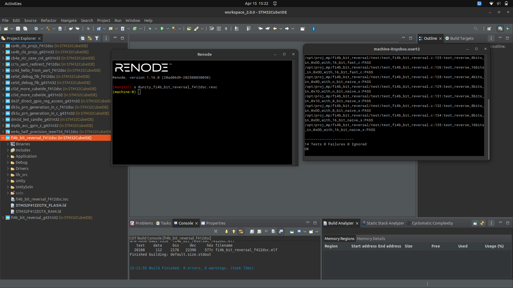
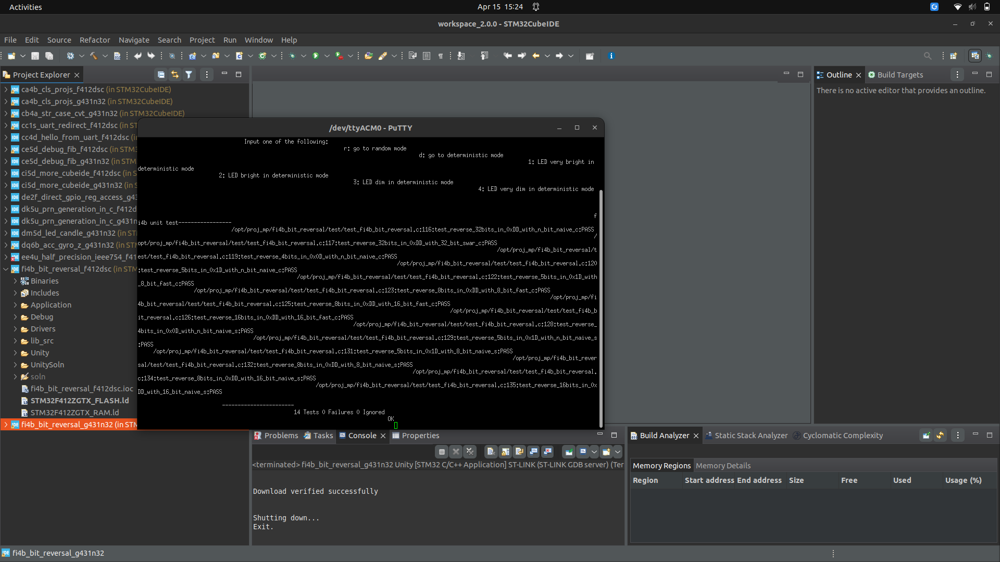

# Lab 08 Report: Bit Reversal in C and Assembly

**Course:** CEC 322
**Project Code:** MP-FI4B
**Student:** ____________________
**Date Started:** ____________________
**Date Completed:** ____________________

---

## Introduction

This lab explores bit-reversal algorithms and their implementation in both C
and ARM assembly on the STM32 microcontrollers used in class (STM32F412 via
Renode and STM32G431 Nucleo-32 via real hardware). Bit reversal is a
fundamental operation in applications such as the Fast Fourier Transform.

Two programming tasks were assigned:

1. **PT1 (30 pts)** — debug the provided `mp_bit_reverse_n_bit_naive_s`
   assembly function, which contains small bugs that prevent the two `naive_s`
   unit tests from passing.
2. **PT2 (60 pts)** — extend the provided 8-bit fast-reversal assembly
   (`mp_bit_reverse_8_bit_fast_s`) into a 16-bit version
   (`mp_bit_reverse_16_bit_fast_s`) that passes the corresponding tests.

---

## Narrative

The base project was extracted from `fi4b_bit_reversal.zip` to
`/opt/proj_mp/fi4b_bit_reversal/`. Because the zip already contained
fully-generated CubeMX sources and CubeIDE `.project` / `.cproject` files with
`PARENT-N-PROJECT_LOC` linked resources, no CubeMX "Generate Code" step was
needed; the two projects (`_f412dsc` and `_g431n32`) were imported directly
via **File → Open Projects from File System** in CubeIDE.

**PT1 — Debugging `mp_bit_reverse_n_bit_naive_s`:**
Comparing the provided assembly against its C reference line-by-line revealed
two "wrong register" bugs (from the three error classes listed in §8.4.1 of the
manual):

- `lsl r6, r2, r4` computed `mask_j = 1 << i` instead of `1 << j`. Fixed to `lsl r6, r2, r3`.
- `lsr r7, r0, r3` computed `b_i = (x >> j) & 1` instead of `(x >> i) & 1`. Fixed to `lsr r7, r0, r4`.

A hand trace with `x = 0b10, n = 2` confirmed that with the bugs `x` ends as
`0b11`, and with the fixes it ends as `0b01`, matching the C reference.

**PT2 — Writing `mp_bit_reverse_16_bit_fast_s`:**
The 8-bit fast function performs three swap stages (distance 1, 2, 4) and
relies on `x << 4` for the final stage (since the low 4 bits have already been
zeroed by the distance-2 stage). Extending the pattern to 16 bits requires
four swap stages (distance 1, 2, 4, 8) using masks `0x5555`, `0x3333`,
`0x0f0f`. Each stage compiles to four ARM instructions using the
data-processing operand2 shift:

```
ldr r1, =<mask>
and r2, r1, r0, lsr #k        @ z = y & (x >> k)
and r0, r1                    @ x &= y
orr r0, r2, r0, lsl #k        @ x = z | (x << k)
```

The final distance-8 stage reuses the no-mask shortcut from the 8-bit version
(`z = x >> 8; x = z | (x << 8)`), and a closing `and r0, 0xFFFF` clamps the
return value to 16 bits.

**Verification:**
Both edits were validated against the test inputs in
`test/test_fi4b_bit_reversal.c`:

- Naive: `reverse(0x0D, 4) = 0x0B`, `reverse(0x1D, 5) = 0x17`
- 16-bit fast: `reverse(0xDD) = 0xBB00`, `reverse(0xDD) >> 8 = 0xBB`

The project was built in CubeIDE under the `Unity` configuration and run in
Renode on F412dsc, then flashed to a real G431 Nucleo-32 for the second
screenshot.

---

## Code Snippets and Screenshots

### C1: `fi4b_bit_reversal_sfns.s` (PT1 + PT2)

See [c1.s](./c1.s).

### A1: Unity Test Results — F412dsc via Renode



All 14 tests pass (6 C-function tests + 8 assembly-function tests).

### A2: Unity Test Results — G431n32 Real Board



---

## Discussions and Results

**PT1 discussion.** The two bugs were both "wrong register for intended
variable" mistakes (category 3 in §8.4.1 of the manual). They are easy to
miss on a quick read because the mnemonic and immediate operands look correct
— only the register number differs from the matching C variable. Tracing
through the smallest case (`n = 2`) makes the mismatch obvious: with the bugs,
`mask_i == mask_j` and `b_i == b_j`, so the algorithm degenerates.

**PT2 discussion.** The biggest translation decision was whether to emit a
final `and r0, 0x...` mask after every stage. Since each stage writes
`z | (x << k)` where both operands have been pre-masked through `y`, no
intermediate mask is needed; only the final 16-bit clamp is required. The
three-operand ARM data-processing instructions with shifted operand2 keep the
function at 17 instructions plus the final `bx lr` — the same density as the
provided 8-bit version.

**Computational complexity.** The naive algorithm is `O(n)` — one iteration
per pair of bits. The SWAR / fast algorithm used here is `O(log n)` — one
swap stage per bit-width doubling. For 32-bit reversal this is 5 stages vs.
16 iterations, roughly a 3× improvement before any micro-architectural
gains.

---

## Submission

**PDF:** `fi4b-report-lastname-firstname.pdf`
**ZIP:** `fi4b-proj-lastname-firstname.zip`

See [lab08_findings.md](./lab08_findings.md) for the full submission checklist.
