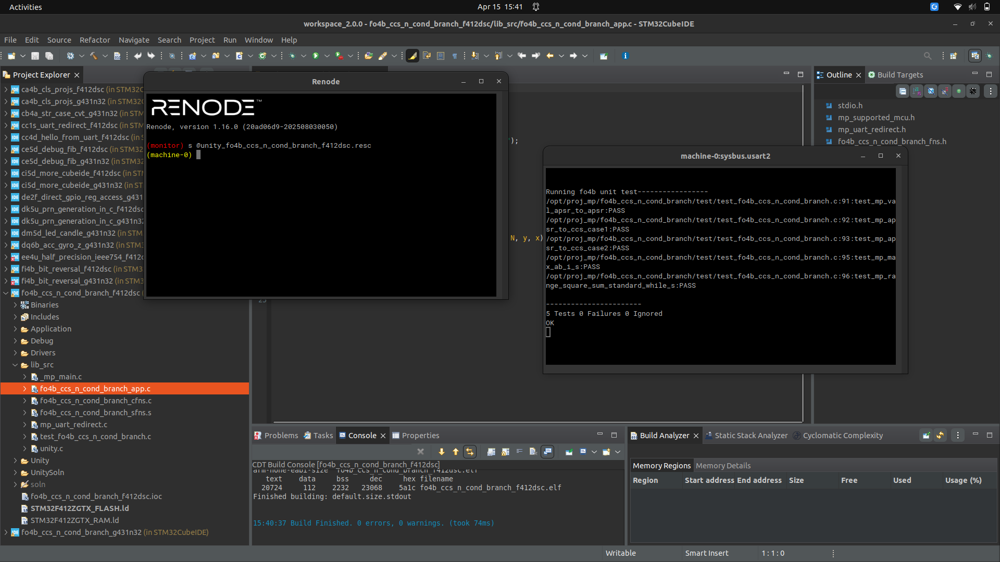
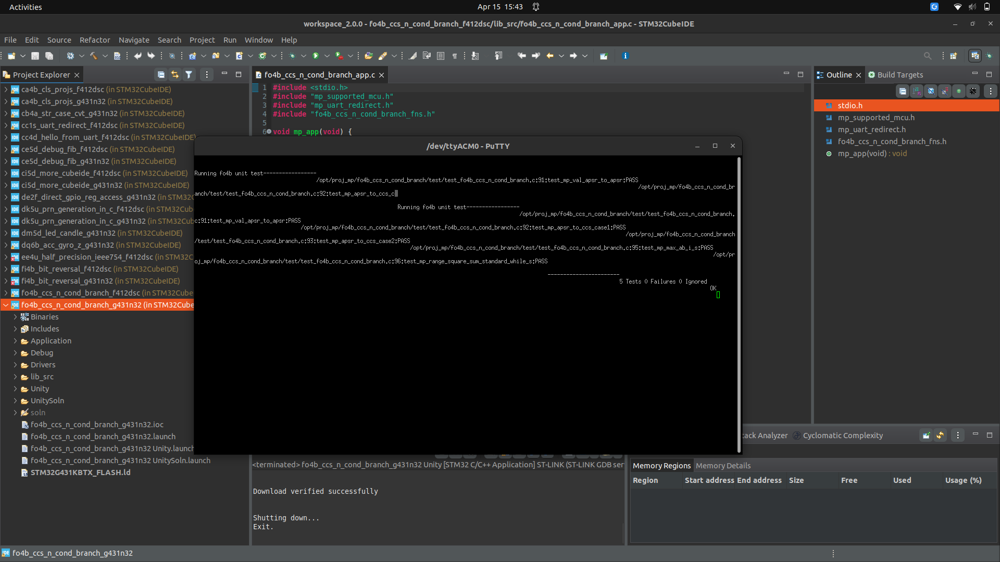

# Lab 09 Report: Condition Code Suffices and Conditional Branch

**Course:** CEC 322
**Project Code:** MP-FO4B
**Student:** ____________________
**Date Started:** ____________________
**Date Completed:** ____________________

---

## Introduction

This lab connects three closely-related topics from lecture 19: the APSR
status flags (`N`, `Z`, `C`, `V`) produced by `CMP`, the condition code
suffixes (CCSs) that combine those flags into higher-level predicates
(`EQ`, `LT`, `HS`, ...), and the conditional branch instructions that use
those CCSs to implement C-style `if-else` and `for-while` constructs in
ARM assembly.

The lab has four assignments:

1. **CET (10 pts)** — a writing task explaining the pointer trick used in
   `mp_val_apsr_to_apsr` to pull an `APSR_t` bit-field out of the upper 32
   bits of a `uint64_t`.
2. **PT1 (30 pts)** — implement `mp_apsr_to_ccs` in C, deriving all 10 CCS
   fields from the four APSR flag bits.
3. **PT2 (15 pts)** — write `mp_max_ab_i_s` in assembly to return the signed
   max of two `int`s.
4. **PT3 (35 pts)** — write `mp_range_square_sum_standard_while_s` in
   assembly to return the 64-bit sum of squares over a range `[s, e]`.

---

## Narrative

The base project was extracted from `fo4b_ccs_n_cond_branch.zip` to
`/opt/proj_mp/fo4b_ccs_n_cond_branch/`. As with lab08, the zip already
contained fully-generated CubeMX sources and CubeIDE `.project` /
`.cproject` files with `PARENT-N-PROJECT_LOC` linked resources, so both
projects were imported directly via **File → Open Projects from File System**.

**CET — Explaining `mp_val_apsr_to_apsr`.**
See the *Discussions and Results* section below for the full explanation.

**PT1 — `mp_apsr_to_ccs`.**
The function fills the `CCS_t` struct using the standard ARM condition-code
definitions from lecture 19. The signed comparisons (`LT`, `LE`, `GE`, `GT`)
use the fact that for the result of `x - y`, the sign bit `N` agrees with
the overflow flag `V` iff the true signed result is non-negative; so
`N == V` ⟺ `x >= y` (signed). The unsigned comparisons (`LO`, `LS`, `HS`,
`HI`) use only `C` (= "no borrow") and `Z`. `EQ` / `NE` are just `Z` / `!Z`.

**PT2 — `mp_max_ab_i_s`.**
Three real instructions: `cmp r0, r1` sets the flags from `a − b`, `bge`
jumps past the `mov r0, r1` when `a ≥ b` (signed), leaving `a` in `r0`
as the return value; otherwise the `mov` replaces `r0` with `b`. The
signed `BGE` is important for the test case `a = 0xFFFFFFFF, b = 0`, which
is `−1` vs `0` and should return `0`, not `−1`.

**PT3 — `mp_range_square_sum_standard_while_s`.**
The loop mirrors the C reference one-for-one:

- `r2:r3` holds the 64-bit `sum`, initialized to zero.
- `r0` doubles as both the loop counter `i` (live in) and the return low
  word (live out).
- `r1` holds `e` (live in) and is overwritten with the return high word at
  the end.
- `cmp r0, r1` + `bgt` implements `while (i <= e)` exactly.
- `smull r4, r5, r0, r0` produces the signed 64-bit square of `i` in
  `r5:r4`. This is necessary because `0x100000 * 0x100000 = 2^40` overflows
  32 bits, and because `i` can be negative (test case `s = −3`).
- `adds / adc` propagates the carry from the low-word addition into the
  high word — the standard ARM idiom for 64-bit add.
- `r4` and `r5` are callee-saved, so they're pushed at entry and popped
  at exit.

All 4 PT3 test cases were verified by Python simulation:
`(3, 0) → 0`, `(−3, 0) → 14`, `(0, 3) → 14`,
`(0x100000, 0x100000) → 0x10000000000`. The CCS logic was host-compiled
with gcc and matched both PT1 test cases exactly.

The project was built in CubeIDE under the `Unity` configuration, run in
Renode on F412dsc (A1), then flashed to a real G431 Nucleo-32 for A2.

---

## Code Snippets and Screenshots

### C1: `mp_apsr_to_ccs` (PT1)

See [c1.c](./c1.c).

### C2: `fo4b_ccs_n_cond_branch_sfns.s` (PT2 + PT3)

See [c2.s](./c2.s).

### A1: Unity Test Results — F412dsc via Renode



All 5 tests pass: `test_mp_val_apsr_to_apsr`, `test_mp_apsr_to_ccs_case1`,
`test_mp_apsr_to_ccs_case2`, `test_mp_max_ab_i_s`,
`test_mp_range_square_sum_standard_while_s`.

### A2: Unity Test Results — G431n32 Real Board



---

## Discussions and Results

### CET answer — the pointer trick in `mp_val_apsr_to_apsr`

```c
APSR_t mp_val_apsr_to_apsr(uint64_t val_apsr) {
    APSR_t apsr = *((APSR_t *)&val_apsr + 1);
    return apsr;
}
```

**How is the value of APSR assigned to `apsr`?**
`&val_apsr` yields a pointer to the 64-bit value. The cast
`(APSR_t *)&val_apsr` reinterprets that same address as a pointer to an
`APSR_t` object — no bytes move, we're just telling the compiler to treat
the underlying memory as a 4-byte bit-field struct. Because `sizeof(APSR_t)
== 4`, pointer arithmetic on an `APSR_t *` steps in 4-byte units, so the
expression `(APSR_t *)&val_apsr + 1` points at the **second** 4-byte slot
within `val_apsr`. On a little-endian machine (all the STM32 targets we use
are LE), that second slot is the high 32 bits of the original `uint64_t`.
Dereferencing it with `*(...)` reads those 4 bytes and reinterprets them as
an `APSR_t` — again, no bit-level arithmetic happens, so each flag bit in
the source lines up with the corresponding bit-field slot declared in
`fo4b_ccs_n_cond_branch_fns.h` (`V` at bit 28, `C` at 29, `Z` at 30, `N` at
31). We have to go through a pointer cast because the compiler does not let
you assign a plain 32-bit integer directly into a bit-field struct type;
the pointer cast bypasses that type-conversion check.

**Why does `((uint64_t)15) << (32 + 28)` match `exp[1] = 0xF0000000`?**
The 64-bit constant lays out `val_apsr` as `[high 32 bits | low 32 bits]`.
We want to set the APSR flags (`V`, `C`, `Z`, `N`, which occupy bits 28..31
of the *upper* word). Counting from bit 0 of the full 64-bit value, those
four positions are bits `32+28`, `32+29`, `32+30`, and `32+31`. Writing
`(uint64_t)15 << (32+28)` places the four least-significant `1`s of
`0b1111` starting at bit `32+28`, so all four APSR flags become `1` and
every other bit is zero. When `mp_val_apsr_to_apsr` extracts the upper
word and `act[1] = *(uint32_t *)&apsr1` reads it back as a plain `uint32_t`,
the result is `0xF0000000` — four `1`s in the top nibble — which is
precisely `exp[1]`.

### PT1 verification by hand

| Case | x, y, N | Resulting APSR (N,Z,C,V) | Expected CCS |
|---|---|---|---|
| 1 | −3, 13, 5 | (1, 0, 1, 0) | `{0,1,1,1,0,0,0,0,1,1}` |
| 2 | 17, 17, 5 (→ both −15) | (0, 1, 1, 0) | `{1,0,0,1,1,0,0,1,1,0}` |

Applying the CCS formulas table to both rows reproduces the expected arrays
exactly, which matches what the Unity tests check.

### PT3 — why `smull` and not `mul`

ARM's `mul` gives only the low 32 bits of the product, which is wrong for
the last test case `(0x100000, 0x100000)`: the square is `0x10000000000`,
so `mul` would truncate it to `0` and the whole 64-bit sum would silently
be wrong. `smull` produces the full signed 64-bit result in a pair of
registers, and `adds + adc` adds that pair into the 64-bit accumulator
without losing the carry from the low word.

### PT3 — why `bgt` (not `bge`) on the loop exit

The C reference is `while (i <= e)`, which means *continue* while `i ≤ e`
and *exit* when `i > e`. After `cmp r0, r1`, the condition `i > e` (signed)
is exactly `BGT`, so `bgt end_sq_s` correctly matches the C semantics.

---

## Submission

**PDF:** `fo4b-report-lastname-firstname.pdf`
**ZIP:** `fo4b-proj-lastname-firstname.zip`

See [lab09_findings.md](./lab09_findings.md) for the full submission checklist.
