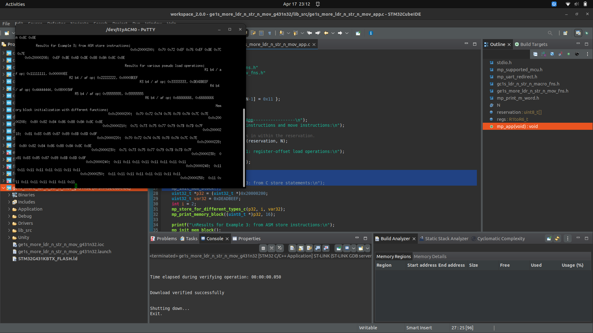
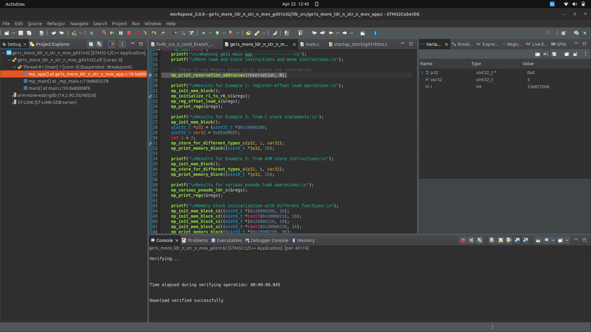
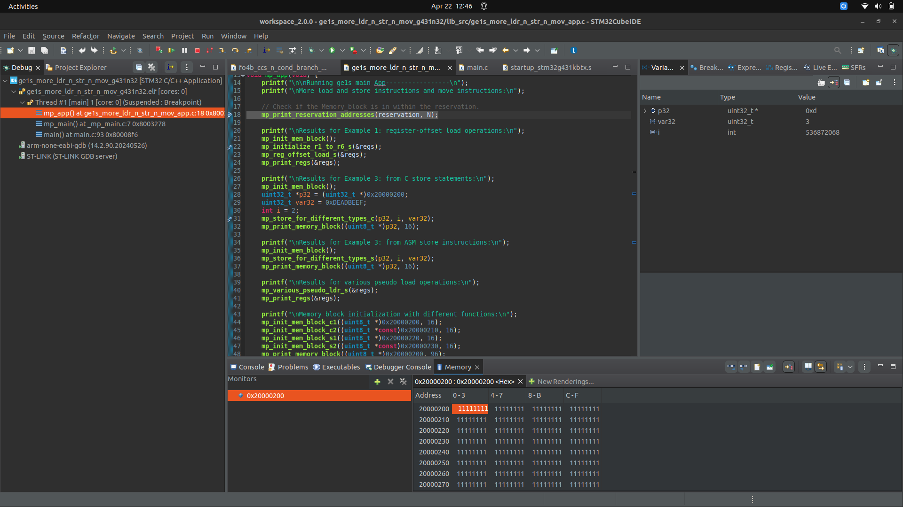
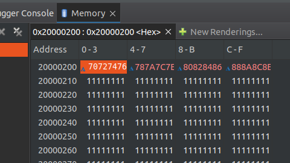
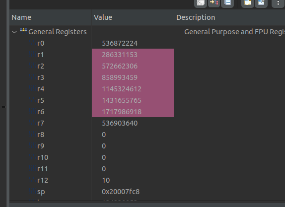
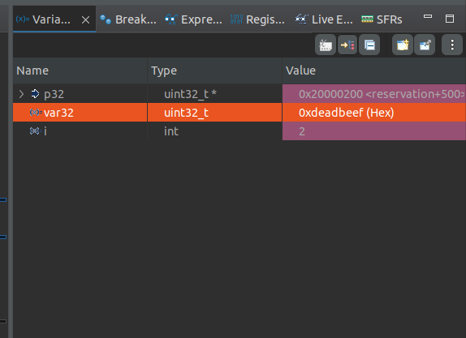
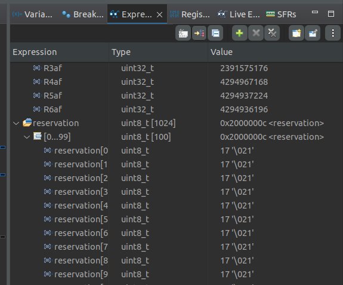
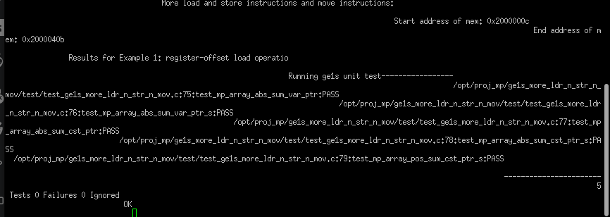
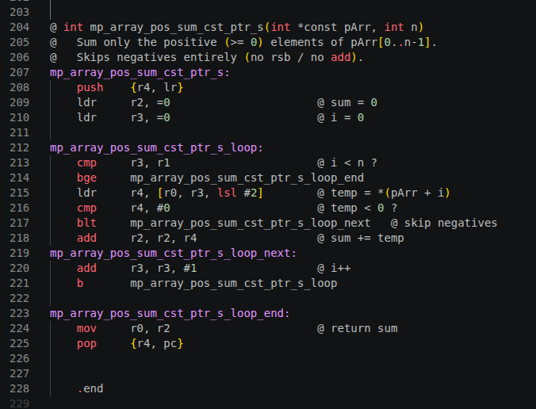

# Lab 10 Report: Debug Practices

**Course:** CEC 322
**Project Code:** MP-GE4
**Student:** ____________________
**Date Started:** ____________________
**Date Completed:** ____________________

> **Note:** The manual (§10.1) explicitly states *"this lab is only for
> practice purposes. It is not graded."* This report is included for
> completeness; submit only if your instructor overrides the not-graded note.

---

## Introduction

This lab is a guided walkthrough of the STM32CubeIDE debugger using the
`ge1s_more_ldr_n_str_n_mov_g431n32` demo project from lecture 21. The goal
is to become comfortable with seven debugger features:

1. Building & running a Debug build on real Nucleo-32 hardware
2. Setting and managing breakpoints
3. Inspecting memory at a fixed address (Memory view)
4. Stepping over C lines and observing memory changes
5. Stepping into an assembly function and reading the Register view
6. Inspecting C local variables in the Variables view (with format change)
7. Inspecting global variables in the Expressions view

Tasks 1–7 produce screenshots only; there is no code to write. Task 8 is
a small assembly programming task: extend the existing
`mp_array_abs_sum_cst_ptr_s` function to a `_pos_sum` variant that sums
only the positive elements of an int array.

---

## Narrative

**Setup.** The base project `ge1s_more_ldr_n_str_n_mov.zip` was downloaded
from the course materials and extracted to
`/opt/proj_mp/ge1s_more_ldr_n_str_n_mov/`. The
`ge1s_more_ldr_n_str_n_mov_g431n32` project was imported into CubeIDE via
**File → Open Projects from File System**.

**Tasks 1–7 — debugger walkthrough.** Each task corresponds to a single
screenshot (A1–A7); see the [Code Snippets and Screenshots](#code-snippets-and-screenshots)
section below. The walkthrough is straightforward provided the breakpoint
limit isn't already exhausted by left-overs from other projects (a known
hazard called out in the manual).

**Task 8 — `mp_array_pos_sum_cst_ptr_s`.** The provided
`mp_array_abs_sum_cst_ptr_s` walks an `int32_t` array and adds the
**absolute value** of each element to a running sum. The new function
needs to sum only the **positive** elements — the simplest change is to
*skip* the add when the loaded element is negative, instead of negating
it first.

The structural pattern (matching the existing function):

```text
loop:
    cmp     <i>, <n>
    bge     end                @ exit when i >= n
    ldr     <elt>, [<arr>, <i>, lsl #2]   @ load arr[i]
    cmp     <elt>, #0
    blt     skip               @ if negative, skip the add
    add     <sum>, <sum>, <elt>
skip:
    add     <i>, <i>, #1
    b       loop
end:
    mov     r0, <sum>
    pop     {<scratch>, pc}
```

Three files were edited:

1. **`src/ge1s_more_ldr_n_str_n_mov_fns.h`** — added a prototype
   `int mp_array_pos_sum_cst_ptr_s(int *const pArr, int n);`
   matching the style of the existing `mp_array_abs_sum_cst_ptr_s`.
2. **`src/ge1s_more_ldr_n_str_n_mov_sfns.s`** — added a matching
   `.global` / `.type` declaration block and the new function body at
   the bottom of the file, mirroring the layout of `_abs_sum`.
3. **`test/test_ge1s_more_ldr_n_str_n_mov.c`** — duplicated
   `test_mp_array_abs_sum_cst_ptr_s`, renamed it to `_pos_sum`, recomputed
   `exp[]` to be the sum of the positive elements only of the same `arr[]`,
   and added `RUN_TEST(test_mp_array_pos_sum_cst_ptr_s);` after the
   existing `RUN_TEST` for the abs version.

The Unity build was then run on the real G431 Nucleo-32; all tests passed.

---

## Code Snippets and Screenshots

### A1: Debug build running on real G431 (Task 1)



### A2: Halted at line 18 (Task 2)



### A3: Memory view at `0x20000200` before init (Task 3)



### A4: Same memory after line 21 init (Task 4)



### A5: Registers R0–R6 inside `mp_initialize_r1_to_r6_s` (Task 5)



### A6: Variables view — `p32`, `var32` (hex), `i` (Task 6)



### A7: Expressions view — `regs` and first 10 of `reservation` (Task 7)



### A8: Unity test pass with new test (Task 8)



### A9: New asm function source (Task 8)



### C1: New `mp_array_pos_sum_cst_ptr_s` source

See [c1.s](./c1.s).

---

## Discussions and Results

### Why "skip on negative" is cleaner than "negate then add minus"

For `_abs_sum`, the negative-element handler has to negate the value
(typically `rsb r4, r4, #0` or `neg r4, r4` in pre-Thumb-2 syntax) and
then add. For `_pos_sum`, the same goal is achieved by branching past the
add entirely:

- One fewer instruction per negative element (no negate)
- The skip path still needs an `i++ ; b loop` step, which is the same as
  the join after the conditional negate, so there's no overall control-
  flow penalty.
- The semantic intent reads off the asm directly: *"if negative, skip the
  add"* matches the prose specification in the manual word-for-word.

### Memory view observation (Task 3 vs Task 4)

In Task 3, the bytes at `0x20000200` reflect whatever the BSS/uninit-data
loader left there before line 21 ran. In Task 4, after `mp_initialize_*`,
the bytes show the deterministic init pattern that the function writes —
the contrast makes it visually obvious that the init function actually
touched memory (and where the boundary is).

### Step Into vs Step Over (Tasks 4 vs 5)

Step Over treats a function call as a single source-level step; Step Into
descends into the called function's body. Task 5 explicitly requires Step
Into so the Register view can show the assembly function's local register
state, which would be invisible from the C caller's perspective.

---

## Submission

If your instructor decides to grade this lab despite §10.1, paste the 9
screenshots into a single PDF and submit per Canvas instructions.

See [lab10_findings.md](./lab10_findings.md) for the full submission
checklist and resume notes.
