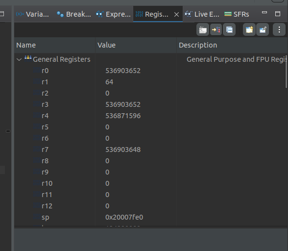
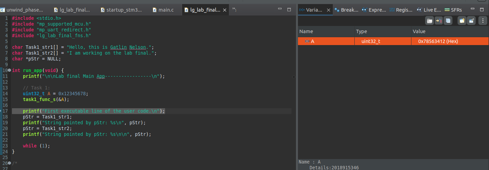
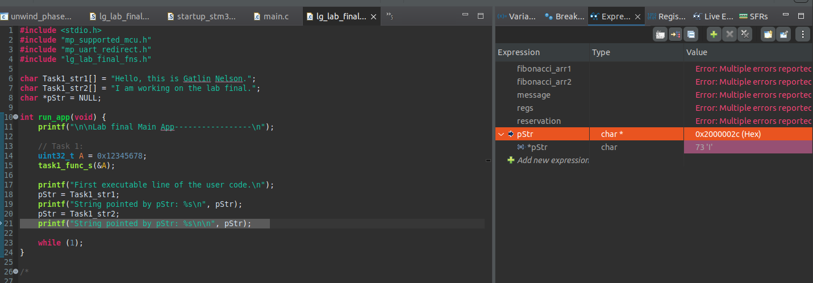
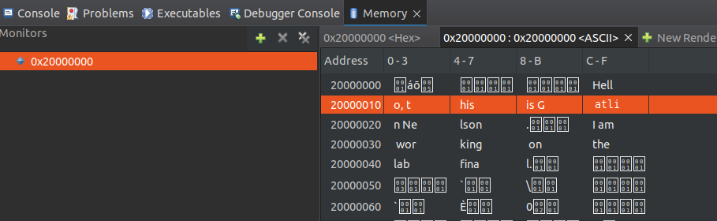
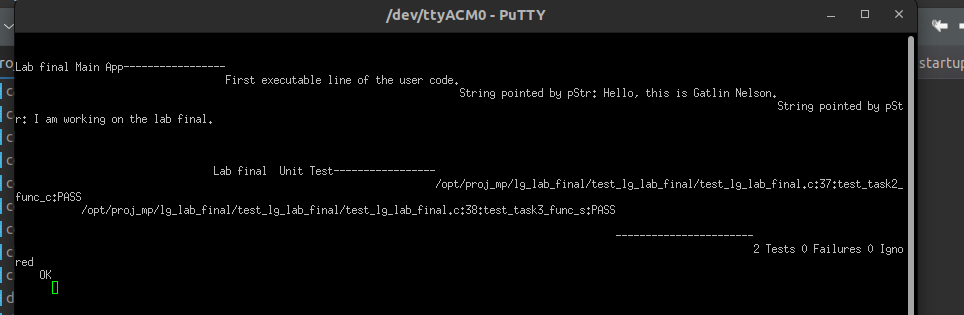

# Lab Final Report

**Course:** CEC 322
**Project Code:** lg_lab_final
**Student:** ____________________
**Date Started:** ____________________
**Date Completed:** ____________________

---

## Introduction

The lab final covers three tasks that exercise the core skills from the
course: using the STM32CubeIDE debugger on real hardware, writing portable
C, and writing ARM assembly that cooperates with C code via the AAPCS
calling convention.

1. **Task 1 — Big→little endian byte swap (asm, pre-supplied).** Exercises
   the CubeIDE debugger: set a breakpoint in assembly, step through a
   byte-reorder sequence, inspect registers/variables/expressions/memory,
   and record four hex values.
2. **Task 2 — Sum of negative elements (C).** Write a C function that
   linearly scans an `int` array and returns the signed sum of elements
   less than zero.
3. **Task 3 — Null-terminated string copy (asm).** Write an assembly
   function that copies a C string from `src` to `dst`, including the
   terminating `'\0'`, using post-increment byte load / byte store.

Target board: STM32G431KB Nucleo-32. No simulator (Renode) is used —
everything runs on the physical board via USB.

---

## Narrative

**Setup.** The base project `lg_lab_final.zip` was extracted to
`/opt/proj_mp/lg_lab_final/`. The zip comes pre-packaged with a CubeIDE
project that uses `PARENT-N-PROJECT_LOC` linked resources, so
**File → Open Projects from File System** imports it directly — no
CubeMX "Generate Code" step is needed.

**Task 1 — debugger walkthrough.** Task 1's assembly function
`task1_func_s` ships already implemented. It loads the 32-bit word at
`[r0]` into `r1`, then stores the low byte of `r1` into offset 3 of
`[r0]`, logical-shifts `r1` right by 8, stores the next byte into offset
2, and repeats for offsets 1 and 0. The net effect is a byte-order
reverse in place: `0x12345678` at `[r0]` becomes `0x78563412`.

The Task 1 work is all done in the debugger: set a breakpoint on the
first asm instruction (`ldr r1, [r0]`), **Debug As**, capture screenshots
and hex values from the Registers view (r0), Variables view (A after the
swap), Expressions view (`pStr` at two different C lines), and Memory
view (the ASCII layout at `0x20000000`, which lets us physically see
`Task1_str1` as characters).

**Task 2 — `task2_func_c`.** A straightforward linear scan. Initialize
`sum = 0`, walk `arr[0..n-1]`, add each negative element to `sum`, return
`sum`. Matches the Unity test `{1, -2, 3, -4}` → `-2` for n=2 and `-6`
for n=4.

**Task 3 — `task3_func_s`.** The register map given by the comment is
`src → r0, dst → r1, ch → r2`. The loop body is:

```
loop:
    ldrb    r2, [r0], #1    @ post-increment load — ch = *src++
    strb    r2, [r1], #1    @ post-increment store — *dst++ = ch
    cmp     r2, #0          @ we've just stored ch, so even '\0' is in dst
    bne     loop            @ if that wasn't '\0', keep going
    bx      lr
```

The key design point: the `cmp` happens **after** the `strb`, so the
terminating null byte is always copied to the destination before the loop
exits. That matches the Unity test's assertion length — 6 bytes for
"Hello" and 3 bytes for "Hi" both include the null.

The new assembly was verified with `arm-none-eabi-as -mcpu=cortex-m4
-mthumb` and `objdump -d`; the generated instruction stream is exactly
the five instructions above (with `bne.n` short-form encoding for the
backward branch).

---

## Code Snippets and Screenshots

### C1: Task 2 — `task2_func_c` (C)

See [c1.c](./c1.c).

```c
int32_t task2_func_c(int *arr, int n) {
    int32_t sum = 0;
    for (int i = 0; i < n; i++) {
        if (arr[i] < 0) {
            sum += arr[i];
        }
    }
    return sum;
}
```

### C2: Task 3 — `task3_func_s` (asm)

See [c2.s](./c2.s) (full `_sfns.s` with Task 1 preserved and Task 3 filled in).

```
task3_func_s:
task3_func_s_loop:
    ldrb    r2, [r0], #1           @ ch = *src++
    strb    r2, [r1], #1           @ *dst++ = ch
    cmp     r2, #0                 @ ch == '\0' ?
    bne     task3_func_s_loop      @ loop until null copied
    bx      lr
```

### A1: Task 1.1 — Registers view at `ldr r1, [r0]` breakpoint



**Recorded value:** `r0 = 0x20007FE4` (address of local `A` on the stack; sp was `0x20007FE0`, so `A` is the next word up at `sp + 4`)

### A2: Task 1.2 — Variables view at `_app.c` line 17



**Recorded value:** `A = 0x78563412` — the little-endian byte-reversal of the initial `0x12345678`, confirming `task1_func_s` worked as designed.

### A3: Task 1.3 — Expressions view at lines 19 and 21



**Recorded values:**

- At line 19: `pStr = 0x2000000C` (address of `Task1_str1`)
- At line 21: `pStr = 0x2000002C` (address of `Task1_str2`)

The screenshot was captured at the line-21 pause showing the updated value. The line-19 value was recorded from the Expressions view before stepping past the assignment.

### A4: Task 1.4 — Memory view ASCII at `0x20000000`



**Recorded value:** `Task1_str1` starting address = `0x2000000C`.

The ASCII rendering shows `Hell` beginning at offset `C` of row `0x20000000` (so byte address `0x2000000C`), continuing `o, this is Gatlin Nelson.` across the next two rows. This matches the `pStr` value recorded at line 19 — `pStr = Task1_str1;` on line 18 sets it to the array's base address. The `\0` terminator after "Nelson." lands just before `0x2000002C`, which is exactly where `Task1_str2` ("I am working on the lab final.") begins — matching the line-21 `pStr` value.

### A5: Unity — Task 2 + Task 3 pass on real G431



Expected output: both `test_task2_func_c:PASS` and `test_task3_func_s:PASS`,
summary `2 Tests 0 Failures 0 Ignored / OK`.

---

## Discussions and Results

### Why Task 1's byte-store sequence produces the swap

The trick is that all four `strb` instructions write to the *same base
address* `r0`, hitting offsets 3, 2, 1, 0 in that order. After the first
`strb`, byte 3 of the word holds the low byte of the original value.
Each `lsr r1, r1, #8` shifts the next byte of the original into the low
byte of `r1`, ready for the next `strb`. No temporary storage is needed,
and no reads are made between the stores — so it's safe to overwrite the
same word one byte at a time.

### Why Task 2 uses `int32_t` for the accumulator

The test inputs are small (`{1, -2, 3, -4}`), so `int` would be fine on
this MCU. But `int32_t` is explicit about the return type matching the
header prototype, and it protects against weird corner cases on
hypothetical targets where `int` might be 16-bit. Sticking to the
declared signature is the safer habit.

### Why Task 3 compares **after** the store

Two equivalent-looking variants of the loop exist:

```
A) ldrb; strb; cmp; bne       @ ours — null is stored before branch
B) ldrb; cmp; beq done; strb; b loop; done: strb; bx lr
```

Variant A copies the null unconditionally as part of every iteration,
including the last. Variant B must duplicate the final store outside the
loop. Variant A is three instructions in the hot loop instead of four,
and matches the spec's wording ("the ending 0 has to be copied") without
needing an exit-path store. The Unity test expects the null to land at
the correct `dst[strlen(src)]` position, so both variants would pass —
but A is simpler to read and smaller.

### Big-endian vs little-endian (Task 1 context)

Cortex-M4 is little-endian by default, so a 32-bit word stored as
`0x12345678` in memory reads back as `0x12345678` in a register. But
*reading it as four bytes* starting at offset 0, the bytes are
`0x78, 0x56, 0x34, 0x12`. Task 1's function does an in-place byte-reverse,
so after the swap the word is `0x78563412` (as seen in A2).

---

## Submission

If an instructor-provided filename convention is published, use that;
otherwise follow the prior-labs pattern:

- **PDF:** `lg-lab-final-lastname-firstname.pdf`
- **ZIP:** `lg-lab-final-lastname-firstname.zip`

Before zipping, replace the `Firstname Lastname` placeholder in
`Task1_str1` with your real name, and Clean All in CubeIDE. See
[lab_final_findings.md](./lab_final_findings.md) for the full submission
checklist and hex-value recording table.
