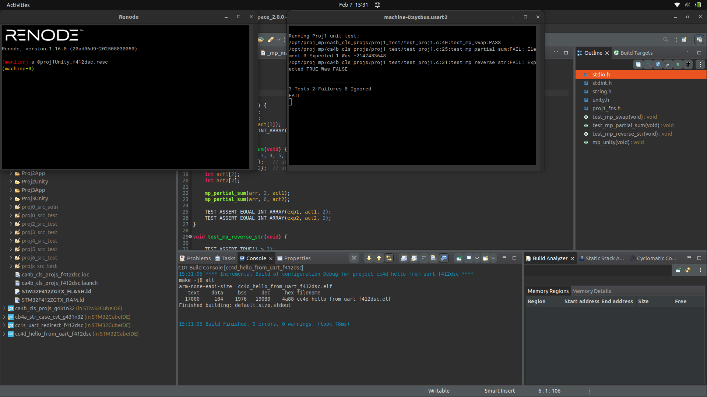
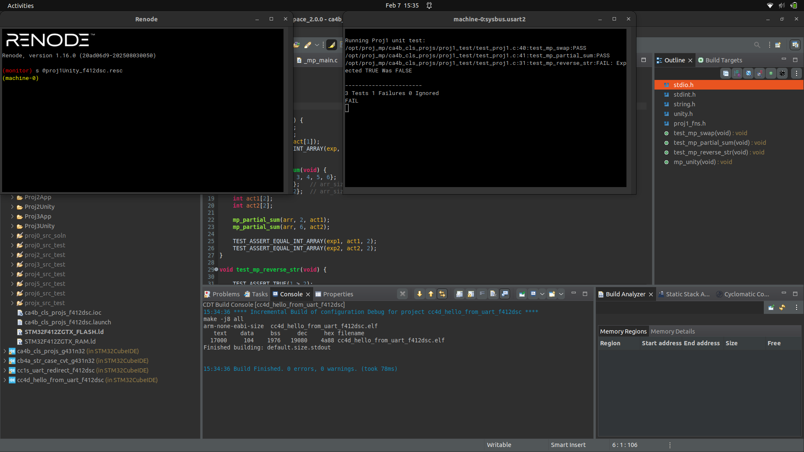
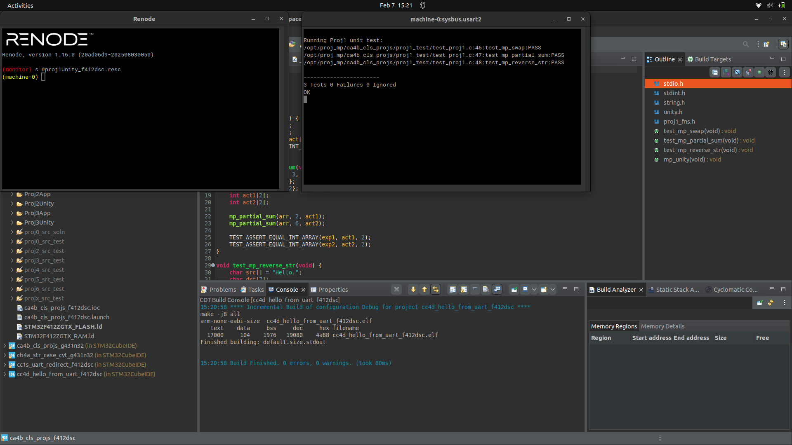

# Proj 01 Report: Pointers and Unit Test

**Course:** CEC 320 - Microprocessors
**Proj Start Date:** 2026-02-07
**Report Date:** 2026-02-07

---

## Introduction

This project focuses on C pointer manipulation, array indexing, string operations, and unit testing using the Unity framework. Four programming tasks were completed incrementally, with each task verified by running unit tests on Renode before proceeding to the next.

---

## Narrative

The project used the `ca4b_cls_projs` shared base project, which had pre-configured build configurations and include paths. Source files were placed in `proj1_src/` and `proj1_test/`, then linked into CubeIDE's `proj1_src_test/` folder. Each programming task was implemented one at a time, rebuilt, and tested in Renode to capture progressive test results. The TDD approach was followed for PT3/PT4 — the test function was written before the function under test.

---

## Code Snippets and Screenshots

### Artifact 1a: test_mp_swap PASSED



*Figure 1: Renode UART2 output showing test_mp_swap PASSED (1 pass, 2 fail) after modifying mp_swap to use pointers.*

### Artifact 1b: mp_swap Function

```c
void mp_swap(int *a, int *b) {
    int temp = *a;
    *a = *b;
    *b = temp;
}
```

*Code Snippet 1: PT1 — mp_swap modified to take int pointers, enabling pass-by-reference swapping.*

---

### Artifact 2a: test_mp_partial_sum PASSED



*Figure 2: Renode UART2 output showing test_mp_partial_sum PASSED (2 pass, 1 fail) with correct even/odd index sums.*

### Artifact 2b: mp_partial_sum Function

```c
void mp_partial_sum(int *arr, int arr_size, int *result) {
    result[0] = 0;
    result[1] = 0;

    for (int i = 0; i < arr_size; i++) {
        if (i % 2 == 0) {
            result[0] += *(arr + i);
        } else {
            result[1] += arr[i];
        }
    }
}
```

*Code Snippet 2: PT2 — mp_partial_sum using pointer arithmetic for even-indexed elements and array indexing for odd-indexed elements.*

---

### Artifact 3a: All Tests PASSED (PT3)



*Figure 3: Renode UART2 output showing all 3 Unity tests PASSED (3 pass, 0 fail) after implementing mp_reverse_str.*

### Artifact 3b: mp_reverse_str Function

```c
int mp_reverse_str(char *src, char *dst) {
    int len = 0;
    char *p = src;

    while (*p != '\0') {
        len++;
        p++;
    }

    for (int i = 0; i < len; i++) {
        dst[i] = src[len - 1 - i];
    }
    dst[len] = '\0';

    return len;
}
```

*Code Snippet 3: PT3 — mp_reverse_str determining string length without strlen, reversing characters into dst, and returning the count.*

---

### Artifact 4a: All Tests PASSED (PT4)


*Figure 4: Renode UART2 output confirming the test_mp_reverse_str unit test correctly validates string reversal and character count.*

### Artifact 4b: test_mp_reverse_str Function

```c
void test_mp_reverse_str(void) {
    char src[] = "Hello.";
    char dst[7];
    char exp[] = ".olleH";

    int result = mp_reverse_str(src, dst);

    TEST_ASSERT_EQUAL_INT(6, result);
    TEST_ASSERT_EQUAL_UINT8_ARRAY(exp, dst, 7);
}
```

*Code Snippet 4: PT4 — Unit test verifying "Hello." reverses to ".olleH" with 6 characters reversed, using TEST_ASSERT_EQUAL_INT and TEST_ASSERT_EQUAL_UINT8_ARRAY.*

---

## Discussions and Results

- Passing variables by value in C creates local copies — pointers are required to modify the caller's variables.
- Pointer arithmetic (`*(arr + i)`) and array indexing (`arr[i]`) are equivalent ways to access array elements; the choice is stylistic but both were demonstrated as required.
- Writing the test function before the function under test (TDD) clarifies expected behavior and catches implementation errors early.
- The Unity framework provides clear PASS/FAIL output per test, making incremental development straightforward.
