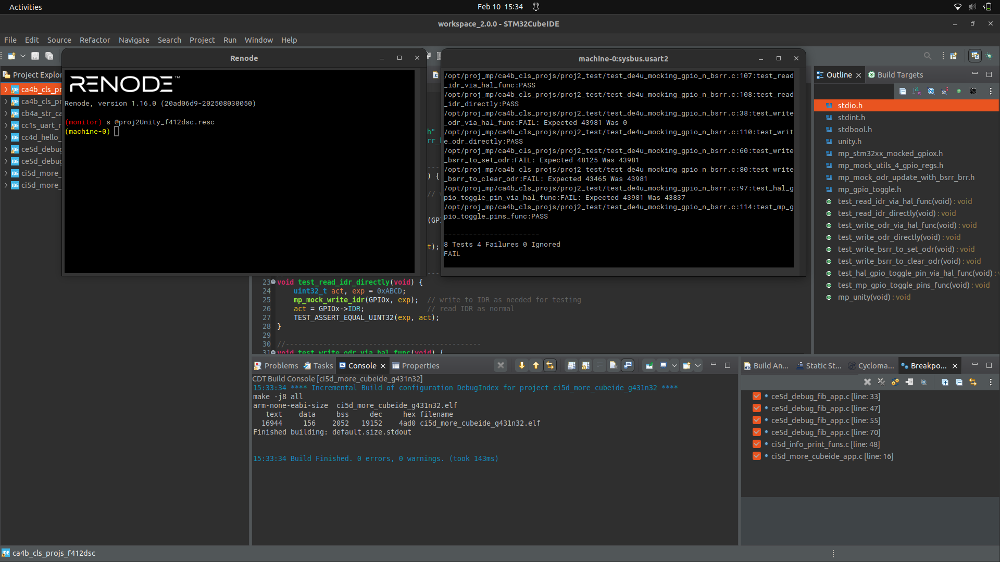
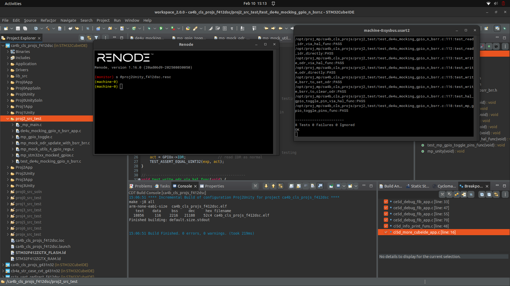

# Proj 02 Report: Mocking GPIO and BSRR

**Course:** CEC 320 / MP-DE4U
**Lab Start Date:** 2026-02-10
**Report Date:** 2026-02-10

---

## Introduction

This project teaches how to use mocking to unit test GPIO operations without real hardware. By intercepting access to real GPIO registers and rerouting it to locally-defined mocked registers, we can verify that functions correctly manipulate IDR, ODR, and BSRR — the key registers for GPIO input, output, and bit set/reset operations.

---

## Narrative

The project built on the `ca4b_cls_projs` base project used in Proj 1, so the CubeIDE infrastructure was already in place. Source files from `de4u_src_test.zip` were extracted into `proj2_src/` and `proj2_test/`, linked in CubeIDE, and a new Renode script (`proj2Unity_f412dsc.resc`) was created since none existed for Proj 2. The three programming tasks were implemented incrementally: first `mp_mock_write_idr` to pass the IDR tests, then `mp_mock_odr_update_with_bsrr` to simulate BSRR-to-ODR propagation, and finally the `test_mp_gpio_toggle_pins_func` test for the revised toggle function.

---

## Code Snippets and Screenshots

### Code C1: mp_mock_write_idr()

**File:** [c1.c](./c1.c)

```c
void mp_mock_write_idr(GPIO_TypeDef *GPIOx, uint32_t idr) {
    GPIOx->IDR = idr;
}
```

*Code Snippet 1: PT 1 — Writes a value to the mocked IDR register, simulating GPIO input pin state changes.*

### Code C2: mp_mock_odr_update_with_bsrr()

**File:** [c2.c](./c2.c)

```c
void mp_mock_odr_update_with_bsrr(GPIO_TypeDef *GPIOx) {
    if (GPIOx->BSRR != 0) {
        GPIOx->ODR |= (GPIOx->BSRR & 0xFFFF);
        GPIOx->ODR &= ~(GPIOx->BSRR >> 16);
        GPIOx->BSRR = 0;
    }
}
```

*Code Snippet 2: PT 2 — Simulates hardware BSRR-to-ODR propagation. Lower 16 bits (BS) set ODR bits, upper 16 bits (BR) clear ODR bits, then BSRR is cleared.*

### Code C3: test_mp_gpio_toggle_pins_func()

**File:** [c3.c](./c3.c)

```c
void test_mp_gpio_toggle_pins_func(void) {
    uint32_t act, exp = 0xABCD, odr = 0xAB3D;
    GPIOx->ODR = odr;
    mp_GPIO_TogglePinS(GPIOx, (15U<<4));
    act = mp_mock_read_odr(GPIOx);
    TEST_ASSERT_EQUAL_UINT32(exp, act);
}
```

*Code Snippet 3: PT 3 — Tests the revised `mp_GPIO_TogglePinS` function which toggles pins via direct ODR XOR instead of BSRR, eliminating the need for `mp_mock_odr_update_with_bsrr`.*

### Artifact A1: Tests 1,2 PASS After PT 1



*Figure 1: UART2 output after implementing `mp_mock_write_idr` — Tests 1 and 2 pass while 4 tests requiring BSRR mocking still fail.*

### Artifact A3: All 8 Tests PASS



*Figure 2: UART2 output after all three programming tasks — 8 Tests, 0 Failures, 0 Ignored.*

---

## Discussions and Results

**Key Learnings:**

- Mocking intercepts hardware register access by defining local structs that mirror GPIO register banks, allowing unit tests to run without real hardware or even Renode simulation
- BSRR provides atomic bit set/reset in a single write operation (2 ASM instructions) compared to the read-modify-write pattern of direct ODR manipulation (3 ASM instructions)
- The revised `mp_GPIO_TogglePinS` function uses direct ODR XOR (`GPIOx->ODR ^= GPIO_PinS`) which is simpler and supports toggling multiple pins at once, unlike the HAL version which unnecessarily reads ODR and writes to BSRR

**Takeaway:** Mocking is a powerful technique for testing hardware-dependent code on a host PC, and understanding the BSRR register's role in GPIO operations is essential for writing efficient embedded code.
