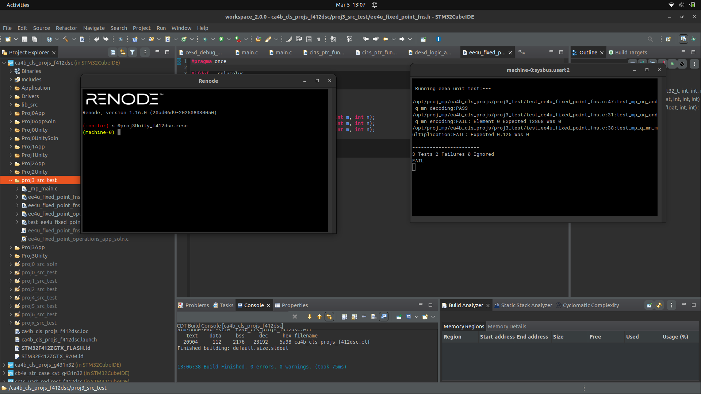
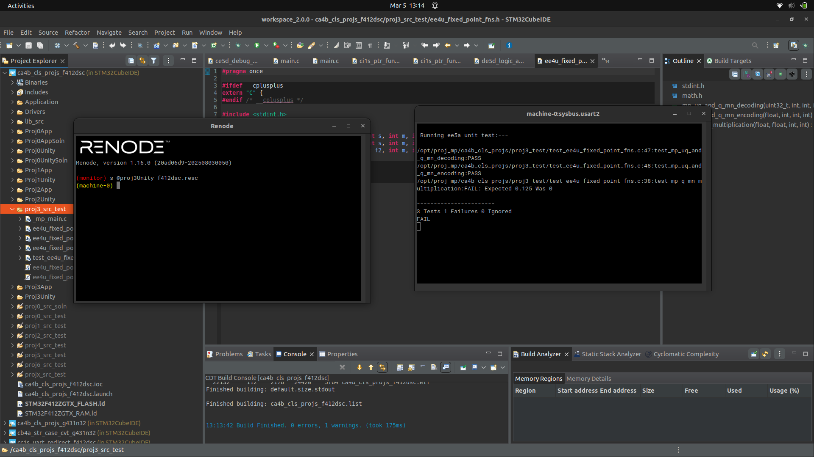
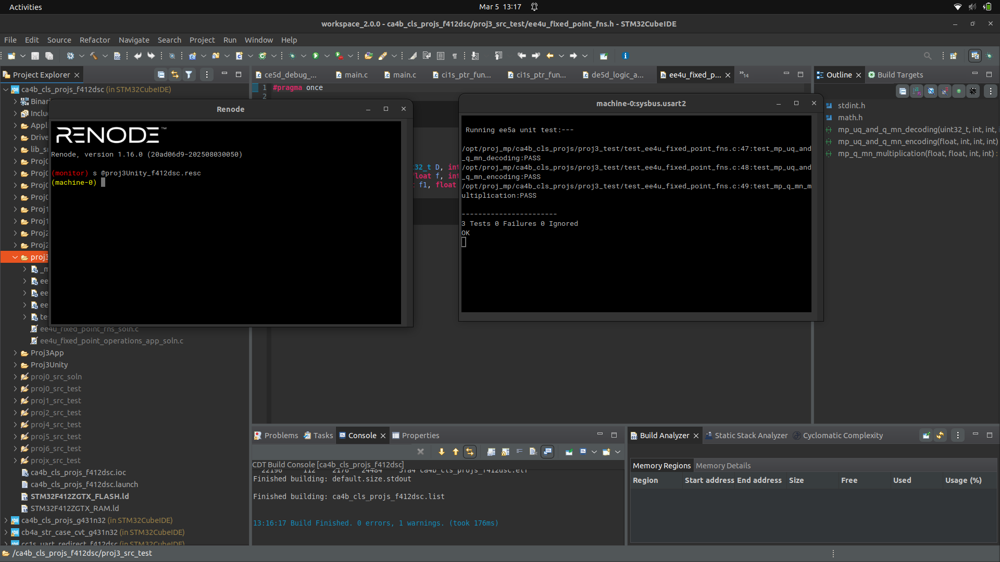
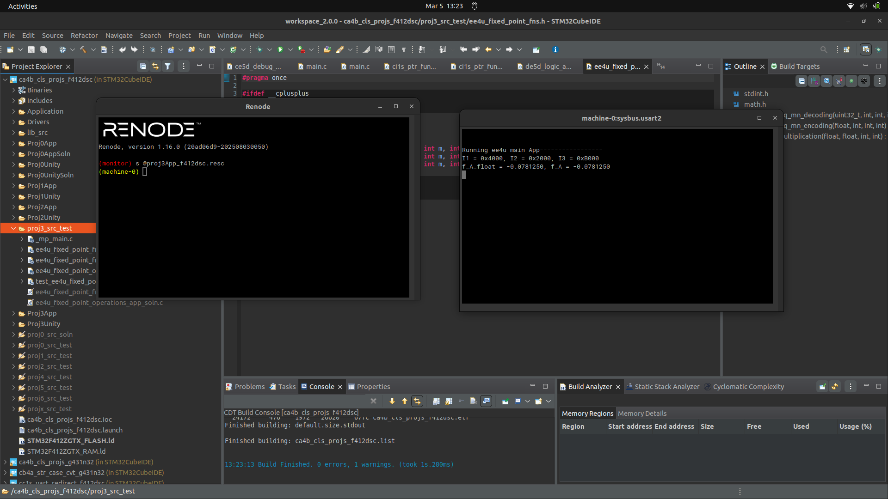

# Proj 03 Report: Fixed-Point Arithmetic Operations

**Course:** CEC 320 / MP-EE4U
**Lab Start Date:** ____________________
**Report Date:** ____________________

---

## Introduction

This project implements fixed-point arithmetic operations using UQm.n and Qm.n number representations. Three core functions were developed: decoding (fixed-point to float), encoding (float to fixed-point), and Qm.n multiplication. A main application demonstrates Q15 multiplication with three operands.

---

## Narrative

The solution files (`*_soln.c`) were pre-linked in the project and their strong implementations overrode the weak stubs, causing all 3 tests to pass immediately. This was resolved by excluding them from the build configurations via Resource Configurations.

The encoding function initially failed due to truncation during the float-to-integer cast. Using `(int32_t)` directly truncates toward zero, producing off-by-one errors for values that don't scale to exact integers. The fix was to use `lrint()` which rounds to the nearest integer, matching the expected test values.

---

## Code Snippets and Screenshots

### A1: Decoding Test Passes (1 of 3)



*Figure 1: After implementing mp_uq_and_q_mn_decoding — 1 pass, 2 failures.*

### A2: Encoding Test Also Passes (2 of 3)



*Figure 2: After implementing mp_uq_and_q_mn_encoding — 2 passes, 1 failure.*

### C1: Three Functions — ee4u_fixed_point_fns.c

**File:** [c1.c](./c1.c)

```c
float mp_uq_and_q_mn_decoding(uint32_t D, int s, int m, int n) {
    int total_bits = m + n + s;
    uint32_t mask = (1U << total_bits) - 1;
    D = D & mask;
    float f;
    if (s && (D >> (total_bits - 1))) {
        int32_t signed_D = (int32_t)(D | (~mask));
        f = (float)signed_D / (float)(1 << n);
    } else {
        f = (float)D / (float)(1 << n);
    }
    return f;
}

uint32_t mp_uq_and_q_mn_encoding(float f, int s, int m, int n) {
    float fn = f * (1 << n);
    int32_t intD = lrint(fn);
    uint32_t D = (uint32_t)intD;
    return D;
}

float mp_q_mn_multiplication(float f1, float f2, int m, int n) {
    int I1 = (int) mp_uq_and_q_mn_encoding(f1, 1, m, n);
    int I2 = (int) mp_uq_and_q_mn_encoding(f2, 1, m, n);
    int I3 = I1 * I2;
    I3 >>= n;
    float prod = mp_uq_and_q_mn_decoding(I3, 1, m, n);
    return prod;
}
```

*Code Snippet 1: Three fixed-point functions — decoding with sign extension, encoding with lrint rounding, and Qm.n multiplication via encode-multiply-shift-decode.*

### A3: All Tests Passing



*Figure 3: Renode UART output showing 3 Tests, 0 Failures, 0 Ignored — all fixed-point functions pass.*

### C2: Main App — ee4u_fixed_point_operations_app.c

**File:** [c2.c](./c2.c)

```c
void mp_app(void) {
    printf("\n\nRunning ee4u main App-----------------\n");
    float f1 = 0.5, f2 = 0.25, f3 = -0.625;
    uint16_t I1 = mp_uq_and_q_mn_encoding(f1, 1, 0, 15);
    uint16_t I2 = mp_uq_and_q_mn_encoding(f2, 1, 0, 15);
    uint16_t I3 = mp_uq_and_q_mn_encoding(f3, 1, 0, 15);
    float temp = mp_q_mn_multiplication(f1, f2, 0, 15);
    float f_A = mp_q_mn_multiplication(temp, f3, 0, 15);
    float f_A_float = f1 * f2 * f3;
    printf("I1 = 0x%04X, I2 = 0x%04X, I3 = 0x%04X \n", I1, I2, I3);
    printf("f_A_float = %8.7f, f_A = %8.7f \n", f_A_float, f_A);
    while (1);
}
```

*Code Snippet 2: Main app encodes three values to Q15, computes their product via Q15 multiplication, and compares with direct float multiplication.*

### A4: App Output



*Figure 4: App output showing I1=0x4000, I2=0x2000, I3=0xB000, and both f_A and f_A_float equal to -0.0781250.*

---

## Discussions and Results

**Key Learnings:**

- Fixed-point encoding requires proper rounding (`lrint`) rather than truncation to match expected integer representations
- Qm.n multiplication follows the pattern: encode operands, multiply integers, right-shift by n bits, decode result
- For Q15 (m=0, n=15), the Q15 multiplication result matched the direct float result exactly (-0.0781250), demonstrating that Q15 provides sufficient precision for these operand values

**Takeaway:** Fixed-point arithmetic enables fractional math on integer-only hardware by trading precision for speed, with the encode-multiply-shift-decode pattern being the fundamental operation.
