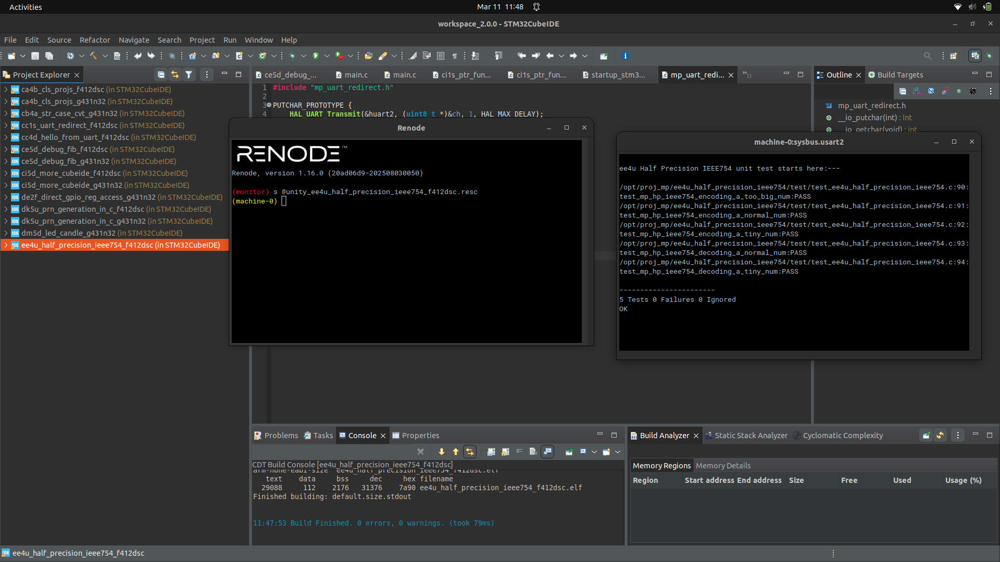
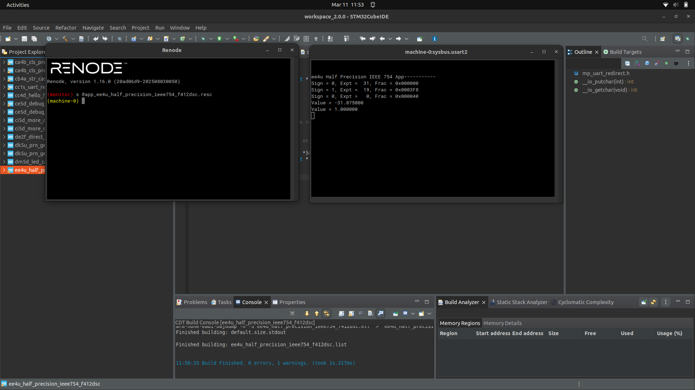

# Proj 04 Report: Half Precision IEEE 754 Numbers

**Course:** CEC 320
**Lab Start Date:** 2026-03-11
**Report Date:** 2026-03-11

---

## Introduction

This project implements encoding and decoding of half-precision (16-bit) IEEE 754-2008 floating-point numbers, which use 1 sign bit, 5 exponent bits (bias 15), and 10 fraction bits. The encoding function handles normal, denormalized, and overflow (infinity) cases, while the decoding function reconstructs the float value from the three fields.

---

## Narrative

The standalone project ZIP came fully pre-configured with linked source files, include paths, and build configurations (Debug for App, Unity for tests), so no CubeMX or manual CubeIDE setup was needed beyond importing. The `DebugSoln` config produced a makefile error during Clean All, but this is the instructor's solution config and does not affect student builds. All 5 Unity tests passed on the first build, and the App output matched expected values.

---

## Code Snippets and Screenshots

### Artifact A1: Unity Test Results — All 5 Tests Passing

*Figure 1: Renode UART2 output showing all 5 half-precision IEEE 754 tests passing (3 encoding + 2 decoding) with 0 failures.*

### Artifact A2: App Running Result

*Figure 2: Renode UART2 output showing App mode — encoded fields for 3 numbers (too-big → infinity, normal -31.875, denormalized 2^-18) and decoded values (-31.875, 1.0).*

### Code: ee4u_half_precision_ieee754_fns.c

**File:** [c1.c](./c1.c)

The encoding function determines the sign, then branches on magnitude: overflow maps to infinity (exp=31, frac=0), normal numbers use `floor(log2())` for the exponent and extract the fractional mantissa, and denormalized numbers set exp=0 with a scaled fraction. The decoding function reverses this by checking the exponent field to select the appropriate formula.

---

## Discussions and Results

- Half-precision IEEE 754 uses the same structure as single/double precision but with fewer bits, trading range and precision for memory efficiency (important for GPUs)
- The denormalized case (exp=0) provides gradual underflow by dropping the implicit leading 1, allowing representation of values smaller than 2^-14
- Overflow maps to infinity (exp=all 1s, frac=0) rather than wrapping, preserving IEEE 754 semantics
- The encoding/decoding round-trip is exact for the test values since they align to representable half-precision values
