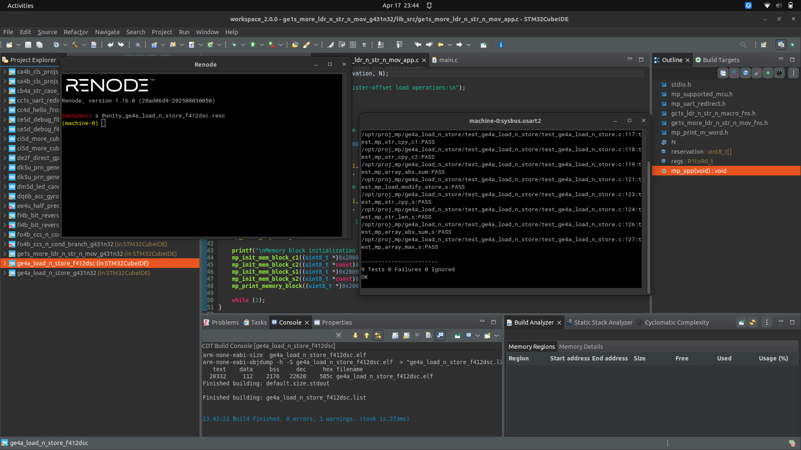
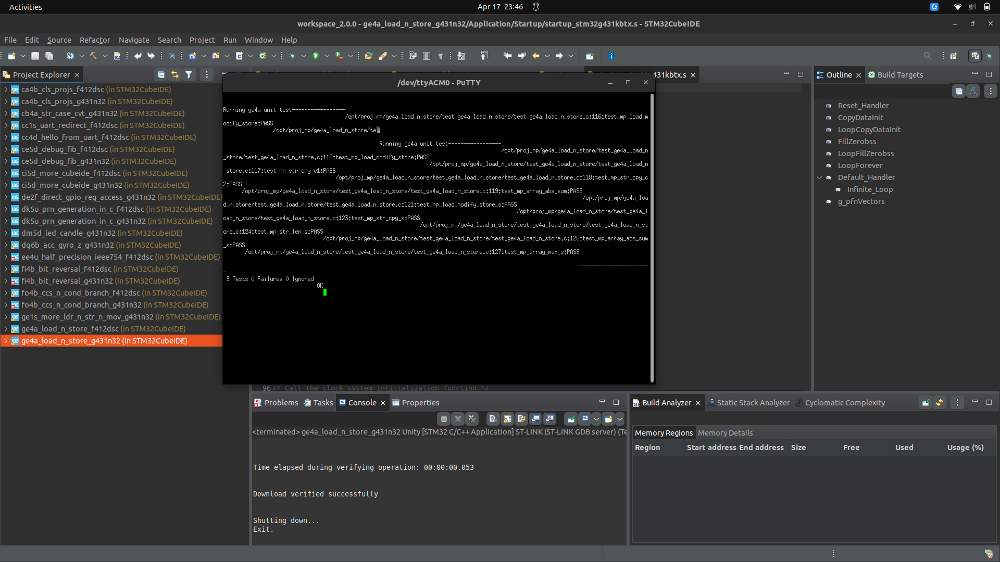

# Proj 05 Report: Load and Store (General)

**Course:** CEC 322
**Project Code:** MP-GE4A
**Student:** ____________________
**Date Started:** ____________________
**Date Completed:** ____________________

---

## Introduction

This project applies the ARM load-and-store instructions discussed in the
`ldr`/`str` lectures to three increasingly-general problem classes:

1. **Load–modify–store** on differently-sized pointer parameters
   (`int32_t *`, `int16_t *`, `int8_t *`), where the "modify" step must
   reduce to a single shift instruction.
2. **String processing** — copy and length — using post-indexed byte
   load/store as a direct assembly realization of C's `*p++` pointer
   idiom.
3. **Array processing** — accumulate-with-transform (absolute-value sum)
   and running maximum — using post-indexed word load and conditional
   execution.

The five programming tasks (totaling 90 points) are:

| PT | Function | Pts |
|----|----------|-----|
| PT1 | `mp_load_modify_store_s` | 15 |
| PT2a | `mp_str_cpy_s` | 18 |
| PT2b | `mp_str_len_s` | 12 |
| PT3a | `mp_array_abs_sum_s` | 30 |
| PT3b | `mp_array_max_s` | 15 |

All tasks live in a single file, `ge4a_load_n_store_sfns.s`, which starts
with five weak stubs that each do nothing but `bx lr`.

---

## Narrative

The base project was extracted from `ge4a_load_n_store.zip` to
`/opt/proj_mp/ge4a_load_n_store/`. Like lab08/lab09 and proj04, the zip
already ships fully-generated CubeMX sources and CubeIDE `.project` /
`.cproject` files with `PARENT-N-PROJECT_LOC` linked resources, so both
projects (`_f412dsc` and `_g431n32`) were imported directly via **File →
Open Projects from File System** in CubeIDE. One quirk worth noting: this
project uses non-standard `src_ge4a_load_n_store/` and
`test_ge4a_load_n_store/` folder names (not the plain `src/` and `test/` of
lab08/lab09); the packaged linked resources already target those names, so
no renaming was needed.

**Base-code vs. manual divergence.** The PDF §5.3.3 describes a "ReLU
norm" with the function name `mp_array_relu_sum` (positive-only sum). The
shipped zip instead ships `mp_array_abs_sum` — the same loop but with a
conditional negate so that negatives contribute their absolute value
rather than being skipped. The Unity test file exercises `abs_sum`
(`exp = {9, 18}` for `arr = {-5,-3,-1,0,1,3,5}` with `n ∈ {3, 7}`), so the
assembly was written to match the shipped test. If the PDF is
authoritative, swapping the `neglt` for a conditional skip over the `add`
is a one-line change.

**PT1 — `mp_load_modify_store_s`.**
The C reference does three `x = k * x / 4` operations with `k ∈ {3, 2, 1}`,
one per pointer-to-integer type. §5.3.1 says each modify **must** reduce
to a single shift-based instruction. The algebra:

| k | expression | one-instruction form |
|---|------------|----------------------|
| 3 | `3·x / 4 = x − x/4`  | `sub r3, r3, r3, asr #2` |
| 2 | `2·x / 4 = x / 2`    | `asr r3, r3, #1` |
| 1 | `1·x / 4 = x / 4`    | `asr r3, r3, #2` |

The load side uses `ldr` / `ldrsh` / `ldrsb` so the 16-bit and 8-bit values
arrive sign-extended in the full 32-bit register; arithmetic `asr` then
does the right thing for negatives. The store side uses `str` / `strh` /
`strb` so only the low 16 or 8 bits are written back, leaving adjacent
bytes in the `int[]` untouched.

**PT2a — `mp_str_cpy_s`.**
The C reference `while ((ch = *src++)) *dst++ = ch;` is the textbook
use-case for post-indexed `ldrb [r0], #1` / `strb [r1], #1`: one
instruction each for load-then-increment and store-then-increment. A
`cbz` handles the NUL-test without clobbering flags, which keeps the
loop at four instructions per character plus the final terminator write.

**PT2b — `mp_str_len_s`.**
No C reference is provided — §5.3.2 asks the student to figure the
semantics out from the test (`len("hi") == 2`, `len("hello") == 5`, i.e.
C-style length not counting the NUL). The chosen algorithm is
pointer-subtract: walk a shadow pointer `r1 = str`, `ldrb r2, [r1], #1`
until NUL, then return `(r1 − str − 1)`. The `−1` corrects for the fact
that post-increment leaves `r1` one byte *past* the NUL.

**PT3a — `mp_array_abs_sum_s`.**
Post-indexed `ldr r3, [r0], #4` replaces the C `temp = *(pArr + i); i++`
pair with one instruction. The `if (temp < 0) temp = -temp` branch is
collapsed to an `IT LT ; NEGLT r3, r3` — two instructions, no branch, no
pipeline stall. `r12` is used as the down-counter; because ARM EABI
treats `r12` (IP) as caller-saved, no `push {r12}` is needed.

**PT3b — `mp_array_max_s`.**
Same skeleton as PT3a, but seeded with `max = pArr[0]` (the test passes
`n ≥ 1` in every case) and using `IT GT ; MOVGT r2, r3` as the
conditional-update step. The `subs r12, r12, #1` + `bne` at the bottom
plays the role of `i++; while (i < n)`.

**Verification.**
All five algorithms were hand-simulated in Python against the Unity test
vectors before building on hardware. The assembly itself was sanity-
checked with `arm-none-eabi-as -mcpu=cortex-m4 -mthumb` (clean assemble).
The project was then built in CubeIDE under the `Unity` configuration and
run in Renode on F412dsc (Artifact A1), then flashed to a real G431
Nucleo-32 for Artifact A2.

---

## Code Snippets and Screenshots

### C1: `ge4a_load_n_store_sfns.s` (all 5 PT bodies)

See [c1.s](./c1.s).

The key instruction-level details:

- **PT1** uses three different load/store widths (`ldr/str`,
  `ldrsh/strh`, `ldrsb/strb`) paired with one shift instruction each.
- **PT2a / PT2b** use `[r0], #1` post-indexed byte load and
  `[r1], #1` post-indexed byte store; PT2b also uses `cbz` for an
  early-exit on NUL.
- **PT3a / PT3b** both use `[r0], #4` post-indexed word load, `IT`
  blocks with `neglt` / `movgt` for branchless conditional work, and
  `r12` as a caller-saved loop counter.

### A1: Unity Test Results — F412dsc via Renode

All 9 tests pass: `test_mp_load_modify_store` (C), `test_mp_str_cpy_c1`
(C), `test_mp_str_cpy_c2` (C), `test_mp_array_abs_sum` (C),
`test_mp_load_modify_store_s` (PT1), `test_mp_str_cpy_s` (PT2a),
`test_mp_str_len_s` (PT2b), `test_mp_array_abs_sum_s` (PT3a),
`test_mp_array_max_s` (PT3b).

### A2: Unity Test Results — G431n32 Real Board

---

## Discussions and Results

### PT1 — why `ldrsh` / `ldrsb` (not `ldrh` / `ldrb`)

The test data starts `inp = {-16, -8, -4}` and expects
`{-12, -4, -1}` after the three operations. The int16 and int8 loads must
**sign-extend** — if they didn't, `(uint16_t)-8 = 0xFFF8 = 65528 unsigned`
and `asr #1` would yield `32764`, not `-4`. Using `ldrsh` / `ldrsb` ensures
`asr` divides correctly for negative values.

### PT1 — why `strh` / `strb` (not `str`)

The Unity test aliases a single `int[3]` with three different pointer
types. After the three writes the test compares element-by-element with
`int[]` semantics, so the writes *must* preserve the neighboring bytes
of each `int` slot. `strh` / `strb` only write the low 2 / 1 bytes
respectively, which is exactly what the test expects. (Using `str` here
would wipe the upper bytes and give the wrong final `int32` values.)

### PT2 — post-indexed addressing as the "natural" idiom

ARM's post-indexed `ldrb Rt, [Rn], #k` executes as "load from address Rn,
then Rn += k" in a single cycle. This is a one-to-one map with C's `*p++`,
which is why §5.1.1 specifically calls out "post-indexed immediate-offset
load and store" as the instruction family this project targets. The five-
instruction inner loop of `mp_str_cpy_s` is the minimum possible for a
byte-by-byte copy on Cortex-M4.

### PT2b — why `(r1 − str − 1)` and not `(r1 − str)`

`ldrb r2, [r1], #1` first reads the byte at `r1`, *then* advances `r1`.
When the NUL is read, `r1` is already one byte past the NUL, so the raw
subtraction `r1 − str` counts the NUL itself; subtracting 1 yields the
standard C `strlen` (bytes up to but not including the terminator).

### PT3 — branchless conditionals via IT blocks

Both `abs_sum_s` and `max_s` use `IT` (If-Then) blocks with conditional
suffixes (`neglt`, `movgt`) to avoid branches inside the inner loop.
On Cortex-M4 this keeps the pipeline full: the `IT` block predicts with
100 % accuracy and the conditional instruction either executes or
retires as a NOP, with no branch-mispredict penalty. For short tests
(a predicate plus one conditional op) this is strictly faster than the
`bge …; neg …; label:` pattern.

### PT3 — `r12` as a scratch counter

ARM EABI classifies `r12` (also called `ip`, the "intra-procedure call"
register) as caller-saved. A leaf function is free to use it as a
scratch register without a `push/pop` pair, which saves two cycles at
entry and exit of each of `abs_sum_s` / `max_s`.

### Observed divergence: PDF text vs. shipped code

§5.3.3 of the manual discusses the *ReLU norm* (sum of positive
elements) but every concrete artifact in the zip — the C reference, the
asm stubs, the header, the test — uses *absolute-value sum*. The
submitted assembly matches the shipped code so that the Unity tests
pass. Swapping to ReLU would be a one-line change (`IT LT ; addge r2, r3`
or equivalently guard the `add` with `IT GE`).

---

## Submission

**PDF:** `cec320-proj5-report-lastname-firstname.pdf`
**ZIP:** `cec320-proj5-proj-lastname-firstname.zip`

See [proj05_findings.md](./proj05_findings.md) for the full submission
checklist.
