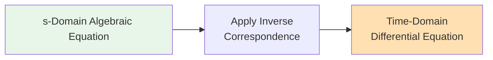
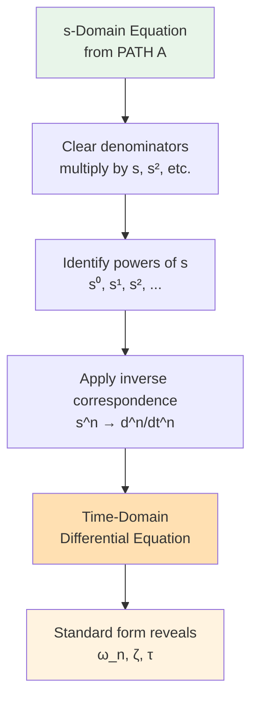

# Converting s-Domain Equations to Differential Equations

## Overview

This document covers the **reverse process**: starting with an s-domain algebraic equation (from PATH A) and deriving the corresponding time-domain differential equation.

## Why Do This?

After following PATH A, you may want to:
- **Understand the physics** - see what differential equation you actually solved
- **Answer exam questions** - "what is the differential equation?"
- **Analyze system behavior** - determine natural frequency, damping, etc.
- **Verify your work** - check against PATH B result

## Inverse Correspondence Rules

These rules convert s-domain terms back to time-domain:

| s-Domain Term | Time-Domain Equivalent | Notes |
|---------------|------------------------|-------|
| V(s) or I(s) | v(t) or i(t) | Basic function |
| sV(s) | dv(t)/dt | First derivative |
| s²V(s) | d²v(t)/dt² | Second derivative |
| s³V(s) | d³v(t)/dt³ | Third derivative |
| V(s)/s | ∫v(t)dt | Integration |
| Constant C | Constant C | Unchanged |
| V_s(s) | v_s(t) = ℒ⁻¹{V_s(s)} | Inverse transform source |

**Important:** Initial conditions are assumed to be handled separately (they appear as additional terms in s-domain).

## Step-by-Step Process

### Step 1: Start with s-Domain Equation

Begin with your algebraic equation from PATH A.

### Step 2: Multiply to Clear Denominators

Get all terms with same denominator or eliminate fractions.

### Step 3: Identify Powers of s

Look for s⁰, s¹, s², etc. multiplying V(s) or I(s).

### Step 4: Apply Inverse Correspondence

Replace each s-term with its time-domain equivalent.

### Step 5: Rearrange to Standard Form

Put derivatives in descending order, right-hand side for forcing function.

## Example 1: First-Order (Series RC)

### Starting s-Domain Equation

From PATH A Example 1:
$$\frac{10}{s} = I(s)\left[100 + \frac{10^5}{s}\right]$$

Or equivalently (voltage across capacitor):
$$V_C(s) = \frac{10^4}{s(s+1000)}$$

Let's work with the impedance equation:
$$V_s(s) = I(s) \cdot R + I(s) \cdot \frac{1}{sC}$$

### Step 1: Write Explicitly

$$V_s(s) = R \cdot I(s) + \frac{I(s)}{sC}$$

### Step 2: Multiply by sC

$$sC \cdot V_s(s) = sRC \cdot I(s) + I(s)$$

### Step 3: Apply Inverse Correspondence

- $sC \cdot V_s(s) \rightarrow C\frac{dv_s(t)}{dt}$
- $sRC \cdot I(s) \rightarrow RC\frac{di(t)}{dt}$
- $I(s) \rightarrow i(t)$

### Step 4: Time-Domain Differential Equation

$$C\frac{dv_s(t)}{dt} = RC\frac{di(t)}{dt} + i(t)$$

### Step 5: Alternative Form (for v_C)

To get differential equation for v_C(t), use: $i(t) = C\frac{dv_C(t)}{dt}$

Substitute:
$$C\frac{dv_s(t)}{dt} = RC \cdot C\frac{d^2v_C(t)}{dt^2} + C\frac{dv_C(t)}{dt}$$

Simplify:
$$\frac{dv_s(t)}{dt} = RC\frac{d^2v_C(t)}{dt^2} + \frac{dv_C(t)}{dt}$$

Or integrate:
$$v_s(t) = RC\frac{dv_C(t)}{dt} + v_C(t)$$

Which gives:
$$RC\frac{dv_C(t)}{dt} + v_C(t) = v_s(t)$$

**This matches PATH B Example 1!**

## Example 2: First-Order (Series RL)

### Starting s-Domain Equation

From PATH A Example 2:
$$\frac{5}{s+2} = I(s)[10 + 0.5s]$$

### Step 1: Expand

$$\frac{5}{s+2} = 10I(s) + 0.5sI(s)$$

### Step 2: Multiply Both Sides by 1 (already clear)

$$\frac{5}{s+2} = 10I(s) + 0.5sI(s)$$

### Step 3: Apply Inverse Correspondence

Left side: $\frac{5}{s+2} \rightarrow 5e^{-2t}u(t)$

Right side:
- $10I(s) \rightarrow 10i(t)$
- $0.5sI(s) \rightarrow 0.5\frac{di(t)}{dt}$

### Step 4: Time-Domain Differential Equation

$$5e^{-2t}u(t) = 10i(t) + 0.5\frac{di(t)}{dt}$$

Rearrange:
$$0.5\frac{di(t)}{dt} + 10i(t) = 5e^{-2t}u(t)$$

Or:
$$\frac{di(t)}{dt} + 20i(t) = 10e^{-2t}u(t)$$

**This matches PATH B Example 2!**

## Example 3: Second-Order (Series RLC)

### Starting s-Domain Equation

For a series RLC circuit:
$$V_s(s) = I(s)\left[R + sL + \frac{1}{sC}\right]$$

### Step 1: Expand

$$V_s(s) = RI(s) + sLI(s) + \frac{I(s)}{sC}$$

### Step 2: Multiply by sC

$$sCV_s(s) = sRCI(s) + s^2LCI(s) + I(s)$$

### Step 3: Apply Inverse Correspondence

- $sCV_s(s) \rightarrow C\frac{dv_s(t)}{dt}$
- $sRCI(s) \rightarrow RC\frac{di(t)}{dt}$
- $s^2LCI(s) \rightarrow LC\frac{d^2i(t)}{dt^2}$
- $I(s) \rightarrow i(t)$

### Step 4: Time-Domain Differential Equation

$$C\frac{dv_s(t)}{dt} = RC\frac{di(t)}{dt} + LC\frac{d^2i(t)}{dt^2} + i(t)$$

Rearrange:
$$LC\frac{d^2i(t)}{dt^2} + RC\frac{di(t)}{dt} + i(t) = C\frac{dv_s(t)}{dt}$$

**This is a second-order differential equation.**

For a step input v_s(t) = V₀u(t), the derivative is V₀δ(t):
$$LC\frac{d^2i(t)}{dt^2} + RC\frac{di(t)}{dt} + i(t) = CV_0\delta(t)$$

## Example 4: Parallel RLC Circuit

### Starting s-Domain Equation

$$I_s(s) = V(s)\left[\frac{1}{R} + \frac{1}{sL} + sC\right]$$

### Step 1: Expand

$$I_s(s) = \frac{V(s)}{R} + \frac{V(s)}{sL} + sCV(s)$$

### Step 2: Multiply by sL

$$sLI_s(s) = \frac{sLV(s)}{R} + V(s) + s^2LCV(s)$$

### Step 3: Apply Inverse Correspondence

- $sLI_s(s) \rightarrow L\frac{di_s(t)}{dt}$
- $\frac{sLV(s)}{R} \rightarrow \frac{L}{R}\frac{dv(t)}{dt}$
- $V(s) \rightarrow v(t)$
- $s^2LCV(s) \rightarrow LC\frac{d^2v(t)}{dt^2}$

### Step 4: Time-Domain Differential Equation

$$L\frac{di_s(t)}{dt} = \frac{L}{R}\frac{dv(t)}{dt} + v(t) + LC\frac{d^2v(t)}{dt^2}$$

Rearrange:
$$LC\frac{d^2v(t)}{dt^2} + \frac{L}{R}\frac{dv(t)}{dt} + v(t) = L\frac{di_s(t)}{dt}$$

For step input i_s(t) = I₀u(t):
$$LC\frac{d^2v(t)}{dt^2} + \frac{L}{R}\frac{dv(t)}{dt} + v(t) = LI_0\delta(t)$$

## Extracting System Parameters

Once you have the differential equation in standard form, you can identify system characteristics.

### First-Order Standard Form

$$\tau\frac{dy(t)}{dt} + y(t) = Ku(t)$$

Where:
- **τ = time constant** (seconds)
- **K = DC gain**

**For RC circuit:** τ = RC
**For RL circuit:** τ = L/R

### Second-Order Standard Form

$$\frac{d^2y(t)}{dt^2} + 2\zeta\omega_n\frac{dy(t)}{dt} + \omega_n^2y(t) = Ku(t)$$

Where:
- **ω_n = natural frequency** (rad/s)
- **ζ = damping ratio** (unitless)
- **K = DC gain**

### Example: Series RLC

From: $LC\frac{d^2i}{dt^2} + RC\frac{di}{dt} + i = C\frac{dv_s}{dt}$

Divide by LC:
$$\frac{d^2i}{dt^2} + \frac{R}{L}\frac{di}{dt} + \frac{1}{LC}i = \frac{1}{L}\frac{dv_s}{dt}$$

Identify:
- $\omega_n^2 = \frac{1}{LC}$ → $\omega_n = \frac{1}{\sqrt{LC}}$
- $2\zeta\omega_n = \frac{R}{L}$ → $\zeta = \frac{R}{2}\sqrt{\frac{C}{L}}$

### Damping Categories

- **Overdamped:** ζ > 1 (two real poles)
- **Critically damped:** ζ = 1 (repeated real pole)
- **Underdamped:** ζ < 1 (complex conjugate poles)

## Converting Back to s-Domain (Verification)

You can verify your differential equation by applying Laplace transform:

### Time Domain:
$$\frac{d^2i(t)}{dt^2} + 2\zeta\omega_n\frac{di(t)}{dt} + \omega_n^2i(t) = u(t)$$

### Apply Laplace:
$$s^2I(s) - si(0) - i'(0) + 2\zeta\omega_n[sI(s) - i(0)] + \omega_n^2I(s) = \frac{1}{s}$$

### With zero initial conditions:
$$I(s)[s^2 + 2\zeta\omega_n s + \omega_n^2] = \frac{1}{s}$$

$$I(s) = \frac{1}{s(s^2 + 2\zeta\omega_n s + \omega_n^2)}$$

This should match your PATH A result!

## Common Pitfalls

### Pitfall 1: Forgetting to Clear Denominators

Before applying inverse correspondence, ensure all terms are polynomials in s, not fractions.

### Pitfall 2: Wrong Correspondence

WRONG: $\frac{V(s)}{s} \rightarrow \frac{v(t)}{t}$

RIGHT: $\frac{V(s)}{s} \rightarrow \int v(t)dt$

### Pitfall 3: Mixing Variables

Stay consistent - if solving for i(t), don't introduce v(t) without substituting relationships.

### Pitfall 4: Source Function Confusion

The inverse transform of V_s(s) gives v_s(t), but you may need its derivative for the RHS.

## Quick Reference: s to t Correspondence

| From s-Domain | To Time-Domain | Operation |
|---------------|----------------|-----------|
| F(s) | f(t) | Basic |
| sF(s) | df/dt | Differentiation |
| s²F(s) | d²f/dt² | 2nd derivative |
| s³F(s) | d³f/dt³ | 3rd derivative |
| F(s)/s | ∫f(t)dt | Integration |
| C (constant) | C (constant) | Unchanged |
| 1/s | u(t) | Step function |
| 1/(s+a) | e^(-at)u(t) | Exponential |
| ω/(s²+ω²) | sin(ωt)u(t) | Sine |
| s/(s²+ω²) | cos(ωt)u(t) | Cosine |

## Practice Problems

Given the following s-domain equations, derive the time-domain differential equations:

### Problem 1
$$\frac{12}{s} = I(s)\left[4 + \frac{20}{s}\right]$$

### Problem 2
$$V(s)\left[\frac{1}{5} + \frac{1}{2s}\right] = \frac{4}{s}$$

### Problem 3
$$I(s)\left[8 + 2s + \frac{40}{s}\right] = \frac{20}{s}$$

## Summary

**Key insight:** The s-domain algebraic equation and time-domain differential equation contain the same information in different forms!

## Next Steps

- **Compare with PATH B:** Your derived equation should match what PATH B gives directly
- **Extract parameters:** Use standard form to find ω_n, ζ, etc.
- **Verify:** Apply Laplace transform to your diff eq and confirm it gives the original s-domain equation