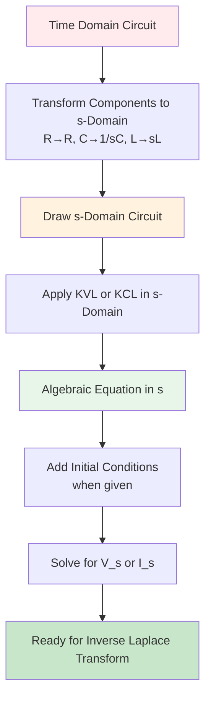
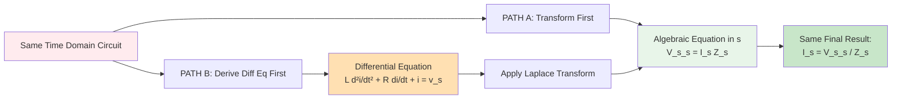
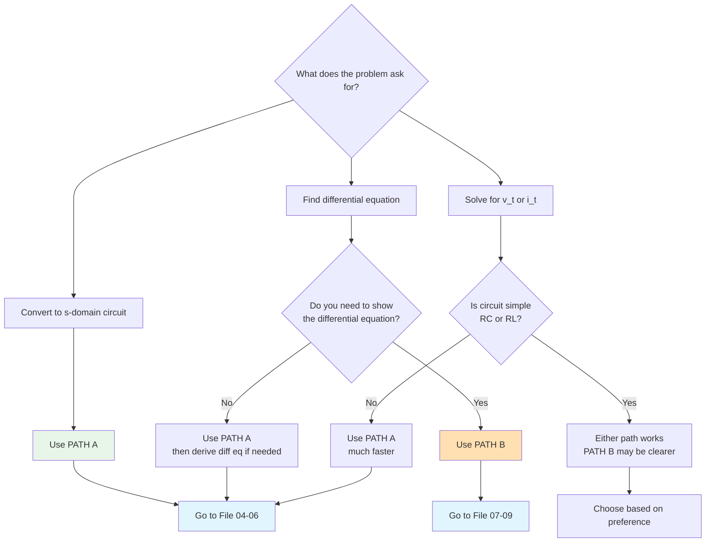
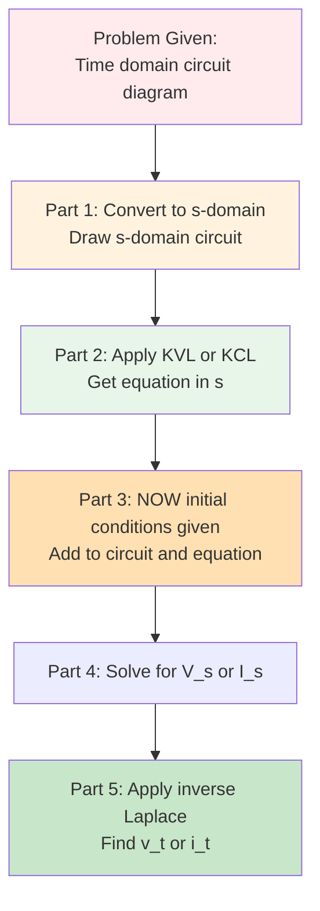
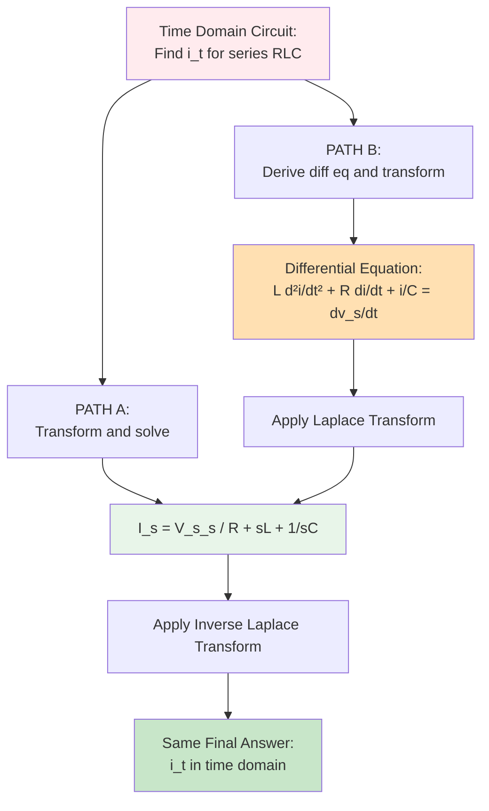

# Overview and Analysis Paths

## Introduction

When analyzing circuits using Laplace transforms, there are **two fundamentally different approaches** you can take. Understanding which path to use and when is critical for efficient problem-solving.

This document provides an overview of both paths and helps you choose the right approach for your problem.

## The Two Paths

### PATH A: Direct s-Domain Transformation
Go directly from time-domain circuit to s-domain, then apply circuit laws.

**Result:** Algebraic equation in s (NOT a differential equation)

### PATH B: Differential Equation First
Apply circuit laws in time domain first, derive differential equation, then transform.

**Result:** Explicitly written differential equation, then algebraic equation in s

## PATH A: Direct s-Domain Transformation



### Key Characteristics of PATH A

**Advantages:**
- Most common in exams and textbooks
- Faster for complex circuits
- Works directly with impedances
- No need to explicitly write differential equation
- Algebraic manipulation only (after transformation)

**When to Use:**
- Problem says "convert to s-domain"
- Complex circuits with multiple components
- Time pressure situations
- When you're comfortable with impedance concepts

**What You Get:**
An equation like: $V_s(s) = I(s)[R + sL + \frac{1}{sC}]$

This is **algebraic in s**, not a differential equation.

## PATH B: Differential Equation First

```mermaid
graph TD
    A[Time Domain Circuit] --> B[Apply KVL or KCL in Time Domain]
    B --> C[Substitute Component Equations<br/>v=Ri, v=L di/dt, i=C dv/dt]
    C --> D[Manipulate to Single Variable]
    D --> E[Differential Equation]
    E --> F[Apply Laplace Transform]
    F --> G[Use Differentiation Property<br/>L{df/dt} = sF_s - f_0]
    G --> H[Substitute Initial Conditions]
    H --> I[Algebraic Equation in s]
    I --> J[Solve for V_s or I_s]
    J --> K[Ready for Inverse Laplace Transform]
    
    style A fill:#ffebee
    style E fill:#ffe0b2
    style I fill:#e8f5e9
    style K fill:#c8e6c9
```

### Key Characteristics of PATH B

**Advantages:**
- Shows the physics more clearly
- Explicitly reveals the differential equation
- Better for understanding system behavior
- Natural for simple circuits

**When to Use:**
- Problem explicitly asks for differential equation
- Simple circuits (RC or RL)
- You need to understand the underlying physics
- Educational/learning context

**What You Get:**
First a differential equation like: $LC\frac{d^2i(t)}{dt^2} + RC\frac{di(t)}{dt} + i(t) = v_s(t)$

Then after Laplace transform: $LCs^2I(s) + RCsI(s) + I(s) = V_s(s)$

## Critical Difference



**Important:** Both paths lead to the **same s-domain result**, but:
- PATH A never explicitly shows the differential equation
- PATH B makes the differential equation visible

## Decision Flow Chart



## Comparison Table

| Aspect | PATH A | PATH B |
|--------|--------|--------|
| **First Step** | Transform to s-domain | Apply KVL/KCL in time domain |
| **Circuit Laws Applied** | In s-domain | In time domain |
| **Intermediate Result** | Algebraic equation in s | Differential equation |
| **Shows Diff Eq?** | No (implicit) | Yes (explicit) |
| **Speed** | Faster for complex circuits | Slower, more steps |
| **Complexity** | Impedance algebra | Differential equation manipulation |
| **Exam Preference** | More common | Less common |
| **Learning Value** | Good for practical solving | Better for understanding physics |
| **Best For** | Series/parallel RLC, complex circuits | Simple RC/RL circuits |

## What About Initial Conditions?

**Both paths handle initial conditions the same way:**

In PATH A:
- Transform circuit first (without initial conditions)
- Apply circuit laws
- **When initial conditions are given**, add them as sources
- Update your equation

In PATH B:
- Write differential equation
- **When initial conditions are given**, use them in Laplace transform
- They appear in the differentiation property: $\mathcal{L}\{\frac{df}{dt}\} = sF(s) - f(0)$

**Key Point:** Initial conditions are often given AFTER you've set up the basic equation. This is intentional in exam problems.

## Typical Exam Problem Structure



This structure follows **PATH A** because:
1. You transform before initial conditions are given
2. You work in s-domain throughout
3. Differential equation is not required

## Which Path Should You Learn First?

**Recommendation: Learn PATH A first**

Reasons:
1. More common in exams and homework
2. More efficient for most circuits
3. Builds impedance intuition
4. Easier to verify results

**Then learn PATH B** to:
- Understand what differential equation you're actually solving
- Gain deeper physical insight
- Handle problems that explicitly ask for differential equations

## Both Paths Lead to the Same Place



## Navigation Guide

**To learn PATH A (Direct s-Domain):**
1. Read `02-component-transformations.md` (essential foundation)
2. Read `04-path-a-time-to-sdomain.md`
3. Read `05-path-a-kvl-kcl-sdomain.md`
4. Read `03-initial-conditions.md`
5. Read `06-path-a-complete-process.md` (complete examples)

**To learn PATH B (Differential Equation First):**
1. Read `02-component-transformations.md` (still needed)
2. Read `07-path-b-time-domain-analysis.md`
3. Read `08-path-b-laplace-transform.md`
4. Read `03-initial-conditions.md`
5. Read `09-path-b-complete-process.md` (complete examples)

**To understand the connection:**
- Read `10-sdomain-to-differential-equation.md` (how to go backwards from PATH A to see the differential equation)

## Summary

- **PATH A** = Time domain → s-domain → Algebraic equation → Solve
- **PATH B** = Time domain → Differential equation → Laplace → Algebraic equation → Solve
- Both are valid
- Both give the same answer
- PATH A is more common and faster
- PATH B shows the physics more clearly
- Choose based on problem requirements and personal preference

**Next Steps:** Proceed to `02-component-transformations.md` to learn the fundamental transformation rules needed for both paths.