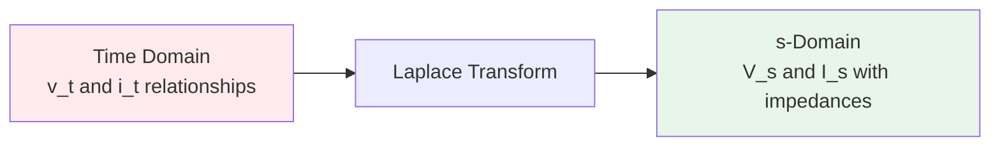
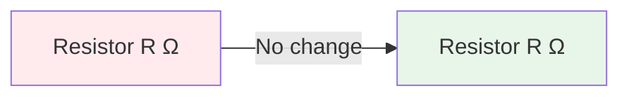
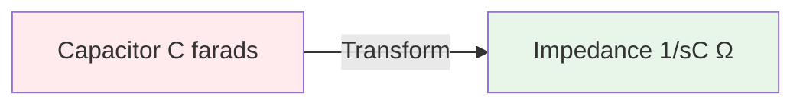
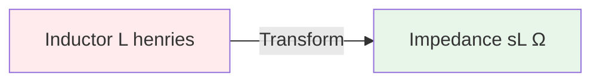
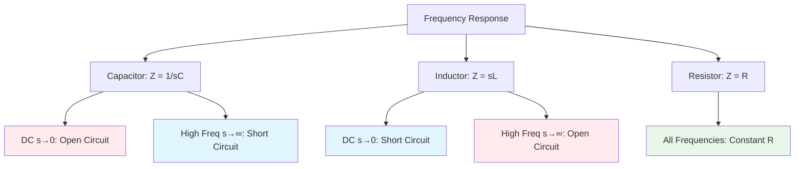
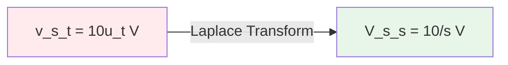
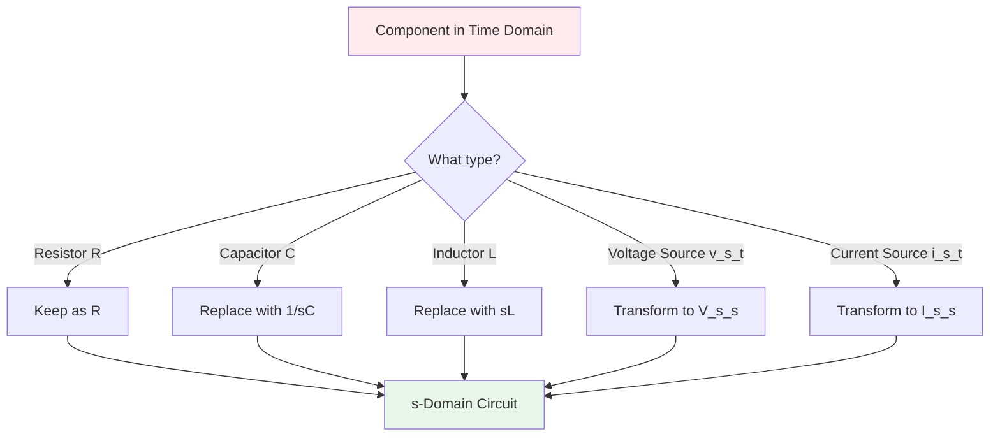

# Component Transformations: Time Domain to s-Domain

## Introduction

This document covers the fundamental transformation rules for converting circuit components from the time domain to the s-domain (Laplace domain). **These transformations are essential for both PATH A and PATH B.**

## The Basic Principle

In the s-domain, we replace time-domain relationships with frequency-domain (s-domain) **impedances**.



## Complete Transformation Table

| Component | Time Domain | s-Domain Impedance Z(s) | Notes |
|-----------|-------------|------------------------|-------|
| **Resistor** | $R$ | $R$ | Unchanged |
| **Capacitor** | $C$ | $\frac{1}{sC}$ | Inversely proportional to s |
| **Inductor** | $L$ | $sL$ | Proportional to s |
| **Voltage Source** | $v_s(t)$ | $V_s(s) = \mathcal{L}\{v_s(t)\}$ | Transform the function |
| **Current Source** | $i_s(t)$ | $I_s(s) = \mathcal{L}\{i_s(t)\}$ | Transform the function |

## Resistor Transformation

### Time Domain Relationship
$$v_R(t) = R \cdot i_R(t)$$
$$i_R(t) = \frac{v_R(t)}{R}$$

### s-Domain Impedance
$$Z_R(s) = R$$

### Transformation


**Key Points:**
- Resistors remain unchanged in s-domain
- Same value, same units (Ohms)
- Simplest component to transform

### s-Domain Ohm's Law
$$V_R(s) = R \cdot I_R(s)$$

## Capacitor Transformation

### Time Domain Relationships
$$i_C(t) = C \frac{dv_C(t)}{dt}$$
$$v_C(t) = \frac{1}{C}\int_{0}^{t} i_C(\tau)d\tau + v_C(0)$$

### s-Domain Impedance
$$Z_C(s) = \frac{1}{sC}$$

### Transformation


**Key Points:**
- Impedance is **inversely proportional** to both s and C
- At low frequencies (s → 0): impedance → ∞ (open circuit)
- At high frequencies (s → ∞): impedance → 0 (short circuit)
- Unit: Ohms (Ω)

### s-Domain Ohm's Law
$$V_C(s) = \frac{1}{sC} \cdot I_C(s)$$
$$I_C(s) = sC \cdot V_C(s)$$

### Why 1/sC?

Taking Laplace transform of the capacitor current equation:
$$i_C(t) = C \frac{dv_C(t)}{dt}$$

$$I_C(s) = C[sV_C(s) - v_C(0)]$$

Without initial condition (or with it as a separate source):
$$I_C(s) = sC \cdot V_C(s)$$

Therefore:
$$V_C(s) = \frac{1}{sC} \cdot I_C(s)$$

This is Ohm's law with impedance $Z_C = \frac{1}{sC}$

## Inductor Transformation

### Time Domain Relationships
$$v_L(t) = L \frac{di_L(t)}{dt}$$
$$i_L(t) = \frac{1}{L}\int_{0}^{t} v_L(\tau)d\tau + i_L(0)$$

### s-Domain Impedance
$$Z_L(s) = sL$$

### Transformation


**Key Points:**
- Impedance is **proportional** to both s and L
- At low frequencies (s → 0): impedance → 0 (short circuit)
- At high frequencies (s → ∞): impedance → ∞ (open circuit)
- Unit: Ohms (Ω)

### s-Domain Ohm's Law
$$V_L(s) = sL \cdot I_L(s)$$
$$I_L(s) = \frac{V_L(s)}{sL}$$

### Why sL?

Taking Laplace transform of the inductor voltage equation:
$$v_L(t) = L \frac{di_L(t)}{dt}$$

$$V_L(s) = L[sI_L(s) - i_L(0)]$$

Without initial condition (or with it as a separate source):
$$V_L(s) = sL \cdot I_L(s)$$

This is Ohm's law with impedance $Z_L = sL$

## Frequency Behavior Comparison



## Voltage Source Transformation

### Common Voltage Source Functions

| Time Domain | s-Domain Transform | Name |
|-------------|-------------------|------|
| $V_0 u(t)$ | $\frac{V_0}{s}$ | Step function |
| $V_0 e^{-at}u(t)$ | $\frac{V_0}{s+a}$ | Exponential |
| $V_0 \sin(\omega t)u(t)$ | $\frac{V_0\omega}{s^2+\omega^2}$ | Sine wave |
| $V_0 \cos(\omega t)u(t)$ | $\frac{V_0 s}{s^2+\omega^2}$ | Cosine wave |
| $V_0 t \cdot u(t)$ | $\frac{V_0}{s^2}$ | Ramp function |
| $V_0 \delta(t)$ | $V_0$ | Impulse function |

### Transformation Process



**Important:** Always include $u(t)$ when the source turns on at $t=0$.

## Current Source Transformation

### Common Current Source Functions

Same transform pairs as voltage sources, just replace $V$ with $I$:

| Time Domain | s-Domain Transform |
|-------------|-------------------|
| $I_0 u(t)$ | $\frac{I_0}{s}$ |
| $I_0 e^{-at}u(t)$ | $\frac{I_0}{s+a}$ |
| $I_0 \sin(\omega t)u(t)$ | $\frac{I_0\omega}{s^2+\omega^2}$ |
| $I_0 \cos(\omega t)u(t)$ | $\frac{I_0 s}{s^2+\omega^2}$ |

## Series and Parallel Impedances

### Series Impedances

Just like resistors:
$$Z_{total} = Z_1 + Z_2 + Z_3 + \cdots$$

**Example - Series RLC:**
$$Z_{total} = R + sL + \frac{1}{sC}$$

### Parallel Impedances

Just like resistors:
$$\frac{1}{Z_{total}} = \frac{1}{Z_1} + \frac{1}{Z_2} + \frac{1}{Z_3} + \cdots$$

**For two impedances:**
$$Z_{total} = \frac{Z_1 Z_2}{Z_1 + Z_2}$$

**Example - Parallel RLC:**
$$\frac{1}{Z_{total}} = \frac{1}{R} + \frac{1}{sL} + sC$$

## Transformation Examples

### Example 1: Series RC Circuit

**Time Domain:**
```
v_s(t) = 5u(t) V ---[R = 10Ω]---[C = 0.1F]--- ground
```

**s-Domain:**
```
V_s(s) = 5/s V ---[10Ω]---[10/s Ω]--- ground
```

**Calculations:**
- Source: $v_s(t) = 5u(t) \rightarrow V_s(s) = \frac{5}{s}$
- Resistor: $R = 10Ω$ (unchanged)
- Capacitor: $Z_C = \frac{1}{sC} = \frac{1}{s \cdot 0.1} = \frac{10}{s}$

**Total impedance:**
$$Z_{total} = R + Z_C = 10 + \frac{10}{s} = \frac{10s + 10}{s}$$

### Example 2: Parallel RL Circuit

**Time Domain:**
```
         i_s(t) = 2e^{-3t}u(t) A
              |
         +----+----+
         |    |    |
        R=4Ω L=2H
         |    |    |
       ground ground
```

**s-Domain:**
```
         I_s(s) = 2/(s+3) A
              |
         +----+----+
         |    |    |
        4Ω   2s Ω
         |    |    |
       ground ground
```

**Calculations:**
- Source: $i_s(t) = 2e^{-3t}u(t) \rightarrow I_s(s) = \frac{2}{s+3}$
- Resistor: $R = 4Ω$ (unchanged)
- Inductor: $Z_L = sL = 2s$

**Total impedance:**
$$Z_{total} = \frac{R \cdot Z_L}{R + Z_L} = \frac{4 \cdot 2s}{4 + 2s} = \frac{8s}{2(2 + s)} = \frac{4s}{s+2}$$

### Example 3: Series RLC Circuit

**Time Domain:**
```
v_s(t) = 10\cos(5t)u(t) V ---[R=2Ω]---[L=0.4H]---[C=0.05F]--- ground
```

**s-Domain:**
```
V_s(s) = 10s/(s²+25) V ---[2Ω]---[0.4s Ω]---[20/s Ω]--- ground
```

**Calculations:**
- Source: $v_s(t) = 10\cos(5t)u(t) \rightarrow V_s(s) = \frac{10s}{s^2+25}$
- Resistor: $R = 2Ω$ (unchanged)
- Inductor: $Z_L = sL = 0.4s$
- Capacitor: $Z_C = \frac{1}{sC} = \frac{1}{0.05s} = \frac{20}{s}$

**Total impedance:**
$$Z_{total} = 2 + 0.4s + \frac{20}{s} = \frac{2s + 0.4s^2 + 20}{s} = \frac{0.4s^2 + 2s + 20}{s}$$

## Unit Verification

All impedances must have units of **Ohms (Ω)**.

### Capacitor Impedance Units
$$[Z_C] = \frac{1}{[s][C]} = \frac{1}{s^{-1} \cdot F} = \frac{1}{s^{-1} \cdot \frac{s}{\Omega}} = \Omega$$ [CHECK]

### Inductor Impedance Units
$$[Z_L] = [s][L] = s^{-1} \cdot H = s^{-1} \cdot (\Omega \cdot s) = \Omega$$ [CHECK]

## Common Mistakes to Avoid

### [X] WRONG: Capacitor Transformation
```
C = 0.1F → Z = 0.1sC  (NO!)
C = 0.1F → Z = sC     (NO!)
C = 0.1F → Z = C      (NO!)
```

### [CHECK] CORRECT: Capacitor Transformation
```
C = 0.1F → Z = 1/(sC) = 1/(0.1s) = 10/s
```

### [X] WRONG: Inductor Transformation
```
L = 2H → Z = L/s    (NO!)
L = 2H → Z = 1/(sL) (NO!)
L = 2H → Z = L      (NO!)
```

### [CHECK] CORRECT: Inductor Transformation
```
L = 2H → Z = sL = 2s
```

### [X] WRONG: Forgetting the s Variable
```
Z_total = R + L + 1/C  (NO! Missing s)
```

### [CHECK] CORRECT: Including s
```
Z_total = R + sL + 1/(sC)
```

## Quick Reference: Transformation Rules



## Summary

| Component | Transformation | Frequency Behavior |
|-----------|---------------|-------------------|
| Resistor | $R \rightarrow R$ | Independent of frequency |
| Capacitor | $C \rightarrow \frac{1}{sC}$ | High Z at low freq, Low Z at high freq |
| Inductor | $L \rightarrow sL$ | Low Z at low freq, High Z at high freq |
| Voltage Source | $v_s(t) \rightarrow V_s(s)$ | Apply Laplace transform |
| Current Source | $i_s(t) \rightarrow I_s(s)$ | Apply Laplace transform |

**Note:** Initial conditions are NOT included in these basic transformations. They are added separately as voltage or current sources. See `03-initial-conditions.md` for details.

**Next Steps:**
- For PATH A: Proceed to `04-path-a-time-to-sdomain.md`
- For PATH B: Proceed to `07-path-b-time-domain-analysis.md`
- For initial conditions: See `03-initial-conditions.md`