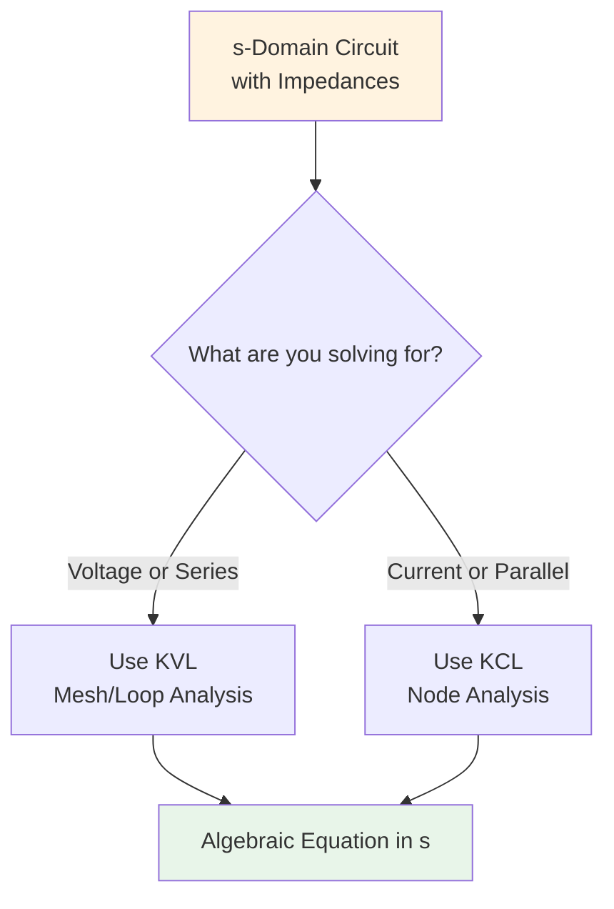

# PATH A: Applying KVL/KCL in s-Domain

## Overview

Once you have your s-domain circuit (from `04-path-a-time-to-sdomain.md`), you apply Kirchhoff's laws exactly as you would in DC circuit analysis - but now you're working with impedances and complex frequency s.



## Kirchhoff's Voltage Law (KVL) in s-Domain

### Basic Principle

**KVL:** The sum of voltages around any closed loop equals zero.

$$\sum V_{rises}(s) - \sum V_{drops}(s) = 0$$

Or equivalently:
$$\sum V_{sources}(s) = \sum V_{drops}(s)$$

### Voltage Drop Across Impedances

In s-domain, **Ohm's Law** applies:
$$V(s) = I(s) \cdot Z(s)$$

Where:
- V(s) = voltage across impedance
- I(s) = current through impedance
- Z(s) = impedance value

### When to Use KVL

**Use KVL for:**
- Series circuits (elements share same current)
- Mesh/loop analysis
- When solving for current
- Circuits with few loops

## KVL Step-by-Step Process

### Step 1: Choose Loop Direction

Pick clockwise or counterclockwise - stick with it.

### Step 2: Mark Current Direction

Draw current I(s) flowing around the loop.

### Step 3: Write Voltage Terms

For each component, going in loop direction:
- **Voltage source:** + if going − to +, − if going + to −
- **Impedance:** Use passive sign convention
  - Voltage drop = I(s) \times Z(s) in direction of current

### Step 4: Apply KVL Equation

$$V_{source}(s) = I(s) \cdot Z_1(s) + I(s) \cdot Z_2(s) + \cdots$$

Factor out I(s):
$$V_{source}(s) = I(s)[Z_1(s) + Z_2(s) + \cdots]$$

## KVL Example 1: Series RC Circuit

### s-Domain Circuit

```
V_s(s) = 10/s ----[R=100Ω]----[Z_C=10⁵/s Ω]---- ground
                   ← I(s) →
```

### Apply KVL (clockwise)

Going around loop:
$$V_s(s) - I(s) \cdot R - I(s) \cdot Z_C = 0$$

$$V_s(s) = I(s) \cdot R + I(s) \cdot Z_C$$

$$\frac{10}{s} = I(s)[100 + \frac{10^5}{s}]$$

Common denominator:
$$\frac{10}{s} = I(s)\left[\frac{100s + 10^5}{s}\right]$$

**Solve for I(s):**
$$I(s) = \frac{10}{s} \cdot \frac{s}{100s + 10^5} = \frac{10}{100s + 10^5}$$

Simplify:
$$I(s) = \frac{10}{100(s + 1000)} = \frac{0.1}{s + 1000}$$

### Find Voltage Across Capacitor

$$V_C(s) = I(s) \cdot Z_C = \frac{0.1}{s+1000} \cdot \frac{10^5}{s}$$

$$V_C(s) = \frac{10^4}{s(s+1000)}$$

## KVL Example 2: Series RL Circuit

### s-Domain Circuit

```
V_s(s) = 5/(s+2) ----[R=10Ω]----[Z_L=0.5s Ω]---- ground
                        ← I(s) →
```

### Apply KVL

$$V_s(s) = I(s) \cdot R + I(s) \cdot Z_L$$

$$\frac{5}{s+2} = I(s)[10 + 0.5s]$$

**Solve for I(s):**
$$I(s) = \frac{5}{(s+2)(10 + 0.5s)}$$

$$I(s) = \frac{5}{0.5(s+2)(20+s)} = \frac{10}{(s+2)(s+20)}$$

## Kirchhoff's Current Law (KCL) in s-Domain

### Basic Principle

**KCL:** The sum of currents entering a node equals the sum leaving.

$$\sum I_{in}(s) = \sum I_{out}(s)$$

Or:
$$\sum I_{sources}(s) = \sum I_{branches}(s)$$

### Current Through Impedances

Using Ohm's Law:
$$I(s) = \frac{V(s)}{Z(s)}$$

Where V(s) is the voltage across the impedance.

### When to Use KCL

**Use KCL for:**
- Parallel circuits (elements share same voltage)
- Node analysis
- When solving for voltage
- Circuits with few nodes

## KCL Step-by-Step Process

### Step 1: Identify Node

Choose the node where branches meet.

### Step 2: Define Node Voltage

Let V(s) = voltage at the node (relative to ground).

### Step 3: Write Current Terms

For each branch connected to node:
$$I_{branch}(s) = \frac{V_{node}(s)}{Z_{branch}(s)}$$

### Step 4: Apply KCL Equation

$$I_{source}(s) = \sum \frac{V(s)}{Z_i(s)}$$

Factor out V(s):
$$I_{source}(s) = V(s) \sum \frac{1}{Z_i(s)}$$

## KCL Example 1: Parallel RL Circuit

### s-Domain Circuit

```
         I_s(s) = 2/(s+3)
              |
         +----V(s)----+
         |            |
        R=4Ω         Z_L=2s Ω
         |            |
       ground       ground
```

### Apply KCL at Top Node

Currents leaving node:
$$I_s(s) = I_R(s) + I_L(s)$$

Express in terms of V(s):
- $I_R(s) = \frac{V(s)}{R} = \frac{V(s)}{4}$
- $I_L(s) = \frac{V(s)}{Z_L} = \frac{V(s)}{2s}$

**KCL equation:**
$$\frac{2}{s+3} = \frac{V(s)}{4} + \frac{V(s)}{2s}$$

Factor out V(s):
$$\frac{2}{s+3} = V(s)\left[\frac{1}{4} + \frac{1}{2s}\right]$$

Common denominator:
$$\frac{2}{s+3} = V(s)\left[\frac{s + 2}{4s}\right]$$

**Solve for V(s):**
$$V(s) = \frac{2}{s+3} \cdot \frac{4s}{s+2} = \frac{8s}{(s+3)(s+2)}$$

## KCL Example 2: Parallel RLC Circuit

### s-Domain Circuit

```
         I_s(s) = 4/s
              |
         +----V(s)----+----+----+
         |            |    |    |
        R=5Ω        Z_L  Z_C
         |          =2s  =10/s
       ground      gnd  gnd
```

### Apply KCL at Top Node

$$I_s(s) = I_R(s) + I_L(s) + I_C(s)$$

Express in terms of V(s):
- $I_R(s) = \frac{V(s)}{5}$
- $I_L(s) = \frac{V(s)}{2s}$
- $I_C(s) = V(s) \cdot \frac{s}{10}$ (since Z_C = 10/s, so 1/Z_C = s/10)

**KCL equation:**
$$\frac{4}{s} = \frac{V(s)}{5} + \frac{V(s)}{2s} + \frac{sV(s)}{10}$$

Factor out V(s):
$$\frac{4}{s} = V(s)\left[\frac{1}{5} + \frac{1}{2s} + \frac{s}{10}\right]$$

Common denominator (10s):
$$\frac{4}{s} = V(s)\left[\frac{2s + 5 + s^2}{10s}\right]$$

$$\frac{4}{s} = V(s)\left[\frac{s^2 + 2s + 5}{10s}\right]$$

**Solve for V(s):**
$$V(s) = \frac{4}{s} \cdot \frac{10s}{s^2 + 2s + 5} = \frac{40}{s^2 + 2s + 5}$$

## Mixed Analysis: Series-Parallel Circuits

For complex topologies, you may need to combine methods.

### Approach 1: Simplify First

Combine series/parallel impedances before applying KVL/KCL.

**Example:** If R₂ and C are in parallel within a series circuit:
1. Find Z_parallel = (R₂ \times Z_C)/(R₂ + Z_C)
2. Now circuit is series: R₁ with Z_parallel
3. Apply KVL

### Approach 2: Multiple Equations

Write separate KVL/KCL for each loop/node, then solve system.

### Approach 3: Node-Voltage Method

Choose one analysis method and stick with it throughout.

## Key Equations Summary

### For Series Circuits (KVL)

**Total impedance:**
$$Z_{total} = Z_1 + Z_2 + \cdots + Z_n$$

**Current:**
$$I(s) = \frac{V_s(s)}{Z_{total}}$$

**Voltage across element i:**
$$V_i(s) = I(s) \cdot Z_i(s)$$

### For Parallel Circuits (KCL)

**Total admittance:**
$$Y_{total} = Y_1 + Y_2 + \cdots + Y_n = \frac{1}{Z_1} + \frac{1}{Z_2} + \cdots$$

**Total impedance:**
$$Z_{total} = \frac{1}{Y_{total}}$$

**Voltage:**
$$V(s) = I_s(s) \cdot Z_{total}$$

**Current through element i:**
$$I_i(s) = \frac{V(s)}{Z_i(s)}$$

## Algebraic Tips

### Tip 1: Always Factor Out the Unknown

Immediately factor out I(s) or V(s):

$$V_s(s) = I(s) \cdot Z_1 + I(s) \cdot Z_2 = I(s)[Z_1 + Z_2]$$

### Tip 2: Find Common Denominators Early

$$100 + \frac{10^5}{s} = \frac{100s + 10^5}{s}$$

### Tip 3: Simplify Before Solving

$$\frac{10}{100s + 10^5} = \frac{10}{100(s + 1000)} = \frac{0.1}{s + 1000}$$

### Tip 4: Check Units

All impedances must be in Ohms (Ω).

### Tip 5: Verify with Limiting Cases

- At s → 0 (DC): capacitors = open, inductors = short
- At s → ∞ (high freq): capacitors = short, inductors = open

## What You Have Now

After applying KVL or KCL, you have:

1. **An algebraic equation in s** (not a differential equation!)
2. **Expression for V(s) or I(s)** in terms of sources and impedances
3. **No initial conditions yet** (added in next step if needed)

## Common Mistakes to Avoid

### Mistake 1: Forgetting to Factor

WRONG: Leaving terms like: $V_s(s) = I(s) \cdot R + I(s) \cdot Z_L$

RIGHT: Factor immediately: $V_s(s) = I(s)[R + Z_L]$

### Mistake 2: Sign Errors

Always use consistent sign convention:
- Passive sign convention for impedances
- Check source polarity carefully

### Mistake 3: Wrong Current Direction

Current through impedance must match the voltage polarity you're calculating.

### Mistake 4: Mixing Series and Parallel

For series: add impedances directly
For parallel: use reciprocal formula or product-over-sum

### Mistake 5: Forgetting s in Impedances

WRONG: $Z = R + L + 1/C$

RIGHT: $Z = R + sL + 1/(sC)$

## Next Steps

**Without initial conditions:** You now have your complete equation! Skip to `06-path-a-complete-process.md` for full examples.

**With initial conditions:** Proceed to `03-initial-conditions.md` to learn how to add them to your equation.

## Summary

KVL/KCL in s-domain:
1. ✓ Choose appropriate method (KVL for series, KCL for parallel)
2. ✓ Write equation using Ohm's law with impedances
3. ✓ Factor out unknown (I(s) or V(s))
4. ✓ Simplify algebraically
5. ✓ Solve for desired variable
6. → Result is algebraic equation in s

**Key insight:** This is ALGEBRA, not differential equations! That's the power of s-domain analysis.