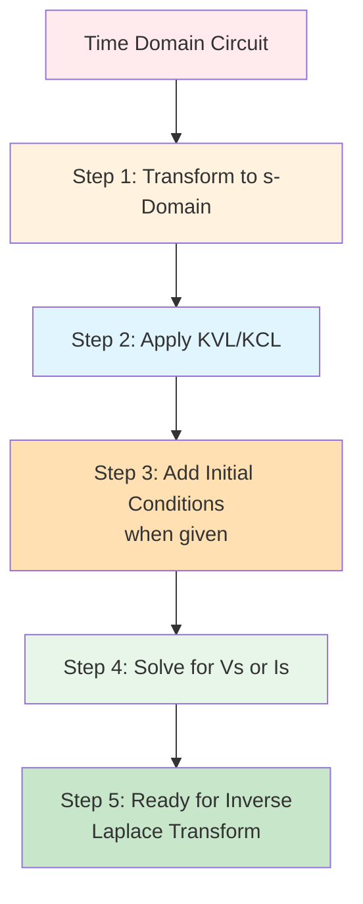
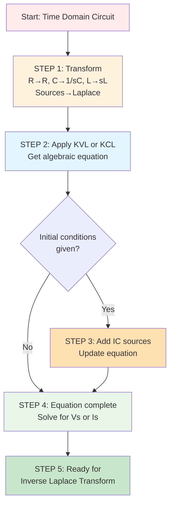

# PATH A: Complete Process with Examples

## Overview

This document presents the **complete PATH A process** from start to finish with detailed worked examples. PATH A takes you directly from time domain to s-domain, applies circuit laws, and prepares for inverse Laplace transform.



## Complete Example 1: Series RC Circuit (Zero Initial Conditions)

### Problem Statement

Find the voltage across the capacitor v_C(t) for t ≥ 0.

**Given:**
- v_s(t) = 10u(t) V
- R = 100Ω
- C = 10µF
- Initial condition: v_C(0) = 0 (capacitor uncharged)

### Time Domain Circuit

```
v_s(t) = 10u(t) V ----[R=100Ω]----[C=10µF]---- ground
```

### STEP 1: Transform to s-Domain

**Component transformations:**
1. Voltage source: v_s(t) = 10u(t) → V_s(s) = 10/s V
2. Resistor: R = 100Ω → R = 100Ω (unchanged)
3. Capacitor: C = 10µF = 10×10⁻⁶ F → Z_C = 1/(sC) = 1/(s·10×10⁻⁶) = 10⁶/(10s) = 10⁵/s Ω

**s-Domain circuit (no initial conditions yet):**
```
V_s(s) = 10/s V ----[100Ω]----[10⁵/s Ω]---- ground
```

### STEP 2: Apply KVL in s-Domain

Let I(s) = current flowing clockwise

**KVL equation:**
$$V_s(s) = I(s) \cdot R + I(s) \cdot Z_C$$

$$\frac{10}{s} = I(s)\left[100 + \frac{10^5}{s}\right]$$

**Common denominator:**
$$\frac{10}{s} = I(s)\left[\frac{100s + 10^5}{s}\right]$$

**Solve for I(s):**
$$I(s) = \frac{10}{s} \cdot \frac{s}{100s + 10^5} = \frac{10}{100s + 10^5}$$

**Simplify:**
$$I(s) = \frac{10}{100(s + 1000)} = \frac{0.1}{s + 1000}$$

**Find V_C(s):**
$$V_C(s) = I(s) \cdot Z_C = \frac{0.1}{s+1000} \cdot \frac{10^5}{s}$$

$$V_C(s) = \frac{10^4}{s(s+1000)}$$

### STEP 3: Add Initial Conditions

Given: v_C(0) = 0

Since the initial condition is zero, **no additional source is needed**. The equation is complete.

### STEP 4: Solve for V_C(s) - Complete

$$V_C(s) = \frac{10^4}{s(s+1000)} = \frac{10000}{s(s+1000)}$$

### STEP 5: Ready for Inverse Laplace Transform

**Final result:**
$$V_C(s) = \frac{10000}{s(s+1000)}$$

This would be solved using **partial fraction expansion**:
$$V_C(s) = \frac{A}{s} + \frac{B}{s+1000}$$

And then inverse transformed to find v_C(t).

---

## Complete Example 2: Series RL Circuit (Non-Zero Initial Condition)

### Problem Statement

Find the current i(t) for t ≥ 0.

**Given:**
- v_s(t) = 5e^(-2t)u(t) V
- R = 10Ω
- L = 0.5H
- Initial condition (given later): i_L(0) = 2A

### Time Domain Circuit

```
v_s(t) = 5e^(-2t)u(t) V ----[R=10Ω]----[L=0.5H]---- ground
```

### STEP 1: Transform to s-Domain

**Component transformations:**
1. Voltage source: v_s(t) = 5e^(-2t)u(t) → V_s(s) = 5/(s+2) V
2. Resistor: R = 10Ω → R = 10Ω (unchanged)
3. Inductor: L = 0.5H → Z_L = sL = 0.5s Ω

**s-Domain circuit (no initial conditions yet):**
```
V_s(s) = 5/(s+2) V ----[10Ω]----[0.5s Ω]---- ground
```

### STEP 2: Apply KVL in s-Domain

Let I(s) = current flowing clockwise

**KVL equation:**
$V_s(s) = I(s) \cdot R + I(s) \cdot Z_L$

$\frac{5}{s+2} = I(s)[10 + 0.5s]$

**Solve for I(s) (without initial condition):**
$I(s) = \frac{5}{(s+2)(10 + 0.5s)}$

Factor denominator:
$I(s) = \frac{5}{0.5(s+2)(20+s)} = \frac{10}{(s+2)(s+20)}$

### STEP 3: Add Initial Conditions

**Now given:** i_L(0) = 2A

For series circuit with inductor, add voltage source Li_L(0) in series with Z_L.

**Initial condition voltage source:**
$V_{initial} = Li_L(0) = 0.5 \times 2 = 1V$

**Updated s-Domain circuit:**
```
V_s(s) = 5/(s+2) V ----[10Ω]----[0.5s Ω]----[+1V]---- ground
                                              (opposes current)
```

**Updated KVL equation:**
$V_s(s) = I(s) \cdot R + I(s) \cdot Z_L + V_{initial}$

$\frac{5}{s+2} = I(s)[10 + 0.5s] + 1$

**Rearrange:**
$\frac{5}{s+2} - 1 = I(s)[10 + 0.5s]$

$\frac{5 - (s+2)}{s+2} = I(s)[10 + 0.5s]$

$\frac{3-s}{s+2} = I(s)[10 + 0.5s]$

### STEP 4: Solve for I(s) - Complete

$I(s) = \frac{3-s}{(s+2)(10+0.5s)}$

$I(s) = \frac{3-s}{0.5(s+2)(s+20)} = \frac{2(3-s)}{(s+2)(s+20)}$

$I(s) = \frac{6-2s}{(s+2)(s+20)}$

### STEP 5: Ready for Inverse Laplace Transform

**Final result:**
$I(s) = \frac{6-2s}{(s+2)(s+20)}$

This would be solved using partial fractions, then inverse transformed to find i(t).

---

## Complete Example 3: Parallel RLC Circuit (Non-Zero Initial Conditions)

### Problem Statement

Find the voltage v(t) across all elements for t ≥ 0.

**Given:**
- i_s(t) = 4u(t) A
- R = 5Ω
- L = 1H
- C = 0.1F
- Initial conditions (given later): v_C(0) = 0V, i_L(0) = 3A

### Time Domain Circuit

```
         i_s(t) = 4u(t) A
              |
         +----+----+----+
         |    |    |    |
        R=5Ω L=1H C=0.1F
         |    |    |    |
       gnd  gnd  gnd  gnd
```

### STEP 1: Transform to s-Domain

**Component transformations:**
1. Current source: i_s(t) = 4u(t) → I_s(s) = 4/s A
2. Resistor: R = 5Ω (unchanged)
3. Inductor: L = 1H → Z_L = s Ω
4. Capacitor: C = 0.1F → Z_C = 1/(0.1s) = 10/s Ω

**s-Domain circuit (no initial conditions yet):**
```
         I_s(s) = 4/s A
              |
         +----+----+----+
         |    |    |    |
        5Ω   s Ω  10/s Ω
         |    |    |    |
       gnd  gnd  gnd  gnd
```

### STEP 2: Apply KCL at Top Node

Let V(s) = voltage at the node

**KCL equation:**
$I_s(s) = I_R(s) + I_L(s) + I_C(s)$

Express currents in terms of V(s):
- $I_R(s) = \frac{V(s)}{R} = \frac{V(s)}{5}$
- $I_L(s) = \frac{V(s)}{Z_L} = \frac{V(s)}{s}$
- $I_C(s) = \frac{V(s)}{Z_C} = \frac{V(s)}{10/s} = \frac{sV(s)}{10}$

**Substitute:**
$\frac{4}{s} = \frac{V(s)}{5} + \frac{V(s)}{s} + \frac{sV(s)}{10}$

**Factor out V(s):**
$\frac{4}{s} = V(s)\left[\frac{1}{5} + \frac{1}{s} + \frac{s}{10}\right]$

**Common denominator (10s):**
$\frac{4}{s} = V(s)\left[\frac{2s + 10 + s^2}{10s}\right]$

$\frac{4}{s} = V(s)\left[\frac{s^2 + 2s + 10}{10s}\right]$

**Solve for V(s) (without initial conditions):**
$V(s) = \frac{4}{s} \cdot \frac{10s}{s^2 + 2s + 10}$

$V(s) = \frac{40}{s^2 + 2s + 10}$

### STEP 3: Add Initial Conditions

**Now given:** v_C(0) = 0V, i_L(0) = 3A

**For capacitor:** Since v_C(0) = 0, no voltage source needed.

**For inductor (parallel form for KCL):** Add current source i_L(0)/s = 3/s A in parallel with Z_L

**Updated s-Domain circuit:**
```
         I_s(s) = 4/s A
              |
         +----+----+----+
         |    |    |    |
        5Ω   [s Ω]  10/s Ω
         |   [3/s A↓]  |
       gnd  gnd  gnd  gnd
```

The inductor initial condition current source supplies current to the node.

**Updated KCL equation:**
$I_s(s) + I_{L,initial}(s) = I_R(s) + I_L(s) + I_C(s)$

$\frac{4}{s} + \frac{3}{s} = \frac{V(s)}{5} + \frac{V(s)}{s} + \frac{sV(s)}{10}$

$\frac{7}{s} = V(s)\left[\frac{s^2 + 2s + 10}{10s}\right]$

### STEP 4: Solve for V(s) - Complete

$V(s) = \frac{7}{s} \cdot \frac{10s}{s^2 + 2s + 10}$

$V(s) = \frac{70}{s^2 + 2s + 10}$

### STEP 5: Ready for Inverse Laplace Transform

**Final result:**
$V(s) = \frac{70}{s^2 + 2s + 10}$

Complete the square in denominator: s² + 2s + 10 = (s+1)² + 9

$V(s) = \frac{70}{(s+1)^2 + 9}$

This has the form of a damped sinusoid and can be inverse transformed to find v(t).

---

## Complete Example 4: Typical Exam Problem Format

### Problem Statement

This example follows the typical exam format where initial conditions are given AFTER you've set up the s-domain circuit.

**Part (a):** Convert the circuit to s-domain and draw the s-domain equivalent circuit.

**Part (b):** Apply KVL and find an expression for I(s).

**Part (c):** Now you are told: v_C(0) = 5V, i_L(0) = 0A. Add these to your circuit and find the complete expression for I(s).

**Given circuit:**
```
v_s(t) = 20u(t) V ----[R=8Ω]----[L=2H]----[C=0.025F]---- ground
```

### Solution to Part (a): Transform to s-Domain

**Component transformations:**
1. v_s(t) = 20u(t) → V_s(s) = 20/s V
2. R = 8Ω (unchanged)
3. L = 2H → Z_L = 2s Ω
4. C = 0.025F → Z_C = 1/(0.025s) = 40/s Ω

**s-Domain circuit:**
```
V_s(s) = 20/s V ----[8Ω]----[2s Ω]----[40/s Ω]---- ground
```

### Solution to Part (b): Apply KVL

Let I(s) = current flowing clockwise

**KVL equation:**
$V_s(s) = I(s) \cdot R + I(s) \cdot Z_L + I(s) \cdot Z_C$

$\frac{20}{s} = I(s)\left[8 + 2s + \frac{40}{s}\right]$

**Common denominator:**
$\frac{20}{s} = I(s)\left[\frac{8s + 2s^2 + 40}{s}\right]$

$\frac{20}{s} = I(s)\left[\frac{2s^2 + 8s + 40}{s}\right]$

**Solve for I(s):**
$I(s) = \frac{20}{s} \cdot \frac{s}{2s^2 + 8s + 40}$

$I(s) = \frac{20}{2s^2 + 8s + 40} = \frac{20}{2(s^2 + 4s + 20)}$

$I(s) = \frac{10}{s^2 + 4s + 20}$

**Part (b) answer:**
$I(s) = \frac{10}{s^2 + 4s + 20}$

### Solution to Part (c): Add Initial Conditions

**Now given:** v_C(0) = 5V, i_L(0) = 0A

**For capacitor:** Add voltage source v_C(0)/s = 5/s V in series with Z_C

**For inductor:** Li_L(0) = 2(0) = 0V, so no source needed

**Updated s-Domain circuit:**
```
V_s(s) = 20/s V ----[8Ω]----[2s Ω]----[40/s Ω]----[+5/s V]---- ground
```

**Updated KVL equation:**
$V_s(s) = I(s) \cdot R + I(s) \cdot Z_L + I(s) \cdot Z_C + \frac{v_C(0)}{s}$

$\frac{20}{s} = I(s)\left[8 + 2s + \frac{40}{s}\right] + \frac{5}{s}$

$\frac{20}{s} - \frac{5}{s} = I(s)\left[\frac{2s^2 + 8s + 40}{s}\right]$

$\frac{15}{s} = I(s)\left[\frac{2s^2 + 8s + 40}{s}\right]$

**Solve for I(s):**
$I(s) = \frac{15}{s} \cdot \frac{s}{2s^2 + 8s + 40}$

$I(s) = \frac{15}{2(s^2 + 4s + 20)} = \frac{7.5}{s^2 + 4s + 20}$

**Part (c) answer:**
$I(s) = \frac{7.5}{s^2 + 4s + 20}$

**Note:** The initial condition changed the numerator from 10 to 7.5.

---

## Summary of PATH A Process



## Key Takeaways

1. **PATH A gives you algebraic equations**, not differential equations
2. **Initial conditions are added as sources** after the basic equation is set up
3. **The process is systematic and repeatable** for any circuit
4. **The result is always ready for inverse Laplace transform** - that's a separate step
5. **Most exam problems follow this exact format** - transform first, then add ICs

## Practice Strategy

To master PATH A:

1. Practice transforming components (memorize the impedance formulas)
2. Practice applying KVL/KCL in s-domain (factor out unknowns!)
3. Practice adding initial conditions correctly (remember the /s for capacitors!)
4. Practice algebraic simplification (common denominators, factoring)
5. Work through examples without looking at solutions

## Next Steps

- **For PATH B (differential equation first):** See `07-path-b-time-domain-analysis.md`
- **For inverse Laplace transform:** See your existing inverse transform documentation
- **For converting s-domain back to differential equations:** See `10-sdomain-to-differential-equation.md`