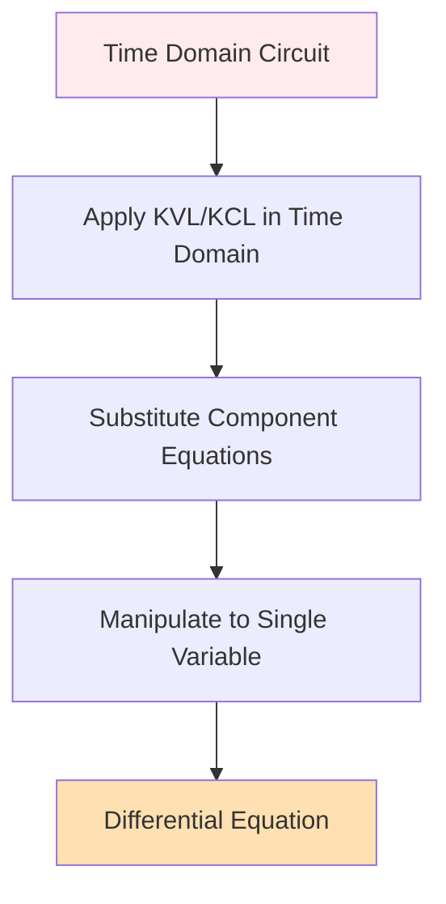

# PATH B: Time Domain Analysis and Differential Equations

## Overview

PATH B is the **differential equation first approach** where you apply circuit laws in the time domain, derive a differential equation, then transform it to s-domain using Laplace transform.



## When to Use PATH B

**Use this path when:**
- Problem explicitly asks for the differential equation
- You need to understand the underlying physics
- Simple circuits (RC or RL)
- Educational/learning context
- You want to see the system's natural behavior

**Advantages:**
- Shows the physics clearly
- Explicitly reveals the differential equation
- Better for understanding system behavior
- Natural for simple circuits
- Makes the order of the system obvious

## Component Equations in Time Domain

### Resistor

**Voltage-current relationship:**
$$v_R(t) = R \cdot i_R(t)$$

$$i_R(t) = \frac{v_R(t)}{R}$$

### Capacitor

**Current as derivative of voltage:**
$$i_C(t) = C \frac{dv_C(t)}{dt}$$

**Voltage as integral of current:**
$$v_C(t) = \frac{1}{C}\int_{0}^{t} i_C(\tau)d\tau + v_C(0)$$

### Inductor

**Voltage as derivative of current:**
$$v_L(t) = L \frac{di_L(t)}{dt}$$

**Current as integral of voltage:**
$$i_L(t) = \frac{1}{L}\int_{0}^{t} v_L(\tau)d\tau + i_L(0)$$

## Step-by-Step Process

### Step 1: Apply KVL or KCL in Time Domain

**For series circuits:** Use KVL
$$\sum v_{sources}(t) = \sum v_{drops}(t)$$

**For parallel circuits:** Use KCL
$$\sum i_{sources}(t) = \sum i_{branches}(t)$$

### Step 2: Substitute Component Equations

Replace each voltage or current with its component relationship.

### Step 3: Choose Your Variable

Decide what you're solving for (current or voltage) and manipulate the equation to express everything in terms of that single variable.

### Step 4: Eliminate Integrals (if present)

If integrals appear, **differentiate** the entire equation to eliminate them.

### Step 5: Arrange in Standard Form

Put all terms with the unknown on the left, source terms on the right.

## Example 1: Series RC Circuit (First-Order)

### Circuit

```
v_s(t) = 10u(t) V ----[R=100Ω]----[C=10µF]---- ground
```

**Find:** Differential equation for v_C(t)

### Step 1: Apply KVL

$$v_s(t) = v_R(t) + v_C(t)$$

### Step 2: Substitute Component Equations

For resistor: $v_R(t) = R \cdot i(t) = 100i(t)$

For capacitor: $i(t) = C\frac{dv_C(t)}{dt} = 10 \times 10^{-6}\frac{dv_C(t)}{dt}$

Therefore: $v_R(t) = 100 \cdot 10 \times 10^{-6}\frac{dv_C(t)}{dt} = 10^{-3}\frac{dv_C(t)}{dt}$

### Step 3: Substitute into KVL

$$v_s(t) = 10^{-3}\frac{dv_C(t)}{dt} + v_C(t)$$

### Step 4: Rearrange to Standard Form

$$10^{-3}\frac{dv_C(t)}{dt} + v_C(t) = v_s(t)$$

Divide by 10-³:
$$\frac{dv_C(t)}{dt} + 1000v_C(t) = 1000v_s(t)$$

For v_s(t) = 10u(t):
$$\frac{dv_C(t)}{dt} + 1000v_C(t) = 10000u(t)$$

**This is a first-order differential equation.**

### Alternative: Differential Equation for Current

If solving for current i(t):

From KVL: $v_s(t) = Ri(t) + v_C(t)$

Capacitor: $v_C(t) = \frac{1}{C}\int i(\tau)d\tau + v_C(0)$

Substitute:
$$v_s(t) = Ri(t) + \frac{1}{C}\int i(\tau)d\tau + v_C(0)$$

**Differentiate to eliminate integral:**
$$\frac{dv_s(t)}{dt} = R\frac{di(t)}{dt} + \frac{i(t)}{C}$$

$$R\frac{di(t)}{dt} + \frac{i(t)}{C} = \frac{dv_s(t)}{dt}$$

For step input v_s(t) = 10u(t), the derivative is the impulse: $\frac{dv_s(t)}{dt} = 10\delta(t)$

## Example 2: Series RL Circuit (First-Order)

### Circuit

```
v_s(t) = 5e^(-2t)u(t) V ----[R=10Ω]----[L=0.5H]---- ground
```

**Find:** Differential equation for i(t)

### Step 1: Apply KVL

$$v_s(t) = v_R(t) + v_L(t)$$

### Step 2: Substitute Component Equations

- Resistor: $v_R(t) = Ri(t) = 10i(t)$
- Inductor: $v_L(t) = L\frac{di(t)}{dt} = 0.5\frac{di(t)}{dt}$

### Step 3: Substitute into KVL

$$v_s(t) = 10i(t) + 0.5\frac{di(t)}{dt}$$

### Step 4: Rearrange to Standard Form

$$0.5\frac{di(t)}{dt} + 10i(t) = v_s(t)$$

Divide by 0.5:
$$\frac{di(t)}{dt} + 20i(t) = 2v_s(t)$$

For v_s(t) = 5e^(-2t)u(t):
$$\frac{di(t)}{dt} + 20i(t) = 10e^{-2t}u(t)$$

**This is a first-order differential equation.**

## Example 3: Series RLC Circuit (Second-Order)

### Circuit

```
v_s(t) = 10cos(5t)u(t) V ----[R=2Ω]----[L=0.4H]----[C=0.05F]---- ground
```

**Find:** Differential equation for i(t)

### Step 1: Apply KVL

$$v_s(t) = v_R(t) + v_L(t) + v_C(t)$$

### Step 2: Substitute Component Equations

- Resistor: $v_R(t) = Ri(t) = 2i(t)$
- Inductor: $v_L(t) = L\frac{di(t)}{dt} = 0.4\frac{di(t)}{dt}$
- Capacitor: $v_C(t) = \frac{1}{C}\int i(\tau)d\tau + v_C(0) = \frac{1}{0.05}\int i(\tau)d\tau + v_C(0) = 20\int i(\tau)d\tau + v_C(0)$

### Step 3: Substitute into KVL

$$v_s(t) = 2i(t) + 0.4\frac{di(t)}{dt} + 20\int i(\tau)d\tau + v_C(0)$$

### Step 4: Differentiate to Eliminate Integral

$$\frac{dv_s(t)}{dt} = 2\frac{di(t)}{dt} + 0.4\frac{d^2i(t)}{dt^2} + 20i(t)$$

### Step 5: Rearrange to Standard Form

$$0.4\frac{d^2i(t)}{dt^2} + 2\frac{di(t)}{dt} + 20i(t) = \frac{dv_s(t)}{dt}$$

Divide by 0.4:
$$\frac{d^2i(t)}{dt^2} + 5\frac{di(t)}{dt} + 50i(t) = 2.5\frac{dv_s(t)}{dt}$$

For v_s(t) = 10cos(5t)u(t):
$$\frac{dv_s(t)}{dt} = -50\sin(5t)u(t) + 10\cos(5t)\delta(t)$$

**This is a second-order differential equation.**

## Example 4: Parallel RC Circuit

### Circuit

```
         i_s(t) = 2u(t) A
              |
         +----+----+
         |         |
        R=4Ω      C=0.25F
         |         |
       ground    ground
```

**Find:** Differential equation for v(t)

### Step 1: Apply KCL at Top Node

$$i_s(t) = i_R(t) + i_C(t)$$

### Step 2: Substitute Component Equations

- Resistor: $i_R(t) = \frac{v(t)}{R} = \frac{v(t)}{4}$
- Capacitor: $i_C(t) = C\frac{dv(t)}{dt} = 0.25\frac{dv(t)}{dt}$

### Step 3: Substitute into KCL

$$i_s(t) = \frac{v(t)}{4} + 0.25\frac{dv(t)}{dt}$$

### Step 4: Rearrange to Standard Form

$$0.25\frac{dv(t)}{dt} + \frac{v(t)}{4} = i_s(t)$$

Multiply by 4:
$$\frac{dv(t)}{dt} + v(t) = 4i_s(t)$$

For i_s(t) = 2u(t):
$$\frac{dv(t)}{dt} + v(t) = 8u(t)$$

**This is a first-order differential equation.**

## Identifying System Order

The **order** of the differential equation equals the number of **independent energy storage elements** (L and C).

### First-Order Systems
- RC circuit: 1 capacitor
- RL circuit: 1 inductor
- Result: First derivative is highest

### Second-Order Systems
- LC circuit: 1 capacitor + 1 inductor
- RLC circuit: 1 capacitor + 1 inductor
- Result: Second derivative is highest

### Higher-Order Systems
- Multiple L's and C's
- Order = total number of L's and C's (if independent)

## Standard Forms

### First-Order Standard Form

$$\tau\frac{dy(t)}{dt} + y(t) = K \cdot u(t)$$

Where:
- τ = time constant
- K = gain
- y(t) = output variable
- u(t) = input (forcing function)

### Second-Order Standard Form

$$\frac{d^2y(t)}{dt^2} + 2\zeta\omega_n\frac{dy(t)}{dt} + \omega_n^2y(t) = K \cdot u(t)$$

Where:
- ω_n = natural frequency
- ζ = damping ratio
- K = gain

## Tips for Deriving Differential Equations

### Tip 1: Choose Your Variable Wisely

Solve for the variable that makes the math simplest:
- Series circuits: solve for current (same everywhere)
- Parallel circuits: solve for voltage (same everywhere)

### Tip 2: Eliminate Integrals Early

If you have integrals, differentiate the entire equation immediately.

### Tip 3: Work Systematically

1. Write circuit law (KVL/KCL)
2. Substitute ALL component equations
3. Collect like terms
4. Differentiate if needed
5. Arrange in standard form

### Tip 4: Check Your Order

Count energy storage elements = order of differential equation

### Tip 5: Handle Initial Conditions

Initial conditions (v_C(0), i_L(0)) appear as:
- Constants in integrated form
- They'll be incorporated when applying Laplace transform

## Common Mistakes

### Mistake 1: Forgetting to Differentiate

If you have an integral and want a differential equation, you MUST differentiate.

### Mistake 2: Wrong Derivative

$$\frac{d}{dt}\left[\frac{1}{C}\int i(\tau)d\tau\right] = \frac{i(t)}{C}$$

NOT: $\frac{1}{C}i(t)dt$

### Mistake 3: Mixing Variables

Don't have both v(t) and i(t) in final equation. Express everything in terms of one variable.

### Mistake 4: Sign Errors

Be consistent with passive sign convention and current directions.

## What You Have Now

After completing PATH B time-domain analysis:

1. **An explicit differential equation** showing system dynamics
2. **Clear understanding** of system order
3. **Physical insight** into how the circuit behaves
4. **Ready to apply Laplace transform** (next step)

## Next Steps

**Proceed to:** `08-path-b-laplace-transform.md` to learn how to transform your differential equation to s-domain.

## Summary

PATH B time-domain process:
1. ✓ Apply KVL or KCL in time domain
2. ✓ Substitute component equations (v=Ri, v=Ldi/dt, i=Cdv/dt)
3. ✓ Manipulate to single variable
4. ✓ Differentiate to eliminate integrals
5. ✓ Arrange in standard form
6. → Result: Explicit differential equation

**Key advantage:** You see exactly what differential equation governs the circuit behavior!