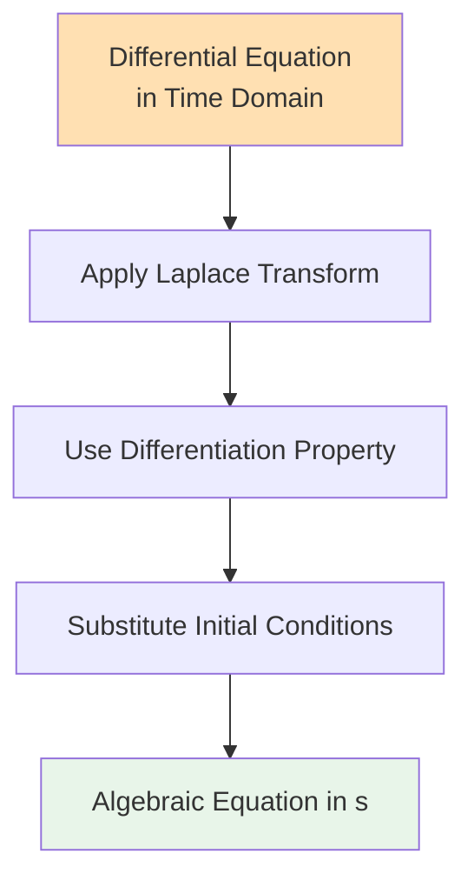
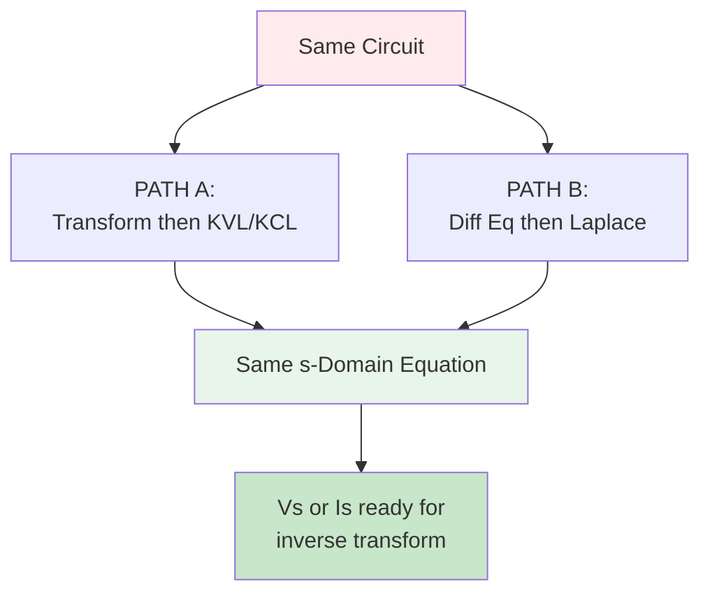

# PATH B: Applying Laplace Transform to Differential Equations

## Overview

After deriving your differential equation in time domain (from `07-path-b-time-domain-analysis.md`), you now apply the Laplace transform to convert it to an algebraic equation in s-domain.

## Laplace Transform Properties

### Linearity Property

$$\mathcal{L}\{af(t) + bg(t)\} = aF(s) + bG(s)$$

This means you can transform each term separately.

### Differentiation Property (First Derivative)

$$\mathcal{L}\left\{\frac{df(t)}{dt}\right\} = sF(s) - f(0^-)$$

Where:
- F(s) = Laplace transform of f(t)
- f(0⁻) = initial value at t = 0⁻

**For t > 0 problems with f(0⁻) = f(0⁺):**
$$\mathcal{L}\left\{\frac{df(t)}{dt}\right\} = sF(s) - f(0)$$

### Differentiation Property (Second Derivative)

$$\mathcal{L}\left\{\frac{d^2f(t)}{dt^2}\right\} = s^2F(s) - sf(0) - f'(0)$$

Where:
- f(0) = initial value
- f'(0) = initial derivative

### Integration Property

$$\mathcal{L}\left\{\int_0^t f(\tau)d\tau\right\} = \frac{F(s)}{s}$$

## Step-by-Step Process

### Step 1: Apply Laplace Transform to Both Sides

Transform the entire differential equation term by term.

### Step 2: Use Differentiation Property

Replace derivatives with s-domain equivalents using the differentiation property.

### Step 3: Substitute Initial Conditions

Insert the known initial values: f(0), f'(0), etc.

### Step 4: Solve for F(s)

Algebraically isolate the variable of interest (I(s) or V(s)).

### Step 5: Simplify

Put in standard form ready for inverse Laplace transform.

## Example 1: First-Order RC Circuit

### Starting Differential Equation

From Example 1 in previous file:
$$\frac{dv_C(t)}{dt} + 1000v_C(t) = 10000u(t)$$

**Given initial condition:** v_C(0) = 0

### Step 1: Apply Laplace Transform

$$\mathcal{L}\left\{\frac{dv_C(t)}{dt}\right\} + 1000\mathcal{L}\{v_C(t)\} = 10000\mathcal{L}\{u(t)\}$$

### Step 2: Use Differentiation Property

$$sV_C(s) - v_C(0) + 1000V_C(s) = 10000 \cdot \frac{1}{s}$$

### Step 3: Substitute Initial Condition

With v_C(0) = 0:
$$sV_C(s) - 0 + 1000V_C(s) = \frac{10000}{s}$$

$$sV_C(s) + 1000V_C(s) = \frac{10000}{s}$$

### Step 4: Solve for V_C(s)

Factor out V_C(s):
$$V_C(s)[s + 1000] = \frac{10000}{s}$$

$$V_C(s) = \frac{10000}{s(s + 1000)}$$

### Result

$$V_C(s) = \frac{10000}{s(s + 1000)}$$

**Note:** This matches the result from PATH A Example 1!

## Example 2: First-Order RL Circuit

### Starting Differential Equation

From Example 2 in previous file:
$$\frac{di(t)}{dt} + 20i(t) = 10e^{-2t}u(t)$$

**Given initial condition:** i(0) = 2A

### Step 1: Apply Laplace Transform

$$\mathcal{L}\left\{\frac{di(t)}{dt}\right\} + 20\mathcal{L}\{i(t)\} = 10\mathcal{L}\{e^{-2t}u(t)\}$$

### Step 2: Use Differentiation Property

$$sI(s) - i(0) + 20I(s) = 10 \cdot \frac{1}{s+2}$$

### Step 3: Substitute Initial Condition

With i(0) = 2:
$$sI(s) - 2 + 20I(s) = \frac{10}{s+2}$$

### Step 4: Solve for I(s)

$$I(s)[s + 20] = \frac{10}{s+2} + 2$$

Common denominator:
$$I(s)[s + 20] = \frac{10 + 2(s+2)}{s+2} = \frac{10 + 2s + 4}{s+2} = \frac{2s + 14}{s+2}$$

$$I(s) = \frac{2s + 14}{(s+2)(s+20)} = \frac{2(s + 7)}{(s+2)(s+20)}$$

### Result

$$I(s) = \frac{2s + 14}{(s+2)(s+20)}$$

## Example 3: Second-Order RLC Circuit

### Starting Differential Equation

From Example 3 in previous file (simplified):
$$\frac{d^2i(t)}{dt^2} + 5\frac{di(t)}{dt} + 50i(t) = 2.5\frac{dv_s(t)}{dt}$$

**Given initial conditions:** i(0) = 0, i'(0) = 0

For simplicity, let's use v_s(t) = 10u(t) (step input):
$$\frac{d^2i(t)}{dt^2} + 5\frac{di(t)}{dt} + 50i(t) = 0$$

(The RHS becomes 0 because dv_s/dt for a step is an impulse at t=0)

### Step 1: Apply Laplace Transform

$$\mathcal{L}\left\{\frac{d^2i(t)}{dt^2}\right\} + 5\mathcal{L}\left\{\frac{di(t)}{dt}\right\} + 50\mathcal{L}\{i(t)\} = 0$$

### Step 2: Use Differentiation Properties

$$s^2I(s) - si(0) - i'(0) + 5[sI(s) - i(0)] + 50I(s) = 0$$

### Step 3: Substitute Initial Conditions

With i(0) = 0 and i'(0) = 0:
$$s^2I(s) - 0 - 0 + 5sI(s) - 0 + 50I(s) = 0$$

$$s^2I(s) + 5sI(s) + 50I(s) = 0$$

### Step 4: Solve for I(s)

$$I(s)[s^2 + 5s + 50] = 0$$

This gives I(s) = 0 (natural response is zero with zero initial conditions and zero forcing).

**Better example with forcing function:** If we keep the source term properly:

For v_s(t) = 10u(t), we need to go back to the KVL approach and use:
$$v_s(t) = Ri(t) + L\frac{di(t)}{dt} + \frac{1}{C}\int i(\tau)d\tau$$

This is actually easier to handle via PATH A for RLC circuits!

## Example 4: First-Order with Non-Zero Initial Condition

### Differential Equation

$$\frac{dv(t)}{dt} + v(t) = 8u(t)$$

**Initial condition:** v(0) = 3V

### Apply Laplace Transform

$$sV(s) - v(0) + V(s) = \frac{8}{s}$$

### Substitute Initial Condition

$$sV(s) - 3 + V(s) = \frac{8}{s}$$

### Solve for V(s)

$$V(s)[s + 1] = \frac{8}{s} + 3$$

$$V(s)[s + 1] = \frac{8 + 3s}{s}$$

$$V(s) = \frac{8 + 3s}{s(s+1)} = \frac{3s + 8}{s(s+1)}$$

### Result

$$V(s) = \frac{3s + 8}{s(s+1)}$$

The initial condition appears in the numerator!

## Understanding Initial Conditions in Laplace Domain

### Where Initial Conditions Appear

When you use the differentiation property:
$$\mathcal{L}\left\{\frac{df(t)}{dt}\right\} = sF(s) - f(0)$$

The **f(0) term** represents the initial condition.

### Effect on Solution

Initial conditions create **additional terms** in the s-domain equation:

**Zero initial conditions:**
$$sF(s) + aF(s) = \text{forcing}$$

**Non-zero initial conditions:**
$$sF(s) + aF(s) = \text{forcing} + \text{IC terms}$$

### Natural vs. Forced Response

The solution F(s) contains:
- **Forced response:** From the input/source
- **Natural response:** From initial conditions

Both appear in the final s-domain expression.

## Comparing PATH A and PATH B Results

**Key Point:** Both paths give **identical results** in s-domain!

## When PATH B is Better

PATH B is advantageous when:

1. **Educational context** - You want to see the differential equation
2. **Simple circuits** - RC or RL where the diff eq is easy
3. **Problem explicitly asks** for the differential equation
4. **System analysis** - Understanding natural frequency, damping, etc.
5. **You're comfortable** with differential equations

## When PATH A is Better

PATH A is advantageous when:

1. **Complex circuits** - Multiple components
2. **Time pressure** - Exams with limited time
3. **Direct solution** - Don't need to see differential equation
4. **Standard problems** - Most textbook problems
5. **Multiple sources** - Easier in impedance form

## Common Laplace Transforms (Reference)

| Time Domain f(t) | Laplace Domain F(s) |
|------------------|---------------------|
| u(t) | 1/s |
| e^(-at)u(t) | 1/(s+a) |
| t·u(t) | 1/s² |
| t^n·u(t) | n!/s^(n+1) |
| sin(ωt)u(t) | ω/(s²+ω²) |
| cos(ωt)u(t) | s/(s²+ω²) |
| e^(-at)sin(ωt)u(t) | ω/[(s+a)²+ω²] |
| e^(-at)cos(ωt)u(t) | (s+a)/[(s+a)²+ω²] |
| δ(t) | 1 |

## Tips for Applying Laplace Transform

### Tip 1: Write Out the Differentiation Property

Don't try to do it in your head. Write:
$$\mathcal{L}\left\{\frac{df}{dt}\right\} = sF(s) - f(0)$$

### Tip 2: Handle Initial Conditions Carefully

Keep track of initial condition terms separately until you substitute values.

### Tip 3: Check Dimensions

After transformation, verify that all terms have consistent units in s-domain.

### Tip 4: Factor Early

As soon as you have the transformed equation, factor out F(s) or I(s) or V(s).

### Tip 5: Simplify the Forcing Function

Transform the input function separately and clearly before substituting.

## Common Mistakes

### Mistake 1: Forgetting Initial Conditions

WRONG: $\mathcal{L}\{df/dt\} = sF(s)$

RIGHT: $\mathcal{L}\{df/dt\} = sF(s) - f(0)$

### Mistake 2: Wrong Second Derivative Property

WRONG: $\mathcal{L}\{d²f/dt²\} = s²F(s) - f(0)$

RIGHT: $\mathcal{L}\{d²f/dt²\} = s²F(s) - sf(0) - f'(0)$

### Mistake 3: Algebraic Errors with Initial Conditions

Keep initial condition terms until the end. Don't drop them accidentally.

### Mistake 4: Wrong Transform of Input

Make sure you're using the correct Laplace transform for your input function.

## What You Have Now

After completing PATH B Laplace transform:

1. **Same s-domain equation** as you would get from PATH A
2. **Clear understanding** of how initial conditions enter
3. **Explicit connection** between time and s-domain
4. **Ready for inverse transform** (same as PATH A ending)

## Next Steps

**Proceed to:** `09-path-b-complete-process.md` for complete worked examples of the entire PATH B process from start to finish.

**For inverse transform:** Use your existing inverse Laplace transform documentation.

## Summary

PATH B Laplace transform process:
1. ✓ Start with differential equation from time domain
2. ✓ Apply Laplace transform term by term
3. ✓ Use differentiation property (includes initial conditions!)
4. ✓ Substitute known initial values
5. ✓ Solve algebraically for F(s)
6. → Result: Same s-domain equation as PATH A

**Key insight:** The differentiation property automatically incorporates initial conditions into the s-domain equation!