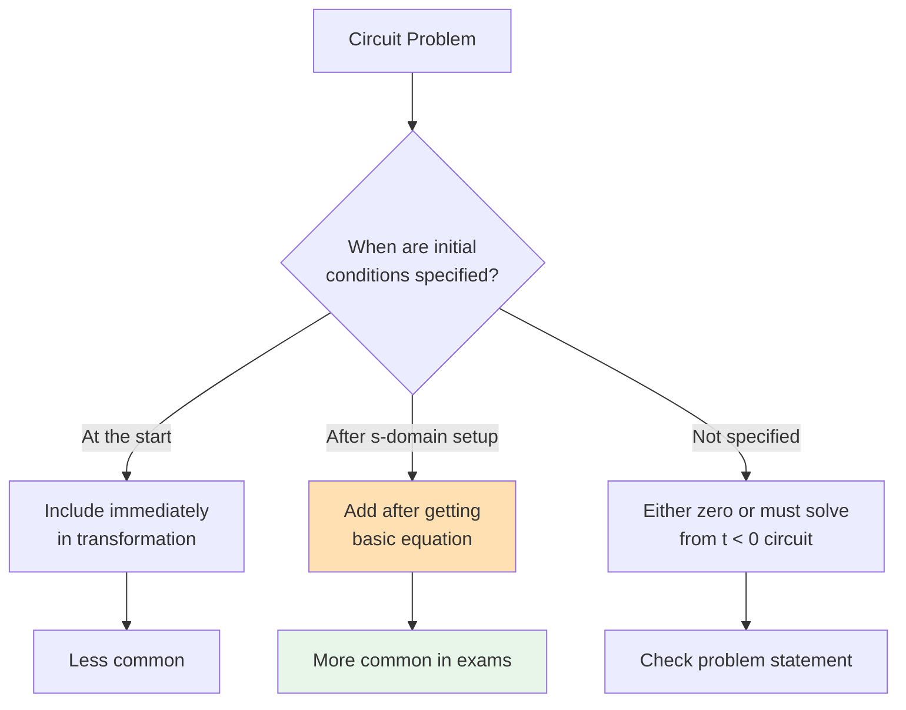
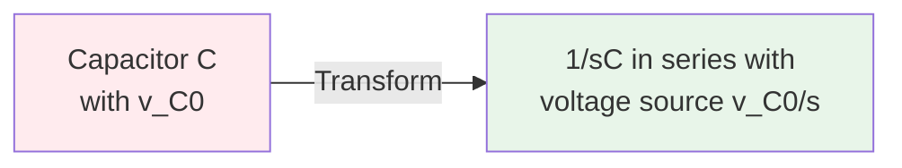
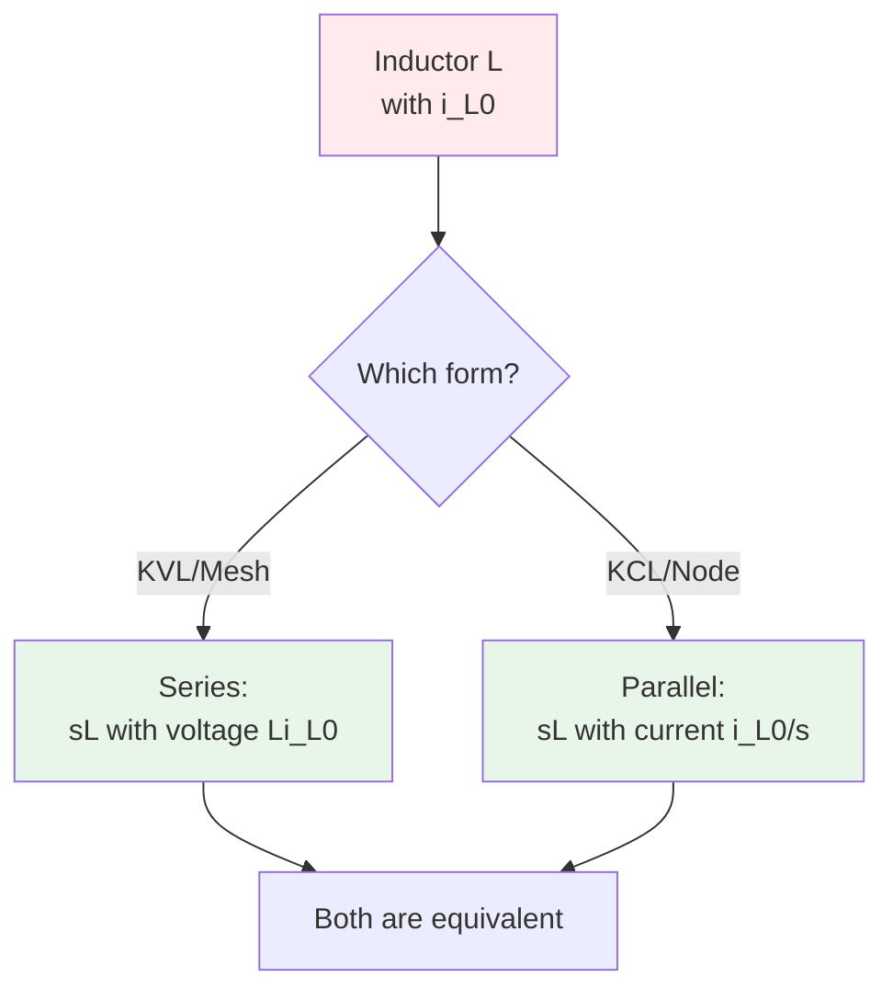
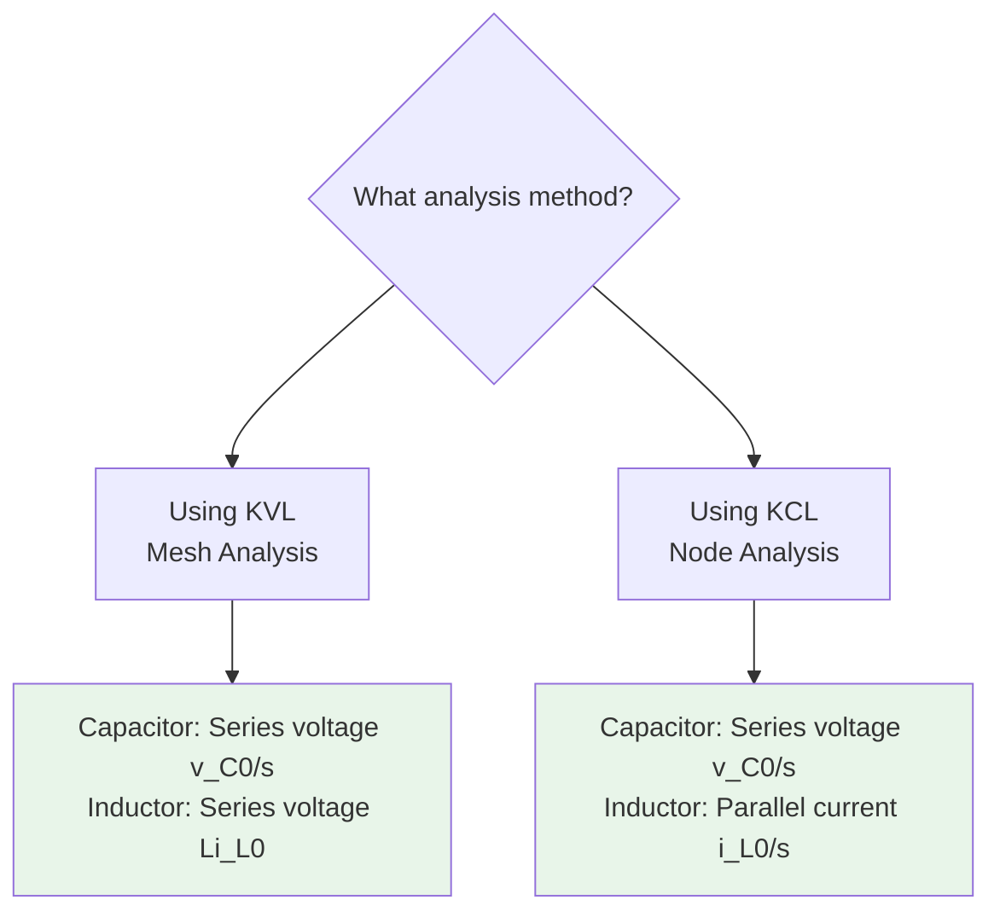

# Initial Conditions in s-Domain Analysis

## Introduction

Initial conditions represent the **stored energy** in capacitors and inductors at time $t = 0$. This document explains how to properly include initial conditions in s-domain circuit analysis.

## Why Initial Conditions Matter

Energy storage elements (capacitors and inductors) have "memory":
- **Capacitors** store energy in electric fields → voltage across capacitor at $t=0$
- **Inductors** store energy in magnetic fields → current through inductor at $t=0$

These initial states affect the circuit response and **must be included** for accurate analysis.

## When Are Initial Conditions Given?



**Most exam problems:** Give initial conditions AFTER you've drawn the s-domain circuit and written the basic equation.

## Capacitor Initial Conditions

### Time Domain Representation

At $t = 0^-$, the capacitor has voltage $v_C(0)$ stored.

### s-Domain Representation

**Add a voltage source** $\frac{v_C(0)}{s}$ in **series** with the capacitor impedance $\frac{1}{sC}$.



### Circuit Representation

**Without initial condition:**
```
---[ 1/sC ]---
```

**With initial condition $v_C(0)$:**
```
---[ 1/sC ]---[+]---
            [v_C(0)/s]
              [-]
```

The polarity: positive terminal is where the capacitor was positively charged.

### Derivation

From the capacitor current equation:
$$i_C(t) = C \frac{dv_C(t)}{dt}$$

Taking Laplace transform:
$$I_C(s) = C[sV_C(s) - v_C(0)]$$

Rearranging:
$$I_C(s) = sC \cdot V_C(s) - C \cdot v_C(0)$$

Using Ohm's law form:
$$V_C(s) = \frac{I_C(s)}{sC} + \frac{v_C(0)}{s}$$

This shows: impedance $\frac{1}{sC}$ with voltage source $\frac{v_C(0)}{s}$ in series.

### Example: Capacitor with Initial Voltage

**Given:** $C = 0.1F$, $v_C(0) = 5V$

**s-Domain representation:**
```
---[ 10/s Ω ]---[+]---
              [5/s V]
              [-]
```

Where:
- $Z_C = \frac{1}{sC} = \frac{1}{0.1s} = \frac{10}{s}$
- Initial condition source = $\frac{v_C(0)}{s} = \frac{5}{s}$

## Inductor Initial Conditions

### Time Domain Representation

At $t = 0^-$, the inductor has current $i_L(0)$ flowing through it.

### s-Domain Representation (Two Options)

**Option A - Series Voltage Source (for KVL/Mesh):**
Add voltage source $Li_L(0)$ in **series** with impedance $sL$

**Option B - Parallel Current Source (for KCL/Node):**
Add current source $\frac{i_L(0)}{s}$ in **parallel** with impedance $sL$



### Circuit Representation - Series Form

**Without initial condition:**
```
---[ sL ]---
```

**With initial condition $i_L(0)$ (series form):**
```
---[ sL ]---[+]---
          [Li_L(0)]
            [-]
```

Polarity: opposes the change in current (back-EMF)

### Circuit Representation - Parallel Form

**With initial condition $i_L(0)$ (parallel form):**
```
      [ sL ]
---+----||----+---
   |          |
   [i_L(0)/s]→
   |          |
```

The current source flows in the direction of initial current.

### Derivation - Series Form

From the inductor voltage equation:
$$v_L(t) = L \frac{di_L(t)}{dt}$$

Taking Laplace transform:
$$V_L(s) = L[sI_L(s) - i_L(0)]$$

Rearranging:
$$V_L(s) = sL \cdot I_L(s) - L \cdot i_L(0)$$

This shows: impedance $sL$ with voltage source $Li_L(0)$ in series.

### Derivation - Parallel Form

Using the integral form:
$$i_L(t) = \frac{1}{L}\int_{0}^{t} v_L(\tau)d\tau + i_L(0)$$

Taking Laplace transform:
$$I_L(s) = \frac{V_L(s)}{sL} + \frac{i_L(0)}{s}$$

This shows: impedance $sL$ with current source $\frac{i_L(0)}{s}$ in parallel.

### Equivalence of Two Forms

The series and parallel forms are **equivalent** by source transformation:

$$Li_L(0) \text{ in series with } sL \equiv \frac{i_L(0)}{s} \text{ in parallel with } sL$$

Verification:
$$\frac{Li_L(0)}{sL} = \frac{i_L(0)}{s}$$ [CHECK]

### Example: Inductor with Initial Current

**Given:** $L = 2H$, $i_L(0) = 3A$

**Series form (for KVL):**
```
---[ 2s Ω ]---[+]---
            [6 V]
            [-]
```

Where:
- $Z_L = sL = 2s$
- Initial condition source = $Li_L(0) = 2 \times 3 = 6V$

**Parallel form (for KCL):**
```
    [ 2s Ω ]
---+----||----+---
   |          |
   [3/s A]→
   |          |
```

Where:
- $Z_L = sL = 2s$
- Initial condition source = $\frac{i_L(0)}{s} = \frac{3}{s}$

## When to Use Which Form



**General Rule:**
- **KVL/Mesh:** Use series voltage sources for both components
- **KCL/Node:** Use series voltage for capacitor, parallel current for inductor

## Polarity Conventions

### Capacitor Initial Condition Polarity

The voltage source $\frac{v_C(0)}{s}$ has polarity matching the stored voltage:
- If capacitor top plate is positive → voltage source + on top
- The source represents the voltage the capacitor starts with

### Inductor Initial Condition Polarity

**Series form:** The voltage source $Li_L(0)$ **opposes** current change
- Acts like back-EMF
- Polarity opposes the direction you'd expect from applied voltage

**Parallel form:** The current source $\frac{i_L(0)}{s}$ flows in the **same direction** as initial current
- Represents the current the inductor wants to maintain

## Complete Transformation Examples

### Example 1: Series RC with Initial Conditions

**Given:**
- $R = 50Ω$, $C = 20μF$
- $v_C(0) = 10V$
- $v_s(t) = 100u(t)V$

**s-Domain circuit:**
```
V_s(s)=100/s ---[50Ω]---[50000/s Ω]---[+]--- ground
                                    [10/s V]
                                    [-]
```

Calculations:
- $Z_C = \frac{1}{sC} = \frac{1}{s \cdot 20 \times 10^{-6}} = \frac{50000}{s}$
- Initial condition: $\frac{v_C(0)}{s} = \frac{10}{s}$

### Example 2: Series RL with Initial Conditions (KVL)

**Given:**
- $R = 10Ω$, $L = 0.5H$
- $i_L(0) = 2A$
- $v_s(t) = 20e^{-t}u(t)V$

**s-Domain circuit:**
```
V_s(s)=20/(s+1) ---[10Ω]---[0.5s Ω]---[+]--- ground
                                    [1 V]
                                    [-]
```

Calculations:
- $Z_L = sL = 0.5s$
- Initial condition: $Li_L(0) = 0.5 \times 2 = 1V$

### Example 3: Parallel RLC with Initial Conditions (KCL)

**Given:**
- $R = 5Ω$, $L = 1H$, $C = 0.1F$
- $v_C(0) = 0V$, $i_L(0) = 3A$
- $i_s(t) = 4u(t)A$

**s-Domain circuit:**
```
         I_s(s) = 4/s
              |
         +----+----+----+
         |    |    |    |
        5Ω   [s Ω][3/s A]  ---[10/s]---[+]---
         |    |    ||   |    |              [0]
       ground  +----+---+  ground
```

Since $v_C(0) = 0$, the capacitor has no initial condition source.

The inductor uses **parallel form** for KCL: $\frac{i_L(0)}{s} = \frac{3}{s}$

## Adding Initial Conditions to Equations

### For KVL (Series Circuits)

**Basic equation without initial conditions:**
$$V_s(s) = I(s)[Z_1 + Z_2 + \cdots]$$

**With initial conditions:**
$$V_s(s) = I(s)[Z_1 + Z_2 + \cdots] + V_{initial,C}(s) + V_{initial,L}(s)$$

Where:
- $V_{initial,C}(s) = \frac{v_C(0)}{s}$
- $V_{initial,L}(s) = Li_L(0)$

### For KCL (Node Analysis)

**Basic equation without initial conditions:**
$$I_s(s) = \frac{V(s)}{Z_1} + \frac{V(s)}{Z_2} + \cdots$$

**With initial conditions (capacitor):**
$$I_s(s) = \frac{V(s) - \frac{v_C(0)}{s}}{Z_C} + \frac{V(s)}{Z_1} + \cdots$$

**With initial conditions (inductor, parallel form):**
$$I_s(s) + I_{initial,L}(s) = \frac{V(s)}{Z_L} + \frac{V(s)}{Z_1} + \cdots$$

Where $I_{initial,L}(s) = \frac{i_L(0)}{s}$

## Zero Initial Conditions

If initial conditions are **not specified**, you typically assume:
- $v_C(0) = 0$ (capacitor uncharged)
- $i_L(0) = 0$ (inductor unenergized)

This means the circuit was de-energized before $t=0$.

**Exception:** If the problem describes steady-state operation before $t=0$, you must solve for initial conditions from the $t < 0$ circuit.

## Summary Table

| Component | Initial Condition | s-Domain Addition | When to Use |
|-----------|------------------|-------------------|-------------|
| Capacitor | $v_C(0)$ | Series voltage $\frac{v_C(0)}{s}$ | Always |
| Inductor (KVL) | $i_L(0)$ | Series voltage $Li_L(0)$ | Mesh analysis |
| Inductor (KCL) | $i_L(0)$ | Parallel current $\frac{i_L(0)}{s}$ | Node analysis |

## Common Mistakes

### [X] WRONG: Capacitor Initial Condition
```
v_C(0) = 5V → Add voltage source 5V  (NO! Missing /s)
```

### [CHECK] CORRECT:
```
v_C(0) = 5V → Add voltage source 5/s V
```

### [X] WRONG: Inductor Initial Condition (Series)
```
i_L(0) = 2A, L = 3H → Add voltage source 2V  (NO! Missing L)
```

### [CHECK] CORRECT:
```
i_L(0) = 2A, L = 3H → Add voltage source Li_L(0) = 6V
```

### [X] WRONG: Inductor Initial Condition (Parallel)
```
i_L(0) = 2A → Add current source 2A  (NO! Missing /s)
```

### [CHECK] CORRECT:
```
i_L(0) = 2A → Add current source 2/s A
```

## Next Steps

- **For PATH A:** See `04-path-a-time-to-sdomain.md` for complete transformation process
- **For PATH B:** See `08-path-b-laplace-transform.md` for how initial conditions appear in Laplace transforms
- **For examples:** See `06-path-a-complete-process.md` and `09-path-b-complete-process.md`