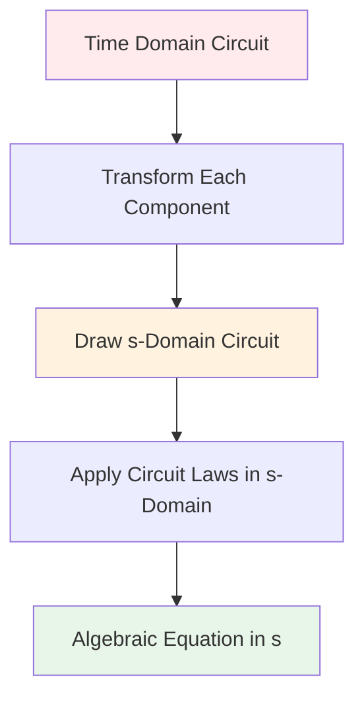
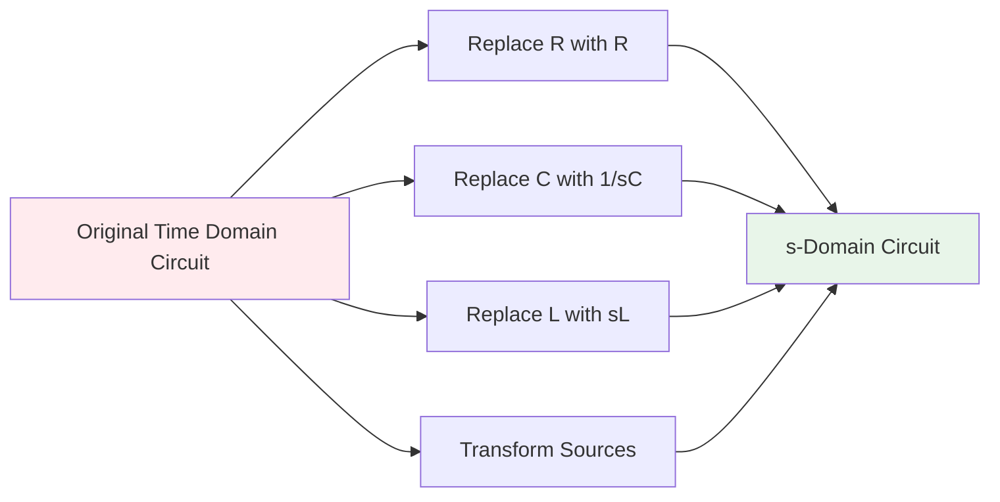
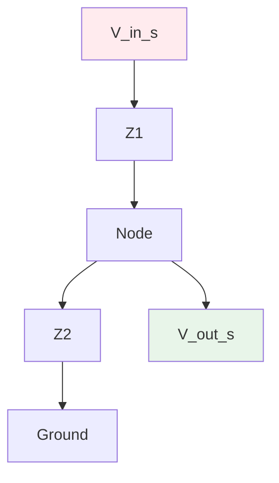
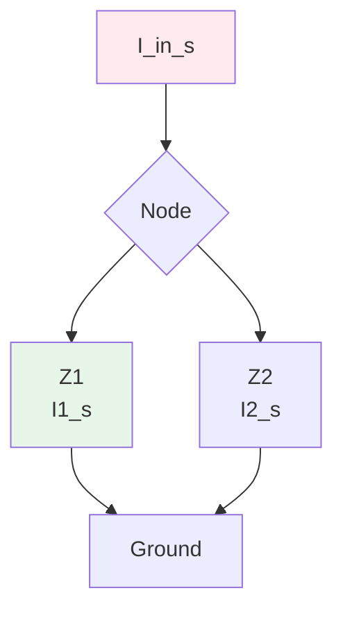

# PATH A: Time Domain to s-Domain Circuit Transformation

## Overview

PATH A is the **direct transformation approach** where you convert the entire circuit to s-domain first, then apply circuit analysis laws. This is the most common method in exams and professional practice.



## When to Use PATH A

**Use this path when:**
- Problem says "convert to s-domain"
- Complex circuits with multiple components
- You're comfortable with impedance concepts
- Time pressure (faster than PATH B)
- You want to work directly with frequency-domain concepts

**Advantages:**
- Faster for complex circuits
- Direct impedance manipulation
- No need to explicitly write differential equations
- Purely algebraic after transformation
- More intuitive for frequency-domain thinking

## Step-by-Step Process

### Step 1: Identify All Circuit Components

Before transforming, inventory your circuit:
- **Passive elements:** Resistors, capacitors, inductors
- **Active elements:** Voltage sources, current sources
- **Connections:** Series, parallel, nodes

### Step 2: Transform Each Component

Apply transformation rules from `02-component-transformations.md`:

| Component | Time Domain | s-Domain |
|-----------|-------------|----------|
| Resistor | R Ω | R Ω |
| Capacitor | C farads | 1/(sC) Ω |
| Inductor | L henries | sL Ω |
| Voltage Source | v_s(t) | V_s(s) = ℒ{v_s(t)} |
| Current Source | i_s(t) | I_s(s) = ℒ{i_s(t)} |

**Important:** Do NOT include initial conditions yet. They will be added later.

### Step 3: Draw the s-Domain Circuit

Create a new circuit diagram with:
- All impedances replacing reactive components
- Transformed sources
- Same topology (connections) as original
- Label all nodes and currents clearly



## Example 1: Series RC Circuit

### Time Domain Circuit

```
v_s(t) = 10u(t) V ----[R = 100Ω]----[C = 10µF]---- ground
```

### Transformation

**Component transformations:**
- Source: v_s(t) = 10u(t) → V_s(s) = 10/s V
- Resistor: R = 100Ω → R = 100Ω (unchanged)
- Capacitor: C = 10µF → Z_C = 1/(sC) = 1/(s·10\times10-⁶) = 10⁵/s Ω

### s-Domain Circuit (without initial conditions)

```
V_s(s) = 10/s V ----[100Ω]----[10⁵/s Ω]---- ground
```

**Total impedance:**
$$Z_{total} = R + Z_C = 100 + \frac{10^5}{s} = \frac{100s + 10^5}{s}$$

## Example 2: Parallel RL Circuit

### Time Domain Circuit

```
         i_s(t) = 2e^(-3t)u(t) A
              |
         +----+----+
         |         |
        R=4Ω      L=2H
         |         |
       ground    ground
```

### Transformation

**Component transformations:**
- Source: i_s(t) = 2e^(-3t)u(t) → I_s(s) = 2/(s+3) A
- Resistor: R = 4Ω (unchanged)
- Inductor: L = 2H → Z_L = sL = 2s Ω

### s-Domain Circuit (without initial conditions)

```
         I_s(s) = 2/(s+3) A
              |
         +----+----+
         |         |
        4Ω        2s Ω
         |         |
       ground    ground
```

**Total impedance (parallel):**
$$Z_{total} = \frac{R \cdot Z_L}{R + Z_L} = \frac{4 \cdot 2s}{4 + 2s} = \frac{8s}{2(2+s)} = \frac{4s}{s+2}$$

## Example 3: Series RLC Circuit

### Time Domain Circuit

```
v_s(t) = 10cos(5t)u(t) V ----[R=2Ω]----[L=0.4H]----[C=0.05F]---- ground
```

### Transformation

**Component transformations:**
- Source: v_s(t) = 10cos(5t)u(t) → V_s(s) = 10s/(s²+25) V
- Resistor: R = 2Ω (unchanged)
- Inductor: L = 0.4H → Z_L = 0.4s Ω
- Capacitor: C = 0.05F → Z_C = 1/(0.05s) = 20/s Ω

### s-Domain Circuit (without initial conditions)

```
V_s(s) = 10s/(s²+25) V ----[2Ω]----[0.4s Ω]----[20/s Ω]---- ground
```

**Total impedance:**
$$Z_{total} = R + Z_L + Z_C = 2 + 0.4s + \frac{20}{s}$$

Combining over common denominator:
$$Z_{total} = \frac{2s + 0.4s^2 + 20}{s} = \frac{0.4s^2 + 2s + 20}{s}$$

## Combining Impedances in s-Domain

### Series Impedances

Just like resistors in series:
$$Z_{total} = Z_1 + Z_2 + Z_3 + \cdots$$

**Example:**
$$Z_{RLC,series} = R + sL + \frac{1}{sC}$$

### Parallel Impedances

Just like resistors in parallel:
$$\frac{1}{Z_{total}} = \frac{1}{Z_1} + \frac{1}{Z_2} + \frac{1}{Z_3} + \cdots$$

**For two impedances:**
$$Z_{total} = \frac{Z_1 Z_2}{Z_1 + Z_2}$$

**Example:**
$$Z_{RLC,parallel} = \frac{1}{\frac{1}{R} + \frac{1}{sL} + sC}$$

## Impedance Simplification Strategies

### Strategy 1: Find Common Denominator

When adding impedances with fractions:

$$R + \frac{1}{sC} = \frac{RsC + 1}{sC}$$

$$sL + \frac{1}{sC} = \frac{s^2LC + 1}{sC}$$

### Strategy 2: Factor First

$$R + sL + \frac{1}{sC} = \frac{RsC + s^2LC + 1}{sC}$$

Factor if possible:
$$= \frac{LC(s^2 + \frac{R}{L}s + \frac{1}{LC})}{sC}$$

### Strategy 3: Parallel Simplification

For parallel R and C:
$$Z_{parallel} = \frac{R \cdot \frac{1}{sC}}{R + \frac{1}{sC}} = \frac{\frac{R}{sC}}{\frac{RsC + 1}{sC}} = \frac{R}{RsC + 1}$$

## Common Circuit Topologies

### Voltage Divider



**Formula:**
$$V_{out}(s) = V_{in}(s) \cdot \frac{Z_2}{Z_1 + Z_2}$$

### Current Divider



**Formula:**
$$I_1(s) = I_{in}(s) \cdot \frac{Z_2}{Z_1 + Z_2}$$

## Transformation Checklist

Before proceeding to circuit laws:

- [ ] All resistors identified (unchanged in s-domain)
- [ ] All capacitors converted to 1/(sC)
- [ ] All inductors converted to sL
- [ ] All voltage sources transformed using Laplace table
- [ ] All current sources transformed using Laplace table
- [ ] Circuit topology preserved (same connections)
- [ ] All nodes labeled
- [ ] Current directions marked
- [ ] Initial conditions NOT yet added (comes later)

## What You Have Now

After completing this step, you should have:

1. **A complete s-domain circuit diagram** with all impedances
2. **No initial condition sources yet** (added in Step 3)
3. **Ready to apply KVL or KCL** (covered in next file)

## Next Steps

**Proceed to:** `05-path-a-kvl-kcl-sdomain.md` to learn how to apply circuit laws to your s-domain circuit.

**If you need initial conditions:** You'll add them after setting up the basic equation (see `03-initial-conditions.md`).

## Summary

PATH A transformation process:
1. ✓ Identify all components
2. ✓ Transform each component using impedance rules
3. ✓ Draw s-domain circuit (no initial conditions yet)
4. ✓ Combine impedances if helpful
5. → Ready for KVL/KCL analysis

**Key Advantage:** You now work entirely with algebra - no differential equations needed!