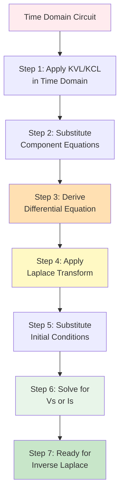
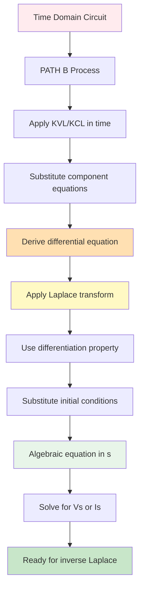

# PATH B: Complete Process with Examples

## Overview

This document presents the **complete PATH B process** from start to finish. PATH B derives the differential equation first in time domain, then applies Laplace transform.



## Complete Example 1: Series RC Circuit

### Problem Statement

Find the voltage across the capacitor v_C(t) for t \geq 0.

**Given:**
- v_s(t) = 10u(t) V
- R = 100Ω
- C = 10µF
- v_C(0) = 0

### Time Domain Circuit

```
v_s(t) = 10u(t) V ----[R=100Ω]----[C=10µF]---- ground
```

### STEP 1: Apply KVL in Time Domain

Going around the loop:
$$v_s(t) = v_R(t) + v_C(t)$$

### STEP 2: Substitute Component Equations

**For resistor:**
$$v_R(t) = R \cdot i(t)$$

**For capacitor:**
$$i(t) = C\frac{dv_C(t)}{dt}$$

Therefore:
$$v_R(t) = RC\frac{dv_C(t)}{dt}$$

**Substitute values:**
$$v_R(t) = 100 \times 10 \times 10^{-6} \frac{dv_C(t)}{dt} = 10^{-3}\frac{dv_C(t)}{dt}$$

### STEP 3: Derive Differential Equation

Substitute into KVL:
$$v_s(t) = 10^{-3}\frac{dv_C(t)}{dt} + v_C(t)$$

Rearrange to standard form:
$$10^{-3}\frac{dv_C(t)}{dt} + v_C(t) = v_s(t)$$

Divide by 10-³:
$$\frac{dv_C(t)}{dt} + 1000v_C(t) = 1000v_s(t)$$

For v_s(t) = 10u(t):
$$\frac{dv_C(t)}{dt} + 1000v_C(t) = 10000u(t)$$

**This is the differential equation.**

### STEP 4: Apply Laplace Transform

Transform both sides:
$$\mathcal{L}\left\{\frac{dv_C(t)}{dt}\right\} + 1000\mathcal{L}\{v_C(t)\} = 10000\mathcal{L}\{u(t)\}$$

Use differentiation property:
$$sV_C(s) - v_C(0) + 1000V_C(s) = 10000 \cdot \frac{1}{s}$$

### STEP 5: Substitute Initial Conditions

Given v_C(0) = 0:
$$sV_C(s) - 0 + 1000V_C(s) = \frac{10000}{s}$$

$$V_C(s)[s + 1000] = \frac{10000}{s}$$

### STEP 6: Solve for V_C(s)

$$V_C(s) = \frac{10000}{s(s+1000)}$$

### STEP 7: Ready for Inverse Laplace Transform

**Final result:**
$$V_C(s) = \frac{10000}{s(s+1000)}$$

**Note:** This exactly matches PATH A Example 1!

---

## Complete Example 2: Series RL Circuit

### Problem Statement

Find the current i(t) for t \geq 0.

**Given:**
- v_s(t) = 20u(t) V
- R = 10Ω
- L = 0.5H
- i_L(0) = 2A

### Time Domain Circuit

```
v_s(t) = 20u(t) V ----[R=10Ω]----[L=0.5H]---- ground
```

### STEP 1: Apply KVL in Time Domain

$$v_s(t) = v_R(t) + v_L(t)$$

### STEP 2: Substitute Component Equations

**For resistor:**
$$v_R(t) = Ri(t) = 10i(t)$$

**For inductor:**
$$v_L(t) = L\frac{di(t)}{dt} = 0.5\frac{di(t)}{dt}$$

### STEP 3: Derive Differential Equation

Substitute into KVL:
$$v_s(t) = 10i(t) + 0.5\frac{di(t)}{dt}$$

Rearrange:
$$0.5\frac{di(t)}{dt} + 10i(t) = v_s(t)$$

Divide by 0.5:
$$\frac{di(t)}{dt} + 20i(t) = 2v_s(t)$$

For v_s(t) = 20u(t):
$$\frac{di(t)}{dt} + 20i(t) = 40u(t)$$

**This is the differential equation.**

### STEP 4: Apply Laplace Transform

$$\mathcal{L}\left\{\frac{di(t)}{dt}\right\} + 20\mathcal{L}\{i(t)\} = 40\mathcal{L}\{u(t)\}$$

$$sI(s) - i(0) + 20I(s) = \frac{40}{s}$$

### STEP 5: Substitute Initial Conditions

Given i(0) = 2A:
$$sI(s) - 2 + 20I(s) = \frac{40}{s}$$

$$I(s)[s + 20] = \frac{40}{s} + 2$$

Common denominator:
$$I(s)[s + 20] = \frac{40 + 2s}{s}$$

### STEP 6: Solve for I(s)

$$I(s) = \frac{40 + 2s}{s(s+20)} = \frac{2s + 40}{s(s+20)}$$

Factor:
$$I(s) = \frac{2(s + 20)}{s(s+20)} = \frac{2}{s}$$

### STEP 7: Ready for Inverse Laplace Transform

**Final result:**
$$I(s) = \frac{2}{s}$$

This is simple: $i(t) = 2u(t)$ A

**Physical interpretation:** With 20V applied across 10Ω total resistance, steady-state current is 2A. The initial condition i(0)=2A means we start at steady state!

---

## Complete Example 3: Parallel RC Circuit

### Problem Statement

Find the voltage v(t) across the parallel combination for t \geq 0.

**Given:**
- i_s(t) = 2u(t) A
- R = 4Ω
- C = 0.25F
- v(0) = 0

### Time Domain Circuit

```
         i_s(t) = 2u(t) A
              |
         +----v(t)----+
         |            |
        R=4Ω        C=0.25F
         |            |
       ground       ground
```

### STEP 1: Apply KCL at Top Node

$$i_s(t) = i_R(t) + i_C(t)$$

### STEP 2: Substitute Component Equations

**For resistor:**
$$i_R(t) = \frac{v(t)}{R} = \frac{v(t)}{4}$$

**For capacitor:**
$$i_C(t) = C\frac{dv(t)}{dt} = 0.25\frac{dv(t)}{dt}$$

### STEP 3: Derive Differential Equation

Substitute into KCL:
$$i_s(t) = \frac{v(t)}{4} + 0.25\frac{dv(t)}{dt}$$

Rearrange:
$$0.25\frac{dv(t)}{dt} + \frac{v(t)}{4} = i_s(t)$$

Multiply by 4:
$$\frac{dv(t)}{dt} + v(t) = 4i_s(t)$$

For i_s(t) = 2u(t):
$$\frac{dv(t)}{dt} + v(t) = 8u(t)$$

**This is the differential equation.**

### STEP 4: Apply Laplace Transform

$$sV(s) - v(0) + V(s) = \frac{8}{s}$$

### STEP 5: Substitute Initial Conditions

Given v(0) = 0:
$$sV(s) + V(s) = \frac{8}{s}$$

$$V(s)[s + 1] = \frac{8}{s}$$

### STEP 6: Solve for V(s)

$$V(s) = \frac{8}{s(s+1)}$$

### STEP 7: Ready for Inverse Laplace Transform

**Final result:**
$$V(s) = \frac{8}{s(s+1)}$$

---

## Complete Example 4: Series RLC Circuit

### Problem Statement

Find the current i(t) for t \geq 0.

**Given:**
- v_s(t) = 10u(t) V
- R = 2Ω
- L = 1H
- C = 0.1F
- i(0) = 0, i'(0) = 0

### Time Domain Circuit

```
v_s(t) = 10u(t) V ----[R=2Ω]----[L=1H]----[C=0.1F]---- ground
```

### STEP 1: Apply KVL in Time Domain

$$v_s(t) = v_R(t) + v_L(t) + v_C(t)$$

### STEP 2: Substitute Component Equations

**For resistor:**
$$v_R(t) = Ri(t) = 2i(t)$$

**For inductor:**
$$v_L(t) = L\frac{di(t)}{dt} = \frac{di(t)}{dt}$$

**For capacitor:**
$$v_C(t) = \frac{1}{C}\int_0^t i(\tau)d\tau + v_C(0) = \frac{1}{0.1}\int_0^t i(\tau)d\tau + v_C(0)$$

$$v_C(t) = 10\int_0^t i(\tau)d\tau + v_C(0)$$

### STEP 3: Derive Differential Equation

Substitute into KVL:
$$v_s(t) = 2i(t) + \frac{di(t)}{dt} + 10\int_0^t i(\tau)d\tau + v_C(0)$$

**Differentiate to eliminate integral:**
$$\frac{dv_s(t)}{dt} = 2\frac{di(t)}{dt} + \frac{d^2i(t)}{dt^2} + 10i(t)$$

Rearrange:
$$\frac{d^2i(t)}{dt^2} + 2\frac{di(t)}{dt} + 10i(t) = \frac{dv_s(t)}{dt}$$

For v_s(t) = 10u(t), the derivative is 10δ(t):
$$\frac{d^2i(t)}{dt^2} + 2\frac{di(t)}{dt} + 10i(t) = 10\delta(t)$$

**This is the second-order differential equation.**

### STEP 4: Apply Laplace Transform

$$s^2I(s) - si(0) - i'(0) + 2[sI(s) - i(0)] + 10I(s) = 10$$

### STEP 5: Substitute Initial Conditions

Given i(0) = 0, i'(0) = 0:
$$s^2I(s) - 0 - 0 + 2sI(s) - 0 + 10I(s) = 10$$

$$I(s)[s^2 + 2s + 10] = 10$$

### STEP 6: Solve for I(s)

$$I(s) = \frac{10}{s^2 + 2s + 10}$$

Complete the square:
$$s^2 + 2s + 10 = (s+1)^2 + 9$$

$$I(s) = \frac{10}{(s+1)^2 + 9}$$

### STEP 7: Ready for Inverse Laplace Transform

**Final result:**
$$I(s) = \frac{10}{(s+1)^2 + 9} = \frac{10}{(s+1)^2 + 3^2}$$

This has the form of a damped sinusoid: $\frac{\omega}{(s+\alpha)^2 + \omega^2}$ where ω=3, α=1

The inverse transform will be: $i(t) = \frac{10}{3}e^{-t}\sin(3t)u(t)$ A

---

## Advantages of PATH B Demonstrated

### Advantage 1: Explicit Differential Equation

From Example 4, we can immediately see:
$$\frac{d^2i(t)}{dt^2} + 2\frac{di(t)}{dt} + 10i(t) = \text{forcing}$$

Standard form: $\frac{d^2i}{dt^2} + 2\zeta\omega_n\frac{di}{dt} + \omega_n^2 i = \text{forcing}$

We can identify:
- $\omega_n^2 = 10$ → $\omega_n = \sqrt{10} \approx 3.16$ rad/s
- $2\zeta\omega_n = 2$ → $\zeta = \frac{1}{\sqrt{10}} \approx 0.316$
- System is **underdamped** (ζ < 1)
- Damped frequency: $\omega_d = \omega_n\sqrt{1-\zeta^2} = 3$ rad/s

This physical insight is immediately clear in PATH B!

### Advantage 2: Understanding Order

The order of the differential equation tells you:
- **First order** (one derivative) → one energy storage element
- **Second order** (two derivatives) → two energy storage elements

### Advantage 3: Initial Condition Clarity

In the differential equation, you can see exactly where initial conditions enter:
- i(0) affects the zero-order term
- i'(0) affects the first-derivative term

## Disadvantages of PATH B Demonstrated

### Disadvantage 1: More Steps

PATH B requires:
1. KVL/KCL in time domain
2. Component substitution
3. Algebraic manipulation
4. Differentiation (if needed)
5. THEN Laplace transform

PATH A skips straight to s-domain (steps 1-2 become one transformation step).

### Disadvantage 2: More Algebra in Time Domain

Manipulating time-domain equations with integrals and derivatives is often messier than working with impedances.

### Disadvantage 3: Must Handle Integrals

For circuits with capacitors, you often get integrals that must be eliminated by differentiation, adding complexity.

## Comparison: PATH A vs PATH B on Same Problem

### Problem: Series RL Circuit
- v_s(t) = 20u(t) V
- R = 10Ω, L = 0.5H
- i(0) = 2A

### PATH A Steps:
1. Transform: R=10Ω, Z_L=0.5s, V_s=20/s
2. KVL: 20/s = I(s)[10 + 0.5s]
3. Add IC: 20/s = I(s)[10 + 0.5s] + Li(0) = I(s)[10 + 0.5s] + 1
4. Solve: I(s) = (20/s - 1)/(10 + 0.5s) = (2s + 40)/(s(s+20))

**Total: ~4 steps**

### PATH B Steps:
1. KVL time: v_s = Ri + Ldi/dt
2. Substitute: 20u(t) = 10i + 0.5di/dt
3. Standard form: di/dt + 20i = 40u(t)
4. Laplace: sI(s) - i(0) + 20I(s) = 40/s
5. Substitute IC: sI(s) - 2 + 20I(s) = 40/s
6. Solve: I(s) = (40/s + 2)/(s+20) = (2s + 40)/(s(s+20))

**Total: ~6 steps**

**Conclusion:** PATH A is faster for this problem.

## When PATH B is Actually Better

### Scenario 1: Problem Asks for Differential Equation

**Problem statement:** "Derive the differential equation governing the circuit, then solve using Laplace transform."

PATH B is **required** here - you must show the differential equation explicitly.

### Scenario 2: System Analysis

**Problem statement:** "Find the natural frequency and damping ratio of the circuit."

PATH B makes this obvious from the differential equation standard form.

### Scenario 3: Educational Context

When learning circuit theory, PATH B helps you understand:
- How differential equations arise from physical laws
- The connection between circuit topology and system order
- Why certain responses occur (overdamped, underdamped, etc.)

## Summary Table: PATH A vs PATH B

| Aspect | PATH A | PATH B |
|--------|--------|--------|
| **Speed** | Faster | Slower |
| **Steps** | Fewer (~4) | More (~6) |
| **Math** | Algebraic (impedances) | Differential equations |
| **Physical insight** | Less direct | More direct |
| **Diff eq visible?** | No (implicit) | Yes (explicit) |
| **Learning value** | Good for solving | Better for understanding |
| **Exam preference** | More common | Less common |
| **Best for** | Complex circuits | Simple circuits |
| **Initial conditions** | Added as sources | In Laplace property |
| **System parameters** | Requires derivation | Immediately visible |

## Practice Problems

Try solving these using PATH B, then verify with PATH A:

### Problem 1: Series RC
- v_s(t) = 5u(t) V
- R = 50Ω, C = 20µF
- v_C(0) = 0
- Find v_C(t)

### Problem 2: Parallel RL
- i_s(t) = 3u(t) A
- R = 6Ω, L = 2H
- i_L(0) = 1A
- Find v(t) across parallel combination

### Problem 3: Series RLC
- v_s(t) = 10u(t) V
- R = 4Ω, L = 1H, C = 0.25F
- i(0) = 0, v_C(0) = 0
- Find i(t)

## Key Takeaways

1. **Both paths give identical s-domain results**
2. **PATH B shows the physics more clearly**
3. **PATH A is faster for most problems**
4. **Choose based on problem requirements**
5. **Understanding both deepens your knowledge**

## Next Steps

**To see reverse operations:** Read `10-sdomain-to-differential-equation.md` to learn how to derive the differential equation from an s-domain algebraic equation (going backwards from PATH A).

**To compare side-by-side:** Work the same problem both ways to see how results match.

## Summary Flow Chart



**Final insight:** PATH B takes longer but gives deeper understanding. PATH A is faster but hides the differential equation. Master both!