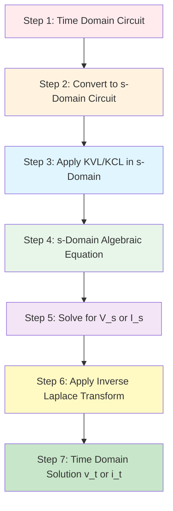
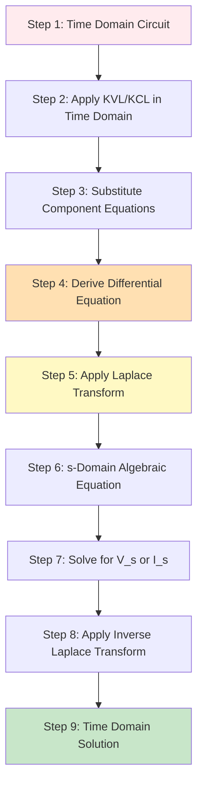
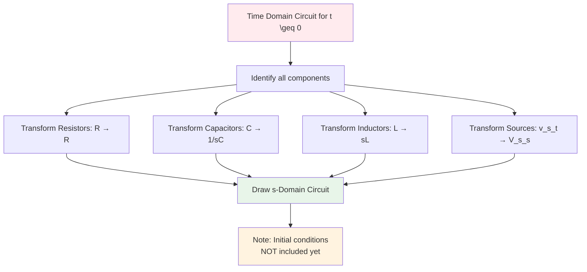
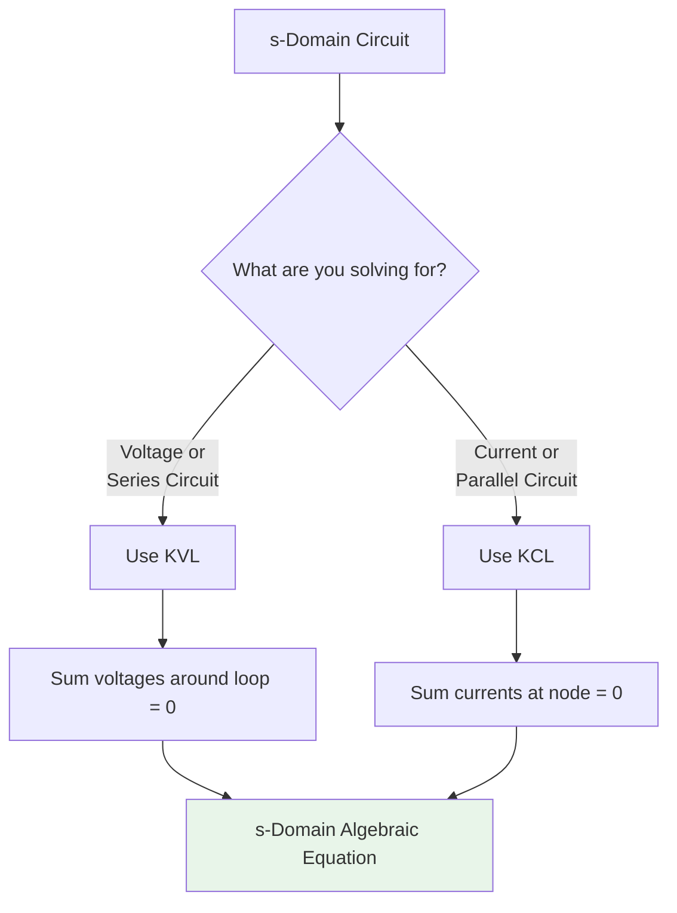
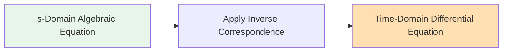
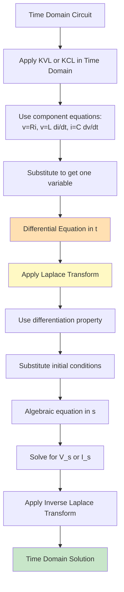
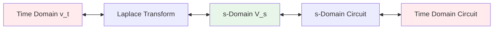
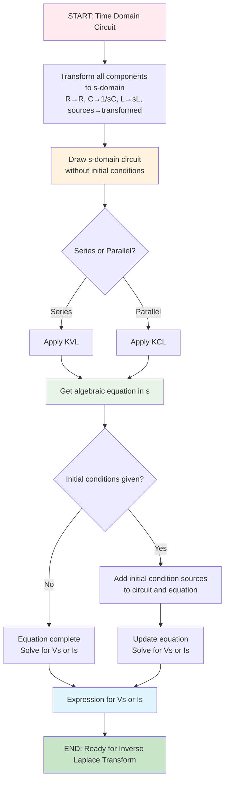
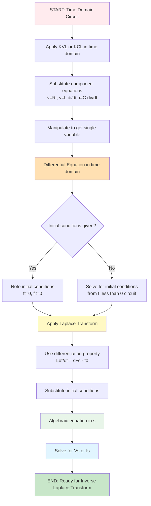

# Comprehensive Guide: Time Domain to s-Domain Circuit Conversion

## Table of Contents
1. [Overview and Order of Operations](#overview-and-order-of-operations)
2. [The Standard Problem Progression](#the-standard-problem-progression)
3. [Component Transformation Equations](#component-transformation-equations)
4. [Step 1: Time Domain Circuit to s-Domain Circuit](#step-1-time-domain-circuit-to-s-domain-circuit)
5. [Step 2: Apply KVL/KCL to s-Domain Circuit](#step-2-apply-kvlkcl-to-s-domain-circuit)
6. [Step 3: Derive Differential Equations from s-Domain](#step-3-derive-differential-equations-from-s-domain)
7. [Step 4: Setup for Laplace Transform](#step-4-setup-for-laplace-transform)
8. [Alternative Path: Differential Equation First](#alternative-path-differential-equation-first)
9. [Working Backwards: Inverse Operations](#working-backwards-inverse-operations)
10. [Complete Worked Examples](#complete-worked-examples)
11. [Tips and Tricks](#tips-and-tricks)
12. [Common Pitfalls](#common-pitfalls)

---

## Overview and Order of Operations

This guide covers **TWO distinct paths** for circuit analysis using Laplace transforms. Understanding the order is critical:

### PATH A: Direct s-Domain Transformation (Most Common in Exams)



**Key Point:** This path goes **directly to s-domain**, then applies circuit laws. You get an algebraic equation in $s$, NOT a differential equation.

### PATH B: Differential Equation First (Alternative Method)



**Key Point:** This path derives a differential equation in time domain FIRST, then transforms it.

---

## The Standard Problem Progression

Based on your description, here is the typical exam question format:

### Problem Format

**Given:**
- Time domain circuit diagram
- Component values (R, L, C)
- Source functions $v_s(t)$ or $i_s(t)$

**Part 1: Convert to s-Domain**
- Transform all components to s-domain equivalents
- Draw the s-domain circuit diagram

**Part 2: Find Equation Using s-Domain Circuit**
- Apply KVL or KCL to the s-domain circuit
- Obtain algebraic equation in terms of $s$

**Part 3: Initial Conditions Given**
- You are NOW given: $v_C(0)$, $i_L(0)$, etc.
- Incorporate these into your s-domain equation
- Solve for $V(s)$ or $I(s)$

**Part 4: Inverse Transform**
- Apply inverse Laplace transform
- Find $v(t)$ or $i(t)$

### Critical Clarification on "Differential Equations"

**IMPORTANT:** When you go **Time Domain → s-Domain Circuit → KVL/KCL**, you get an **ALGEBRAIC equation in $s$**, NOT a differential equation.

You only get a differential equation if you:
- Start in time domain and apply KVL/KCL there (PATH B), OR
- Take your s-domain algebraic equation and inverse transform it back (which is backwards)

**The confusion:** In PATH A, you can think of the s-domain algebraic equation as the "Laplace transform of the differential equation," but you never explicitly write the differential equation.

---

## Component Transformation Equations

### Complete Time Domain to s-Domain Table

| Component | Time Domain | s-Domain Impedance Z(s) | Initial Condition (when given later) |
|-----------|-------------|------------------------|--------------------------------------|
| **Resistor** | $v_R(t) = R \cdot i(t)$ | $Z_R = R$ | None |
| **Capacitor** | $i_C(t) = C \frac{dv_C(t)}{dt}$ | $Z_C = \frac{1}{sC}$ | Add voltage source $\frac{v_C(0)}{s}$ in series |
| **Inductor** | $v_L(t) = L \frac{di_L(t)}{dt}$ | $Z_L = sL$ | Add voltage source $Li_L(0)$ in series OR current source $\frac{i_L(0)}{s}$ in parallel |
| **Voltage Source** | $v_s(t)$ | N/A | $V_s(s) = \mathcal{L}\{v_s(t)\}$ |
| **Current Source** | $i_s(t)$ | N/A | $I_s(s) = \mathcal{L}\{i_s(t)\}$ |

### Key Time-Domain Component Equations

#### Resistor
$$v_R(t) = R \cdot i_R(t)$$
$$i_R(t) = \frac{v_R(t)}{R}$$

#### Capacitor
$$i_C(t) = C \frac{dv_C(t)}{dt}$$
$$v_C(t) = \frac{1}{C}\int_{0}^{t} i_C(\tau)d\tau + v_C(0)$$

#### Inductor
$$v_L(t) = L \frac{di_L(t)}{dt}$$
$$i_L(t) = \frac{1}{L}\int_{0}^{t} v_L(\tau)d\tau + i_L(0)$$

---

## Step 1: Time Domain Circuit to s-Domain Circuit

### Transformation Process



### Detailed Transformation Rules

#### Rule 1: Resistor Transformation
**Time Domain:** Resistor with value $R$ ohms

**s-Domain:** Same resistor with value $R$ ohms

$$Z_R(s) = R$$

#### Rule 2: Capacitor Transformation
**Time Domain:** Capacitor with value $C$ farads

**s-Domain:** Impedance $\frac{1}{sC}$

$$Z_C(s) = \frac{1}{sC}$$

**Circuit Representation (without initial conditions):** Just the impedance $\frac{1}{sC}$

**Circuit Representation (with initial conditions, added later):** 
- Impedance $\frac{1}{sC}$ in **series** with voltage source $\frac{v_C(0)}{s}$

#### Rule 3: Inductor Transformation  
**Time Domain:** Inductor with value $L$ henries

**s-Domain:** Impedance $sL$

$$Z_L(s) = sL$$

**Circuit Representation (without initial conditions):** Just the impedance $sL$

**Circuit Representation (with initial conditions, added later):**
- **Option A (for KVL/Mesh):** Impedance $sL$ in **series** with voltage source $Li_L(0)$
- **Option B (for KCL/Node):** Impedance $sL$ in **parallel** with current source $\frac{i_L(0)}{s}$

#### Rule 4: Voltage Source Transformation
**Time Domain:** $v_s(t)$

**s-Domain:** $V_s(s) = \mathcal{L}\{v_s(t)\}$

Common transforms:
- Step function: $V_0 u(t) \rightarrow \frac{V_0}{s}$
- Exponential: $V_0 e^{-at}u(t) \rightarrow \frac{V_0}{s+a}$
- Sine: $V_0 \sin(\omega t)u(t) \rightarrow \frac{V_0\omega}{s^2+\omega^2}$
- Cosine: $V_0 \cos(\omega t)u(t) \rightarrow \frac{V_0 s}{s^2+\omega^2}$

#### Rule 5: Current Source Transformation
**Time Domain:** $i_s(t)$

**s-Domain:** $I_s(s) = \mathcal{L}\{i_s(t)\}$

(Same transform pairs as voltage sources)

### Example: Series RLC Circuit Transformation

**Time Domain Circuit:**
```
v_s(t) ---[ R ]---[ L ]---[ C ]--- ground
```

**s-Domain Circuit (without initial conditions):**
```
V_s(s) ---[ R ]---[ sL ]---[ 1/sC ]--- ground
```

**s-Domain Circuit (with initial conditions added later):**
```
V_s(s) ---[ R ]---[ sL ]---[+]---[ 1/sC ]---[+]--- ground
                          [Li_L(0)]      [v_C(0)/s]
```

Where [+] indicates voltage source polarity.

---

## Step 2: Apply KVL/KCL to s-Domain Circuit

### Using Kirchhoff's Laws in s-Domain



### KVL in s-Domain (Mesh/Loop Analysis)

**Kirchhoff's Voltage Law:** Sum of voltages around any closed loop equals zero.

$$\sum V_{sources}(s) - \sum V_{drops}(s) = 0$$

**Voltage drops across impedances:**
$$V_{drop}(s) = I(s) \cdot Z(s)$$

**General KVL Equation:**
$$V_s(s) = I(s) \cdot Z_1(s) + I(s) \cdot Z_2(s) + \cdots + I(s) \cdot Z_n(s) + V_{initial}(s)$$

Where $V_{initial}(s)$ represents initial condition voltage sources (when added).

### KCL in s-Domain (Node Analysis)

**Kirchhoff's Current Law:** Sum of currents entering a node equals sum of currents leaving.

$$\sum I_{entering}(s) = \sum I_{leaving}(s)$$

**Current through impedance:**
$$I(s) = \frac{V(s)}{Z(s)}$$

**General KCL Equation at a node:**
$$I_s(s) + I_{initial}(s) = \frac{V_{node}(s)}{Z_1(s)} + \frac{V_{node}(s)}{Z_2(s)} + \cdots$$

Where $I_{initial}(s)$ represents initial condition current sources (when added).

### Example: Series RLC Circuit - KVL Application

**s-Domain Circuit:**
```
V_s(s) ---[ R ]---[ sL ]---[ 1/sC ]--- ground
              Current I(s) flows clockwise
```

**Apply KVL (going clockwise):**
$$V_s(s) - V_R(s) - V_L(s) - V_C(s) = 0$$

**Substitute Ohm's Law in s-Domain:**
$$V_s(s) - I(s) \cdot R - I(s) \cdot sL - I(s) \cdot \frac{1}{sC} = 0$$

**Algebraic equation in s:**
$$V_s(s) = I(s) \left[ R + sL + \frac{1}{sC} \right]$$

**This is an algebraic equation, NOT a differential equation.**

### Example: Parallel RLC Circuit - KCL Application

**s-Domain Circuit:**
```
       I_s(s)
         |
    +----+----+----+
    |    |    |    |
    R   sL  1/sC  ground
```

**Apply KCL at top node (voltage V(s) across all elements):**
$$I_s(s) = I_R(s) + I_L(s) + I_C(s)$$

**Substitute:**
$$I_s(s) = \frac{V(s)}{R} + \frac{V(s)}{sL} + V(s) \cdot sC$$

**Algebraic equation in s:**
$$I_s(s) = V(s) \left[ \frac{1}{R} + \frac{1}{sL} + sC \right]$$

---

## Step 3: Derive Differential Equations from s-Domain

### IMPORTANT CLARIFICATION

When you follow PATH A (Time → s-Domain → KVL/KCL), you get an **algebraic equation in $s$**, not a differential equation.

However, you may be asked to "find the differential equation" which means: **What time-domain differential equation corresponds to this s-domain equation?**

### Converting s-Domain Equation to Differential Equation

This is the **INVERSE** process, used to understand what differential equation you would have gotten if you had used PATH B.



### Inverse Laplace Correspondence Rules

These rules work **backwards** from the Laplace transform properties:

| s-Domain Term | Time-Domain Equivalent |
|---------------|------------------------|
| $V(s)$ or $I(s)$ | $v(t)$ or $i(t)$ |
| $s \cdot V(s)$ | $\frac{dv(t)}{dt}$ (plus initial condition) |
| $s^2 \cdot V(s)$ | $\frac{d^2v(t)}{dt^2}$ (plus initial conditions) |
| $\frac{V(s)}{s}$ | $\int_0^t v(\tau)d\tau$ |
| $V_s(s)$ | $v_s(t)$ |
| Constant $C$ | Constant $C$ |

### Detailed Correspondence Rules

#### Rule 1: Basic Substitution
$$V(s) \rightarrow v(t)$$
$$I(s) \rightarrow i(t)$$

#### Rule 2: Multiplication by $s$ (First Derivative)
$$s \cdot V(s) \rightarrow \frac{dv(t)}{dt} + v(0^+)$$

**However:** If initial conditions are already incorporated as sources in the s-domain circuit, then:
$$s \cdot V(s) \rightarrow \frac{dv(t)}{dt}$$

And the initial condition term appears separately.

#### Rule 3: Multiplication by $s^2$ (Second Derivative)
$$s^2 \cdot V(s) \rightarrow \frac{d^2v(t)}{dt^2} + s \cdot v(0^+) + \frac{dv(0^+)}{dt}$$

With initial conditions incorporated:
$$s^2 \cdot V(s) \rightarrow \frac{d^2v(t)}{dt^2}$$

#### Rule 4: Division by $s$ (Integration)
$$\frac{V(s)}{s} \rightarrow \int_0^t v(\tau)d\tau$$

### Example: Converting s-Domain to Differential Equation

**Given s-Domain Equation (from Series RLC):**
$$V_s(s) = I(s) \left[ R + sL + \frac{1}{sC} \right]$$

**Step 1: Expand**
$$V_s(s) = R \cdot I(s) + sL \cdot I(s) + \frac{I(s)}{sC}$$

**Step 2: Multiply through by $sC$**
$$sC \cdot V_s(s) = sRC \cdot I(s) + s^2LC \cdot I(s) + I(s)$$

**Step 3: Apply inverse correspondence**
- $sC \cdot V_s(s) \rightarrow C\frac{dv_s(t)}{dt}$
- $sRC \cdot I(s) \rightarrow RC\frac{di(t)}{dt}$
- $s^2LC \cdot I(s) \rightarrow LC\frac{d^2i(t)}{dt^2}$
- $I(s) \rightarrow i(t)$

**Resulting Differential Equation:**
$$C\frac{dv_s(t)}{dt} = RC\frac{di(t)}{dt} + LC\frac{d^2i(t)}{dt^2} + i(t)$$

Or rearranged:
$$LC\frac{d^2i(t)}{dt^2} + RC\frac{di(t)}{dt} + i(t) = C\frac{dv_s(t)}{dt}$$

**This is a second-order differential equation.**

---

## Step 4: Setup for Laplace Transform

At this point, you have either:

### Option A: s-Domain Algebraic Equation (from PATH A)

**You already have:** An equation like $V_s(s) = I(s) \cdot Z_{total}(s)$

**To solve:**
1. Add initial condition sources (if not already included)
2. Algebraically solve for $I(s)$ or $V(s)$
3. You now have $I(s) = \frac{V_s(s)}{Z_{total}(s)}$ plus initial condition terms

**Next step:** Apply **Inverse Laplace Transform** to get $i(t)$ or $v(t)$

**You would perform Inverse Laplace Transform from here.**

### Option B: Time-Domain Differential Equation (from PATH B)

**You have:** A differential equation like:
$$LC\frac{d^2i(t)}{dt^2} + RC\frac{di(t)}{dt} + i(t) = C\frac{dv_s(t)}{dt}$$

**To solve:**
1. Apply Laplace Transform to both sides
2. Use differentiation property: $\mathcal{L}\{\frac{df}{dt}\} = sF(s) - f(0)$
3. Substitute initial conditions
4. Solve algebraically for $I(s)$

**You would apply Laplace Transform from here.**

### Laplace Transform Properties (for PATH B)

#### Differentiation Property (First Derivative)
$$\mathcal{L}\left\{\frac{df(t)}{dt}\right\} = sF(s) - f(0)$$

#### Second Derivative Property
$$\mathcal{L}\left\{\frac{d^2f(t)}{dt^2}\right\} = s^2F(s) - sf(0) - f'(0)$$

#### Integration Property
$$\mathcal{L}\left\{\int_0^t f(\tau) d\tau\right\} = \frac{F(s)}{s}$$

#### Linearity Property
$$\mathcal{L}\{af(t) + bg(t)\} = aF(s) + bG(s)$$

### Example: Applying Laplace Transform to Differential Equation

**Given Differential Equation:**
$$LC\frac{d^2i(t)}{dt^2} + RC\frac{di(t)}{dt} + i(t) = v_s(t)$$

**With initial conditions:** $i(0) = I_0$, $\frac{di(0)}{dt} = I_0'$

**Step 1: Apply Laplace Transform to each term**

Left side:
- $\mathcal{L}\{LC\frac{d^2i(t)}{dt^2}\} = LC[s^2I(s) - si(0) - i'(0)] = LC[s^2I(s) - sI_0 - I_0']$
- $\mathcal{L}\{RC\frac{di(t)}{dt}\} = RC[sI(s) - i(0)] = RC[sI(s) - I_0]$
- $\mathcal{L}\{i(t)\} = I(s)$

Right side:
- $\mathcal{L}\{v_s(t)\} = V_s(s)$

**Step 2: Substitute into equation**
$$LC[s^2I(s) - sI_0 - I_0'] + RC[sI(s) - I_0] + I(s) = V_s(s)$$

**Step 3: Expand and collect terms**
$$LCs^2I(s) - LCsI_0 - LCI_0' + RCsI(s) - RCI_0 + I(s) = V_s(s)$$

$$I(s)[LCs^2 + RCs + 1] = V_s(s) + LCsI_0 + LCI_0' + RCI_0$$

**Step 4: Solve for I(s)**
$$I(s) = \frac{V_s(s) + LCsI_0 + LCI_0' + RCI_0}{LCs^2 + RCs + 1}$$

**You would now apply Inverse Laplace Transform to get i(t).**

---

## Alternative Path: Differential Equation First

### When to Use This Path

Use PATH B when:
- The problem explicitly asks for the differential equation first
- You're more comfortable with time-domain analysis
- The circuit is simple enough to analyze in time domain

### Complete PATH B Process



### Detailed Steps for PATH B

#### Step 1: Apply KVL or KCL in Time Domain

**For Series Circuit (KVL):**
$$v_s(t) = v_R(t) + v_L(t) + v_C(t)$$

**For Parallel Circuit (KCL):**
$$i_s(t) = i_R(t) + i_L(t) + i_C(t)$$

#### Step 2: Substitute Component Equations

**For Series RLC finding current i(t):**

From KVL:
$$v_s(t) = v_R(t) + v_L(t) + v_C(t)$$

Substitute:
- $v_R(t) = Ri(t)$
- $v_L(t) = L\frac{di(t)}{dt}$
- $v_C(t) = \frac{1}{C}\int_0^t i(\tau)d\tau + v_C(0)$

Result:
$$v_s(t) = Ri(t) + L\frac{di(t)}{dt} + \frac{1}{C}\int_0^t i(\tau)d\tau + v_C(0)$$

#### Step 3: Eliminate Integrals/Derivatives

**Differentiate to eliminate integral:**
$$\frac{dv_s(t)}{dt} = R\frac{di(t)}{dt} + L\frac{d^2i(t)}{dt^2} + \frac{i(t)}{C}$$

**Rearrange:**
$$L\frac{d^2i(t)}{dt^2} + R\frac{di(t)}{dt} + \frac{i(t)}{C} = \frac{dv_s(t)}{dt}$$

**This is your differential equation.**

#### Step 4: Apply Laplace Transform

(Same process as shown in Step 4 above)

---

## Working Backwards: Inverse Operations

### Understanding the Reverse Process

Sometimes you need to work backwards through the steps:



### Reverse Operation 1: s-Domain to Time Domain Circuit

**Going Forward:** Time circuit → s-Domain circuit (replace R, L, C with impedances)

**Going Backward:** s-Domain circuit → Time circuit

#### Reverse Transformation Table

| s-Domain Element | Time Domain Element |
|------------------|---------------------|
| Resistor $R$ | Resistor $R$ |
| Impedance $\frac{1}{sC}$ | Capacitor $C$ |
| Impedance $sL$ | Inductor $L$ |
| Voltage source $\frac{v_C(0)}{s}$ | Initial condition $v_C(0)$ on capacitor |
| Voltage source $Li_L(0)$ | Initial condition $i_L(0)$ on inductor |
| $V_s(s)$ | $v_s(t) = \mathcal{L}^{-1}\{V_s(s)\}$ |

**Process:**
1. Identify each impedance element
2. Convert impedances back to time-domain components
3. Extract initial conditions from voltage/current sources
4. Inverse transform any source functions

### Reverse Operation 2: s-Domain Equation to Differential Equation

**Going Forward:** Differential equation → Apply Laplace → s-Domain equation

**Going Backward:** s-Domain equation → Identify correspondences → Differential equation

**Process (detailed in Step 3 above):**
1. Identify all terms involving $s$
2. Apply inverse correspondence:
   - $s^n V(s) \rightarrow \frac{d^n v(t)}{dt^n}$
   - $\frac{V(s)}{s} \rightarrow \int v(t)dt$
3. Substitute back to get differential equation

### Reverse Operation 3: KVL/KCL Back to Circuit

**Going Forward:** Circuit → Apply KVL/KCL → Equation

**Going Backward:** Equation → Identify topology → Circuit

**Key identifiers:**
- If equation has sum of voltages = source: **Series circuit (KVL)**
- If equation has sum of currents = source: **Parallel circuit (KCL)**
- Terms added together → Elements in series (for KVL) or parallel (for KCL)

**Example:**
Given: $V_s(s) = I(s)[R + sL + \frac{1}{sC}]$

This indicates:
- Series circuit (sum of impedances)
- Contains R, L, and C in series
- Voltage source $V_s(s)$
- Current $I(s)$ flows through all elements

### Reverse Operation 4: Differential Equation to KVL/KCL

**Going Forward:** KVL/KCL → Substitute components → Differential equation

**Going Backward:** Differential equation → Identify terms → Reconstruct KVL/KCL

**Identification rules:**
- Terms with $\frac{d^2}{dt^2}$ → Inductor (if solving for current) or Capacitor (if solving for voltage)
- Terms with $\frac{d}{dt}$ → Inductor (voltage) or Capacitor (current) or Resistor derivative
- Terms without derivatives → Resistor or result of integration
- RHS (right-hand side) → Source function

---

## Complete Worked Examples

### Example 1: Series RC Circuit (PATH A - Standard Exam Format)

#### Part 1: Given Time Domain Circuit

**Circuit:**
```
v_s(t) = 10u(t) V ---[R = 100Ω]---[C = 10μF]--- ground
```

Find: Voltage across capacitor, $v_C(t)$

#### Part 2: Convert to s-Domain

**Transform components:**
- Voltage source: $v_s(t) = 10u(t) \rightarrow V_s(s) = \frac{10}{s}$
- Resistor: $R = 100Ω \rightarrow R = 100Ω$
- Capacitor: $C = 10μF \rightarrow Z_C = \frac{1}{sC} = \frac{1}{s \cdot 10 \times 10^{-6}} = \frac{10^6}{10s} = \frac{10^5}{s}$

**s-Domain circuit (without initial conditions):**
```
V_s(s) = 10/s ---[100]---[10^5/s]--- ground
```

#### Part 3: Apply KVL in s-Domain

Current flows clockwise: $I(s)$

**KVL around loop:**
$V_s(s) = I(s) \cdot R + V_C(s)$

**Voltage across capacitor:**
$V_C(s) = I(s) \cdot Z_C = I(s) \cdot \frac{10^5}{s}$

**Substitute:**
$\frac{10}{s} = I(s) \cdot 100 + I(s) \cdot \frac{10^5}{s}$

$\frac{10}{s} = I(s) \left[100 + \frac{10^5}{s}\right]$

$\frac{10}{s} = I(s) \left[\frac{100s + 10^5}{s}\right]$

**Solve for I(s):**
$I(s) = \frac{10}{s} \cdot \frac{s}{100s + 10^5} = \frac{10}{100s + 10^5}$

**Simplify:**
$I(s) = \frac{10}{100(s + 1000)} = \frac{0.1}{s + 1000}$

**Now find V_C(s):**
$V_C(s) = I(s) \cdot \frac{10^5}{s} = \frac{0.1}{s + 1000} \cdot \frac{10^5}{s}$

$V_C(s) = \frac{10^4}{s(s + 1000)}$

#### Part 4: Initial Conditions Given Later

**Problem states:** Initially, capacitor is uncharged: $v_C(0) = 0$

Since $v_C(0) = 0$, no initial condition source is added. Our equation is complete.

#### Part 5: Ready for Inverse Laplace Transform

**We have:**
$V_C(s) = \frac{10^4}{s(s + 1000)}$

**At this point, you would apply Inverse Laplace Transform using partial fraction expansion.**

---

### Example 2: Series RL Circuit with Initial Condition (PATH A)

#### Part 1: Given Time Domain Circuit

**Circuit:**
```
v_s(t) = 5e^{-2t}u(t) V ---[R = 10Ω]---[L = 0.5H]--- ground
```

Find: Current $i(t)$

#### Part 2: Convert to s-Domain

**Transform components:**
- Voltage source: $v_s(t) = 5e^{-2t}u(t) \rightarrow V_s(s) = \frac{5}{s+2}$
- Resistor: $R = 10Ω$
- Inductor: $L = 0.5H \rightarrow Z_L = sL = 0.5s$

**s-Domain circuit (without initial conditions):**
```
V_s(s) = 5/(s+2) ---[10]---[0.5s]--- ground
```

#### Part 3: Apply KVL in s-Domain

**KVL around loop:**
$V_s(s) = I(s) \cdot R + I(s) \cdot Z_L$

$\frac{5}{s+2} = I(s) \cdot 10 + I(s) \cdot 0.5s$

$\frac{5}{s+2} = I(s)[10 + 0.5s]$

**Solve for I(s):**
$I(s) = \frac{5}{(s+2)(10 + 0.5s)} = \frac{5}{(s+2) \cdot 0.5(20 + s)}$

$I(s) = \frac{10}{(s+2)(s+20)}$

#### Part 4: Initial Conditions Given

**Problem now states:** $i_L(0) = 2A$

**Add initial condition voltage source** $Li_L(0) = 0.5 \times 2 = 1V$ in series with inductor.

**Updated s-Domain circuit:**
```
V_s(s) = 5/(s+2) ---[10]---[0.5s]---[+]--- ground
                                  [1V source]
```

The voltage source opposes the applied voltage (it represents back-EMF from initial current).

**Updated KVL:**
$V_s(s) = I(s) \cdot R + I(s) \cdot Z_L + Li_L(0)$

$\frac{5}{s+2} = I(s)[10 + 0.5s] + 1$

$\frac{5}{s+2} - 1 = I(s)[10 + 0.5s]$

$\frac{5 - (s+2)}{s+2} = I(s)[10 + 0.5s]$

$\frac{3 - s}{s+2} = I(s)[10 + 0.5s]$

**Solve for I(s):**
$I(s) = \frac{3-s}{(s+2)(10+0.5s)} = \frac{3-s}{0.5(s+2)(s+20)}$

$I(s) = \frac{2(3-s)}{(s+2)(s+20)}$

#### Part 5: Ready for Inverse Laplace Transform

**We have:**
$I(s) = \frac{2(3-s)}{(s+2)(s+20)} = \frac{6-2s}{(s+2)(s+20)}$

**At this point, you would apply Inverse Laplace Transform.**

---

### Example 3: Deriving Differential Equation from s-Domain (PATH A with Step 3)

#### Given: s-Domain Equation

From Example 1, we had:
$V_s(s) = I(s)[R + Z_C]$

For RC circuit:
$V_s(s) = I(s)\left[R + \frac{1}{sC}\right]$

#### Find: Corresponding Differential Equation

**Step 1: Express in standard form**
$V_s(s) = RI(s) + \frac{I(s)}{sC}$

**Step 2: Relate current to voltage**

For a capacitor: $I(s) = sC \cdot V_C(s)$

Substitute:
$V_s(s) = R \cdot sC \cdot V_C(s) + \frac{sC \cdot V_C(s)}{sC}$

$V_s(s) = RsC \cdot V_C(s) + V_C(s)$

$V_s(s) = V_C(s)[1 + RsC]$

**Step 3: Apply inverse correspondence**

- $V_s(s) \rightarrow v_s(t)$
- $V_C(s) \rightarrow v_C(t)$
- $sC \cdot V_C(s) \rightarrow C\frac{dv_C(t)}{dt}$

**From the equation:**
$V_s(s) = V_C(s) + RC \cdot s \cdot V_C(s)$

**Time domain:**
$v_s(t) = v_C(t) + RC\frac{dv_C(t)}{dt}$

**This is the first-order differential equation.**

**Rearranged:**
$RC\frac{dv_C(t)}{dt} + v_C(t) = v_s(t)$

Or:
$\frac{dv_C(t)}{dt} + \frac{1}{RC}v_C(t) = \frac{v_s(t)}{RC}$

---

### Example 4: Complete PATH B Process (Differential Equation First)

#### Part 1: Given Time Domain Circuit

**Circuit:**
```
v_s(t) = 10u(t) V ---[R = 2Ω]---[L = 1H]--- ground
```

Find: Current $i(t)$, given $i_L(0) = 0$

#### Part 2: Apply KVL in Time Domain

**KVL around loop:**
$v_s(t) = v_R(t) + v_L(t)$

#### Part 3: Substitute Component Equations

- $v_R(t) = R \cdot i(t) = 2i(t)$
- $v_L(t) = L\frac{di(t)}{dt} = 1 \cdot \frac{di(t)}{dt} = \frac{di(t)}{dt}$

**Substitute:**
$v_s(t) = 2i(t) + \frac{di(t)}{dt}$

**Given:** $v_s(t) = 10u(t)$

**Differential equation:**
$\frac{di(t)}{dt} + 2i(t) = 10u(t)$

For $t > 0$ (where $u(t) = 1$):
$\frac{di(t)}{dt} + 2i(t) = 10$

#### Part 4: Apply Laplace Transform

**Transform both sides:**
$\mathcal{L}\left\{\frac{di(t)}{dt}\right\} + 2\mathcal{L}\{i(t)\} = \mathcal{L}\{10\}$

**Use differentiation property:**
$sI(s) - i(0) + 2I(s) = \frac{10}{s}$

**Given:** $i(0) = 0$

$sI(s) + 2I(s) = \frac{10}{s}$

$I(s)[s + 2] = \frac{10}{s}$

**Solve for I(s):**
$I(s) = \frac{10}{s(s+2)}$

#### Part 5: Ready for Inverse Laplace Transform

**We have:**
$I(s) = \frac{10}{s(s+2)}$

**At this point, you would apply Inverse Laplace Transform.**

---

### Example 5: Parallel RLC with Node Analysis (PATH A)

#### Part 1: Given Time Domain Circuit

**Circuit:**
```
         i_s(t) = 2u(t) A
              |
         +----+----+----+
         |    |    |    |
        R=5  L=2H C=0.1F
         |    |    |    |
       ground ground ground
```

Find: Voltage $v(t)$ across all elements

#### Part 2: Convert to s-Domain

**Transform components:**
- Current source: $i_s(t) = 2u(t) \rightarrow I_s(s) = \frac{2}{s}$
- Resistor: $R = 5Ω$
- Inductor: $Z_L = sL = 2s$ (use parallel form with current source for KCL)
- Capacitor: $Z_C = \frac{1}{sC} = \frac{1}{0.1s} = \frac{10}{s}$

**s-Domain circuit (without initial conditions):**
```
         I_s(s) = 2/s
              |
         +----+----+----+
         |    |    |    |
        R=5  2s   10/s
         |    |    |    |
       ground
```

Voltage $V(s)$ appears across all elements.

#### Part 3: Apply KCL at Top Node

**KCL (currents leaving node):**
$I_s(s) = I_R(s) + I_L(s) + I_C(s)$

**Express currents in terms of V(s):**
- $I_R(s) = \frac{V(s)}{R} = \frac{V(s)}{5}$
- $I_L(s) = \frac{V(s)}{Z_L} = \frac{V(s)}{2s}$
- $I_C(s) = \frac{V(s)}{Z_C} = V(s) \cdot \frac{s}{10} = \frac{sV(s)}{10}$

**Substitute:**
$\frac{2}{s} = \frac{V(s)}{5} + \frac{V(s)}{2s} + \frac{sV(s)}{10}$

**Factor out V(s):**
$\frac{2}{s} = V(s)\left[\frac{1}{5} + \frac{1}{2s} + \frac{s}{10}\right]$

**Find common denominator (10s):**
$\frac{2}{s} = V(s)\left[\frac{2s}{10s} + \frac{5}{10s} + \frac{s^2}{10s}\right]$

$\frac{2}{s} = V(s)\left[\frac{2s + 5 + s^2}{10s}\right]$

$\frac{2}{s} = V(s)\left[\frac{s^2 + 2s + 5}{10s}\right]$

**Solve for V(s):**
$V(s) = \frac{2}{s} \cdot \frac{10s}{s^2 + 2s + 5}$

$V(s) = \frac{20}{s^2 + 2s + 5}$

#### Part 4: Initial Conditions Given

**Problem states:** $v_C(0) = 0V$, $i_L(0) = 1A$

**For inductor in parallel form:** Add current source $\frac{i_L(0)}{s} = \frac{1}{s}$ in parallel with $Z_L$

**Updated KCL:**
$I_s(s) = I_R(s) + I_L(s) + I_C(s) + I_{L,initial}(s)$

Where $I_{L,initial}(s) = -\frac{i_L(0)}{s} = -\frac{1}{s}$ (negative because it flows out of the node initially)

Actually, the correct polarity: the initial current source flows in the same direction as the inductor would naturally discharge.

**Updated equation:**
$\frac{2}{s} = \frac{V(s)}{5} + \frac{V(s)}{2s} + \frac{sV(s)}{10} - \frac{1}{s}$

$\frac{2}{s} + \frac{1}{s} = V(s)\left[\frac{1}{5} + \frac{1}{2s} + \frac{s}{10}\right]$

$\frac{3}{s} = V(s)\left[\frac{s^2 + 2s + 5}{10s}\right]$

**Solve for V(s):**
$V(s) = \frac{3}{s} \cdot \frac{10s}{s^2 + 2s + 5} = \frac{30}{s^2 + 2s + 5}$

#### Part 5: Ready for Inverse Laplace Transform

**We have:**
$V(s) = \frac{30}{s^2 + 2s + 5}$

**At this point, you would apply Inverse Laplace Transform.**

---

## Tips and Tricks

### General Strategy

**Tip 1: Choose Your Analysis Method Based on Circuit Topology**

- **Series-dominant circuit:** Use KVL/Mesh analysis
- **Parallel-dominant circuit:** Use KCL/Node analysis
- **Mixed circuit:** Count nodes vs. loops, choose method with fewer equations

**Tip 2: Initial Condition Handling**

When initial conditions are given AFTER you've already set up the s-domain circuit:
1. Don't panic - this is common in exams
2. Add the initial condition sources to your existing s-domain circuit
3. Update your KVL/KCL equation with the new source terms
4. Re-solve for the variable of interest

**Tip 3: Impedance Combination**

Combine impedances BEFORE applying KVL/KCL to simplify algebra:

**Series impedances:**
$Z_{total} = Z_1 + Z_2 + Z_3 + \cdots$

**Parallel impedances:**
$\frac{1}{Z_{total}} = \frac{1}{Z_1} + \frac{1}{Z_2} + \frac{1}{Z_3} + \cdots$

Or for two impedances:
$Z_{total} = \frac{Z_1 Z_2}{Z_1 + Z_2}$

### Component Transformation Tips

**Tip 4: Capacitor Impedance Direction**

The impedance $\frac{1}{sC}$ becomes:
- **Large (open circuit) at low frequencies** ($s \to 0$, DC)
- **Small (short circuit) at high frequencies** ($s \to \infty$)

**Tip 5: Inductor Impedance Direction**

The impedance $sL$ becomes:
- **Small (short circuit) at low frequencies** ($s \to 0$, DC)
- **Large (open circuit) at high frequencies** ($s \to \infty$)

**Tip 6: Initial Condition Polarity for Capacitors**

When adding the initial condition voltage source $\frac{v_C(0)}{s}$:
- If $v_C(0) > 0$: The + terminal of the source is on the same side as the + terminal of the capacitor's initial voltage
- The source "helps" discharge the capacitor

**Tip 7: Initial Condition Choice for Inductors**

You have two equivalent options:
- **Series voltage source:** $Li_L(0)$ - easier for KVL
- **Parallel current source:** $\frac{i_L(0)}{s}$ - easier for KCL

Use **source transformation** to convert between them if needed:
$Li_L(0) \text{ (series with } sL) \equiv \frac{i_L(0)}{s} \text{ (parallel with } sL)$

### Equation Setup Tips

**Tip 8: Factor Out the Unknown**

Always factor out $I(s)$ or $V(s)$ as soon as possible:

Instead of:
$\frac{10}{s} = 100I(s) + \frac{10^5 I(s)}{s}$

Write:
$\frac{10}{s} = I(s)\left[100 + \frac{10^5}{s}\right]$

**Tip 9: Common Denominator Strategy**

When combining impedances with different $s$ terms:

$R + \frac{1}{sC} = \frac{RsC + 1}{sC}$

$R + sL = R + sL \text{ (already simplified)}$

$\frac{1}{sL} + sC = \frac{1 + s^2LC}{sL}$

**Tip 10: Simplify Before Solving**

Look for opportunities to simplify:
- Factor out constants
- Cancel common terms in numerator and denominator
- Combine like terms

Example:
$I(s) = \frac{100}{100(s+10)} = \frac{1}{s+10}$

### Differential Equation Derivation Tips

**Tip 11: Matching Powers of s**

When deriving differential equations from s-domain:
- $s^0$ (constant) → original function
- $s^1$ → first derivative
- $s^2$ → second derivative

**Tip 12: Clear Fractions First**

Before applying inverse correspondence, multiply through to eliminate fractions:

Given:
$V_s(s) = I(s)\left[R + sL + \frac{1}{sC}\right]$

Multiply by $sC$:
$sCVs(s) = I(s)[RsC + s^2LC + 1]$

Now apply inverse correspondence more easily.

**Tip 13: Identify the Dependent Variable**

Make sure you know what variable your differential equation should be in terms of:
- If solving for current, derive equation in terms of $i(t)$
- If solving for voltage, derive equation in terms of $v(t)$
- Use component relationships to substitute and eliminate other variables

### Verification Tips

**Tip 14: Dimensional Analysis**

Check units throughout:
- $[R] = \Omega$
- $[sL] = s \cdot H = \Omega$ (since $H = \Omega \cdot s$)
- $[\frac{1}{sC}] = \frac{1}{s \cdot F} = \Omega$ (since $F = \frac{s}{\Omega}$)
- All impedances must have units of Ohms

**Tip 15: Initial Value Check**

Use Initial Value Theorem to verify:
$\lim_{t \to 0^+} f(t) = \lim_{s \to \infty} sF(s)$

Check if your $V(s)$ or $I(s)$ gives the correct initial value.

**Tip 16: Final Value Check**

Use Final Value Theorem (for stable systems):
$\lim_{t \to \infty} f(t) = \lim_{s \to 0} sF(s)$

For DC steady state, this should match your circuit analysis at $s = 0$.

### Problem-Solving Workflow

**Tip 17: Standard Exam Approach**

1. Read entire problem - note what's given and what's asked
2. Draw s-domain circuit (without initial conditions first)
3. Choose KVL or KCL based on topology
4. Write equation in s-domain
5. When initial conditions are given, add them to circuit and equation
6. Solve algebraically for $V(s)$ or $I(s)$
7. State "ready for inverse Laplace transform"

**Tip 18: Sign Convention Consistency**

- Choose current direction at the start
- Mark it clearly on your circuit diagram
- Stick with it throughout the problem
- Voltage drops are positive in the direction of current (passive sign convention)

**Tip 19: Organize Your Work**

Label each step clearly:
- "s-Domain Circuit Transformation"
- "Apply KVL" or "Apply KCL"
- "Add Initial Conditions"
- "Solve for V(s)" or "Solve for I(s)"
- "Ready for Inverse Laplace Transform"

This makes it easier for graders and helps you catch errors.

### Advanced Tips

**Tip 20: Source Transformation in s-Domain**

You can perform source transformations in s-domain just like in time domain:

**Voltage source** $V_s(s)$ in series with $Z$ ↔ **Current source** $I_s(s) = \frac{V_s(s)}{Z}$ in parallel with $Z$

Use this to simplify circuits before analysis.

**Tip 21: Thevenin/Norton in s-Domain**

For complex circuits, find Thevenin or Norton equivalent:
- $V_{th}(s)$ = open circuit voltage
- $Z_{th}(s)$ = impedance with sources zeroed
- $I_N(s) = \frac{V_{th}(s)}{Z_{th}(s)}$

**Tip 22: Voltage and Current Dividers**

Use these shortcuts in s-domain:

**Voltage divider:**
$V_1(s) = V_{in}(s) \cdot \frac{Z_1}{Z_1 + Z_2}$

**Current divider:**
$I_1(s) = I_{in}(s) \cdot \frac{Z_2}{Z_1 + Z_2}$

**Tip 23: Natural Response vs Forced Response**

Your s-domain solution contains both:
- **Poles from circuit** (denominator of $\frac{1}{Z_{total}}$) → natural response
- **Poles from source** (denominator of $V_s(s)$ or $I_s(s)$) → forced response

This becomes clear after inverse transformation.

**Tip 24: Quick Mental Checks**

Before inverse transforming:
- Degree of denominator \geq degree of numerator (for proper rational function)
- All poles should be in left half-plane for stable circuit
- Number of poles tells you order of differential equation

---

## Common Pitfalls

### Transformation Errors

**Pitfall 1: Wrong Impedance Formula**

WRONG: $Z_C = sC$ or $Z_C = C$

CORRECT: $Z_C = \frac{1}{sC}$

WRONG: $Z_L = \frac{L}{s}$ or $Z_L = L$

CORRECT: $Z_L = sL$

**Pitfall 2: Forgetting the $s$ Variable**

When working in s-domain, ALWAYS include $s$:

WRONG: $V(s) = I(s)[R + L + \frac{1}{C}]$

CORRECT: $V(s) = I(s)[R + sL + \frac{1}{sC}]$

**Pitfall 3: Initial Condition Source Form**

WRONG: Capacitor initial condition = $v_C(0)$

CORRECT: Capacitor initial condition = $\frac{v_C(0)}{s}$

WRONG: Inductor series voltage source = $i_L(0)$

CORRECT: Inductor series voltage source = $Li_L(0)$

WRONG: Inductor parallel current source = $i_L(0)$

CORRECT: Inductor parallel current source = $\frac{i_L(0)}{s}$

### Sign and Polarity Errors

**Pitfall 4: Initial Condition Polarity**

The initial condition sources must have correct polarity:
- Capacitor voltage source: reflects actual stored voltage polarity
- Inductor current source: flows in direction of initial current
- Wrong polarity gives negative of correct answer

**Pitfall 5: KVL Sign Errors**

Going around loop, be consistent:
- Voltage rises (- to +) are positive if going that direction
- Voltage drops (+ to -) are negative if going that direction
- OR: Set all drops in current direction as positive (passive convention)

**Pitfall 6: KCL Direction Errors**

At a node:
- Currents entering: one sign (usually positive)
- Currents leaving: opposite sign (usually negative)
- Be consistent throughout

### Algebraic Errors

**Pitfall 7: Fraction Combination**

WRONG: $\frac{1}{sC} + R = \frac{1 + R}{sC}$

CORRECT: $\frac{1}{sC} + R = \frac{1 + RsC}{sC}$

**Pitfall 8: Factoring Errors**

When factoring out $I(s)$ or $V(s)$, check EVERY term:

WRONG: $RI(s) + sLI(s) + \frac{I(s)}{sC} = I(s)[R + sL]$

CORRECT: $RI(s) + sLI(s) + \frac{I(s)}{sC} = I(s)[R + sL + \frac{1}{sC}]$

**Pitfall 9: Solving for Wrong Variable**

Make sure you're solving for what's asked:
- Problem asks for $V_C(s)$ but you solved for $I(s)$ - must convert
- Use $V_C(s) = I(s) \cdot Z_C$ or similar relationships

### Conceptual Errors

**Pitfall 10: Mixing Time and s-Domain**

NEVER write $v(t)$ in an s-domain equation or $V(s)$ in a time-domain equation.

WRONG: $V(s) = R \cdot i(t)$

CORRECT: $V(s) = R \cdot I(s)$ (s-domain) or $v(t) = R \cdot i(t)$ (time-domain)

**Pitfall 11: Assuming Zero Initial Conditions**

Unless explicitly stated or obvious (circuit just turned on from de-energized state), NEVER assume $v_C(0) = 0$ or $i_L(0) = 0$.

Wait for problem to give initial conditions or solve for them from $t < 0$ analysis.

**Pitfall 12: Wrong Differential Equation Order**

The order of the differential equation equals:
- Number of energy storage elements (L and C) in general
- For series/parallel RLC: second order
- For RC or RL: first order

If you get wrong order, check your derivation.

**Pitfall 13: Forgetting u(t) in Sources**

When transforming sources, don't forget the unit step:

$v_s(t) = 10$ for $t > 0$ means $v_s(t) = 10u(t)$

WRONG: $\mathcal{L}\{10\} = 10$

CORRECT: $\mathcal{L}\{10u(t)\} = \frac{10}{s}$

**Pitfall 14: Incorrect Source Transformation**

When converting between series and parallel forms:

For inductor initial condition:

Series: $sL$ with voltage source $Li_L(0)$

↔ Parallel: $sL$ with current source $\frac{i_L(0)}{s}$

The relationship: $Li_L(0) = (sL) \cdot \frac{i_L(0)}{s}$ [CHECK]

NOT: $Li_L(0) = \frac{(sL)}{i_L(0)}$ [X]

### Units and Scaling Errors

**Pitfall 15: Unit Conversion**

Watch for μF, mH, kΩ, etc.:
- $10μF = 10 \times 10^{-6} F$
- $5mH = 5 \times 10^{-3} H$
- $2kΩ = 2 \times 10^3 Ω$

**Pitfall 16: Dimensional Inconsistency**

All terms in an equation must have same dimensions:
- In $V(s) = I(s)Z(s)$: all terms must be voltage
- In $I(s) = \frac{V(s)}{Z(s)}$: all terms must be current
- Check by dimension analysis if unsure

---

## Summary Flow Charts

### Complete PATH A Process



### Complete PATH B Process



### Choosing Between PATH A and PATH B

```mermaid
graph TD
    A[Circuit Analysis Problem] --> B{What does problem ask for?}
    B -->|Convert to s-domain first| C[Use PATH A<br/>Direct Transformation]
    B -->|Find differential equation| D[Use PATH B<br/>or derive from PATH A]
    B -->|Either approach works| E{What's easier?}
    
    E -->|Complex circuit| C
    E -->|Simple circuit| F[Either path fine]
    E -->|Want to understand physics| D
    E -->|Time pressure| C
    
    C --> G[Transform → KVL/KCL → Algebraic equation]
    D --> H[KVL/KCL → Diff Eq → Laplace Transform]
    F --> G
    F --> H
    
    G --> I[Solve in s-domain]
    H --> I
    
    style C fill:#e8f5e9
    style D fill:#ffe0b2
    style I fill:#c8e6c9
```



---

## Quick Reference Tables

### s-Domain Transformations Summary

| Time Domain | s-Domain | Notes |
|-------------|----------|-------|
| $R$ | $R$ | Resistor unchanged |
| $C$ | $\frac{1}{sC}$ | Capacitor impedance |
| $L$ | $sL$ | Inductor impedance |
| $v_C(0)$ | $\frac{v_C(0)}{s}$ | Capacitor initial voltage (series) |
| $i_L(0)$ | $Li_L(0)$ | Inductor initial current (series voltage) |
| $i_L(0)$ | $\frac{i_L(0)}{s}$ | Inductor initial current (parallel current) |
| $V_0 u(t)$ | $\frac{V_0}{s}$ | Step function |
| $V_0 e^{-at}u(t)$ | $\frac{V_0}{s+a}$ | Exponential |
| $V_0 \sin(\omega t)u(t)$ | $\frac{V_0\omega}{s^2+\omega^2}$ | Sine |
| $V_0 \cos(\omega t)u(t)$ | $\frac{V_0 s}{s^2+\omega^2}$ | Cosine |

### Laplace Transform Properties Summary

| Property | Time Domain | s-Domain |
|----------|-------------|----------|
| Linearity | $af(t) + bg(t)$ | $aF(s) + bG(s)$ |
| First Derivative | $\frac{df(t)}{dt}$ | $sF(s) - f(0)$ |
| Second Derivative | $\frac{d^2f(t)}{dt^2}$ | $s^2F(s) - sf(0) - f'(0)$ |
| Integration | $\int_0^t f(\tau)d\tau$ | $\frac{F(s)}{s}$ |
| Time Shift | $f(t-a)u(t-a)$ | $e^{-as}F(s)$ |
| Frequency Shift | $e^{-at}f(t)$ | $F(s+a)$ |

### Inverse Correspondence (s-Domain to Time Domain Differential Equations)

| s-Domain Term | Time Domain Term | Notes |
|---------------|------------------|-------|
| $V(s)$ | $v(t)$ | Basic function |
| $sV(s)$ | $\frac{dv(t)}{dt}$ | First derivative (IC separate) |
| $s^2V(s)$ | $\frac{d^2v(t)}{dt^2}$ | Second derivative (IC separate) |
| $\frac{V(s)}{s}$ | $\int_0^t v(\tau)d\tau$ | Integration |
| $\frac{1}{s}$ | $u(t)$ | Unit step |
| $\frac{1}{s+a}$ | $e^{-at}$ | Exponential |
| $\frac{\omega}{s^2+\omega^2}$ | $\sin(\omega t)$ | Sine |
| $\frac{s}{s^2+\omega^2}$ | $\cos(\omega t)$ | Cosine |

### Analysis Method Selection Guide

| Circuit Type | Recommended Method | Why |
|--------------|-------------------|-----|
| Series RLC | KVL (Mesh) | Elements share same current |
| Parallel RLC | KCL (Node) | Elements share same voltage |
| Ladder network | Node analysis | Usually fewer nodes than loops |
| Multiple sources | Mesh analysis | Often fewer loops |
| Want current | KVL/Mesh | Directly gives current |
| Want voltage | KCL/Node | Directly gives voltage |
| 2-3 nodes | Node analysis | Quick setup |
| 2-3 loops | Mesh analysis | Quick setup |

### Common Circuit Transfer Functions

| Circuit | Configuration | Transfer Function $H(s) = \frac{V_{out}(s)}{V_{in}(s)}$ |
|---------|--------------|--------------------------------------------------|
| RC Low-pass | Series RC, output across C | $\frac{1}{1 + RCs}$ |
| RC High-pass | Series RC, output across R | $\frac{RCs}{1 + RCs}$ |
| RL Low-pass | Series RL, output across R | $\frac{R}{R + sL}$ |
| RL High-pass | Series RL, output across L | $\frac{sL}{R + sL}$ |
| Series RLC | Output across C | $\frac{1}{LCs^2 + RCs + 1}$ |
| Parallel RLC | Current divider to R | $\frac{1}{1 + R(\frac{1}{sL} + sC)}$ |

---

## Additional Worked Example: Mixed Circuit

### Example 6: Mixed Series-Parallel Circuit (Complete PATH A)

#### Problem Statement

Given the following circuit for $t \geq 0$:

```
v_s(t) = 12u(t) V ---[R1 = 4Ω]---+---[R2 = 6Ω]--- ground
                                  |
                                  C = 0.05F
                                  |
                                ground
```

**Find:** Voltage across capacitor $v_C(t)$

**Given later:** $v_C(0) = 2V$

#### Step 1: Convert to s-Domain

**Transform components:**
- Voltage source: $v_s(t) = 12u(t) \rightarrow V_s(s) = \frac{12}{s}$
- $R_1 = 4Ω$ (unchanged)
- $R_2 = 6Ω$ (unchanged)
- Capacitor: $C = 0.05F \rightarrow Z_C = \frac{1}{sC} = \frac{1}{0.05s} = \frac{20}{s}$

**s-Domain circuit (without initial conditions):**
```
V_s(s) = 12/s ---[4Ω]---+---[6Ω]--- ground
                         |
                        20/s
                         |
                       ground
```

#### Step 2: Simplify Circuit - Combine Parallel Elements

$R_2$ and $Z_C$ are in parallel. Their equivalent impedance:

$Z_{parallel} = \frac{R_2 \cdot Z_C}{R_2 + Z_C} = \frac{6 \cdot \frac{20}{s}}{6 + \frac{20}{s}}$

$Z_{parallel} = \frac{\frac{120}{s}}{\frac{6s + 20}{s}} = \frac{120}{s} \cdot \frac{s}{6s + 20} = \frac{120}{6s + 20}$

$Z_{parallel} = \frac{120}{2(3s + 10)} = \frac{60}{3s + 10}$

**Simplified circuit:**
```
V_s(s) = 12/s ---[4Ω]---[60/(3s+10)]--- ground
```

#### Step 3: Apply KVL

Current $I(s)$ flows through series elements:

$V_s(s) = I(s) \cdot R_1 + I(s) \cdot Z_{parallel}$

$\frac{12}{s} = I(s) \left[4 + \frac{60}{3s + 10}\right]$

$\frac{12}{s} = I(s) \left[\frac{4(3s + 10) + 60}{3s + 10}\right]$

$\frac{12}{s} = I(s) \left[\frac{12s + 40 + 60}{3s + 10}\right]$

$\frac{12}{s} = I(s) \left[\frac{12s + 100}{3s + 10}\right]$

**Solve for I(s):**

$I(s) = \frac{12}{s} \cdot \frac{3s + 10}{12s + 100}$

$I(s) = \frac{12(3s + 10)}{s(12s + 100)}$

$I(s) = \frac{12(3s + 10)}{4s(3s + 25)} = \frac{3(3s + 10)}{s(3s + 25)}$

#### Step 4: Find Voltage Across Capacitor

The voltage across the parallel combination (which includes the capacitor):

$V_C(s) = I(s) \cdot Z_{parallel}$

$V_C(s) = \frac{3(3s + 10)}{s(3s + 25)} \cdot \frac{60}{3s + 10}$

$V_C(s) = \frac{3(3s + 10) \cdot 60}{s(3s + 25)(3s + 10)}$

$V_C(s) = \frac{180}{s(3s + 25)}$

#### Step 5: Add Initial Conditions

**Now given:** $v_C(0) = 2V$

The initial condition voltage source $\frac{v_C(0)}{s} = \frac{2}{s}$ is in series with the capacitor impedance.

We need to go back to the original circuit and add this source.

**Updated circuit with initial condition:**
```
V_s(s) = 12/s ---[4Ω]---+---[6Ω]--- ground
                         |
                      [20/s]---[+]
                               [2/s]
                         |
                       ground
```

The capacitor branch now has total impedance: $\frac{20}{s}$ with a voltage source $\frac{2}{s}$ in series.

This is more complex. Let's use **Node Analysis** instead.

#### Step 5 (Revised): Node Analysis with Initial Condition

Let $V_C(s)$ be the voltage at the node between $R_1$ and the parallel combination.

**Apply KCL at this node:**

Current from source through $R_1$: 
$I_1(s) = \frac{V_s(s) - V_C(s)}{R_1} = \frac{\frac{12}{s} - V_C(s)}{4}$

Current through $R_2$:
$I_2(s) = \frac{V_C(s)}{R_2} = \frac{V_C(s)}{6}$

Current through capacitor (with initial condition):

The capacitor has impedance $\frac{20}{s}$ and initial voltage source $\frac{2}{s}$ in series.

Using the voltage across the capacitor branch:
$I_C(s) = \frac{V_C(s) - \frac{2}{s}}{\frac{20}{s}} = \frac{V_C(s) - \frac{2}{s}}{\frac{20}{s}} = \frac{s[V_C(s) - \frac{2}{s}]}{20}$

$I_C(s) = \frac{sV_C(s) - 2}{20}$

**KCL: $I_1(s) = I_2(s) + I_C(s)$**

$\frac{\frac{12}{s} - V_C(s)}{4} = \frac{V_C(s)}{6} + \frac{sV_C(s) - 2}{20}$

**Multiply through by 60 (LCM of 4, 6, 20):**

$15\left[\frac{12}{s} - V_C(s)\right] = 10V_C(s) + 3[sV_C(s) - 2]$

$\frac{180}{s} - 15V_C(s) = 10V_C(s) + 3sV_C(s) - 6$

$\frac{180}{s} + 6 = 15V_C(s) + 10V_C(s) + 3sV_C(s)$

$\frac{180 + 6s}{s} = V_C(s)[25 + 3s]$

**Solve for $V_C(s)$:**

$V_C(s) = \frac{180 + 6s}{s(25 + 3s)} = \frac{6(30 + s)}{s(3s + 25)}$

$V_C(s) = \frac{2(30 + s)}{s(s + \frac{25}{3})}$

#### Step 6: Ready for Inverse Laplace Transform

**Final expression:**

$V_C(s) = \frac{2(30 + s)}{s(s + \frac{25}{3})} = \frac{2s + 60}{s(s + \frac{25}{3})}$

Or:

$V_C(s) = \frac{6s + 180}{3s(s + \frac{25}{3})} = \frac{6s + 180}{3s^2 + 25s}$

**At this point, you would apply Inverse Laplace Transform using partial fraction expansion.**

---

## Deriving Differential Equation from Example 6

If asked to find the differential equation that corresponds to the s-domain analysis:

#### From the Final s-Domain Equation

We have:
$V_C(s)[s(3s + 25)] = 6s + 180$

$3s^2V_C(s) + 25sV_C(s) = 6s + 180$

#### Apply Inverse Correspondence

- $s^2V_C(s) \rightarrow \frac{d^2v_C(t)}{dt^2}$ (with initial conditions handled separately)
- $sV_C(s) \rightarrow \frac{dv_C(t)}{dt}$
- $V_C(s) \rightarrow v_C(t)$
- $s \rightarrow \frac{d}{dt}$ (when applied to constants becomes derivative of that function)

For the RHS:
$6s + 180 \rightarrow 6\frac{d}{dt}[\text{constant}] + 180$

But we need to track back to the source. The original source was $12u(t)$, so:

This is complex. The cleaner way: recognize that the differential equation would be derived from the time-domain KCL directly.

#### Alternative: Derive from Time Domain KCL

From the original circuit, at the node:

$\frac{v_s(t) - v_C(t)}{R_1} = \frac{v_C(t)}{R_2} + C\frac{dv_C(t)}{dt}$

Substitute values: $v_s(t) = 12u(t)$, $R_1 = 4$, $R_2 = 6$, $C = 0.05$

$\frac{12 - v_C(t)}{4} = \frac{v_C(t)}{6} + 0.05\frac{dv_C(t)}{dt}$

**Multiply by 12:**

$3[12 - v_C(t)] = 2v_C(t) + 0.6\frac{dv_C(t)}{dt}$

$36 - 3v_C(t) = 2v_C(t) + 0.6\frac{dv_C(t)}{dt}$

$0.6\frac{dv_C(t)}{dt} + 5v_C(t) = 36$

**Divide by 0.6:**

$\frac{dv_C(t)}{dt} + \frac{25}{3}v_C(t) = 60$

**This is the first-order differential equation.**

---

## Final Summary: The Complete Journey

### PATH A (Most Common): Direct s-Domain Transformation

1. **Start:** Time domain circuit with components and sources
2. **Transform:** Replace all components with s-domain equivalents (impedances)
3. **Draw:** s-Domain circuit diagram (without initial conditions initially)
4. **Analyze:** Apply KVL or KCL to get algebraic equation in $s$
5. **Initial Conditions:** When given, add initial condition sources to circuit and equation
6. **Solve:** Algebraically solve for $V(s)$ or $I(s)$
7. **Result:** Expression ready for inverse Laplace transform

**Key Point:** You get an **algebraic equation** in $s$, not a differential equation. The differential equation is implicit.

### PATH B (Alternative): Differential Equation First

1. **Start:** Time domain circuit
2. **Analyze:** Apply KVL or KCL in time domain
3. **Substitute:** Use component relationships ($v = Ri$, $v = L\frac{di}{dt}$, $i = C\frac{dv}{dt}$)
4. **Derive:** Form differential equation in one variable
5. **Transform:** Apply Laplace transform using differentiation property
6. **Initial Conditions:** Substitute initial values from differentiation property
7. **Solve:** Algebraically solve for $V(s)$ or $I(s)$
8. **Result:** Expression ready for inverse Laplace transform

**Key Point:** You explicitly write the **differential equation** before transforming.

### Which Path to Choose?

**Use PATH A when:**
- Problem says "convert to s-domain"
- You want to work directly with impedances
- Circuit is complex with multiple components
- Exam time pressure

**Use PATH B when:**
- Problem explicitly asks for differential equation
- You need to understand the physics
- Circuit is simple (RC or RL)
- You're more comfortable with time-domain analysis

**Both paths lead to the same s-domain result!**

### The Bridge: Converting Between Representations

You can always:
- Take an s-domain algebraic equation → derive the corresponding differential equation (inverse correspondence)
- Take a differential equation → apply Laplace transform → get s-domain equation (forward transformation)
- Take an s-domain circuit → work backwards to time domain circuit (reverse transformation)

### Final Checklist

Before stating "ready for inverse Laplace transform":

- [ ] s-Domain equation is in the form $V(s) = \frac{N(s)}{D(s)}$ or $I(s) = \frac{N(s)}{D(s)}$
- [ ] All initial conditions have been incorporated
- [ ] Algebraic simplification is complete
- [ ] Proper form for partial fraction expansion (degree of $N(s) <$ degree of $D(s)$)
- [ ] Units checked for consistency

---

## Conclusion

This guide has covered the complete process of converting time-domain circuits to s-domain analysis:

1. **Component transformations** with detailed impedance and initial condition formulas
2. **Two distinct paths** for circuit analysis (direct transformation vs. differential equation first)
3. **Complete step-by-step procedures** for applying KVL/KCL in s-domain
4. **Methods for deriving differential equations** from s-domain equations
5. **Multiple worked examples** showing the entire process
6. **Reverse operations** for working backwards through the process
7. **Practical tips and tricks** for efficient problem-solving
8. **Common pitfalls** to avoid

The key insight is understanding that PATH A (direct s-domain transformation) gives you an algebraic equation in $s$, while PATH B (differential equation first) explicitly shows the differential equation before transformation. Both approaches are valid and lead to the same result.

You are now prepared to:
- Convert any time-domain circuit to its s-domain equivalent
- Apply circuit analysis techniques in the s-domain
- Handle initial conditions correctly
- Set up equations ready for Laplace transformation or inverse transformation
- Work backwards to derive differential equations when needed

**The next step after this process is applying the Inverse Laplace Transform, which you mentioned you already have documentation for.**