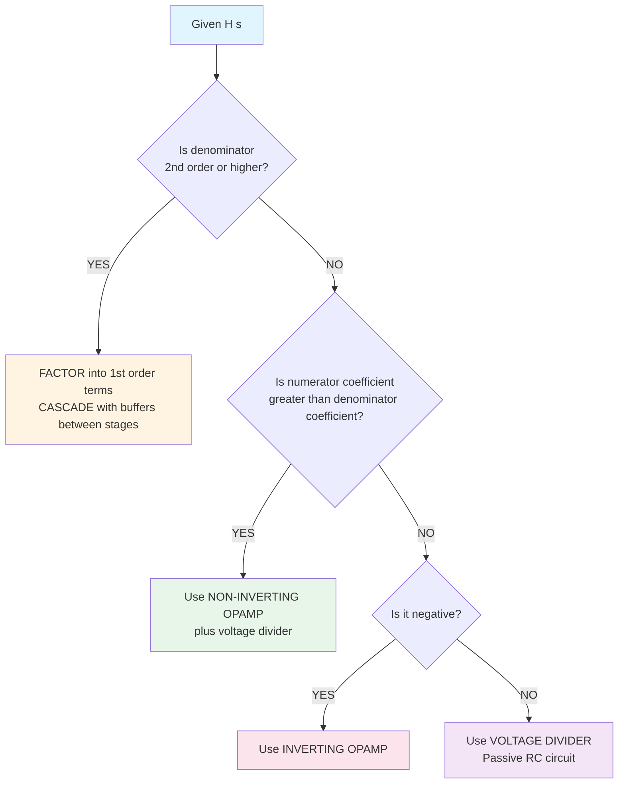

I understand the high level theory of ZSR and ZIR, and i understand the high level theory of the netowkr functions, and differential equations and laplace transforms, but really only what they are and how they are used, not exactly practical implementations for practice problems. could you help me understand the math behind everything, I really need to understand how to piece together a network function, then determine if a specific gain is needed, then how to design a circuit around the network function/s and gain requirements... does this make sense? i need the simplest explanations as possible

please make sure to include the equation for gain, and how to convert KCL and or KVL equations in the S domain into the polynomials needed for the numerator and denominator for the network functions. but please also include the equation for gain for H(s) for determining if i need to use an opamp

so how would i setup cascading stages if needed? what would those look like and please start with determining from a given H(s) for if they are needed, then walk through all relevant theory and equations for designing the circtuit, i know people have mentioed Hi(s) or Hii(s), is this relevant?

# Network Design: Practical Math & Step-by-Step Process

## Part 1: Understanding What You're Given - H(s)

### What is H(s)?
H(s) is just a **ratio of polynomials** that describes how your circuit transforms input to output:

$$H(s) = \frac{V_{out}(s)}{V_{in}(s)} = \frac{\text{numerator polynomial}}{\text{denominator polynomial}}$$

**Example:** $H(s) = \frac{1000}{s + 1000}$

---

## Part 2: The Math You MUST Know

### Component Impedances (s-domain)
Think of impedance as "resistance in the s-domain":

| Component | Impedance Z(s) | When you see this in H(s)... |
|-----------|---------------|------------------------------|
| Resistor R | $R$ | Just a number (like 1000) |
| Capacitor C | $\frac{1}{sC}$ | Terms with $\frac{1}{s}$ or $\frac{\text{number}}{s}$ |
| Inductor L | $sL$ | Terms with $s$ multiplied by a number |

### Voltage Divider Formula (THE MOST IMPORTANT)
When you have two impedances in series, the output voltage is:

$H(s) = \frac{Z_{bottom}}{Z_{top} + Z_{bottom}}$

**This is the foundation of most passive designs.**

### OpAmp Gain Formulas

**Non-Inverting Amplifier:**

$\text{Gain} = K = 1 + \frac{R_f}{R_g}$

where $R_f$ = feedback resistor, $R_g$ = ground resistor

**Inverting Amplifier:**

$H(s) = -\frac{Z_f}{Z_{in}}$

where $Z_f$ = feedback impedance, $Z_{in}$ = input impedance

---

## Part 2B: Converting Circuit Equations to H(s)

### From KCL/KVL to Network Function

**The Process:**

1. Write KCL or KVL equations in the **s-domain** (replace components with impedances)
2. Solve for $V_{out}(s)$ in terms of $V_{in}(s)$
3. Form the ratio $H(s) = \frac{V_{out}(s)}{V_{in}(s)}$
4. Simplify to get polynomial form

### Example: RC Circuit with KCL

**Given:** RC low-pass filter, find H(s)

**Step 1: Draw the circuit mentally**
- Input: $V_{in}$
- Series resistor R
- Capacitor C to ground
- Output: $V_{out}$ (voltage across capacitor)

**Step 2: Write KCL at the output node**

Current through R = Current through C

$\frac{V_{in}(s) - V_{out}(s)}{R} = sC \cdot V_{out}(s)$

**Step 3: Solve for $V_{out}(s)$**

$V_{in}(s) - V_{out}(s) = sRC \cdot V_{out}(s)$

$V_{in}(s) = V_{out}(s) + sRC \cdot V_{out}(s)$

$V_{in}(s) = V_{out}(s)(1 + sRC)$

$V_{out}(s) = \frac{V_{in}(s)}{1 + sRC}$

**Step 4: Form H(s)**

$H(s) = \frac{V_{out}(s)}{V_{in}(s)} = \frac{1}{1 + sRC}$

**Step 5: Rearrange to standard form**

Multiply top and bottom by $\frac{1}{RC}$:

$H(s) = \frac{1/RC}{s + 1/RC}$

**Now you have:** Numerator = $\frac{1}{RC}$, Denominator = $s + \frac{1}{RC}$

### Example: Using KVL

**Given:** Series RLC circuit

**Step 1: Write KVL around the loop**

$V_{in}(s) = V_R(s) + V_L(s) + V_C(s)$

**Step 2: Express voltages in terms of current I(s)**

$V_{in}(s) = I(s) \cdot R + I(s) \cdot sL + I(s) \cdot \frac{1}{sC}$

**Step 3: Factor out I(s)**

$V_{in}(s) = I(s) \left(R + sL + \frac{1}{sC}\right)$

**Step 4: If output is voltage across capacitor:**

$V_{out}(s) = I(s) \cdot \frac{1}{sC}$

**Step 5: Find I(s) and substitute**

$I(s) = \frac{V_{in}(s)}{R + sL + \frac{1}{sC}}$

$V_{out}(s) = \frac{V_{in}(s)}{sC\left(R + sL + \frac{1}{sC}\right)}$

**Step 6: Simplify to get H(s)**

Multiply numerator and denominator by $sC$:

$H(s) = \frac{1}{s^2LC + sRC + 1}$

### Quick Reference: Equation to Polynomial

**Given any circuit equation, follow these steps:**

1. **Substitute impedances:** Replace all R, L, C with their s-domain impedances
2. **Apply circuit laws:** Use KCL (currents) or KVL (voltages)
3. **Isolate $V_{out}(s)$:** Get all terms with $V_{out}(s)$ on one side
4. **Factor out $V_{out}(s)$:** Group all terms multiplying output
5. **Divide both sides by $V_{in}(s)$:** This gives you H(s)
6. **Clear fractions:** Multiply top and bottom to eliminate complex fractions
7. **Arrange in polynomial form:** $H(s) = \frac{b_ms^m + ... + b_0}{a_ns^n + ... + a_0}$

### Common Forms You'll See

| Circuit Type | H(s) Form | Polynomial Structure |
|--------------|-----------|---------------------|
| RC Lowpass | $\frac{1/RC}{s + 1/RC}$ | Constant over (s + constant) |
| RC Highpass | $\frac{s}{s + 1/RC}$ | s over (s + constant) |
| RLC Series | $\frac{1}{s^2LC + sRC + 1}$ | Constant over (s² + s + constant) |
| OpAmp Integrator | $\frac{-1}{sRC}$ | Constant over s |

---

## Part 3: The Decision Tree - Step by Step

### STEP 1: Compare Numerator to Denominator

**Question:** Is the numerator "fully contained" in the denominator?

#### Example 1: $H(s) = \frac{1000}{s + 1000}$
- Numerator: 1000
- Denominator: s + 1000
- **YES!** The 1000 appears in both → **Voltage divider will work**

#### Example 2: $H(s) = \frac{2000}{s + 1000}$
- Numerator: 2000
- Denominator: s + 1000
- **NO!** The 2000 is bigger than 1000 → **Need gain (OpAmp)**

#### Example 3: $H(s) = \frac{-500}{s + 1000}$
- Negative sign → **Need inverting OpAmp**

---

### STEP 2: Check the DC Gain (CRITICAL FOR DESIGN CHOICE)

**DC Gain** tells you if you need an OpAmp!

Set $s = 0$ in H(s) to find DC gain:

$\text{DC Gain} = H(0) = \frac{\text{constant in numerator}}{\text{constant in denominator}}$

**Or more generally, compare coefficients:**

For $H(s) = \frac{K \cdot (\text{numerator polynomial})}{(\text{denominator polynomial})}$

$\text{Gain} = K = \frac{\text{leading coefficient of numerator}}{\text{leading coefficient of denominator}}$

**Decision Rules:**

- If $|K| > 1$: **Need OpAmp** (voltage divider alone can't amplify)
- If $K < 0$: **Need Inverting OpAmp** (passive circuits can't invert)
- If $0 < K \leq 1$: **Voltage divider works** (passive RC circuit)

**Examples:**

1. $H(s) = \frac{1000}{s + 1000}$ → $H(0) = \frac{1000}{1000} = 1$ ✓ **Voltage divider OK**

2. $H(s) = \frac{2000}{s + 1000}$ → $H(0) = \frac{2000}{1000} = 2$ ✗ **Need gain of 2 (Non-inverting OpAmp)**

3. $H(s) = \frac{-500}{s + 1000}$ → $H(0) = \frac{-500}{1000} = -0.5$ ✗ **Negative! (Inverting OpAmp)**

4. $H(s) = \frac{500}{s + 1000}$ → $H(0) = \frac{500}{1000} = 0.5$ ✓ **Voltage divider OK**

5. $H(s) = \frac{3s}{s + 100}$ → $H(0) = \frac{0}{100} = 0$, but check high frequency: $\lim_{s\to\infty} H(s) = 3$ ✗ **Need gain of 3**

**Alternative Method - Compare ANY matching terms:**

$H(s) = \frac{as + b}{cs + d}$

Gain can be found by: $K = \frac{a}{c}$ (compare s terms) OR $K = \frac{b}{d}$ (compare constants)

---

### STEP 3A: Design with Voltage Divider (No Gain Needed)

**When:** Numerator is "inside" denominator, positive, no extra gain

**Process:**

1. **Rewrite denominator as sum:** 
   $$\text{Denominator} = \text{Numerator} + \text{Other stuff}$$

2. **Match to impedance form:**
   
   $H(s) = \frac{Z_2}{Z_1 + Z_2}$
   
   where $Z_2$ = numerator, $Z_1$ = "other stuff"

3. **Convert to R and C:**
   - Constant terms → Resistors
   - Terms with $\frac{1}{s}$ → Divide by s to get capacitance

#### Example: $H(s) = \frac{1000}{s + 1000}$

**Step 1:** Rewrite denominator
$$s + 1000 = 1000 + s$$

**Step 2:** Match to voltage divider

$H(s) = \frac{1000}{s + 1000} = \frac{Z_2}{Z_1 + Z_2}$

So: $Z_2 = 1000$ and $Z_1 = s$

**Step 3:** Convert to components
- $Z_2 = 1000$ → **R = 1000Ω**
- $Z_1 = s$ → This is tricky! We want $\frac{1}{sC}$, so...
  
**TRICK:** Divide everything by s:

$H(s) = \frac{1000/s}{1 + 1000/s}$

Now:
- $Z_2 = \frac{1000}{s} = \frac{1}{sC}$ → $C = \frac{1}{1000} = 1$ mF
- $Z_1 = 1$ → **R = 1Ω**

**Circuit:** R (1Ω) in series with C (1mF), output taken across C

---

### STEP 3B: Design with Non-Inverting OpAmp (Positive Gain Needed)

**When:** Numerator coefficient is LARGER than denominator, positive

**Process:**

1. **Factor out the gain:**
   
   $H(s) = K \cdot \frac{\text{something}}{s + \text{something}}$

2. **Design voltage divider for the fractional part**

3. **Add non-inverting amplifier with gain K**

#### Example: $H(s) = \frac{2000}{s + 1000}$

**Step 1:** Factor out gain

$H(s) = 2 \cdot \frac{1000}{s + 1000}$

**Step 2:** Design voltage divider for $\frac{1000}{s + 1000}$ (use Step 3A)

**Step 3:** Non-inverting amp gain formula:

$K = 1 + \frac{R_f}{R_g}$

For K = 2:

$2 = 1 + \frac{R_f}{R_g}$

$R_f = R_g$

Choose $R_g = 1$ kΩ, $R_f = 1$ kΩ

---

### STEP 3C: Design with Inverting OpAmp (Negative Gain)

**When:** Negative sign in H(s)

**Process:** Use impedance ratio formula:
$$H(s) = -\frac{Z_f}{Z_{in}}$$

where $Z_f$ = feedback impedance, $Z_{in}$ = input impedance

#### Example: $H(s) = -\frac{1000}{s + 1000}$

**Match to formula:**

$-\frac{Z_f}{Z_{in}} = -\frac{1000}{s + 1000}$

So: $Z_f = 1000$ and $Z_{in} = s + 1000$

**Convert:**
- $Z_f = 1000$ → $R_f = 1000$ Ω
- $Z_{in} = s + 1000$ → $R_{in} + \frac{1}{sC}$

Divide by s: $Z_{in} = 1 + \frac{1000}{s}$
- $R_{in} = 1$ Ω
- $C = \frac{1}{1000}$ F

---

### STEP 4: Second-Order Systems (Overdamped)

**When:** Denominator is 2nd order (has $s^2$ term), real poles

**Strategy:** Factor into two 1st-order systems and **cascade** them

#### Example: $H(s) = \frac{10^6}{(s + 100)(s + 1000)}$

**Step 1:** Factor

$H(s) = \frac{100}{s + 100} \cdot \frac{10000}{s + 1000}$

Wait! That gives us gains > 1. Let's rewrite:

$H(s) = 10 \cdot \frac{100}{s + 100} \cdot \frac{1000}{s + 1000}$

**Step 2:** Design each part:
- First stage: $\frac{100}{s + 100}$ (voltage divider)
- Buffer (voltage follower) to prevent loading
- Second stage: $\frac{1000}{s + 1000}$ (voltage divider)
- Buffer
- Gain stage: Non-inverting amp with gain = 10

---

## Part 4: The Divide-by-s Trick (CRITICAL)

**Why we do it:** To make capacitor impedances obvious

Given: $H(s) = \frac{1000}{s + 1000}$

**Divide numerator and denominator by s:**
$$H(s) = \frac{1000/s}{1 + 1000/s}$$

**Now you can SEE:**
- $\frac{1000}{s}$ looks like $\frac{1}{sC}$ → so $C = \frac{1}{1000}$
- $1$ looks like $R$ → so $R = 1$

---

## Part 5: Quick Reference Decision Chart

---

## Part 6: Common Patterns to Recognize

| H(s) Pattern | What You Need | Circuit Type |
|-------------|---------------|--------------|
| $\frac{a}{s + a}$ | Voltage divider | RC low-pass |
| $\frac{s}{s + a}$ | Voltage divider | RC high-pass |
| $\frac{ka}{s + a}$ where k > 1 | Non-inv amp + divider | Gain + filter |
| $-\frac{a}{s + a}$ | Inverting amp | Active RC |
| $\frac{K}{(s+a)(s+b)}$ | Cascade two stages | Two filters + buffers |

---

## Part 7: The Universal Checklist

Before you start designing:

1. ✓ Factor H(s) completely
2. ✓ Check if gain > 1 or < 0
3. ✓ Prefer capacitors over inductors
4. ✓ Use voltage divider if possible
5. ✓ Add OpAmp only when necessary
6. ✓ For 2nd order: factor and cascade
7. ✓ Always use buffers between cascaded stages

---

## Key Formulas Summary

### Voltage Divider:
$$H(s) = \frac{Z_2}{Z_1 + Z_2}$$

### Non-Inverting Gain:
$$K = 1 + \frac{R_f}{R_g}$$

### Inverting:
$$H(s) = -\frac{Z_f}{Z_{in}}$$

### Cascade:
$$H(s) = H_1(s) \cdot H_2(s) \cdot ... \cdot H_n(s)$$