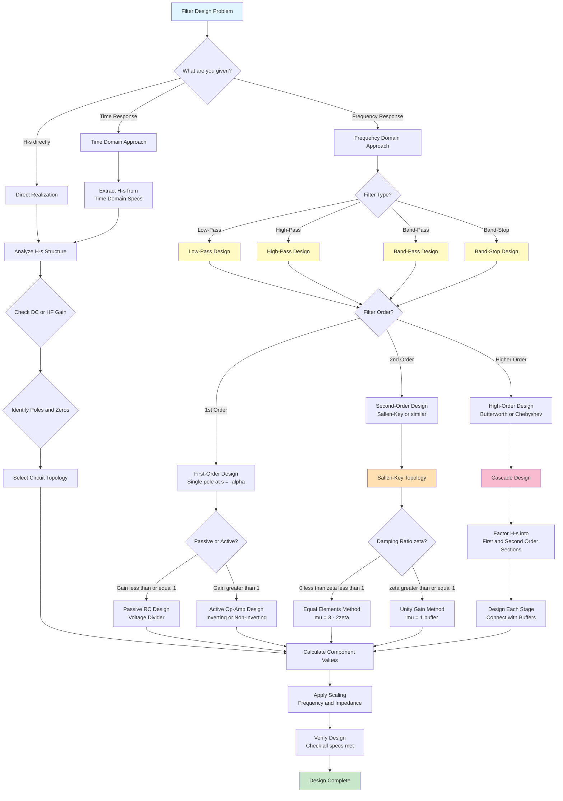

Please help me fill in the gaps for filter design. I want to know every aspect of the high level theory that goes into it and every relevant equation. I don't need example problems, but i would like small, embedded examples using the theory and equations such as "so a gain of this would relate to needing this" does this make sense? Please expclude the following mermaid graph from the markdown document. Be aware when you use codeblocks as they might break the document.





# Complete Filter Design Theory and Equations

## 1. Filter Fundamentals

### Filter Classification by Frequency Response

**Low-Pass Filter (LPF):**
- Passes low frequencies, attenuates high frequencies
- **H(s) Form:** $H(s) = \frac{K\omega_c}{s + \omega_c}$ (1st order) or $H(s) = \frac{K\omega_0^2}{s^2 + 2\zeta\omega_0 s + \omega_0^2}$ (2nd order)
- **DC Gain:** $H(0) = K$
- **High-Frequency Roll-off:** -20 dB/decade per pole

**High-Pass Filter (HPF):**
- Passes high frequencies, attenuates low frequencies  
- **H(s) Form:** $H(s) = \frac{Ks}{s + \omega_c}$ (1st order) or $H(s) = \frac{Ks^2}{s^2 + 2\zeta\omega_0 s + \omega_0^2}$ (2nd order)
- **DC Gain:** $H(0) = 0$
- **Low-Frequency Roll-off:** +20 dB/decade per zero at origin

**Band-Pass Filter (BPF):**
- Passes a specific frequency band
- **H(s) Form:** $H(s) = \frac{K(2\zeta\omega_0)s}{s^2 + 2\zeta\omega_0 s + \omega_0^2}$
- **Center Frequency:** $\omega_0$
- **Bandwidth:** $BW = 2\zeta\omega_0$
- **Quality Factor:** $Q = \frac{\omega_0}{BW} = \frac{1}{2\zeta}$

**Band-Stop Filter (BSF):**
- Attenuates a specific frequency band
- **H(s) Form:** $H(s) = K\frac{s^2 + \omega_0^2}{s^2 + 2\zeta\omega_0 s + \omega_0^2}$

### Key Filter Parameters

**Cutoff Frequency ($\omega_c$ or $f_c$):**
- Frequency where power drops to half (-3 dB point)
- For low-pass: $|H(j\omega_c)| = \frac{|H(0)|}{\sqrt{2}}$
- For high-pass: $|H(j\omega_c)| = \frac{|H(\infty)|}{\sqrt{2}}$

**Passband:**
- Frequency range where signals pass with minimal attenuation
- Defined by ripple specifications

**Stopband:**
- Frequency range where signals are significantly attenuated
- Defined by minimum attenuation required

**Transition Band:**
- Frequency range between passband and stopband
- Steeper transitions require higher filter order

## 2. First-Order Filter Design

### Passive RC Filters

**Low-Pass RC Filter:**
- **Circuit:** Series R, shunt C
- **Transfer Function:** $H(s) = \frac{1}{1 + sRC}$
- **Cutoff Frequency:** $\omega_c = \frac{1}{RC}$
- **DC Gain:** 1
- **Example:** For $f_c = 1$ kHz, choose $R = 1.59$ kΩ and $C = 0.1$ μF

**High-Pass RC Filter:**
- **Circuit:** Series C, shunt R  
- **Transfer Function:** $H(s) = \frac{sRC}{1 + sRC}$
- **Cutoff Frequency:** $\omega_c = \frac{1}{RC}$
- **High-Frequency Gain:** 1

### Active First-Order Filters

**Non-Inverting Low-Pass:**
- **Gain:** $K = 1 + \frac{R_f}{R_g}$
- **Transfer Function:** $H(s) = \frac{K}{1 + sR_fC}$
- **Cutoff Frequency:** $\omega_c = \frac{1}{R_fC}$

**Inverting Low-Pass:**
- **Transfer Function:** $H(s) = -\frac{R_f/R_1}{1 + sR_fC}$
- **DC Gain:** $-\frac{R_f}{R_1}$
- **Cutoff Frequency:** $\omega_c = \frac{1}{R_fC}$

## 3. Second-Order Filter Design

### Standard Second-Order Form

**General Form:**
$$H(s) = \frac{K\omega_0^2}{s^2 + 2\zeta\omega_0 s + \omega_0^2} \quad \text{(Low-Pass)}$$
$$H(s) = \frac{Ks^2}{s^2 + 2\zeta\omega_0 s + \omega_0^2} \quad \text{(High-Pass)}$$
$$H(s) = \frac{K(2\zeta\omega_0)s}{s^2 + 2\zeta\omega_0 s + \omega_0^2} \quad \text{(Band-Pass)}$$

**Key Parameters:**
- $\omega_0$: Undamped natural frequency
- $\zeta$: Damping ratio
- $Q = \frac{1}{2\zeta}$: Quality factor
- $K$: Passband gain

### Sallen-Key Topology

**Low-Pass Configuration:**
```
Vin -- R1 -- C1 -- Vout
         |      |
         C2     R2
         |      |
        GND    GND
         Op-Amp (non-inverting)
```

**Transfer Function:**
$$H(s) = \frac{K}{R_1R_2C_1C_2s^2 + [R_1C_1 + R_2C_1 + R_1C_2(1-K)]s + 1}$$

**Design Equations:**
- $\omega_0 = \frac{1}{\sqrt{R_1R_2C_1C_2}}$
- $Q = \frac{\sqrt{R_1R_2C_1C_2}}{R_1C_1 + R_2C_1 + R_1C_2(1-K)}$

### Sallen-Key Design Methods

**Equal Elements Method:**
- Set $R_1 = R_2 = R$ and $C_1 = C_2 = C$
- **Constraint:** Only works for $0 < \zeta < 1$ ($Q > 0.5$)
- **Design Equations:**
  - $\omega_0 = \frac{1}{RC}$
  - $K = 3 - 2\zeta = 3 - \frac{1}{Q}$
- **Example:** For $\omega_0 = 10^4$ rad/s and $Q = 2$ ($\zeta = 0.25$), choose $R = 10$ kΩ, $C = 0.01$ μF, and $K = 2.5$

**Unity Gain Method:**
- Set Op-Amp gain $K = 1$ (buffer configuration)
- **Advantage:** Works for all $\zeta$ values
- **Design Equations:**
  - Choose $C_1$
  - $C_2 = 4Q^2 C_1 = \zeta^2 C_1$
  - $R_1 = R_2 = \frac{1}{2Q\omega_0 C_1} = \frac{1}{\zeta\omega_0 C_1}$
- **Example:** For $\omega_0 = 10^3$ rad/s and $\zeta = 2$ (overdamped), choose $C_1 = 0.1$ μF, then $C_2 = 0.4$ μF, $R_1 = R_2 = 500$ Ω

### Second-Order Filter Responses

**Butterworth Response (Maximally Flat):**
- Poles equally spaced on left half of unit circle
- $\zeta = \frac{1}{\sqrt{2}} \approx 0.707$ for 2nd order
- $Q = \frac{1}{\sqrt{2}} \approx 0.707$

**Chebyshev Response (Steeper Roll-off):**
- Poles on ellipse, allows passband ripple
- Ripple dB = $10\log_{10}(1 + \epsilon^2)$ where $\epsilon$ determines ripple magnitude
- For 1 dB ripple: $\epsilon = 0.5088$, $\zeta \approx 0.522$

**Bessel Response (Linear Phase):**
- Maximally flat group delay, minimal overshoot in step response
- $\zeta \approx 0.866$ for 2nd order

## 4. High-Order Filter Design

### Filter Approximation Methods

**Butterworth Filters:**
- Maximally flat passband response
- **Magnitude Response:** $|H(j\omega)| = \frac{1}{\sqrt{1 + (\omega/\omega_c)^{2n}}}$
- **Roll-off:** -20n dB/decade
- **Pole Locations:** Equally spaced on circle of radius $\omega_c$ in left half-plane

**Chebyshev Type I Filters:**
- Equiripple in passband, monotonic in stopband
- **Magnitude Response:** $|H(j\omega)| = \frac{1}{\sqrt{1 + \epsilon^2 C_n^2(\omega/\omega_c)}}$
- $C_n$: Chebyshev polynomial of order n
- **Roll-off:** Steeper than Butterworth for same order

**Chebyshev Type II Filters:**
- Monotonic in passband, equiripple in stopband
- Contains zeros on imaginary axis

**Elliptic (Cauer) Filters:**
- Equiripple in both passband and stopband
- Steepest roll-off for given order
- Contains both poles and zeros

### Order Calculation Formulas

**Butterworth Order:**
$$n \geq \frac{\log\left[\left(\frac{10^{A_s/10} - 1}{10^{A_p/10} - 1}\right)\right]}{2\log(\omega_s/\omega_p)}$$

**Chebyshev Order:**
$$n \geq \frac{\cosh^{-1}\left(\sqrt{\frac{10^{A_s/10} - 1}{10^{A_p/10} - 1}}\right)}{\cosh^{-1}(\omega_s/\omega_p)}$$

Where:
- $A_p$ = passband ripple (dB)
- $A_s$ = stopband attenuation (dB)  
- $\omega_p$ = passband edge frequency
- $\omega_s$ = stopband edge frequency

### Cascade Design Approach

**High-Order Realization:**
$$H(s) = H_1(s) \cdot H_2(s) \cdot \cdots \cdot H_k(s)$$

**Section Assignment:**
- Real poles → First-order sections
- Complex conjugate pole pairs → Second-order sections
- **Example:** 5th order filter: one 1st-order + two 2nd-order sections

**Cascading Rules:**
- Use voltage followers (buffers) between stages to prevent loading
- Order sections: Low-Q first, high-Q last (reduces sensitivity)
- Overall gain distributes among sections

## 5. Frequency Transformations

### Low-Pass to High-Pass Transformation

**Substitution:** $s \rightarrow \frac{\omega_0^2}{s}$

**Component Changes:**
- Resistors unchanged
- Capacitors $C$ become inductors $L = \frac{1}{\omega_0^2 C}$
- Inductors $L$ become capacitors $C = \frac{1}{\omega_0^2 L}$

**Active Filter Transformation:**
- For Sallen-Key: Swap resistors and capacitors
- **Example:** Low-pass with series R, shunt C becomes high-pass with series C, shunt R

### Low-Pass to Band-Pass Transformation

**Substitution:** $s \rightarrow \frac{s^2 + \omega_0^2}{BW \cdot s}$

Where:
- $\omega_0 = \sqrt{\omega_1\omega_2}$: Center frequency
- $BW = \omega_2 - \omega_1$: Bandwidth

**Order Doubling:**
- nth order low-pass becomes 2nth order band-pass

### Low-Pass to Band-Stop Transformation

**Substitution:** $s \rightarrow \frac{BW \cdot s}{s^2 + \omega_0^2}$

## 6. Filter Response Characteristics

### Time-Domain Specifications

**Step Response Parameters:**
- Rise time ($t_r$): 10% to 90% of final value
- Overshoot: Percentage exceeding final value
- Settling time ($t_s$): Time to reach and stay within specified error band

**Butterworth Step Response:**
- Moderate overshoot (~8% for 2nd order)
- Good compromise between speed and overshoot

**Chebyshev Step Response:**
- Larger overshoot due to passband ripple
- Faster initial response but longer settling

**Bessel Step Response:**
- Minimal overshoot
- Slowest rise time but best pulse preservation

### Frequency-Domain Specifications

**Magnitude Response:**
- Passband ripple: $\delta_1$ (dB or linear)
- Stopband attenuation: $\delta_2$ (dB)
- Transition ratio: $\omega_s/\omega_p$

**Phase Response:**
- Group delay: $\tau_g(\omega) = -\frac{d\phi}{d\omega}$
- Phase linearity: Constant group delay for minimal distortion

**Bode Plot Asymptotes:**
- Single pole: -20 dB/decade slope, -90° phase shift
- Single zero: +20 dB/decade slope, +90° phase shift
- Complex poles: -40 dB/decade slope, -180° phase shift

## 7. Sensitivity Analysis

### Component Sensitivity

**Sensitivity Definition:**
$$S_x^y = \frac{\partial y/y}{\partial x/x} = \frac{x}{y}\frac{\partial y}{\partial x}$$

**Key Sensitivities:**
- $S_R^{\omega_0}$: Typically 0.5 (for equal R values)
- $S_C^{\omega_0}$: Typically 0.5 (for equal C values)  
- $S_R^Q$, $S_C^Q$: Can be >1 for high-Q filters

**Design Guidelines:**
- Use equal component values where possible
- For high-Q filters, use low-sensitivity topologies
- Prefer capacitor ratios over resistor ratios (better matching)

### Temperature and Aging Effects

**Component Drifts:**
- Resistors: ±100-500 ppm/°C
- Capacitors: Ceramic: high variation, Film: ±50-200 ppm/°C
- Active components: Op-amp gain-bandwidth product variations

**Design for Robustness:**
- Use higher-order filters with lower Q sections
- Include tuning capability for critical applications
- Specify components with tight tolerances and low TC

## 8. Practical Design Considerations

### Op-Amp Selection

**Gain-Bandwidth Product:**
$$GBW \geq 100 \cdot f_c \cdot Q \cdot K$$
- **Example:** For $f_c = 10$ kHz, $Q = 5$, $K = 10$: GBW ≥ 50 MHz

**Slew Rate:**
$$SR \geq 2\pi f_{max} V_{peak}$$
- **Example:** For 20 kHz sine wave at 10V peak: SR ≥ 1.26 V/μs

**Other Considerations:**
- Input impedance (affects loading)
- Output current capability
- Noise performance
- Power supply requirements

### Component Selection

**Resistor Values:**
- Practical range: 1 kΩ to 1 MΩ
- Avoid very low values (high current)
- Avoid very high values (noise, parasitic effects)

**Capacitor Values:**
- Practical range: 100 pF to 10 μF
- Prefer film capacitors for precision applications
- Consider temperature coefficients and aging

**Inductor Usage:**
- Generally avoided in active filters
- Used in high-frequency or high-power applications
- Issues: Size, cost, non-ideal behavior

### Scaling Techniques

**Frequency Scaling:**
- Multiply all capacitors by $k_f$: $C_{new} = C/k_f$
- Multiply all inductors by $k_f$: $L_{new} = L/k_f$
- **Effect:** $\omega_{0,new} = k_f \omega_0$

**Impedance Scaling:**
- Multiply all resistors by $k_z$: $R_{new} = k_z R$
- Divide all capacitors by $k_z$: $C_{new} = C/k_z$
- Multiply all inductors by $k_z$: $L_{new} = k_z L$
- **Effect:** $H(s)$ unchanged

**Example Scaling:**
Original: $R = 1$ kΩ, $C = 1$ μF, $f_c = 159$ Hz
Frequency scale to $f_c = 1.59$ kHz ($k_f = 10$): $C = 0.1$ μF
Impedance scale to $R = 10$ kΩ ($k_z = 10$): $C = 0.01$ μF

## 9. Advanced Filter Topologies

### Multiple Feedback (MFB) Filters

**Advantages:**
- Better sensitivity than Sallen-Key for high-Q
- Inverting configuration

**Disadvantages:**
- Component spread can be large
- More difficult to tune

### State-Variable Filters

**Features:**
- Simultaneous LP, HP, BP outputs
- Independent tuning of $\omega_0$ and Q
- Low sensitivity

**Implementation:**
- Two integrators and summing amplifier
- More components but superior performance

### Biquadratic (Biquad) Filters

**General Form:**
$$H(s) = \frac{As^2 + Bs + C}{s^2 + 2\zeta\omega_0 s + \omega_0^2}$$

**Advantages:**
- Can realize any 2nd-order transfer function
- Low sensitivity
- Independent parameter control

## 10. Filter Implementation Guidelines

### Design Procedure Summary

1. **Specify Requirements:**
   - Filter type (LP, HP, BP, BS)
   - Passband and stopband frequencies
   - Passband ripple and stopband attenuation
   - Phase/group delay requirements (if any)

2. **Select Approximation:**
   - Butterworth: Maximally flat magnitude
   - Chebyshev: Steeper roll-off, allowable ripple
   - Bessel: Linear phase, minimal overshoot
   - Elliptic: Sharpest transition

3. **Determine Filter Order:**
   - Use order calculation formulas
   - Consider implementation complexity vs. performance

4. **Choose Circuit Topology:**
   - 1st order: Simple RC or active
   - 2nd order: Sallen-Key, MFB, state-variable
   - High order: Cascade design

5. **Calculate Component Values:**
   - Use design equations for chosen topology
   - Consider practical value availability

6. **Apply Scaling:**
   - Frequency scaling to desired cutoff
   - Impedance scaling to practical component values

7. **Verify Design:**
   - Check all specifications are met
   - Evaluate sensitivity and robustness
   - Consider manufacturing tolerances

### Troubleshooting Common Issues

**Oscillation:**
- Check op-amp stability (phase margin)
- Reduce Q or add compensation
- Ensure proper power supply decoupling

**Excessive Noise:**
- Use lower resistor values
- Select low-noise op-amps
- Add filtering at input/output

**Frequency Response Errors:**
- Verify component values and tolerances
- Check for parasitic capacitances
- Consider op-amp bandwidth limitations

This comprehensive filter design theory covers all essential aspects from basic first-order filters to advanced high-order implementations, providing the mathematical foundation and practical insights needed for successful filter design.