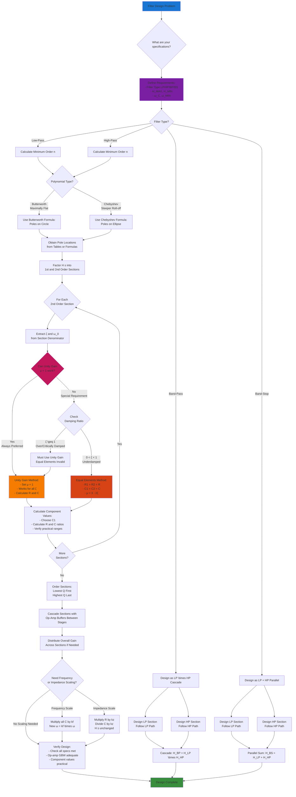

# Filter Design Decision Flow Chart



## Quick Reference: Unity Gain Method (Preferred)

### Why Unity Gain is Preferred
- Works for **all damping ratios** (ζ \geq 0)
- Simplest op-amp configuration (voltage follower)
- Zero sensitivity to gain variations
- Most stable and reliable

### Unity Gain Design Equations

**For Lowpass Sallen-Key:**
- Set μ = 1 (op-amp as buffer)
- Choose C₁ (typically 0.01 to 1 μF)
- Calculate: C₂ = (2ζ)² \times C₁
- Calculate: R₁ = R₂ = 1/(ζω₀C₁)

**For Highpass Sallen-Key:**
- Set μ = 1 (op-amp as buffer)
- Choose R₂ (typically 1k to 100k)
- Calculate: R₁ = (2ζ)² \times R₂
- Calculate: C₁ = C₂ = 1/(ζω₀R₂)

## Order Calculation Formulas

### Butterworth (Maximally Flat)

**Lowpass:**
```
n_B = ⌈ (1/2) \times log[(H_MAX/H_MIN)² - 1] / log(ω_MIN/ω_C) ⌉
```

**Highpass:**
```
n_B = ⌈ (1/2) \times log[(H_MAX/H_MIN)² - 1] / log(ω_C/ω_MIN) ⌉
```

### Chebyshev (Steeper Roll-off)

**Lowpass:**
```
n_C = ⌈ cosh-¹(√[(H_MAX/H_MIN)² - 1]) / cosh-¹(ω_MIN/ω_C) ⌉
```

**Highpass:**
```
n_C = ⌈ cosh-¹(√[(H_MAX/H_MIN)² - 1]) / cosh-¹(ω_C/ω_MIN) ⌉
```

## Key Relationships

| Parameter | Equation | Notes |
|-----------|----------|-------|
| Quality Factor | Q = 1/(2ζ) | Higher Q = more resonance |
| Damping Ratio | ζ = 1/(2Q) | Lower ζ = more peaking |
| Bandwidth | BW = 2ζω₀ = ω₀/Q | 3-dB bandwidth |
| Natural Frequency | ω₀ = 1/√(R₁R₂C₁C₂) | For Sallen-Key |

## Decision Points Summary

1. **Start:** Always begin by defining all specifications clearly
2. **Order Calculation:** Use appropriate formula for filter type and polynomial
3. **Unity Gain Check:** ALWAYS check if unity gain can work first (it usually can)
4. **Equal Elements:** Only use if μ > 1 is required AND 0 < ζ < 1
5. **Section Ordering:** Low Q (high ζ) sections first, high Q (low ζ) last
6. **Scaling:** Apply frequency and impedance scaling to get practical component values

## Common Damping Values

| Response Type | ζ | Q | Characteristics |
|---------------|---|---|-----------------|
| Butterworth | 0.707 | 0.707 | Maximally flat, -3dB at ω₀ |
| Chebyshev 0.5dB | ~0.86 | ~0.58 | Slight ripple, sharp transition |
| Chebyshev 1dB | ~0.52 | ~0.96 | More ripple, sharper transition |
| Bessel | 0.866 | 0.577 | Linear phase, minimal overshoot |
| Critically Damped | 1.0 | 0.5 | No overshoot, fastest settling |