# Comprehensive Poles and Zeros Study Guide

## Part 1: Foundation - ZSR, ZIR, and Network Functions

### Zero-Input Response (ZIR)
The **ZIR** represents what your circuit does based purely on **stored energy**.

- **What it is:** Response with NO external input sources
- **Caused by:** Initial conditions (capacitor voltage V_c(0), inductor current I_L(0))
- **In time domain:** This is the **natural response** - the circuit "ringing" due to stored energy
- **Key insight:** ZIR exists even after you turn off all sources

### Zero-State Response (ZSR)
The **ZSR** represents what your circuit does based purely on **external inputs**.

- **What it is:** Response with NO initial stored energy (all initial conditions = 0)
- **Caused by:** External voltage/current sources
- **Key insight:** ZSR assumes the circuit starts from a "blank slate"

### Total Response = ZIR + ZSR
By **superposition**, the complete circuit response is:
```
Total Response = ZIR + ZSR
```

### Network Functions H(s)
The **network function** is the mathematical DNA of your circuit in the s-domain.

**Definition:**
```
H(s) = Output(s) / Input(s)     [with all initial conditions = 0]
```

**Critical Points:**
- H(s) ONLY describes the ZSR (zero-state response)
- Must set all initial conditions to zero when finding H(s)
- Relates output to input in frequency domain

**Types of Network Functions:**

1. **Transfer Function H(s) or T(s)**
   - Input and output at DIFFERENT ports
   - Example: V_out(s) / V_in(s)

2. **Driving-Point Impedance Z(s)**
   - Measured at SAME port: V(s) / I(s)

3. **Driving-Point Admittance Y(s)**
   - Measured at SAME port: I(s) / V(s)
   - Y(s) = 1/Z(s)

---

## Part 2: What Are Poles and Zeros?

### Network Function as Rational Function
Every network function can be written as:

```
H(s) = N(s) / D(s)
```

Where:
- N(s) = Numerator polynomial
- D(s) = Denominator polynomial

### POLES: The Circuit's Natural Frequencies

**Definition:** Poles are the roots of the denominator: **D(s) = 0**

**Why "poles"?** At these values of s, H(s) → ∞ (the function "blows up")

**What poles tell you:**

1. **In s-domain:** 
   - Locations where H(s) becomes infinite
   - Also called "natural frequencies" or "characteristic roots"

2. **In time domain:**
   - Determine the **natural response** modes
   - Each pole creates an exponential term in the output
   - Real pole at s = -α → term like: k·e^(-αt)
   - Complex poles at s = -α ± jω_d → damped sinusoid: k·e^(-αt)·cos(ω_d·t + φ)

3. **In differential equations:**
   - Poles come from the **OUTPUT side** (left side) of the ODE
   - The characteristic equation D(s) = 0 gives you the poles

4. **Physical meaning:**
   - Poles represent modes that are **always present** in the output
   - Even if your input doesn't contain these frequencies, they'll appear in the response
   - **Special case:** If input frequency = pole frequency, you get resonance (term becomes t·e^(s_0·t))

### ZEROS: The Circuit's Blocking Frequencies

**Definition:** Zeros are the roots of the numerator: **N(s) = 0**

**Why "zeros"?** At these values of s, H(s) = 0 (the function becomes zero)

**What zeros tell you:**

1. **In s-domain:**
   - Locations where H(s) = 0

2. **In time domain:**
   - Determine which frequencies are **blocked** from appearing in output
   - If input contains e^(z_i·t) where z_i is a zero, that term is **completely eliminated** from output

3. **In differential equations:**
   - Zeros come from the **INPUT side** (right side) of the ODE

4. **Physical meaning:**
   - Zeros act as "blockers" - they prevent certain input frequencies from reaching the output
   - Like a notch filter that kills specific frequencies

### Quick Reference Table

| Property | Poles | Zeros |
|----------|-------|-------|
| **Math** | Roots of D(s) = 0 | Roots of N(s) = 0 |
| **H(s) value** | H(s) → ∞ | H(s) = 0 |
| **ODE side** | Output (left) | Input (right) |
| **Time domain** | Always in output | Never in output |
| **Circuit property** | Natural modes | Blocked frequencies |

---

## Part 3: Master Decision Tree - Problem Solving Strategy

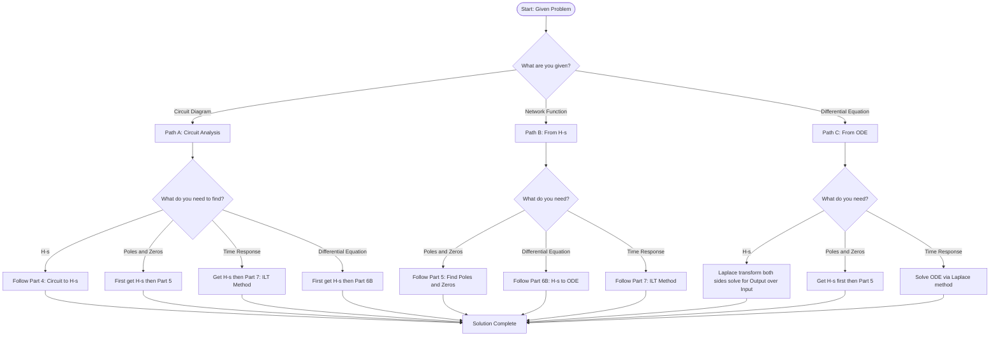

---

## Part 4: Step-by-Step Process to Find H(s) from Circuit

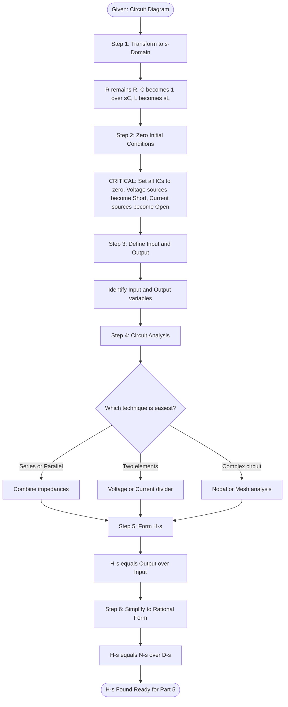

### Process Overview
```
Time-domain circuit → s-domain circuit → H(s) → Poles & Zeros
```

### Detailed Steps

**Step 1: Transform Circuit to s-Domain**

Convert each element to its s-domain impedance:
- **Resistor R** → Z = R
- **Capacitor C** → Z = 1/(sC)
- **Inductor L** → Z = sL

**Step 2: Zero All Initial Conditions**

This is CRITICAL for finding H(s):
- Voltage sources (including initial condition sources) → **short circuits**
- Current sources → **open circuits**
- This ensures H(s) represents only the ZSR

**Step 3: Define Input and Output**

Identify:
- Input variable: V_in(s) or I_in(s)
- Output variable: V_out(s) or I_out(s)

**Step 4: Analyze the s-Domain Circuit**

Use standard resistive circuit techniques:
- Voltage divider
- Current divider
- Nodal analysis (KCL)
- Mesh analysis (KVL)
- Source transformations
- Series/parallel combinations

**Step 5: Form H(s)**

Calculate:
```
H(s) = Output(s) / Input(s)
```

**Step 6: Simplify to Rational Form**

Express as:
```
H(s) = (a_m·s^m + a_(m-1)·s^(m-1) + ... + a_0) / (b_n·s^n + b_(n-1)·s^(n-1) + ... + b_0)
```

Factor if possible to show poles and zeros explicitly:
```
H(s) = K · (s - z_1)(s - z_2)...(s - z_m) / (s - p_1)(s - p_2)...(s - p_n)
```

---

## Part 5: Step-by-Step Process to Find Poles and Zeros

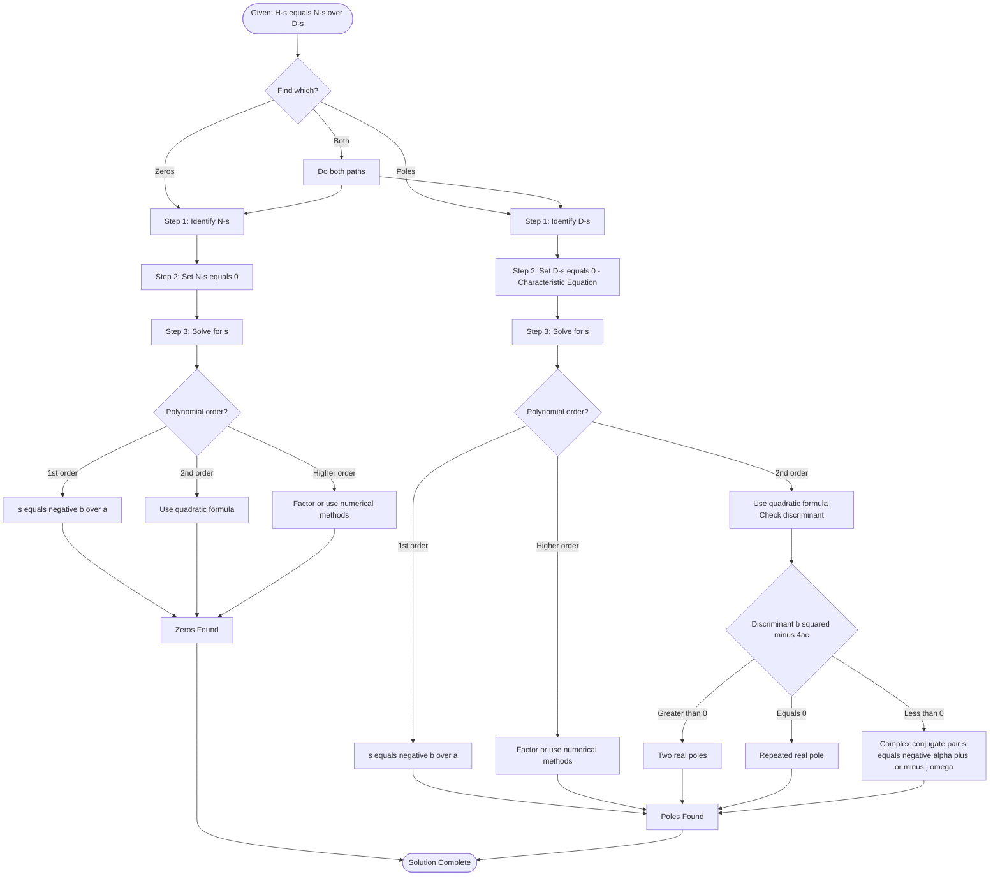

Once you have H(s) = N(s)/D(s):

### Finding Zeros

**Step 1:** Identify the numerator polynomial N(s)

**Step 2:** Set N(s) = 0

**Step 3:** Solve for s
- Factor if possible
- Use quadratic formula for 2nd order
- Use numerical methods for higher orders

**Example:**
```
If N(s) = s² + 3s + 2
Then: s² + 3s + 2 = 0
      (s + 1)(s + 2) = 0
Zeros: s = -1, s = -2
```

### Finding Poles

**Step 1:** Identify the denominator polynomial D(s)

**Step 2:** Set D(s) = 0 (this is the **characteristic equation**)

**Step 3:** Solve for s
- Same techniques as for zeros

**Example:**
```
If D(s) = s² + 4s + 13
Then: s² + 4s + 13 = 0

Using quadratic formula:
s = (-4 ± √(16 - 52)) / 2
s = (-4 ± √(-36)) / 2
s = (-4 ± j6) / 2
s = -2 ± j3

Poles: s = -2 + j3, s = -2 - j3 (complex conjugate pair)
```

### Types of Poles and Their Time-Domain Responses

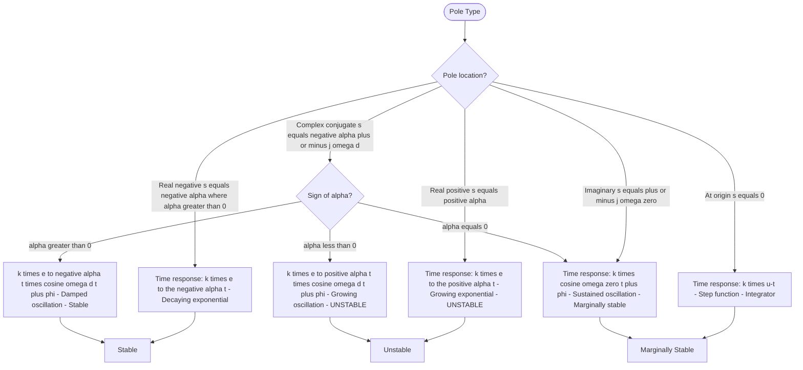

**Key Points:**

1. **Real, negative pole (s = -α, α > 0)**
   - Time response: k·e^(-αt) → decaying exponential
   - Stable

2. **Real, positive pole (s = +α)**
   - Time response: k·e^(+αt) → growing exponential
   - **UNSTABLE**

3. **Complex conjugate pair (s = -α ± jω_d)**
   - Time response: k·e^(-αt)·cos(ω_d·t + φ)
   - Damped oscillation if α > 0
   - Growing oscillation if α < 0 (unstable)

4. **Imaginary poles (s = ±jω_0)**
   - Time response: k·cos(ω_0·t + φ)
   - Sustained oscillation (marginally stable)

5. **Pole at origin (s = 0)**
   - Time response: k·u(t) → step function
   - Indicates integrator in system

---

## Part 6: Creating Differential Equations from Circuits

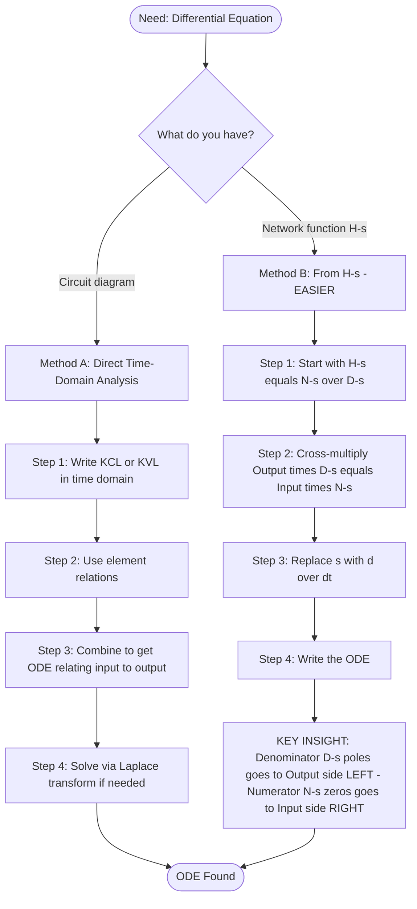

### Method A: Direct Time-Domain Analysis

**Step 1:** Write KCL/KVL equations in time domain

**Step 2:** Use element relationships:
- Resistor: v = R·i
- Capacitor: i = C·(dv/dt) or v = (1/C)·∫i dt
- Inductor: v = L·(di/dt) or i = (1/L)·∫v dt

**Step 3:** Combine to get ODE relating input to output

**Step 4:** Solve via Laplace transform:
- Transform ODE to s-domain
- Solve algebraically
- Inverse transform back

### Method B: From Network Function (EASIER!)

If you already have H(s), you can directly write the ODE:

**Step 1:** Start with H(s) in polynomial form
```
H(s) = V_out(s)/V_in(s) = N(s)/D(s)
```

**Step 2:** Cross-multiply
```
V_out(s)·D(s) = V_in(s)·N(s)
```

**Step 3:** Interpret s as the derivative operator d/dt
- s → d/dt
- s² → d²/dt²
- s³ → d³/dt³, etc.

**Step 4:** Write the ODE

**Example:**
```
Given: H(s) = (2s + 3) / (s² + 5s + 6)

Cross-multiply:
V_out(s)·(s² + 5s + 6) = V_in(s)·(2s + 3)

Replace s with d/dt:
(d²/dt² + 5·d/dt + 6)·v_out(t) = (2·d/dt + 3)·v_in(t)

Final ODE:
d²v_out/dt² + 5·dv_out/dt + 6·v_out = 2·dv_in/dt + 3·v_in
```

**Key Insight:**
- **Denominator coefficients (poles)** → output side (left)
- **Numerator coefficients (zeros)** → input side (right)

---

## Part 7: Time-Domain Response via Inverse Laplace Transform

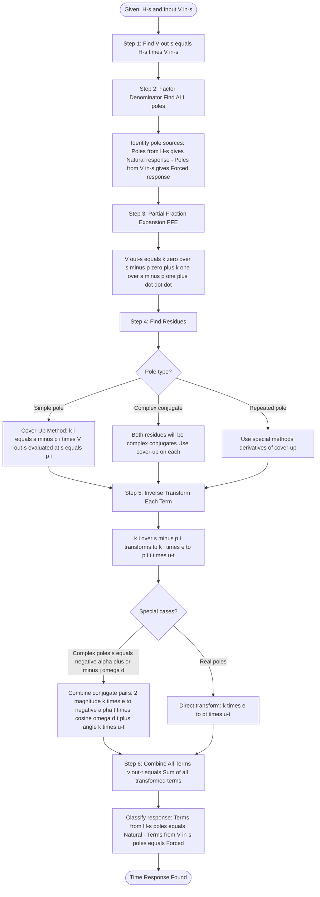

### The Big Picture

When you have:
```
V_out(s) = H(s)·V_in(s)
```

The time response v_out(t) contains TWO types of terms:

1. **Natural Response** → from poles of H(s)
2. **Forced Response** → from poles of V_in(s)

### Step-by-Step ILT Process

**Step 1: Find V_out(s)**
```
V_out(s) = H(s)·V_in(s)
```

**Step 2: Factor the Denominator**

Factor completely to find ALL poles:
- Poles from H(s) → natural response
- Poles from V_in(s) → forced response

**Step 3: Partial Fraction Expansion (PFE)**

Decompose into simple terms:
```
V_out(s) = k_0/(s - p_0) + k_1/(s - p_1) + k_2/(s - p_2) + ...
```

**Step 4: Find Residues Using Cover-Up Method**

For simple pole at s = p_i:
```
k_i = [(s - p_i)·V_out(s)]|_(s=p_i)
```

Cover up the (s - p_i) term in V_out(s), then substitute s = p_i everywhere else.

**Step 5: Inverse Transform**

Each term transforms as:
```
k_i/(s - p_i) → k_i·e^(p_i·t)·u(t)
```

**Step 6: Combine Terms**
```
v_out(t) = k_0·e^(p_0·t) + k_1·e^(p_1·t) + k_2·e^(p_2·t) + ...
           [forced]        [natural response terms]
```

### Special Cases

**Complex Conjugate Poles (s = -α ± jω_d):**

If k and k* are conjugate residues:
```
k/(s - (-α + jω_d)) + k*/(s - (-α - jω_d))
```

Combines to give:
```
2|k|·e^(-αt)·cos(ω_d·t + ∠k)·u(t)
```

**Repeated Poles:**

For pole p_i with multiplicity n, use special techniques (not covered in detail here, but involves derivatives of the cover-up method).

### Understanding Natural vs Forced Response

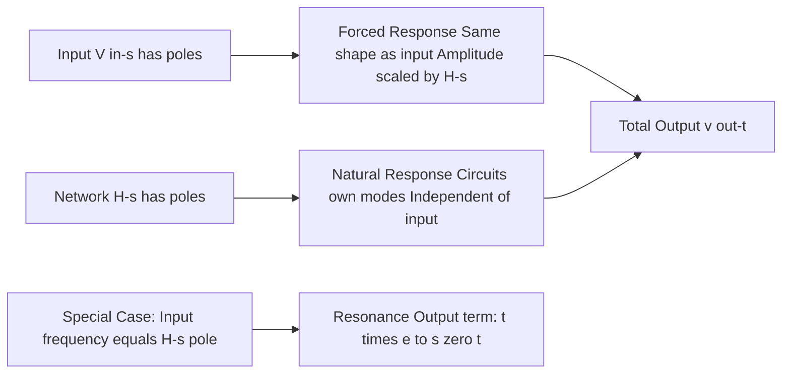

**Forced Response:**
- Comes from input poles
- Has same "shape" as input
- Amplitude scaled by H(s) evaluated at input frequency
- If v_in(t) = K·e^(s_0·t)·u(t), then forced term = K·H(s_0)·e^(s_0·t)

**Natural Response:**
- Comes from H(s) poles
- Independent of input type
- Determined by circuit elements (R, L, C)
- Same modes appear in ZIR (zero-input response)

**Key Insight:** If input frequency matches a pole of H(s), you get **resonance** - the output term becomes t·e^(s_0·t) (grows with time).

---

## Part 8: Common Mistakes to Avoid

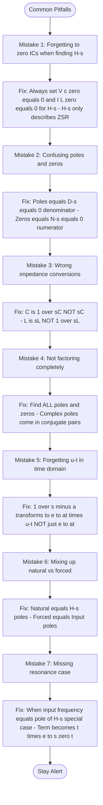

1. **Forgetting to zero initial conditions when finding H(s)**
   - H(s) ONLY represents ZSR
   - Must set V_c(0) = 0 and I_L(0) = 0

2. **Confusing poles and zeros**
   - Poles = denominator roots (D(s) = 0)
   - Zeros = numerator roots (N(s) = 0)

3. **Not factoring completely**
   - Must find ALL poles and zeros
   - Complex poles come in conjugate pairs

4. **Wrong impedance conversions**
   - Capacitor: 1/(sC) not sC
   - Inductor: sL not 1/(sL)

5. **Forgetting unit step u(t) in time domain**
   - ILT of 1/(s-a) is e^(at)·u(t), not just e^(at)

6. **Mixing up which response is which**
   - Natural response = from H(s) poles
   - Forced response = from input poles

7. **Not recognizing resonance**
   - When input frequency = pole of H(s), special case occurs

---

## Part 9: Quick Reference Formulas

### s-Domain Impedances
```
Z_R = R
Z_C = 1/(sC)
Z_L = sL
```

### Network Function
```
H(s) = N(s)/D(s) = Output(s)/Input(s)  [with ICs = 0]
```

### Finding Poles and Zeros
```
Zeros: N(s) = 0
Poles: D(s) = 0  [characteristic equation]
```

### Differential Equation from H(s)
```
If H(s) = N(s)/D(s)
Then: D(d/dt)·y(t) = N(d/dt)·x(t)
```

### Common Laplace Pairs
```
u(t) ↔ 1/s
e^(at)·u(t) ↔ 1/(s-a)
t·e^(at)·u(t) ↔ 1/(s-a)²
cos(ωt)·u(t) ↔ s/(s² + ω²)
sin(ωt)·u(t) ↔ ω/(s² + ω²)
e^(-αt)·cos(ωt)·u(t) ↔ (s+α)/((s+α)² + ω²)
```

### Cover-Up Method (Simple Poles)
```
k_i = [(s - p_i)·V_out(s)]|_(s=p_i)
```

---

## Part 10: Practice Problem Workflow

```mermaid
flowchart TD
    Start([Example: RC Low-Pass Filter - V in to R to C to V out])
    Goal[Goal: Find H-s poles zeros and diff eq]
    S1[Step 1: s-Domain Transform - Z R equals R - Z C equals 1 over sC]
    S2[Step 2: Voltage Divider - H-s equals Z C over Z R plus Z C]
    S3[Step 3: Substitute - H-s equals 1 over sC divided by R plus 1 over sC]
    S4[Step 4: Simplify - Multiply top and bottom by sC]
    Result1[H-s equals 1 over 1 plus sRC equals 1 over RC divided by s plus 1 over RC]
    FindPZ[Find Poles and Zeros]
    Num[Numerator: N-s equals 1 over RC constant]
    Z[No finite zeros cannot equal 0]
    Den[Denominator: D-s equals s plus 1 over RC]
    P[Set s plus 1 over RC equals 0 - Pole: s equals negative 1 over RC]
    PZDone[Pole at s equals negative 1 over RC - No finite zeros]
    DiffEq[Create Differential Equation]
    Cross[Cross-multiply: V out-s times s plus 1 over RC equals V in-s times 1 over RC]
    Replace[Replace s with d over dt]
    ODE[dv out over dt plus v out over RC equals v in over RC]
    TimeResp[Find Time Response to step input: v in equals u-t]
    VinS[V in-s equals 1 over s]
    VoutS[V out-s equals H-s times V in-s equals 1 over RC divided by s plus 1 over RC times 1 over s]
    PFE[Partial Fractions: V out-s equals A over s plus B over s plus 1 over RC]
    CoverUp[Cover-up method: A equals 1 - B equals negative 1]
    ILT[Inverse Laplace: v out-t equals 1 minus e to negative t over RC]
    Final[Final: v out-t equals 1 minus e to negative t over RC times u-t - Natural response: negative e to negative t over RC from H-s pole - Forced response: 1 from input pole at s equals 0]
    Complete([Complete Solution])
    
    Start --> Goal
    Goal --> S1
    S1 --> S2
    S2 --> S3
    S3 --> S4
    S4 --> Result1
    Result1 --> FindPZ
    FindPZ --> Num
    FindPZ --> Den
    Num --> Z
    Den --> P
    Z --> PZDone
    P --> PZDone
    PZDone --> DiffEq
    DiffEq --> Cross
    Cross --> Replace
    Replace --> ODE
    ODE --> TimeResp
    TimeResp --> VinS
    VinS --> VoutS
    VoutS --> PFE
    PFE --> CoverUp
    CoverUp --> ILT
    ILT --> Final
    Final --> Complete
```

**Example Circuit: RC Low-Pass Filter**

Given: Input v_in, output v_out across capacitor, R and C in series.

**Find H(s), poles, zeros, and differential equation:**

**Solution:**

1. **s-domain circuit:**
   - Z_R = R
   - Z_C = 1/(sC)

2. **Voltage divider:**
   ```
   H(s) = V_out(s)/V_in(s) = Z_C/(Z_R + Z_C)
   H(s) = [1/(sC)] / [R + 1/(sC)]
   H(s) = 1 / (1 + sRC)
   H(s) = 1/(RC) / (s + 1/(RC))
   ```

3. **Poles and zeros:**
   ```
   N(s) = 1/(RC) → No finite zeros
   D(s) = s + 1/(RC) = 0
   Pole: s = -1/(RC)
   ```

4. **Differential equation:**
   ```
   Cross-multiply: V_out(s)·(s + 1/(RC)) = V_in(s)·(1/(RC))
   
   Replace s → d/dt:
   (d/dt + 1/(RC))·v_out = (1/(RC))·v_in
   
   dv_out/dt + v_out/(RC) = v_in/(RC)
   ```

5. **Time response to step input (v_in = u(t)):**
   ```
   V_in(s) = 1/s
   V_out(s) = H(s)·V_in(s) = [1/(RC)]/[(s + 1/(RC))·s]
   
   PFE: V_out(s) = 1/s - 1/(s + 1/(RC))
   
   v_out(t) = [1 - e^(-t/(RC))]·u(t)
   ```

---

## Part 11: Quiz Preparation Checklist

```mermaid
flowchart TD
    Start([Quiz Day Preparation])
    C1{Can you do this?}
    T1[Transform R L C to s-domain]
    Study1[Review Part 4]
    C2{Can you do this?}
    T2[Find H-s from circuit using circuit analysis]
    Study2[Review Part 4]
    C3{Can you do this?}
    T3[Find poles: set D-s equals 0 - Find zeros: set N-s equals 0]
    Study3[Review Part 5]
    C4{Can you do this?}
    T4[Write diff eq from H-s by cross-multiplying]
    Study4[Review Part 6]
    C5{Can you do this?}
    T5[Do partial fraction expansion]
    Study5[Review Part 7]
    C6{Can you do this?}
    T6[Use cover-up method for residues]
    Study6[Review Part 7]
    C7{Can you do this?}
    T7[Inverse Laplace transform each term]
    Study7[Review Part 7]
    C8{Do you understand?}
    T8[Distinguish natural vs forced response]
    Study8[Review Part 2 and 7]
    C9{Do you remember?}
    T9[Zero ICs when finding H-s]
    Study9[Review Part 1 and 4]
    C10{Can you recognize?}
    T10[Different pole types and their time responses]
    Study10[Review Part 5]
    Ready[READY FOR QUIZ]
    
    Start --> C1
    C1 -->|Yes| T1
    C1 -->|No| Study1
    T1 --> C2
    C2 -->|Yes| T2
    C2 -->|No| Study2
    T2 --> C3
    C3 -->|Yes| T3
    C3 -->|No| Study3
    T3 --> C4
    C4 -->|Yes| T4
    C4 -->|No| Study4
    T4 --> C5
    C5 -->|Yes| T5
    C5 -->|No| Study5
    T5 --> C6
    C6 -->|Yes| T6
    C6 -->|No| Study6
    T6 --> C7
    C7 -->|Yes| T7
    C7 -->|No| Study7
    T7 --> C8
    C8 -->|Yes| T8
    C8 -->|No| Study8
    T8 --> C9
    C9 -->|Yes| T9
    C9 -->|No| Study9
    T9 --> C10
    C10 -->|Yes| T10
    C10 -->|No| Study10
    T10 --> Ready
    Study1 --> C1
    Study2 --> C2
    Study3 --> C3
    Study4 --> C4
    Study5 --> C5
    Study6 --> C6
    Study7 --> C7
    Study8 --> C8
    Study9 --> C9
    Study10 --> C10
```

### Essential Skills Checklist

**Before the quiz, make sure you can:**

✓ **Transform circuits to s-domain**
- R → R
- C → 1/(sC)
- L → sL

✓ **Find H(s) from circuits**
- Zero all initial conditions first!
- Use voltage/current dividers or nodal/mesh analysis
- Express as rational function N(s)/D(s)

✓ **Find poles and zeros**
- Poles: solve D(s) = 0
- Zeros: solve N(s) = 0
- Use quadratic formula for 2nd order

✓ **Write differential equations from H(s)**
- Cross-multiply: Output(s)·D(s) = Input(s)·N(s)
- Replace s with d/dt
- Poles → output side, Zeros → input side

✓ **Perform partial fraction expansion**
- Factor denominator completely
- Set up PFE with one term per pole
- Use cover-up method for residues

✓ **Inverse Laplace transform**
- k/(s-p) → k·e^(pt)·u(t)
- Handle complex conjugate pairs properly
- Combine to get natural + forced response

✓ **Conceptual understanding**
- H(s) only describes ZSR (zero initial conditions)
- Poles = always in output (natural response)
- Zeros = never in output (blocked frequencies)
- Natural response from H(s) poles
- Forced response from input poles

---

## Part 12: Key Conceptual Questions for Understanding

```mermaid
flowchart TD
    Q1[Q: Why do we zero initial conditions for H-s?]
    A1[A: H-s only describes ZSR zero-state response - ICs would add ZIR component]
    Q2[Q: What is the difference between poles and zeros?]
    A2[A: Poles from D-s equals 0 always in output - Zeros from N-s equals 0 blocked from output]
    Q3[Q: Why do complex poles come in conjugate pairs?]
    A3[A: Real circuits have real coefficients - Complex roots of real polynomials must be conjugate pairs]
    Q4[Q: What does a pole at origin s equals 0 mean?]
    A4[A: Integrator in system - Step response in time domain - DC gain is infinite]
    Q5[Q: What happens when input frequency equals pole of H-s?]
    A5[A: RESONANCE - Output grows as t times e to s zero t - System is driven at natural frequency]
    Q6[Q: How do you identify natural vs forced response?]
    A6[A: Natural from H-s poles - Forced from input poles - Check which pole each term came from]
    Q7[Q: What makes a system unstable?]
    A7[A: Poles in right half-plane positive real part - Leads to growing exponentials]
    Q8[Q: Why is the characteristic equation important?]
    A8[A: D-s equals 0 gives the poles - Poles determine natural response - Same for ZIR and ZSR natural modes]
    
    Q1 --> A1
    Q2 --> A2
    Q3 --> A3
    Q4 --> A4
    Q5 --> A5
    Q6 --> A6
    Q7 --> A7
    Q8 --> A8
```

### Think About These:

1. **Why zero initial conditions for H(s)?**
   - H(s) represents only the ZSR (zero-state response)
   - Initial conditions would add the ZIR component
   - We want the pure input-to-output relationship

2. **What's the physical meaning of a pole?**
   - A natural frequency of the circuit
   - Will appear in output even if not in input
   - Determined by circuit elements (R, L, C values)

3. **What's the physical meaning of a zero?**
   - A frequency that gets blocked/cancelled
   - If input contains this frequency, it won't reach output
   - Like a notch filter

4. **Why do complex poles always come in conjugate pairs?**
   - Real circuits have real-valued components
   - Polynomials with real coefficients have conjugate complex roots
   - Ensures time-domain response is real

5. **What happens at resonance?**
   - Input frequency matches a pole of H(s)
   - Normal exponential becomes t·e^(st)
   - Output grows without bound (in theory)

---

## Part 13: Final Tips for Quiz Success

### Time Management Strategy

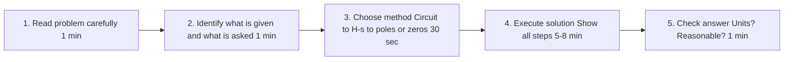

### During the Quiz:

1. **Read carefully** - What's given? What do they want?

2. **Write down knowns** - Circuit values, initial conditions, input type

3. **Choose your path** - Use the decision tree from Part 3

4. **Show all work** - Partial credit is your friend!

5. **Check units** - Does s = -5 rad/s make sense?

6. **Verify stability** - Are poles in left half-plane?

7. **Double-check signs** - Especially negative signs in exponentials

### Common Quiz Question Types:

- **Type 1:** Given circuit → Find H(s)
- **Type 2:** Given H(s) → Find poles/zeros
- **Type 3:** Given circuit + input → Find v_out(t)
- **Type 4:** Given H(s) → Write differential equation
- **Type 5:** Given poles/zeros → Sketch time response

### Quick Mental Checks:

✓ Did I zero initial conditions for H(s)?
✓ Are my impedances correct? (1/sC not sC!)
✓ Did I factor completely?
✓ Does my answer make physical sense?
✓ Did I include u(t) in time-domain?

---

## Part 14: Summary - The Big Picture

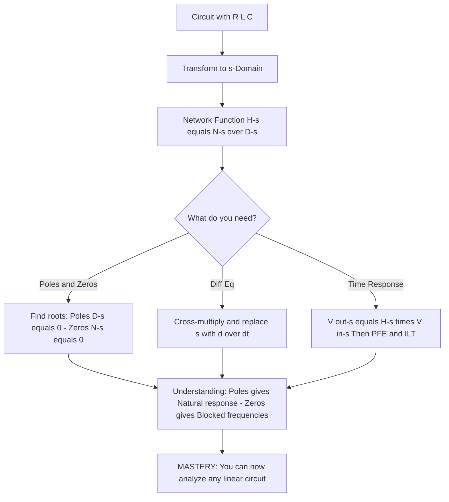

### Remember the Core Concepts:

1. **H(s) = N(s)/D(s)** is the heart of everything
2. **Poles (D(s) = 0)** → Natural modes, always present
3. **Zeros (N(s) = 0)** → Blocked frequencies, never in output
4. **Natural response** comes from H(s) poles
5. **Forced response** comes from input poles
6. **Always zero ICs** when finding H(s)

### The Complete Problem-Solving Framework:

**Path 1: Circuit → H(s) → Poles/Zeros**
1. Transform to s-domain (R, 1/sC, sL)
2. Zero initial conditions
3. Use circuit analysis to find H(s)
4. Find poles: D(s) = 0
5. Find zeros: N(s) = 0

**Path 2: H(s) → Differential Equation**
1. Start with H(s) = N(s)/D(s)
2. Cross-multiply
3. Replace s → d/dt
4. Write ODE (poles on output side, zeros on input side)

**Path 3: Circuit + Input → Time Response**
1. Find H(s) from circuit
2. Calculate V_out(s) = H(s)·V_in(s)
3. Partial fraction expansion
4. Cover-up method for residues
5. Inverse Laplace transform
6. Identify natural vs forced response

### You've Got This! 🎯

This guide covers everything you need. The Mermaid diagrams show you the decision-making process at each step. When you're stuck:
- Look at the master decision tree (Part 3)
- Follow the step-by-step flowcharts
- Check the common mistakes section
- Verify with the quiz preparation checklist

**Practice a few problems using these flowcharts, and you'll be ready!**

**Good luck on your quiz!**