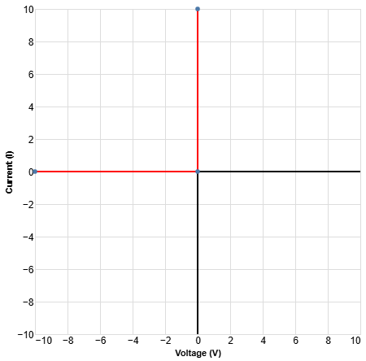

### Diode Fundamentals

* The most common type of diode, typically has a forward voltage $0.6\text{-}0.7\text{V}$, so make this assumption

{ width=0.45\linewidth }

**Following the ideal diode graph**, if you get a positive voltage you must check that your current is not negative, otherwise your guess is wrong. 

* In an ideal diode, if $I_d$ is positive, then the voltage is zero and the diode is on. If $V_d$ is negative and the current is zero, then we say the diode is off.
* If a diode is supposed to be on, check that the current is greater than zero. If the current is 0, it can be either on or off, so you have to check the voltage.
* If you have a current greater than 0, and a voltage greater than 0, then thats fine, because you can't have current flow without voltage. To confirm that a diode is off, you need a negative voltage. If the voltage is positive, then the diode can't be off. 

**Diode Bias** - The triangle points in the direction of the bias of the diode. The anode (positive) must have a greater voltage than the cathode (negative) so that the voltage drop does not go against the diode (current flowing against diode bias). Voltage drop being in the reverse direction of a diode bias will result in the diode being off.

* Positive side of diode is the base of the triangle, negative side is the tip of the triangle. Current only goes through a diode one way, positive to negative. If it goes negative to positive, the current becomes 0 through the diode or current stops. If current flows in the same direction of where the diode is pointing, it is on, otherwise if the current is flowing against the diode, it is off.
* When Would You See 0 V Output?
    * If the diode is reverse biased, so it’s blocking all current
    * If the input voltage is below the forward threshold (e.g. 0.5 V < 0.7 V)

**Zener Diode**
 * A regular diode allows current to flow only in the forward direction and blocks it in reverse, typically used for rectification. A **Zener diode** behaves like a regular diode in forward bias but is designed to conduct in reverse once a specific Zener voltage is reached, making it ideal for voltage regulation and circuit protection.
 * In a basic circuit diagram, the Zener voltage (e.g. 5V, 10V) is typically labeled next to the Zener diode symbol to indicate the voltage at which it will start conducting in reverse bias.
 * When a Zener diode is connected in reverse (cathode to positive), and the voltage across it exceeds the Zener voltage, it clamps the voltage across itself to approximately the Zener voltage, and conducts enough current to maintain that voltage (assuming a current-limiting resistor is present).
    * This only works in reverse bias
    * You must use a current-limiting resistor in series, or the diode can burn out
    * The Zener voltage is not perfectly exact — it may vary slightly (e.g., 5.1 V \pm 5%)

**Voltage Divider** - The larger the resistor, the greater the voltage drop across it. The voltage divider principle applies specifically to components that are part of a single, closed series loop, not to two components in series but on different loops.

**Summary**

1. A pn-junction diode is a two-terminal device
that conducts current easily in one direction 
(from anode to cathode), but not in the opposite 
direction. The volt–ampere characteristic has 
three regions: forward bias, reverse bias, and 
reverse breakdown.
2. The Shockley equation relates current and 
voltage in a pn-junction diode.
3. Nonlinear circuits, such as those containing a 
diode, can be analyzed by using the load-line 
technique.
4. Zener diodes are intended to be operated in the 
reverse-breakdown region as constant-voltage 
references.
5. Voltage regulators are circuits that produce a 
nearly constant output voltage while operating 
from a variable source.
6. The ideal-diode model is a short circuit (on) if 
current flows in the forward direction and an 
open circuit (off) if voltage is applied in the 
reverse direction.
7. In the method of assumed states, we assume 
a state for each diode (on or off), analyze the 
circuit, and check to see if the assumed states 
are consistent with the current directions and 
voltage polarities. This process is repeated until 
a valid set of states is found.
8. In a piecewise-linear model for a nonlinear 
device, the volt–ampere characteristic is 
approximated by straight-line segments. On 
each segment, the device is modeled as a voltage 
source in series with a resistance.
9. Rectifier circuits can be used to charge batteries 
and to convert ac voltages into constant dc 
voltages. Half-wave rectifiers conduct current 
only for one polarity of the ac input, whereas 
full-wave circuits conduct for both polarities.
10. Wave-shaping circuits change the waveform of 
an input signal and deliver the modified wave-form to the output terminals. Clipper circuits 
remove that portion of the input waveform 
above (or below) a given level. Clamp circuits 
add or subtract a dc voltage, so that the positive 
(or negative) peaks have a specified voltage.
11. The small-signal (incremental) equivalent circuit 
of a diode consists of a resistance. The value of 
the resistance depends on the operating point 
(Q point).
12. Dc sources and coupling capacitors are replaced 
by short circuits in small-signal ac equivalent 
circuits. Diodes are replaced with their dynamic 
resistances

---

### Step-by-Step Methodology: Ideal Diode Analysis

The ideal diode model treats the diode as a perfect conductor (short circuit) in the forward direction and an open circuit in the reverse direction, assuming the forward voltage drop and reverse current are negligible.

1. **Assume Diode States:** Assume a state for each diode, either **ON** or **OFF**.
   * For $n$ diodes, consider $2^n$ possible combinations of diode states. Try to guess with your best judgment, considering the source direction.
2. **Replace Diodes:** Redraw the circuit by replacing the assumed diode states with their linear equivalents:
   * **ON** diodes $\rightarrow$ Short circuit ($V_D = 0$).
   * **OFF** diodes $\rightarrow$ Open circuit ($I_D = 0$).
3. **Analyze Circuit:** Analyze the resulting linear circuit using techniques like Kirchhoff's laws and Ohm's law to determine the following for each diode:
   * Current ($I_D$) through the diodes assumed to be **ON**.
   * Voltage ($V_D$) across the diodes assumed to be **OFF**.
4. **Check Constraints:** Check to see if the calculated results are consistent with the assumed state for each diode:
   * For **ON** diodes: Current must flow in the forward direction ($I_D > 0$).
   * For **OFF** diodes: The voltage must be reverse biased ($V_D < 0$), or positive at the cathode.
5. **Validate or Iterate:**
   * If the results are consistent with the assumed states, the analysis is finished.
   * Otherwise, return to step 1 and choose a different combination of diode states.
   * *Note:* In general, you cannot decide on the state of a particular diode until a combination works for all the diodes in the circuit.

---

### Step-by-Step Methodology: Load-Line Method

The load-line analysis technique is a graphical method used to analyze nonlinear circuits, such as those involving diodes or BJT amplifiers.

1. **Simplify the Circuit:** If the circuit contains multiple linear elements connected to the nonlinear device (the load), replace the network external to the nonlinear device with its Thévenin equivalent circuit ($V_{TH}$ and $R_{TH}$).
2. **Apply KVL (Derive Load Line Equation):** Apply Kirchhoff's Voltage Law (KVL) to the simplified circuit loop containing the nonlinear device. This yields a linear equation (the load line equation) relating the device voltage ($v_D$) and device current ($i_D$).
   * *Notable Equation (Example Diode Circuit):* $V_{SS} = R i_D + v_D$
3. **Plot the Load Line:** Plot this linear KVL equation on the same set of axes used for the nonlinear device's experimentally obtained volt–ampere characteristic.
   * Determine two points to plot the straight line:
     * The voltage axis intercept (where $i_D = 0$): $v_D = V_{SS}$
     * The current axis intercept (where $v_D = 0$): $i_D = \frac{V_{SS}}{R}$
4. **Determine the Operating Point (Q-Point):** The **operating point** is the intersection of the load line and the device characteristic curve. This point represents the simultaneous solution of the circuit.
5. **Read Results:** Read the quiescent voltage ($V_{DQ}$) and current ($I_{DQ}$) at the operating point from the plot.

---

### Step-by-Step Methodology: Rectifier Circuits

Rectifiers convert AC power into DC power, forming the basis for electronic power supplies.

1. **Determine Diode Conduction Cycles:** Based on the rectifier configuration (half-wave, full-wave bridge, or center-tapped), determine which diodes conduct current during the positive and negative half-cycles of the AC source voltage, $v_s(t)$
2. **Analyze Forward Bias:** When the source voltage causes a diode to be forward biased:
   * For an **Ideal Diode**: The output voltage across the load ($v_o(t)$) equals the source voltage.
   * For an **Actual Diode**: The output voltage is typically reduced by the forward voltage drop, $V_f \approx 0.7$ V.
3. **Analyze Reverse Bias:** When the source voltage causes the diodes to be reverse biased:
   * For a resistive load, current flow stops, and $v_o(t)$ drops to zero (for half-wave).
4. **Calculate Peak Inverse Voltage (PIV):** Determine the maximum reverse voltage that appears across the non-conducting diodes.
   * For a half-wave rectifier with a resistive load, PIV $= V_m$ (peak source voltage).
   * For a full-wave center-tapped rectifier, PIV $\approx 2 V_m$
5. **Analyze Circuits with Smoothing Capacitors (If Applicable):** If a capacitor ($C$) is placed in parallel with the load to smooth the voltage (reducing ripple $V_r$), calculate the required capacitance or the average load voltage.
   * *Notable Equation (Average Load Voltage with Capacitor):* $V_L \cong V_m - \frac{V_r}{2}$
   * *Notable Equation (Capacitance for Half-Wave Rectifier):* $C \cong \frac{I_L T}{V_r}$
   * *Notable Equation (Capacitance for Full-Wave Rectifier):* $C = \frac{I_L T}{2 V_r}$
     *Where $I_L$ is the average load current, $T$ is the period, and $V_r$ is the peak-to-peak ripple voltage.*

---

### Step-by-Step Methodology: Clipper Circuits

Clipper circuits are wave-shaping circuits that limit the output waveform by removing the portion of the input voltage that falls above or below a specified level.

**For Output Waveform Analysis:**

1. **Identify Amplitude and Frequency for initial output wave form**
    * Chart basic wave form using full amplitude and frequency from original function
2. **Identify Clipping Levels (Breakpoints):** Determine the critical input voltage levels ($V_{in}$) where the diodes change state (turn ON, OFF, or enter Zener breakdown).
   * Account for the diode forward voltage drop (e.g., $0.6$ V or $0.7$ V) or the Zener breakdown voltage ($V_Z$).
3. **Define Operating Regions:** Analyze the circuit across different ranges of $V_{in}$ corresponding to the possible combinations of diode states.
   * Typically, analyze the negative cycle and positive cycle of $V_{in}$ separately.
4. **Analyze Linear Regions:** For each defined operating region, treat the diodes as linear elements (short circuit, open circuit, or voltage source/resistor combination, depending on the diode model used).
5. **Calculate Output Voltage ($V_{out}$):** Use KVL, KCL, and Ohm's law to determine the relationship between $V_{out}$ and $V_{in}$ for each region.
   * In regions where diodes are OFF, the slope of the transfer characteristic ($V_{out}$ vs. $V_{in}$) is often 1, meaning $V_{out} = V_{in}$
   * In regions where diodes are ON (clipping), $V_{out}$ is generally limited to a constant voltage determined by the limiting elements (batteries, Zener diodes, and forward drops).
6. **Sketch Results:** Sketch the transfer characteristics ($V_{out}$ versus $V_{in}$) or the output waveform ($v_o(t)$) for a given input waveform $v_{in}(t)$

**For Transfer Characteristic Analysis:**

1. **Set Up Axes:** Plot $V_{out}$ vs $V_{in}$ with appropriate scales
2. **Find Breakpoints:** Identify critical voltages where diodes change state
3. **Determine Slopes:** 
   * Slope = 1 when no diodes are conducting (output follows input)
   * Slope = 0 when diodes are clipping (output is constant)
4. **Draw Piecewise Linear Segments:** Connect breakpoints with appropriate slopes
5. **Verify Consistency:** Check that diode states match the calculated voltages and currents

---

### Step-by-Step Methodology: Clamp Circuits

Clamp circuits add a DC component to an AC input waveform so that the positive or negative peaks are forced to take a specified value.

1. **Identify Clamping Level:** Determine the voltage to which peaks will be clamped (consider battery voltage and diode forward drop)
2. **Determine Clamping Direction:** 
   * Positive peaks clamped: Diode anode connected to clamping voltage
   * Negative peaks clamped: Diode cathode connected to clamping voltage
3. **Assume Large Capacitance:** Voltage across capacitor remains approximately constant during each cycle
4. **Apply Superposition:** $v_o(t) = v_{in}(t) - V_C$ where $V_C$ is the DC voltage across the capacitor
5. **Find Steady-State Capacitor Voltage:** The capacitor charges to a value that forces the appropriate peak to the clamping level
6. **Sketch Output:** The output waveform is the input shifted vertically by the capacitor voltage

---

### Additional Key Formulas and Concepts

**Peak Inverse Voltage (PIV):**
* Half-wave rectifier with resistive load: PIV = $V_m$
* Half-wave rectifier with smoothing capacitor: PIV \approx $2V_m$
* Full-wave center-tapped rectifier: PIV \approx $2V_m$
* Full-wave bridge rectifier: PIV = $V_m$

**Smoothing Capacitor Design:**
* Average load voltage: $V_L \cong V_m - \frac{V_r}{2}$
* Half-wave rectifier capacitance: $C \cong \frac{I_L T}{V_r}$
* Full-wave rectifier capacitance: $C = \frac{I_L T}{2V_r}$
  * Where $I_L$ = average load current, $T$ = period, $V_r$ = peak-to-peak ripple voltage

**Small-Signal Dynamic Resistance:**
* $r_d = \frac{nV_T}{I_{DQ}}$ where $V_T = 0.026$ V at 300K, $n = 1$ for silicon diodes
* At room temperature for $n = 1$: $r_d = \frac{26 \text{ mV}}{I_{DQ}}$

**Load Line Slope:**
* Slope = $-\frac{1}{R}$ where $R$ is the total series resistance
* Load lines with different source voltages but same resistance are parallel

**Common Exam Mistakes to Avoid:**

1. **Forgetting diode forward voltage drop** - Always account for 0.6-0.7V drop in practical diodes
2. **Wrong PIV calculation** - Remember PIV increases with smoothing capacitors
3. **Incorrect load line intercepts** - Check your math: $i_D = 0 \rightarrow v_D = V_{SS}$, $v_D = 0 \rightarrow i_D = \frac{V_{SS}}{R}$
4. **Assuming wrong diode states** - Must check ALL diodes in circuit for consistency
5. **Transfer characteristic slopes** - Slope = 1 when diodes OFF, Slope = 0 when clipping occurs

**Quick Reference Values:**
* Silicon diode forward drop: 0.6-0.7V
* $V_T$ at room temperature: 26 mV
* Zener voltage tolerance: typically \pm5%

**Circuit Analysis Shortcuts:**

**For Load-Line Method:**
* If one intercept is off the page, pick a convenient point on the visible area
* Load lines with same R are parallel
* Steeper load line (smaller R) → higher operating current

**For Rectifiers:**
* Half-wave: output for half the cycle only
* Full-wave: output for full cycle, requires 2 diodes minimum
* With capacitor: output stays near peak value with small ripple

**For Clippers:**
* Battery + diode in series sets clipping level
* Diode orientation determines which peaks are clipped
* Multiple diodes can create multiple clipping levels

**For Ideal Diode Analysis:**
* Start with most obvious diode states (follow source polarity)
* If ANY diode fails its constraint, try new combination
* For $n$ diodes, maximum $2^n$ combinations possible

**Piecewise-Linear Model Quick Setup:**
* Voltage axis intercept = $V_a$
* Slope = $\frac{1}{R_a}$
* Model: $R_a$ in series with $V_a$ source

---

### Circuit Design from Specifications (Reverse Engineering)

Based on textbook principles for analyzing circuits containing nonlinear elements and wave-shaping circuits.

**Given Transfer Characteristic → Design Clipper Circuit:**
1. **Identify clipping levels** from horizontal segments of the characteristic
2. **Determine slopes** of each segment:
   * Slope = 1: No diodes conducting, $v_o = v_{in}$
   * Slope = 0: Diodes clipping, output held constant
3. **Calculate required battery voltages:** 
   * For clipping at level $V_c$: Battery voltage = $V_c + V_f$ (where $V_f$ = 0.6-0.7V)
   * Account for diode forward voltage drop in all calculations
4. **Determine diode orientations based on clipping direction:**
   * **Upper clipping** (positive peaks removed): Diode anode to output, cathode to positive voltage source
   * **Lower clipping** (negative peaks removed): Diode cathode to output, anode to negative voltage source
5. **Select current-limiting resistor:** Choose $R$ large enough to limit diode current to safe levels (typically few mA), but small enough that reverse leakage current doesn't cause significant voltage drop

**Given Output Waveform → Design Circuit:**
1. **Overlay input and output waveforms** to identify the modification type
2. **Measure critical levels** from waveform plots
3. **Classify the circuit type:**
   * **Clipping**: Portions of waveform removed, creating flat tops/bottoms with sharp transitions
   * **Clamping**: Entire waveform shifted vertically, maintaining original shape but different DC level
   * **Rectification**: AC converted to pulsating DC, with portions of negative cycles removed or inverted
4. **Apply appropriate design methodology** based on classification
5. **Verify design using load-line analysis or assumed states method**

**Given Rectifier Specifications → Design Circuit:**

*Based on textbook rectifier analysis principles:*

1. **Determine rectifier configuration:**
   * **Half-wave**: Simple, 1 diode, but inefficient (conducts only half the time)
   * **Full-wave center-tap**: 2 diodes, requires transformer with center tap, PIV = 2$V_m$
   * **Full-wave bridge**: 4 diodes, no center tap needed, most common, PIV = $V_m$

2. **Calculate peak source voltage required:**
   * For resistive load: $V_m = V_{load(desired)} + V_f$
   * For capacitive filtering: $V_m = V_{load(avg)} + \frac{V_r}{2} + V_f$

3. **Design smoothing capacitor (if required):**
   * **Half-wave**: $C = \frac{I_L T}{V_r}$ where $T$ = full period
   * **Full-wave**: $C = \frac{I_L T}{2V_r}$ where $T$ = full period
   * Choose standard capacitor value \geq calculated value

4. **Select diodes with appropriate PIV rating:**
   * PIV rating must exceed maximum reverse voltage by safety margin
   * **Half-wave with capacitor**: PIV \approx 2$V_m$
   * **Full-wave bridge**: PIV = $V_m$
   * **Full-wave center-tap**: PIV = 2$V_m$

5. **Add current limiting for battery charging applications:**
   * Series resistance to limit peak charging current
   * Consider that current flows only when source > battery voltage

---

### Essential Circuit Patterns to Memorize

**Basic Clipper Configurations:**
* **Upper clipper:** Diode cathode to positive voltage source
* **Lower clipper:** Diode anode to negative voltage source  
* **Dual clipper:** Both upper and lower clippers in same circuit
* **Zener clipper:** Zener diode provides both upper and lower clipping

**Rectifier Configurations:**
* **Half-wave:** 1 diode, simple but inefficient
* **Full-wave center-tap:** 2 diodes, requires center-tapped transformer
* **Full-wave bridge:** 4 diodes, no center-tap needed, most common

**Load Line Construction:**
* **Two-point method:** Find voltage and current intercepts
* **Alternative points:** If intercept is off-page, use $v_D = 2V, i_D = \frac{V_{SS} - 2V}{R}$
* **Multiple loads:** Each different R value creates new load line slope