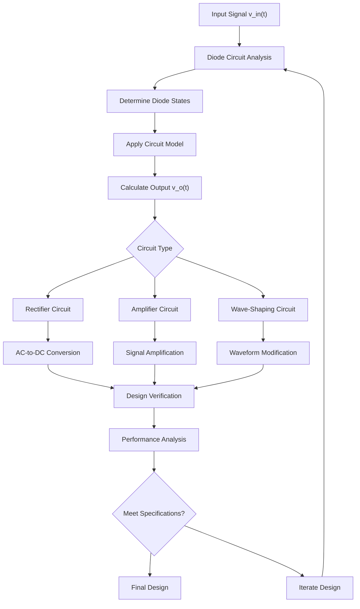

## I. Diode Fundamentals and Models

### Use in the Course

* Analyze nonlinear electronic circuits using simplified models
* Understand forward/reverse bias behavior and switching characteristics
* Design voltage regulation and wave-shaping circuits

### Subtopics to Familiarize

* **Basic Diode Operation:** Anode and cathode terminals, forward-bias region (low resistance), reverse-bias region (high resistance), reverse-breakdown region
* **Shockley Equation:** \(I_D = I_S(e^{V_D/nV_T} - 1)\)
* **Ideal Diode Model:** Perfect switch approximation
* **Piecewise-Linear Models:** Straight-line segment approximations
* **Zener Diodes:** Constant-voltage references in breakdown region

### Diode Models and Equations

#### Ideal Diode Model
\[
\begin{cases}
V_D = 0, & I_D \geq 0 \text{ (ON state)} \\
I_D = 0, & V_D < 0 \text{ (OFF state)}
\end{cases}
\]

#### Piecewise-Linear Model
\[
\begin{cases}
V_D = V_{D0} + r_d I_D, & I_D > 0 \text{ (forward bias)} \\
I_D = 0, & V_D < V_{D0} \text{ (reverse bias)}
\end{cases}
\]

Where \(V_{D0}\) is the forward voltage drop and \(r_d\) is the dynamic resistance.

#### Zener Diode Model
\[
\begin{cases}
V_D = V_Z, & I_D < 0 \text{ and } |V_D| \geq V_Z \\
I_D = 0, & |V_D| < V_Z
\end{cases}
\]

### Step-by-Step Methodology: Ideal Diode Analysis

1. **Assume diode states:** For \(n\) diodes, consider \(2^n\) possible ON/OFF combinations
2. **Replace diodes:** ON → short circuit, OFF → open circuit
3. **Analyze linear circuit:** Calculate \(I_D\) and \(V_D\) for each diode
4. **Check constraints:**
   - ON diodes: \(I_D > 0\)
   - OFF diodes: \(V_D < 0\)
5. **Validate or iterate:** If constraints satisfied, solution found; otherwise try different states

---

## II. Load-Line Analysis

### Use in the Course

* Graphical method for solving nonlinear circuits
* Determine operating points (Q-points) for amplifiers
* Analyze stability and signal swing limitations

### Subtopics to Familiarize

* **Load-line equation:** KVL-derived linear relationship
* **Operating point:** Intersection of load line and device characteristic
* **Q-point stability:** Effect of parameter variations
* **Signal swing analysis:** Maximum undistorted output

### Load-Line Equations

For a circuit with voltage source \(V_{SS}\) and resistance \(R\):

\[V_{SS} = V_D + I_D R\]

**Load line parameters:**
\[
\begin{aligned}
\text{Voltage intercept:} \quad &V_D|_{I_D=0} = V_{SS} \\
\text{Current intercept:} \quad &I_D|_{V_D=0} = \frac{V_{SS}}{R} \\
\text{Slope:} \quad &\frac{dI_D}{dV_D} = -\frac{1}{R}
\end{aligned}
\]

### Step-by-Step Methodology: Load-Line Analysis

1. **Derive KVL equation:** Write voltage equation relating device voltage and current
2. **Identify intercepts:** Find voltage and current intercepts
3. **Plot load line:** Draw line on device characteristic plot
4. **Find Q-point:** Locate intersection of load line and device curve
5. **Analyze operation:** Determine voltage, current, and power at Q-point

---

## III. Amplifier Analysis (BJT/FET)

### Use in the Course

* Design and analyze transistor amplifier circuits
* Separate DC bias analysis from AC small-signal analysis
* Calculate gain, input/output impedance

### Subtopics to Familiarize

* **Operating regions:** Active, saturation, cutoff
* **DC bias analysis:** Large-signal models and Q-point determination
* **Small-signal analysis:** Linear equivalent circuits
* **Amplifier parameters:** Gain (\(A_v\)), input impedance (\(Z_{in}\)), output impedance (\(Z_o\))

### BJT Operating Regions and Models

#### Active Region
\[
\begin{aligned}
I_C &= \beta I_B \\
V_{BE} &= 0.7 \text{ V (typical)} \\
\text{Constraint:} \quad &V_{CE} > 0.2 \text{ V}, \quad I_B > 0
\end{aligned}
\]

#### Small-Signal Parameters
\[
\begin{aligned}
g_m &= \frac{I_C}{V_T} = \frac{I_C}{26 \text{ mV}} \\
r_\pi &= \frac{\beta}{g_m} = \frac{\beta V_T}{I_C}
\end{aligned}
\]

### FET Small-Signal Parameters

\[
\begin{aligned}
g_m &= \frac{\partial I_D}{\partial V_{GS}}\bigg|_{Q} \\
r_d &= \frac{\partial V_{DS}}{\partial I_D}\bigg|_{Q}
\end{aligned}
\]

### Op-Amp Analysis

#### Ideal Op-Amp Constraints
\[
\begin{aligned}
V^+ &= V^- \quad \text{(summing-point constraint)} \\
I^+ &= I^- = 0 \quad \text{(infinite input impedance)}
\end{aligned}
\]

#### Common Configurations
\[
\begin{aligned}
\text{Inverting amplifier:} \quad &A_v = -\frac{R_2}{R_1} \\
\text{Non-inverting amplifier:} \quad &A_v = 1 + \frac{R_2}{R_1}
\end{aligned}
\]

### Step-by-Step Methodology: Transistor Bias Analysis

1. **Assume operating region:** Start with active region for amplifiers
2. **Apply large-signal model:** Use appropriate equations for assumed region
3. **Solve DC circuit:** Calculate \(I_B, I_C, V_{BE}, V_{CE}\)
4. **Check constraints:** Verify region constraints are satisfied
5. **Iterate if necessary:** Try different region if constraints violated

---

## IV. Rectifier Circuits

### Use in the Course

* Convert AC to DC power
* Design power supply circuits
* Analyze ripple and filtering

### Subtopics to Familiarize

* **Half-wave rectifiers:** Single diode, 50% conduction
* **Full-wave rectifiers:** Center-tap and bridge configurations
* **Smoothing capacitors:** Ripple reduction
* **Peak Inverse Voltage (PIV):** Maximum reverse voltage rating

### Rectifier Analysis

#### Half-Wave Rectifier
\[
\begin{aligned}
V_{DC} &= \frac{V_m}{\pi} \\
I_{DC} &= \frac{I_m}{\pi} \\
\text{PIV} &= V_m
\end{aligned}
\]

#### Full-Wave Rectifier
\[
\begin{aligned}
V_{DC} &= \frac{2V_m}{\pi} \\
I_{DC} &= \frac{2I_m}{\pi} \\
\text{PIV} &= 2V_m \text{ (center-tap)}
\end{aligned}
\]

#### Ripple with Capacitive Filter
\[
V_r = \frac{I_{DC}}{fC}
\]

Where \(f\) is the ripple frequency and \(C\) is the filter capacitance.

---

## V. Wave-Shaping Circuits

### Use in the Course

* Design clipper and clamper circuits
* Shape waveforms for signal processing
* Implement voltage limiting and level shifting

### Subtopics to Familiarize

* **Clipper circuits:** Remove portions of waveforms, (Waveform Trimming)
* **Clamper circuits:** Shift DC levels
* **Transfer characteristics:** Input-output relationships
* **Zener clippers:** Precision voltage limiting

### Clipper Circuit Analysis

#### Series Clipper Transfer Function
\[
V_o = \begin{cases}
V_{in} - V_D, & V_{in} > V_{ref} + V_D \\
V_{ref}, & V_{in} \leq V_{ref} + V_D
\end{cases}
\]

#### Parallel Clipper Transfer Function
\[
V_o = \begin{cases}
V_{ref} + V_D, & V_{in} > V_{ref} + V_D \\
V_{in}, & V_{in} \leq V_{ref} + V_D
\end{cases}
\]

### Step-by-Step Methodology: Wave-Shaping Analysis

1. **Identify breakpoints:** Determine input voltages where diodes change state
2. **Analyze regions:** Consider each operating region separately
3. **Apply circuit laws:** Use KVL/KCL for each diode state
4. **Construct transfer characteristic:** Plot \(V_o\) vs \(V_{in}\)
5. **Verify operation:** Check diode states are consistent with assumptions

---

