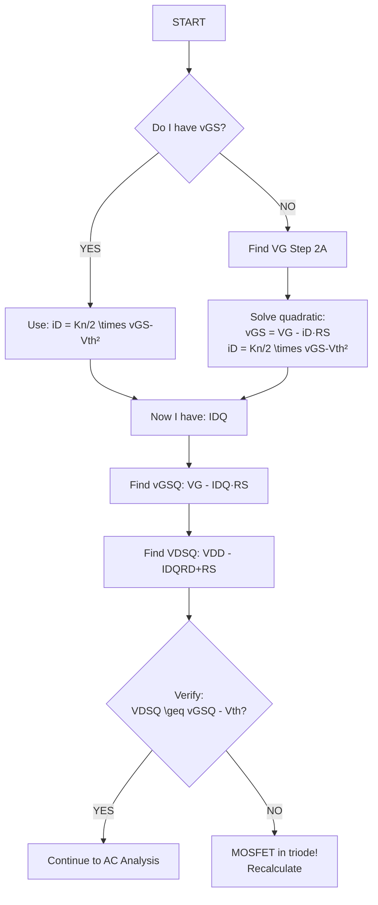
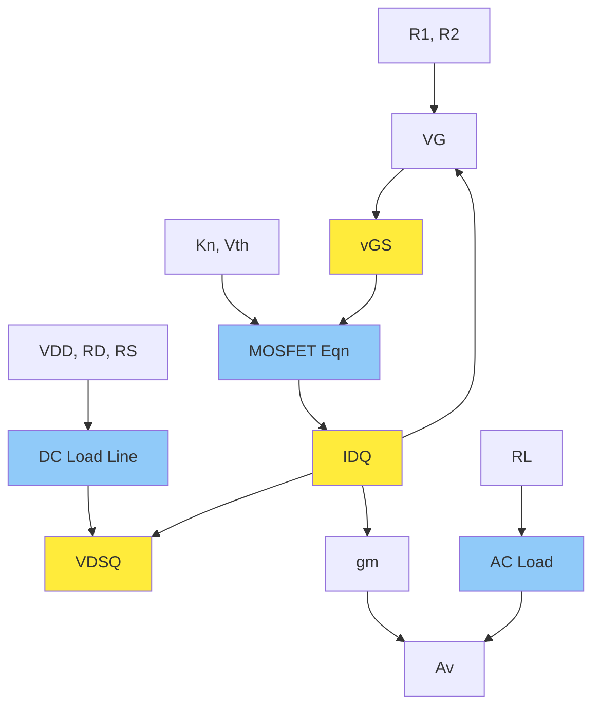

# MOSFET Load Line Analysis - Quick Reference

## Universal Problem-Solving Process

### STEP 1: Identify What You Have & What You Need

**Given Parameters (what you might have):**
- Circuit: VDD, RD, RS, R1, R2, RL
- Device: Kn (or K'n and W/L), Vth, λ
- Operating: vGS, iD, vDS (usually need to find these)

**What You Can Find:**
- Q-point: IDQ, VDSQ, vGSQ
- Load lines: DC and AC
- Small-signal: gm, Av
- Max swing

---

## STEP 2: DC ANALYSIS (Find Q-Point)

### A. Find Gate Voltage (VG)

**Voltage Divider Bias:**
```
VG = VDD \times R2/(R1 + R2)
```

**Fixed Bias:**
```
VG = VGG (given directly)
```

**Self Bias (gate grounded):**
```
VG = 0
```

---

### B. Find Drain Current (IDQ)

**Method 1: If vGS is given**
```
IDQ = (Kn/2)(vGS - Vth)²
```
Done! Go to Step C.

**Method 2: If vGS is NOT given (voltage divider or self-bias)**

Set up two equations:
```
Equation 1: vGS = VG - iD·RS
Equation 2: iD = (Kn/2)(vGS - Vth)²
```

Substitute Equation 1 into Equation 2:
```
iD = (Kn/2)(VG - iD·RS - Vth)²
```

**Quick solve pattern:**
1. Expand the square
2. Collect terms → quadratic equation: AiD² + BiD + C = 0
3. Use quadratic formula
4. Pick the positive, reasonable solution

**Coefficients:**
```
A = (Kn·RS²)/2
B = -[1 + Kn·RS(VG - Vth)]
C = (Kn/2)(VG - Vth)²
```

```
iD = [-B \pm √(B² - 4AC)] / (2A)
```

---

### C. Find Gate-Source Voltage (vGSQ)

**If you just found iD:**
```
vGSQ = VG - IDQ·RS
```

**If vGS was given, you already have it!**

---

### D. Find Drain-Source Voltage (VDSQ)

**KVL around drain-source loop:**
```
VDSQ = VDD - IDQ·RD - IDQ·RS
```

**Simplified:**
```
VDSQ = VDD - IDQ(RD + RS)
```

---

### E. Verify Saturation Region

**Check:**
```
VDSQ \geq (vGSQ - Vth)  ✓ = Saturation (good for amplifiers)
                     ✗ = Triode (recalculate!)
```

---

## STEP 3: DC LOAD LINE (Graphical)

### Two-Point Method

**Point 1 (Cutoff: iD = 0):**
```
vDS = VDD
Coordinates: (VDD, 0)
```

**Point 2 (Saturated: vDS = 0):**
```
iD = VDD/(RD + RS)
Coordinates: (0, VDD/(RD + RS))
```

**Draw:** Straight line between these points

**Equation form:**
```
iD = (VDD - vDS)/(RD + RS)
```

**Plot Q-point:** (VDSQ, IDQ) should lie on this line

---

## STEP 4: AC ANALYSIS (If Needed)

### A. Find AC Load Resistance

**If RS is bypassed by capacitor:**
```
Rac = RD || RL = (RD \times RL)/(RD + RL)
```

**If no external load:**
```
Rac = RD
```

**If RS is NOT bypassed:**
```
Include RS in small-signal analysis (different gain formula)
```

---

### B. AC Load Line (Graphical)

**The AC load line:**
- Passes through Q-point: (VDSQ, IDQ)
- Has slope: -1/Rac
- Steeper than DC load line (if RL < ∞)

**Two-Point Method:**

**Point 1:** Q-point itself (VDSQ, IDQ)

**Point 2:** Choose iD = 0
```
vDS = VDSQ + IDQ \times Rac
Coordinates: (VDSQ + IDQ·Rac, 0)
```

**Alternative Point 2:** Choose vDS = 0
```
iD = IDQ + VDSQ/Rac
Coordinates: (0, IDQ + VDSQ/Rac)
```

**Draw:** Straight line through Q-point with calculated slope

---

### C. Calculate Transconductance (gm)

**Method 1 (from Q-point parameters):**
```
gm = Kn(vGSQ - Vth)
```

**Method 2 (from drain current):**
```
gm = √(2·Kn·IDQ)
```

---

### D. Calculate Voltage Gain (Av)

**Common-source with RS bypassed:**
```
Av = -gm \times Rac = -gm(RD || RL)
```

**Common-source with RS NOT bypassed:**
```
Av = -gm·Rac / (1 + gm·RS)
```

**Note:** Negative sign = 180° phase shift

---

### E. Maximum Output Swing

**From AC Load Line:**

Find distances from Q-point to:
1. **Cutoff boundary (iD = 0):**
   ```
   Δv(cutoff) = |vDS at cutoff - VDSQ|
   ```

2. **Triode boundary (vDS = vGS - Vth):**
   ```
   Δv(triode) = |VDSQ - (vGSQ - Vth)|
   ```

**Maximum swing:**
```
Max swing = min(Δv(cutoff), Δv(triode))
```

**Peak-to-peak swing:**
```
vpp \approx 2 \times (smaller distance)
```

---

## ESSENTIAL FORMULAS - AT A GLANCE

| Need to Find | Formula |
|--------------|---------|
| **Gate voltage** | VG = VDD·R2/(R1+R2) |
| **Drain current** | iD = (Kn/2)(vGS-Vth)² |
| **Drain-source voltage** | vDS = VDD - iD(RD+RS) |
| **DC load line** | iD = (VDD-vDS)/(RD+RS) |
| **AC load resistance** | Rac = RD‖RL |
| **Transconductance** | gm = Kn(vGS-Vth) |
| **Voltage gain** | Av = -gm·Rac |
| **Saturation check** | vDS \geq vGS - Vth |

---

## COMMON PROBLEM TYPES & SHORTCUTS

### Type 1: "Find Q-point given all circuit values"
**Path:** Step 2A → 2B → 2C → 2D → 2E

### Type 2: "Draw DC load line"
**Path:** Step 3 (just need VDD, RD, RS)

### Type 3: "Find voltage gain"
**Path:** Step 2 (get Q-point) → Step 4A → 4C → 4D

### Type 4: "Find maximum output swing"
**Path:** Step 2 (get Q-point) → Step 4B → 4E

### Type 5: "Given iD and vDS, find vGS"
**Reverse:** vGS = Vth + √(2iD/Kn)

---

## TYPICAL GIVEN/FIND SCENARIOS

**Scenario A: Full circuit given, find everything**
- Given: VDD, R1, R2, RD, RS, Kn, Vth
- Find: VG → IDQ → vGSQ → VDSQ → Load lines → gm → Av

**Scenario B: Q-point given, find bias components**
- Given: IDQ, VDSQ, VDD, RD, Kn, Vth
- Find: RS = (VDD-VDSQ)/IDQ - RD
- Find: vGSQ = Vth + √(2IDQ/Kn)
- Find: R1, R2 to achieve VG = vGSQ + IDQ·RS

**Scenario C: Gain specification, find Q-point**
- Given: Av (desired), RL, RD, Kn, Vth
- Find: gm = -Av/(RD‖RL)
- Find: vGS-Vth = gm/Kn
- Design bias for this vGS

---

## FINAL CHECKLIST

Before submitting answer, verify:
- [ ] IDQ is positive and reasonable (typically 0.5-10 mA)
- [ ] VDSQ is between (vGS-Vth) and VDD
- [ ] vGS > Vth (MOSFET is ON)
- [ ] Q-point lies on DC load line
- [ ] AC load line passes through Q-point
- [ ] Gain is negative for common-source
- [ ] Units are correct (mA, V, kΩ)

---

## ONE-PAGE ALGORITHM

1. **Find VG** (from bias network)
2. **Find IDQ** (solve: iD = (Kn/2)(VG-iD·RS-Vth)²)
3. **Find vGSQ** (= VG - IDQ·RS)
4. **Find VDSQ** (= VDD - IDQ(RD+RS))
5. **Check saturation** (VDSQ \geq vGSQ-Vth)
6. **DC load line** (plot (VDD,0) and (0,VDD/(RD+RS)))
7. **Find Rac** (= RD‖RL if RS bypassed)
8. **AC load line** (through Q-point, slope -1/Rac)
9. **Find gm** (= Kn(vGSQ-Vth))
10. **Find Av** (= -gm·Rac)

**Done!**

---

## QUICK DECISION TREE



---

## RELATIONSHIP MAP

