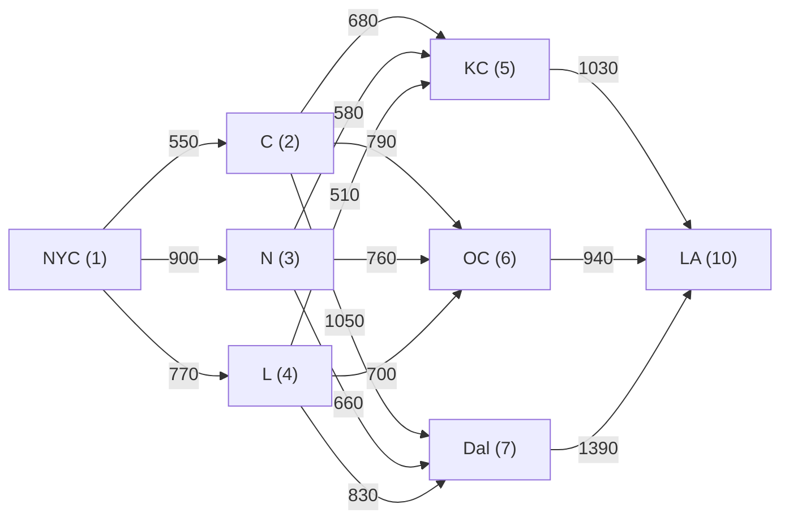
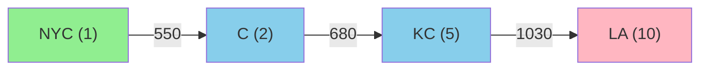

# SYS 304 Test 2 — Collaborative Solutions

---

## Q1 — Trade Study Selection (20 pts)

Chart structure: 4 columns (A, B, C, D), vertical value axis, 4 horizontal threshold lines from top to bottom: Y (up), X (down), Z (up), V (up). Arrows indicate preferred direction (up = higher is better, down = lower is better). Equivalent cost at bottom.

Dot positions read from figure:

    Alt A: X dot above Y | Y dot below Y near it | Z dot between X and Z above Z | V dot below V
    Alt B: Y dot above Y | X dot below X above Z | Z dot below Z above V | V dot below Z above V
    Alt C: Y dot above Y | X dot at/slightly above X | Z dot at/slightly above Z | V dot above V below Z
    Alt D: Y dot at Y | Z dot near X under X above Z | X dot near Z above Z under X | V dot at V

Pass/fail evaluation:

    Criterion   Arrow   A           B           C           D
    Y           up      FAIL        PASS        PASS        PASS (at)
    X           down    FAIL (high) PASS        FAIL (just) PASS
    Z (hard)    up      PASS        FAIL        PASS (just) PASS
    V           up      FAIL        PASS        PASS        PASS (at)

Step 1 — Hard constraint Z: B fails Z (dot below threshold). B is eliminated.

Step 2 — Soft constraint summary for remaining A, C, D:

    A: passes Z only. Fails Y, X, and V (3 of 3 soft constraints fail)
    C: passes Z, Y, V. Borderline fail on X (slightly above X threshold)
    D: passes Z, Y, X, V (all criteria met)

Step 3 — Equivalent cost (main criterion): A has lowest cost, C moderate, D highest.

Selection: C — passes hard constraint Z, meets Y and V, only marginally off on X, and has moderate equivalent cost. A is cheapest but fails all three soft constraints. D passes everything but has the highest equivalent cost.

---

## Q2a — LP Formulation (10 pts)

Decision variables:
    x1 = units of System 1, x2 = units of System 2

Objective:
    Maximize Z = 200*x1 + 350*x2

Constraints:
    3*x1 + 5*x2 <= 25     (Process 1)
    6*x1 + 9*x2 <= 40     (Process 2)
    x1, x2 >= 0

## Q2b — Goal Programming Formulation (15 pts)

Deviation variables:
    d1-, d1+ for profit target
    d2-, d2+ for Process 1 utilization
    d3-, d3+ for Process 2 utilization

Goal constraints:
    200*x1 + 350*x2 + d1- - d1+ = 1500    (profit)
    3*x1 + 5*x2 + d2- - d2+ = 25          (Process 1)
    6*x1 + 9*x2 + d3- - d3+ = 40          (Process 2)

Undesirable deviations:
    d1- (profit shortfall) — undesirable
    d2- (Process 1 idle time) — undesirable
    d3- (Process 2 idle time) — undesirable
    d1+, d2+, d3+ — NOT penalized (overachievement/overtime OK)

Objective:
    Minimize Z = d1- + d2- + d3-

Nonnegativity:
    x1, x2, all d >= 0

---

## Q3 — Dynamic Programming (25 pts)

Network: NYC(1) -> {C(2), N(3), L(4)} -> {KC(5), OC(6), Dal(7)} -> LA(10)

Backward recursion:

Stage 3 (to LA):
    f(KC) = 1030
    f(OC) = 940
    f(Dal) = 1390

Stage 2 (to Stage 3):
    f(C) = min{680+1030, 790+940, 1050+1390} = min{1710, 1730, 2440} = 1710 via KC
    f(N) = min{580+1030, 760+940, 660+1390} = min{1610, 1700, 2050} = 1610 via KC
    f(L) = min{510+1030, 700+940, 830+1390} = min{1540, 1640, 2220} = 1540 via KC

Stage 1 (NYC to Stage 2):
    f(NYC) = min{550+1710, 900+1610, 770+1540} = min{2260, 2510, 2310} = 2260 via C

Optimal path: NYC -> C -> KC -> LA
Total cost: 550 + 680 + 1030 = 2260

---

## Q4 — AHP (30 pts)

Given matrix:

         C1    C2    C3    C4
    C1    1    1/3   1/2    2
    C2    3     1     2     4
    C3    2    1/2    1     3
    C4   1/2   1/4   1/3    1

### Task 1: Interpret the matrix

C2 (Payload) is moderately preferred over C1 (Cost) = 3.
C3 (Endurance) is equally-to-moderately preferred over C1 = 2.
C1 (Cost) is equally-to-moderately preferred over C4 (Integration) = 2.
C2 is equally-to-moderately preferred over C3 = 2.
C2 is moderately-to-strongly preferred over C4 = 4.
C3 is moderately preferred over C4 = 3.

Overall ranking: C2 > C3 > C1 > C4.

### Task 2: Normalized weights and priority weights

Column sums:
    C1: 1 + 3 + 2 + 0.5 = 6.5
    C2: 0.333 + 1 + 0.5 + 0.25 = 2.083
    C3: 0.5 + 2 + 1 + 0.333 = 3.833
    C4: 2 + 4 + 3 + 1 = 10.0

Normalized matrix:
         C1      C2      C3      C4
    C1  0.154   0.160   0.130   0.200
    C2  0.462   0.480   0.522   0.400
    C3  0.308   0.240   0.261   0.300
    C4  0.077   0.120   0.087   0.100

Priority weights (row averages):
    C1 = (0.154 + 0.160 + 0.130 + 0.200) / 4 = 0.161
    C2 = (0.462 + 0.480 + 0.522 + 0.400) / 4 = 0.466
    C3 = (0.308 + 0.240 + 0.261 + 0.300) / 4 = 0.277
    C4 = (0.077 + 0.120 + 0.087 + 0.100) / 4 = 0.096

Sum check: 0.161 + 0.466 + 0.277 + 0.096 = 1.000

### Task 3: Interpret priority weights

C2 (Payload Capacity) = 46.6% — dominant factor
C3 (Endurance) = 27.7% — significant secondary factor
C1 (Cost) = 16.1% — secondary concern
C4 (Ease of Integration) = 9.6% — minor factor

### Task 4: Define Consistency Index

CI = (lambda_max - n) / (n - 1)

where n = matrix size (4) and lambda_max = average of the consistency vector.

Computing lambda_max:
    [A]*[w]:
    C1: 1(0.161) + 0.333(0.466) + 0.5(0.277) + 2(0.096) = 0.647
    C2: 3(0.161) + 1(0.466) + 2(0.277) + 4(0.096) = 1.887
    C3: 2(0.161) + 0.5(0.466) + 1(0.277) + 3(0.096) = 1.120
    C4: 0.5(0.161) + 0.25(0.466) + 0.333(0.277) + 1(0.096) = 0.386

    Consistency vector = [Aw]/[w]:
    4.019, 4.049, 4.043, 4.021

    lambda_max = (4.019 + 4.049 + 4.043 + 4.021) / 4 = 4.033

    CI = (4.033 - 4) / (4 - 1) = 0.033 / 3 = 0.011
    CR = CI / RI = 0.011 / 0.90 = 0.012 < 0.10 — consistent
