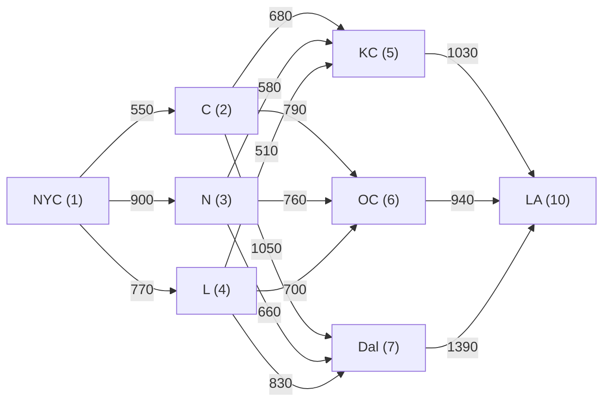
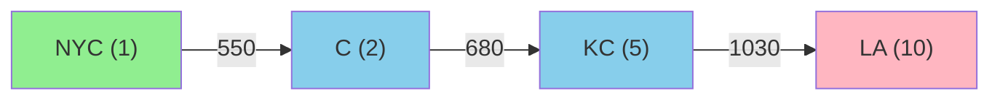

# SYS 304 Test 2 — Solutions

---

## Question 1 (20 points) — Trade Study Selection

The figure is a trade study chart with 4 alternative columns (A, B, C, D) and a vertical performance axis. Four horizontal threshold lines mark the criteria from top to bottom: Y (arrow up — higher is better), X (arrow down — lower is better), Z (arrow up — higher is better, HARD constraint), V (arrow up — higher is better). Equivalent cost is shown at the bottom.

Each alternative has dots at different vertical positions. A dot ABOVE a threshold with an up-arrow means it meets that criterion. A dot BELOW a threshold with a down-arrow means it meets that criterion (lower is better for X).

Dot positions read from the figure:

    Alt A: X dot above Y | Y dot below Y near it | Z dot between X and Z above Z | V dot below V
    Alt B: Y dot above Y | X dot below X above Z | Z dot below Z above V | V dot below Z above V
    Alt C: Y dot above Y | X dot at/slightly above X | Z dot at/slightly above Z | V dot above V below Z
    Alt D: Y dot at Y | Z dot near X under X above Z | X dot near Z above Z under X | V dot at V

Step 1 — Pass/fail evaluation:

    Criterion   Arrow   A           B           C           D
    Y           up      FAIL        PASS        PASS        PASS (at)
    X           down    FAIL (high) PASS        FAIL (just) PASS
    Z (hard)    up      PASS        FAIL        PASS (just) PASS
    V           up      FAIL        PASS        PASS        PASS (at)

Step 2 — Apply hard constraint Z: Alternative B's Z dot is below the Z threshold line, so B fails the hard constraint and is eliminated. Remaining: A, C, D.

Step 3 — Compare soft constraints among survivors:
- A: passes only Z. Fails Y (dot below Y), X (dot far above Y, too high for down-arrow criterion), and V (dot below V). 3 of 3 soft constraints fail.
- C: passes Z, Y, and V. Only borderline fail on X (dot slightly above the X threshold). 2 of 3 soft constraints pass.
- D: passes all four criteria (Z, Y, X, V). 3 of 3 soft constraints pass.

Step 4 — Equivalent cost (main selection criterion): From the figure, A has the lowest equivalent cost, C has moderate cost, D has the highest cost.

Conclusion: We select Alternative C. Although A has the lowest cost, it fails all three soft constraints (Y, X, V), making it a poor overall configuration. D passes every criterion but has the highest equivalent cost, which the problem identifies as the main selection criterion. C provides the best balance — it passes the hard constraint Z, meets the soft constraints Y and V, is only marginally off on X, and has a moderate equivalent cost. C represents the best trade-off between cost and technical performance.

---

## Question 2 (25 points) — LP and Goal Programming

### (a) Linear Programming Formulation

Decision variables:
- x1 = number of System 1 units produced
- x2 = number of System 2 units produced

Objective function (maximize profit):

    Maximize Z = 200*x1 + 350*x2

Subject to:

    3*x1 + 5*x2 <= 25     (Process 1: days available)
    6*x1 + 9*x2 <= 40     (Process 2: days available)
    x1 >= 0, x2 >= 0       (nonnegativity)

### (b) Goal Programming Formulation

We convert from LP to GP. The problem identifies three goals and specifies which deviations are undesirable.

Decision variables: x1, x2 (same as above)

Deviation variables:

    d1_minus, d1_plus: underachievement/overachievement of profit target ($1500)
    d2_minus, d2_plus: underuse/overuse of Process 1 (25 days)
    d3_minus, d3_plus: underuse/overuse of Process 2 (40 days)

Goal constraints (convert inequalities to equalities with deviation variables):

    200*x1 + 350*x2 + d1_minus - d1_plus = 1500    (profit goal)
    3*x1 + 5*x2 + d2_minus - d2_plus = 25          (Process 1 utilization)
    6*x1 + 9*x2 + d3_minus - d3_plus = 40          (Process 2 utilization)

System constraints:

    x1 >= 0, x2 >= 0
    all deviation variables >= 0

Objective function — identify undesirable deviations from the problem statement:

- "concerned about underachievement of profit" -> d1_minus is UNDESIRABLE
- "concerned about idle time for the assembly lines" -> d2_minus and d3_minus are UNDESIRABLE (idle time = underutilization)
- "NOT concerned about overachievement of profit" -> d1_plus is OK (not penalized)
- "NOT concerned about overtime" -> d2_plus and d3_plus are OK (not penalized)

    Minimize Z = P1*d1_minus + P2*(d2_minus + d3_minus)

Where P1 and P2 represent priority weights. If preemptive: minimize d1_minus first, then minimize d2_minus + d3_minus without worsening d1_minus.

Alternatively, if equal priority:

    Minimize Z = d1_minus + d2_minus + d3_minus

---

## Question 3 (25 points) — Dynamic Programming

We find the shortest path from NYC (node 1) to LA (node 10) using backward recursion.

### Network Diagram

### Backward Recursion

Stage 4 (destination):

    f(LA) = 0

Stage 3 — each node can only go to LA:

    f(KC) = 1030 + 0 = 1030, go to LA
    f(OC) = 940 + 0 = 940, go to LA
    f(Dal) = 1390 + 0 = 1390, go to LA

Stage 2 — each node can go to KC, OC, or Dal:

    f(C) = min{ 680+1030, 790+940, 1050+1390 }
         = min{ 1710, 1730, 2440 }
         = 1710, go to KC

    f(N) = min{ 580+1030, 760+940, 660+1390 }
         = min{ 1610, 1700, 2050 }
         = 1610, go to KC

    f(L) = min{ 510+1030, 700+940, 830+1390 }
         = min{ 1540, 1640, 2220 }
         = 1540, go to KC

Stage 1 — NYC can go to C, N, or L:

    f(NYC) = min{ 550+1710, 900+1610, 770+1540 }
           = min{ 2260, 2510, 2310 }
           = 2260, go to C

### Optimal Path

Trace the decisions forward:
- NYC -> C (cost 550)
- C -> KC (cost 680)
- KC -> LA (cost 1030)

Total cost = 550 + 680 + 1030 = 2260

Optimal path: NYC -> C -> KC -> LA, minimum cost = 2260.

---

## Question 4 (30 points) — AHP

We are given the pairwise comparison matrix for criteria:

         C1    C2    C3    C4
    C1    1    1/3   1/2    2
    C2    3     1     2     4
    C3    2    1/2    1     3
    C4   1/2   1/4   1/3    1

### Task 1 (10 pts): Interpret the matrix

The matrix tells us the relative importance of each criterion compared to every other:

- C2 (Payload Capacity) is moderately preferred over C1 (Cost): value 3 in position (C2, C1). This means payload capacity is considered about 3 times more important than cost.
- C3 (Endurance) is equally-to-moderately preferred over C1 (Cost): value 2 in position (C3, C1).
- C1 (Cost) is equally-to-moderately preferred over C4 (Ease of Integration): value 2 in position (C1, C4).
- C2 (Payload Capacity) is equally-to-moderately preferred over C3 (Endurance): value 2 in position (C2, C3).
- C2 (Payload Capacity) is moderately-to-strongly preferred over C4 (Ease of Integration): value 4 in position (C2, C4).
- C3 (Endurance) is moderately preferred over C4 (Ease of Integration): value 3 in position (C3, C4).

Overall ranking of importance from the matrix: C2 > C3 > C1 > C4. Payload Capacity is the most important criterion, followed by Endurance, then Cost, and Ease of Integration is least important.

### Task 2 (10 pts): Compute normalized weights and priority weights

Step 1 — Convert fractions to decimals:

         C1      C2      C3      C4
    C1   1.000   0.333   0.500   2.000
    C2   3.000   1.000   2.000   4.000
    C3   2.000   0.500   1.000   3.000
    C4   0.500   0.250   0.333   1.000

Step 2 — Compute column sums:

    Col C1: 1.000 + 3.000 + 2.000 + 0.500 = 6.500
    Col C2: 0.333 + 1.000 + 0.500 + 0.250 = 2.083
    Col C3: 0.500 + 2.000 + 1.000 + 0.333 = 3.833
    Col C4: 2.000 + 4.000 + 3.000 + 1.000 = 10.000

Step 3 — Normalize (divide each element by its column sum):

         C1      C2      C3      C4
    C1   0.154   0.160   0.130   0.200
    C2   0.462   0.480   0.522   0.400
    C3   0.308   0.240   0.261   0.300
    C4   0.077   0.120   0.087   0.100

Step 4 — Priority weights (row averages):

    w(C1) = (0.154 + 0.160 + 0.130 + 0.200) / 4 = 0.644 / 4 = 0.161
    w(C2) = (0.462 + 0.480 + 0.522 + 0.400) / 4 = 1.864 / 4 = 0.466
    w(C3) = (0.308 + 0.240 + 0.261 + 0.300) / 4 = 1.109 / 4 = 0.277
    w(C4) = (0.077 + 0.120 + 0.087 + 0.100) / 4 = 0.384 / 4 = 0.096

Check: 0.161 + 0.466 + 0.277 + 0.096 = 1.000

Priority weights: C1 = 0.161, C2 = 0.466, C3 = 0.277, C4 = 0.096.

### Task 3 (5 pts): Interpret priority weights

The priority weights tell us the relative importance of each criterion as a fraction of the total:

- C2 (Payload Capacity) has the highest weight at 0.466, meaning it accounts for about 46.6% of the overall decision importance. This is the most critical factor in selecting a drone platform.
- C3 (Endurance) is second at 0.277 (27.7%), making it a significant but secondary factor.
- C1 (Cost) is third at 0.161 (16.1%), indicating cost matters but is less important than capability factors.
- C4 (Ease of Integration) is least important at 0.096 (9.6%), suggesting the team views integration complexity as a minor differentiator.

These weights would be used to compute overall scores for each drone alternative (A, B, C) by multiplying each alternative's evaluation on each criterion by the corresponding weight and summing.

### Task 4 (5 pts): Define Consistency Index

The Consistency Index (CI) measures how logically consistent the pairwise comparisons are. It is defined as:

    CI = (lambda_max - n) / (n - 1)

where:
- n is the number of criteria being compared (here n = 4)
- lambda_max is the largest eigenvalue of the comparison matrix, approximated by averaging the consistency vector

To compute lambda_max:
1. Multiply the original comparison matrix [A] by the priority weight vector [w] to get the weighted sum vector [Aw].
2. Divide each element of [Aw] by the corresponding element of [w] to get the consistency vector.
3. lambda_max = average of the consistency vector.

For a perfectly consistent matrix, lambda_max = n and CI = 0. Larger CI means more inconsistency. The Consistency Ratio CR = CI / RI (where RI is the Random Index for the matrix size; for n=4, RI = 0.90). If CR <= 0.10, the comparisons are acceptably consistent.

Computing CI for our matrix:

    [A]*[w]:
    Row C1: 1(0.161) + 0.333(0.466) + 0.5(0.277) + 2(0.096) = 0.161 + 0.155 + 0.139 + 0.192 = 0.647
    Row C2: 3(0.161) + 1(0.466) + 2(0.277) + 4(0.096) = 0.483 + 0.466 + 0.554 + 0.384 = 1.887
    Row C3: 2(0.161) + 0.5(0.466) + 1(0.277) + 3(0.096) = 0.322 + 0.233 + 0.277 + 0.288 = 1.120
    Row C4: 0.5(0.161) + 0.25(0.466) + 0.333(0.277) + 1(0.096) = 0.081 + 0.117 + 0.092 + 0.096 = 0.386

    Consistency vector = [Aw] / [w]:
    C1: 0.647 / 0.161 = 4.019
    C2: 1.887 / 0.466 = 4.049
    C3: 1.120 / 0.277 = 4.043
    C4: 0.386 / 0.096 = 4.021

    lambda_max = (4.019 + 4.049 + 4.043 + 4.021) / 4 = 16.132 / 4 = 4.033

    CI = (4.033 - 4) / (4 - 1) = 0.033 / 3 = 0.011

    CR = CI / RI = 0.011 / 0.90 = 0.012

CR = 0.012 < 0.10, so the pairwise comparisons are acceptably consistent.
