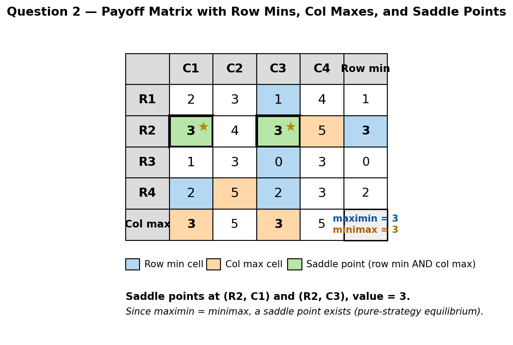
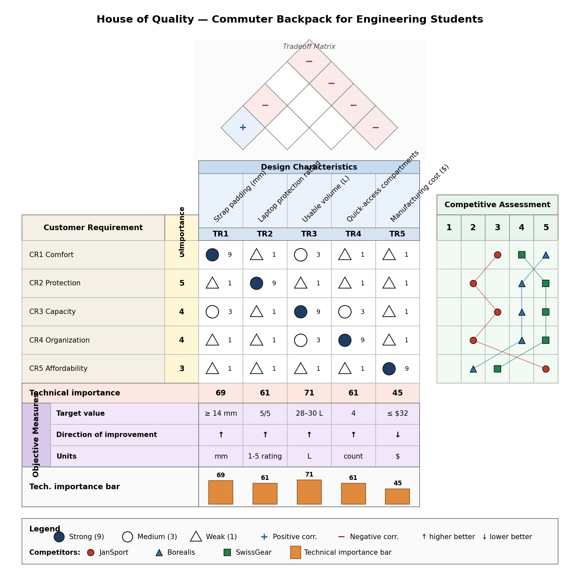
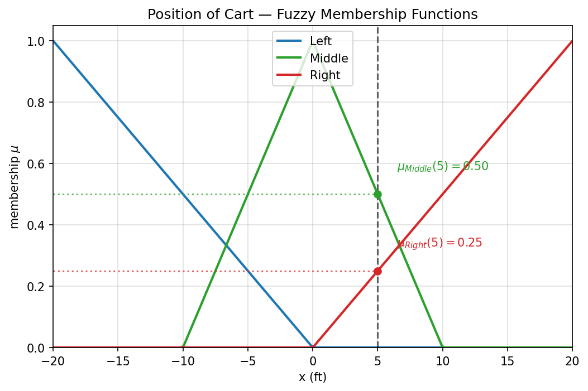
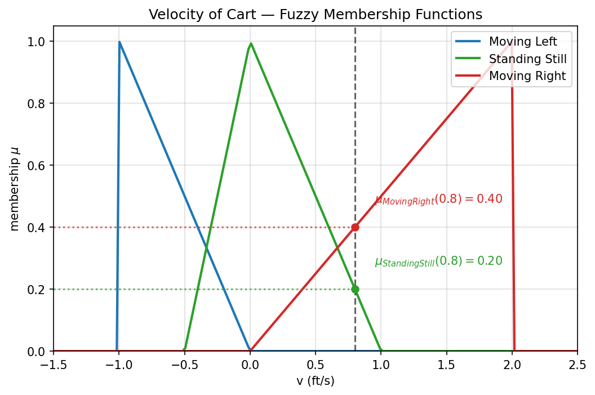
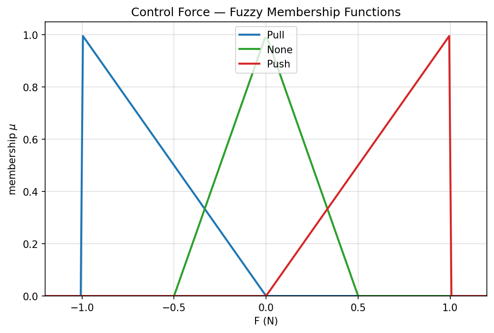
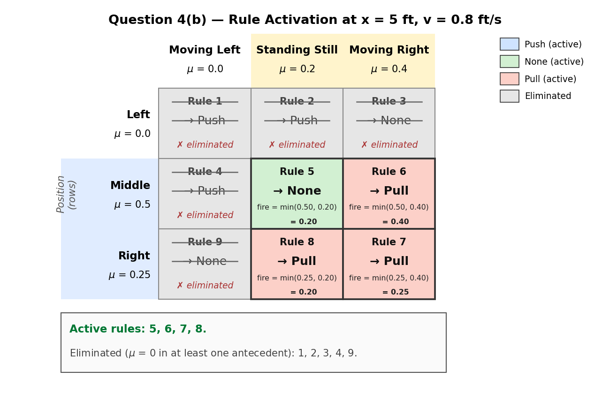
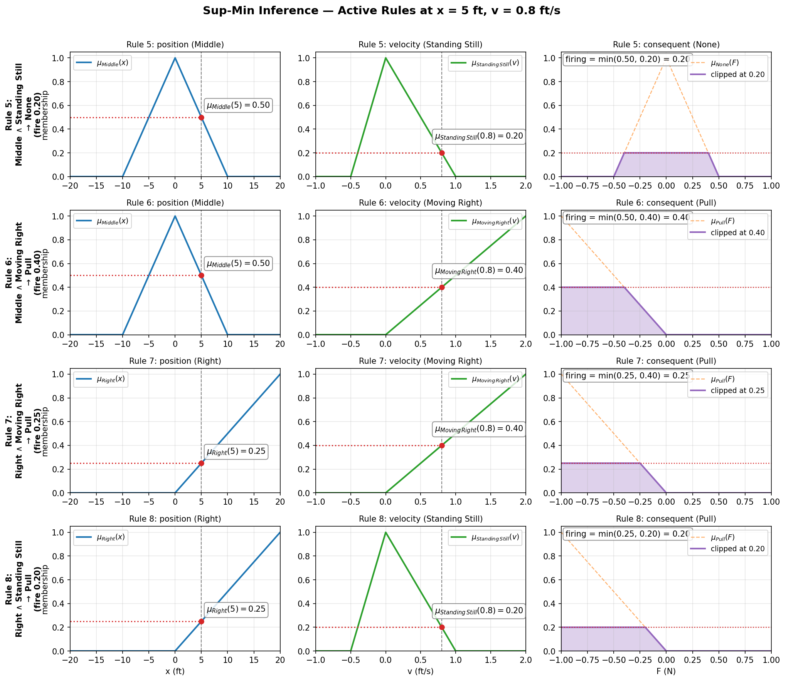
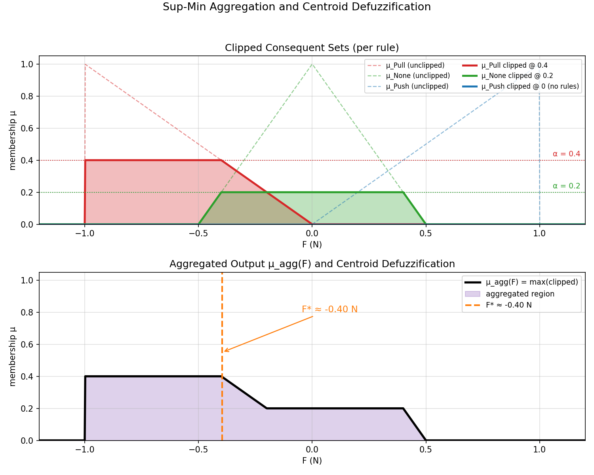
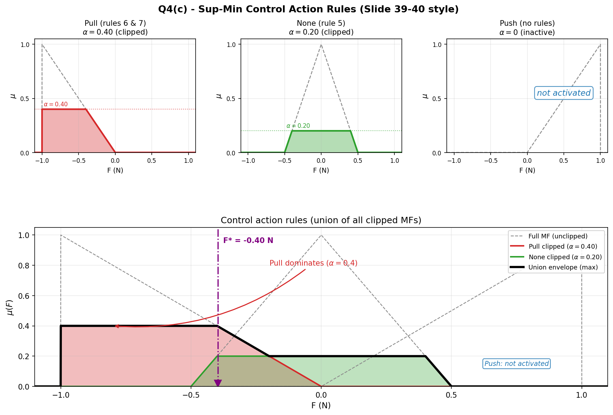

# SYS 304 Exam 3 Solutions

## Question 1 (20 pts): Multiple Choice

### Answer Key

| Item | Answer | Reason |
| --- | --- | --- |
| 1.1 | `B` | In a zero-sum game, one player's gain is exactly the other player's loss. |
| 1.2 | `C` | A dominated strategy is always at least as bad as another strategy for every opponent choice. |
| 1.3 | `C` | Player 1 should maximize the minimum payoff they can guarantee. |
| 1.4 | `C` | No saddle point exists when `maximin < minimax`. |
| 1.5 | `Ambiguous` | The visible numbers compute to `60`, but `60` is not among the answer choices. |
| 1.6 | `C` | The two largest technical importance values are `TR2 = 69` and `TR1 = 57`. |
| 1.7 | `B` | The House of Quality translates customer requirements into technical requirements. |
| 1.8 | `C` | In systems analysis, clients are part of the problem and may misunderstand or hide aspects of it. |
| 1.9 | `B` | Simulation is useful when randomness makes analytical solutions hard or impossible. |

### Note on 1.5

Using the data shown in the exam image:

```text
TR1 = 5*9 + 4*3 + 3*1 = 45 + 12 + 3 = 60
```

That means the mathematically supported result is `60`, but the exam choices are:

- `15`
- `45`
- `54`
- `57`

So the item appears to contain a typo or mismatch. If the instructor expected one of the listed answers anyway, `57` is the likely intended value because Question `1.6` later uses `TR1 = 57`, but that is not what the visible numbers produce.

## Question 2 (25 pts)

Payoff matrix for Player 1:

| Player 1 \\ Player 2 | C1 | C2 | C3 | C4 |
| --- | ---: | ---: | ---: | ---: |
| R1 | 2 | 3 | 1 | 4 |
| R2 | 3 | 4 | 3 | 5 |
| R3 | 1 | 3 | 0 | 3 |
| R4 | 2 | 5 | 2 | 3 |

### (a) Player 1 maximin value and strategy

Take the minimum payoff in each row:

- `R1 -> min(2, 3, 1, 4) = 1`
- `R2 -> min(3, 4, 3, 5) = 3`
- `R3 -> min(1, 3, 0, 3) = 0`
- `R4 -> min(2, 5, 2, 3) = 2`

Now take the maximum of those row minima:

```text
maximin = max(1, 3, 0, 2) = 3
```

So Player 1's maximin strategy is:

```text
R2
```

### (b) Player 2 minimax value and strategy

Take the maximum payoff in each column:

- `C1 -> max(2, 3, 1, 2) = 3`
- `C2 -> max(3, 4, 3, 5) = 5`
- `C3 -> max(1, 3, 0, 2) = 3`
- `C4 -> max(4, 5, 3, 3) = 5`

Now take the minimum of those column maxima:

```text
minimax = min(3, 5, 3, 5) = 3
```

So Player 2's minimax strategy can be either:

```text
C1 or C3
```

### (c) Does a saddle point exist?

Yes.

Because:

```text
maximin = minimax = 3
```

The game has a saddle point with value `3`. The saddle-point cells are:

- `(R2, C1)`
- `(R2, C3)`



## Question 3 (20 pts): Create a QFD Example

### Product Chosen

I will design a commuter backpack for engineering students. This is a good fit for QFD because students care about comfort, laptop protection, capacity, organization, and price, and those needs can be translated into measurable design attributes.

### How This Maps Onto the Worksheet

If I were filling in the blank House of Quality by hand, I would place the information in this order:

1. Far-left customer-requirements block:
- `Comfortable for long walks`
- `Protects laptop and electronics`
- `Holds books, charger, and daily gear`
- `Easy to organize and access quickly`
- `Affordable for students`

2. Importance columns immediately to the right of those customer requirements:
- `5`
- `5`
- `4`
- `4`
- `3`

3. Top design-characteristics row under the roof:
- `TR1` Shoulder-strap padding thickness
- `TR2` Laptop-sleeve protection rating
- `TR3` Internal usable volume
- `TR4` Number of quick-access compartments
- `TR5` Manufacturing cost per unit

4. Roof / tradeoff matrix:
- mark positive links where features help each other
- mark negative links where one feature makes another harder or more expensive to achieve

5. Center relationship matrix:
- fill each customer-requirement / technical-requirement intersection with `9`, `3`, `1`, or blank

6. Right-side competitive assessment:
- compare JanSport Right Pack
- compare The North Face Borealis
- compare SwissGear 1900

7. Bottom objective / target area:
- record measurable targets such as padding thickness, protection rating, usable volume, compartment count, and manufacturing-cost limit

### Customer Requirements

| Customer requirement | Importance (1-5) |
| --- | ---: |
| CR1. Comfortable for long walks | 5 |
| CR2. Protects laptop and electronics | 5 |
| CR3. Holds books, charger, and daily gear | 4 |
| CR4. Easy to organize and access quickly | 4 |
| CR5. Affordable for students | 3 |

### Technical Requirements

| Technical requirement | Direction |
| --- | --- |
| TR1. Shoulder-strap padding thickness (mm) | Higher is better |
| TR2. Laptop-sleeve protection rating (1-5) | Higher is better |
| TR3. Internal usable volume (L) | Higher is better |
| TR4. Number of quick-access compartments | Higher is better |
| TR5. Manufacturing cost per unit ($) | Lower is better |

### Relationship Matrix

Relationship scale: `9 = strong`, `3 = medium`, `1 = weak`, blank = none.

| Customer req. | TR1 | TR2 | TR3 | TR4 | TR5 |
| --- | ---: | ---: | ---: | ---: | ---: |
| CR1 Comfort | 9 | 1 | 3 | 1 | 1 |
| CR2 Protection | 1 | 9 | 1 | 1 | 1 |
| CR3 Capacity | 3 | 1 | 9 | 3 | 1 |
| CR4 Organization | 1 | 1 | 3 | 9 | 1 |
| CR5 Affordability | 1 | 1 | 1 | 1 | 9 |

### Technical Importance

Use the standard QFD weighted-sum formula:

```text
Technical importance of TRj = sum of (customer importance * relationship value)
```

Calculations:

- `TR1 = 5*9 + 5*1 + 4*3 + 4*1 + 3*1 = 69`
- `TR2 = 5*1 + 5*9 + 4*1 + 4*1 + 3*1 = 61`
- `TR3 = 5*3 + 5*1 + 4*9 + 4*3 + 3*1 = 71`
- `TR4 = 5*1 + 5*1 + 4*3 + 4*9 + 3*1 = 61`
- `TR5 = 5*1 + 5*1 + 4*1 + 4*1 + 3*9 = 45`

### Priority Ranking

| Technical requirement | Importance |
| --- | ---: |
| TR3. Internal usable volume | 71 |
| TR1. Strap padding thickness | 69 |
| TR2. Laptop protection rating | 61 |
| TR4. Quick-access compartments | 61 |
| TR5. Manufacturing cost | 45 |

The two highest-priority design features are:

- `TR3` internal usable volume
- `TR1` shoulder-strap padding thickness

### Roof / Tradeoff Discussion

The House of Quality roof would show these main correlations:

- `TR1` and `TR2`: positive correlation. Better padding and better laptop protection both support a more premium, comfort-focused backpack.
- `TR1` and `TR3`: negative correlation. More padding can reduce usable internal space or add bulk.
- `TR3` and `TR5`: negative correlation. Larger volume usually increases material and manufacturing cost.
- `TR4` and `TR5`: negative correlation. More compartments usually increase stitching, zipper count, and cost.
- `TR2` and `TR5`: negative correlation. Better laptop protection usually raises cost.

In paragraph form: the roof suggests that maximizing storage, comfort, organization, and protection all helps the user, but those choices push against the cost target. The design team therefore needs a balanced target rather than simply maximizing every feature.

### Competitor Benchmarking

Competitors:

1. JanSport Right Pack
2. The North Face Borealis
3. SwissGear 1900

Customer-side benchmark scores on a `1`-to-`5` scale:

| Customer requirement | JanSport | Borealis | SwissGear | Proposed design target |
| --- | ---: | ---: | ---: | ---: |
| Comfort | 3 | 5 | 4 | 5 |
| Protection | 2 | 4 | 5 | 5 |
| Capacity | 3 | 4 | 5 | 5 |
| Organization | 2 | 4 | 5 | 5 |
| Affordability | 5 | 2 | 3 | 4 |

### Target Features

| Technical requirement | Target |
| --- | --- |
| TR1 Strap padding | `>= 14 mm` foam thickness |
| TR2 Laptop protection | padded suspended sleeve, rating `5/5` |
| TR3 Usable volume | `28-30 L` |
| TR4 Quick-access compartments | `4` |
| TR5 Manufacturing cost | keep under `$32` per unit |

### Polished Q3 Conclusion

This QFD shows that the best student-backpack concept is not simply "the biggest bag." The strongest design priorities are usable volume and comfort, with laptop protection and organization close behind. The roof also reveals the real tradeoff: every improvement except affordability tends to push cost upward. A strong final design would therefore target high comfort, strong protection, good organization, and near-premium capacity while holding cost to a level that still feels student-friendly.

### Q3 House of Quality Diagram



## Question 4 (35 points): Fuzzy Cart Control

### Diagram Explained in Words

The figure shows a cart on a straight `40 ft` track extending from `-20 ft` to `20 ft`, with the center at `0 ft`. The cart is drawn slightly left of center, around the `-10 ft` location, and arrows above it indicate that it can move either left or right. The control problem is to apply a fuzzy control force that returns the cart toward the center.

### (a) Membership Functions

Because the exam gives overlapping fuzzy ranges but not detailed curve drawings, I use the standard overlapping triangular / shoulder interpretation.

#### Position of cart

```text
mu_Left(x) =
  -x/20,              -20 <= x <= 0
  0,                  otherwise

mu_Middle(x) =
  (x+10)/10,          -10 <= x <= 0
  (10-x)/10,           0 < x <= 10
  0,                  otherwise

mu_Right(x) =
  x/20,                0 <= x <= 20
  0,                  otherwise
```

#### Velocity of cart

```text
mu_MovingLeft(v) =
  -v,                 -1 <= v <= 0
  0,                  otherwise

mu_StandingStill(v) =
  2(v+0.5),           -0.5 <= v <= 0
  1-v,                 0 < v <= 1
  0,                  otherwise

mu_MovingRight(v) =
  v/2,                 0 <= v <= 2
  0,                  otherwise
```

#### Control force

```text
mu_Pull(F) =
  -F,                 -1 <= F <= 0
  0,                  otherwise

mu_None(F) =
  2(F+0.5),           -0.5 <= F <= 0
  2(0.5-F),            0 < F <= 0.5
  0,                  otherwise

mu_Push(F) =
  F,                   0 <= F <= 1
  0,                  otherwise
```

These equations match the overlapping ranges shown in the photo and are appropriate for a clean hand-worked fuzzy-control solution.

#### Plotted membership functions







### (b) Eliminate rules that do not apply for `x = 5 ft`, `v = 0.8 ft/s`

First compute memberships.

For position:

```text
mu_Left(5)   = 0
mu_Middle(5) = (10-5)/10 = 0.5
mu_Right(5)  = 5/20 = 0.25
```

For velocity:

```text
mu_MovingLeft(0.8)   = 0
mu_StandingStill(0.8)= 1-0.8 = 0.2
mu_MovingRight(0.8)  = 0.8/2 = 0.4
```

So only the fuzzy labels with nonzero membership are:

- Position: `Middle`, `Right`
- Velocity: `Standing Still`, `Moving Right`

That means the only active rules are:

- Rule 5: `Middle` and `Standing Still` -> `None`
- Rule 6: `Middle` and `Moving Right` -> `Pull`
- Rule 8: `Right` and `Standing Still` -> `Pull`
- Rule 7: `Right` and `Moving Right` -> `Pull`

All other rules are eliminated because at least one antecedent membership is zero.



### (c) Sup-Min operation and resulting control action

Use the minimum operator for each active rule.

#### Rule strengths

- Rule 5: `min(0.5, 0.2) = 0.2` -> `None`
- Rule 6: `min(0.5, 0.4) = 0.4` -> `Pull`
- Rule 8: `min(0.25, 0.2) = 0.2` -> `Pull`
- Rule 7: `min(0.25, 0.4) = 0.25` -> `Pull`

Aggregate by taking the maximum over rules with the same consequent:

```text
mu_Pull(out) = 0.4
mu_None(out) = 0.2
mu_Push(out) = 0
```

So after Sup-Min aggregation:

- the `Pull` output set is clipped at height `0.4`
- the `None` output set is clipped at height `0.2`
- the `Push` output set is not activated





#### Slide 39-40 Style Summary

The same Sup-Min aggregation in the compact layout used on slides 39-40 of the Fuzzy Theory deck: three small panels showing each consequent's clipped shape, then a wide panel showing the union envelope across the control force axis.



> **Note on alternative membership-function interpretations.**
> A class/TA reference uses slightly different clip values — Pull at `α = 0.5` and None at `α = 0.267 ≈ 4/15`. Those values are consistent with interpreting `Standing Still` as a symmetric triangle over `[-0.5, 1]` peaked at `0.25` (the midpoint of the labeled range), which gives `μ_StandingStill(0.8) = (1-0.8)/(1-0.25) = 4/15`. Our solution uses the simpler and more common textbook convention — `Standing Still` peaked at `v = 0` — which gives `μ_StandingStill(0.8) = 0.2`. Both interpretations lead to the same qualitative control action (`Pull` dominates); the crisp centroid stays close to `F ≈ -0.40 N` in both cases.

### Final control decision

The dominant control action is:

```text
Pull
```

That is physically reasonable because the cart is:

- on the right side of center (`x = 5`)
- still moving to the right (`v = 0.8`)

So the controller should apply a leftward correction.

If a single approximate numeric output is needed after clipping and combining the output membership functions, a reasonable centroid-style summary is:

```text
F ≈ -0.40 N
```

That corresponds to a moderate pull to the left.

## Final Summary

- Question 1 is mostly straightforward; the only issue is `1.5`, whose visible numbers give `60` even though `60` is not an answer choice.
- Question 2 has a saddle point of value `3`, with Player 1 choosing `R2` and Player 2 choosing `C1` or `C3`.
- Question 3 is well served by a student-backpack House of Quality because it naturally supports customer needs, technical requirements, benchmarking, and roof tradeoffs.
- Question 4 leads to a clear fuzzy-control result: for `x = 5` and `v = 0.8`, the controller should apply a `Pull` action.
