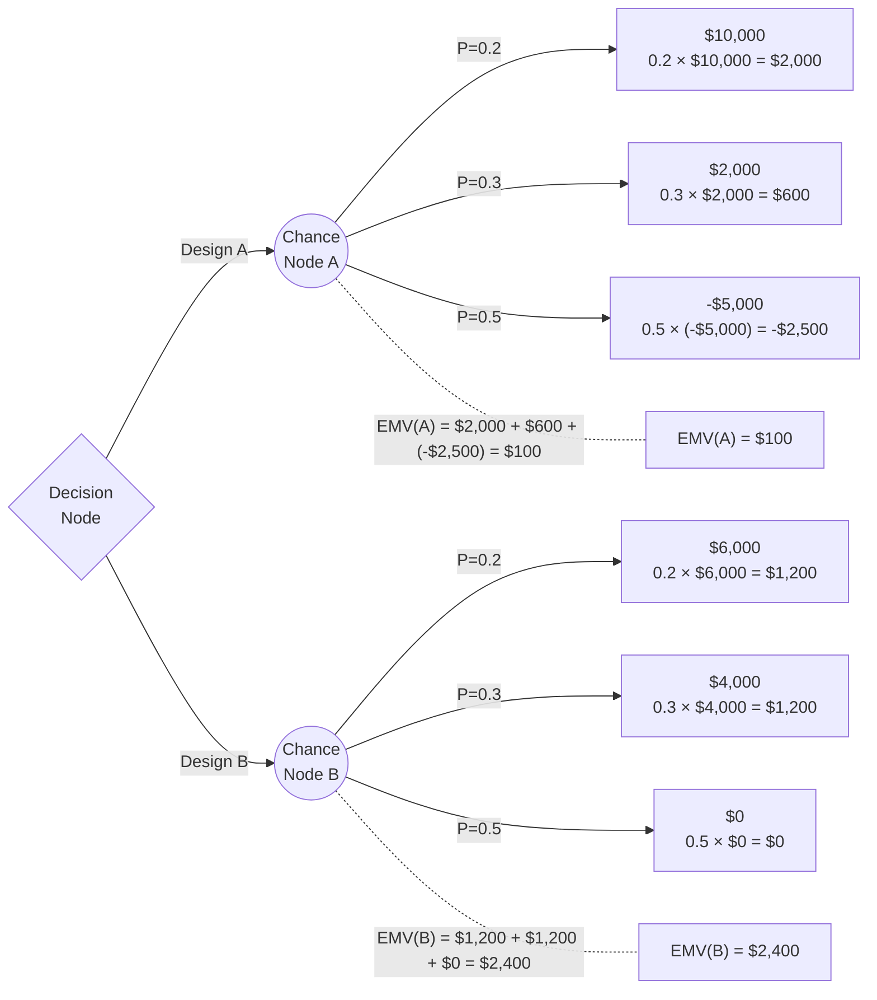

# Homework 3 Solutions

## SYS 304 — Trade Studies Risk Decision Analysis

---

## Question 1: Decision Tree and Expected Value (25 points)

### Problem Statement

A systems engineering firm has two design options to choose from to meet a contractual agreement with another company (customer): Design A and Design B. The return achieved by each of these depends on whether the customer operations are likely to expand in the future, stay the same, or reduce in the future. The payoff table for this scenario is given below.

| Alternative | Expand (0.2) | Same (0.3) | Reduce (0.5) |
|-------------|-------------|------------|--------------|
| Design A    | $10,000     | $2,000     | -$5,000      |
| Design B    | $6,000      | $4,000     | $0           |

Draw the decision tree to represent this situation and perform the necessary calculations to determine which one of the two designs is better. Which design should you choose to maximize the expected value?

### Solution

#### Decision Tree

#### EMV Calculations

**Design A — Expected Monetary Value:**

EMV(A) = P(Expand) × Payoff(Expand) + P(Same) × Payoff(Same) + P(Reduce) × Payoff(Reduce)

EMV(A) = (0.2)($10,000) + (0.3)($2,000) + (0.5)(−$5,000)

EMV(A) = $2,000 + $600 + (−$2,500)

**EMV(A) = $100**

**Design B — Expected Monetary Value:**

EMV(B) = P(Expand) × Payoff(Expand) + P(Same) × Payoff(Same) + P(Reduce) × Payoff(Reduce)

EMV(B) = (0.2)($6,000) + (0.3)($4,000) + (0.5)($0)

EMV(B) = $1,200 + $1,200 + $0

**EMV(B) = $2,400**

#### Decision

| Alternative | EMV     |
|-------------|---------|
| Design A    | $100    |
| Design B    | $2,400  |

**Choose Design B** because EMV(B) = $2,400 > EMV(A) = $100. Design B has the higher expected monetary value and is therefore the better choice to maximize expected value.

---

## Question 2: Bayesian Probability — Marketing Survey (40 points)

### Problem Statement

A start-up company has plans to develop a new software application. However, the company believes that the chances of success for the application are only about 40%. A contractor has suggested that the company conduct a survey in the community to get a better feeling of the demand for the application. There is a 0.9 probability that the research will be favorable if the product is successful. Furthermore, it is estimated that there is a 0.8 probability that the marketing research will be unfavorable if the product is unsuccessful. Determine the chances of a successful product given a favorable result from the marketing survey.

### Solution

We apply Bayes' Theorem to update the belief about product success after observing a favorable survey result.

**Step 1: Identify Prior Probabilities**

- P(Success) = 0.40
- P(Unsuccessful) = 1 − 0.40 = 0.60

**Step 2: Identify Conditional Probabilities (Survey Reliability)**

- P(Favorable | Success) = 0.90
- P(Unfavorable | Unsuccessful) = 0.80
- P(Favorable | Unsuccessful) = 1 − 0.80 = 0.20 (false positive rate)

**Step 3: Calculate Joint Probabilities**

P(Success AND Favorable) = P(Favorable | Success) × P(Success) = 0.90 × 0.40 = **0.36**

P(Unsuccessful AND Favorable) = P(Favorable | Unsuccessful) × P(Unsuccessful) = 0.20 × 0.60 = **0.12**

**Step 4: Calculate Marginal Probability of a Favorable Survey**

P(Favorable) = P(Success AND Favorable) + P(Unsuccessful AND Favorable)

P(Favorable) = 0.36 + 0.12 = **0.48**

**Step 5: Apply Bayes' Theorem for Posterior Probability**

P(Success | Favorable) = P(Success AND Favorable) / P(Favorable)

P(Success | Favorable) = 0.36 / 0.48

**P(Success | Favorable) = 0.75 = 75%**

### Answer

Given a favorable result from the marketing survey, the probability that the product will be successful is **75%**.

---

## Question 3: Pilot Study Decision Analysis (35 points)

### Problem Statement

A hardware development company considers launching a new product computer hardware. Because of the initial investment needed the company has decided to conduct a pilot study to assess the market for the product. The pilot study cost is $10,000, and it can be either successful or not successful. The company's main decision is whether to build a large manufacturing facility, a small manufacturing facility, or no facility at all. With a favorable market, the company expects to make $90,000 from the large facility or $60,000 from the smaller facility. If the market is unfavorable, however, the company estimates a loss of $30,000 with the large facility, and a loss of $20,000 with the small facility. The probability of a favorable market given a successful pilot is 0.8. The probability of an unfavorable market given an unsuccessful pilot study result is estimated to be 0.9. The company believes that there is a 50-50 chance the pilot study will be successful. The company could bypass the pilot study and simply make the decision as to whether build a large plant, small plant, or no facility at all. Without doing any testing in the pilot study, the company estimates that the probability of a successful market is 0.6. Analyze the decision problem and provide your recommendation.

### Solution

We compare two strategies: (A) decide immediately without a pilot study, or (B) conduct the pilot study first then decide based on the result.

#### Part 1: Prior Decision (Without Pilot Study)

**Given:**

- P(Favorable Market) = 0.60
- P(Unfavorable Market) = 0.40

**EMV Calculations:**

EMV(Large) = (0.60)($90,000) + (0.40)(−$30,000) = $54,000 − $12,000 = **$42,000**

EMV(Small) = (0.60)($60,000) + (0.40)(−$20,000) = $36,000 − $8,000 = **$28,000**

EMV(None) = **$0**

**Best prior decision: Build Large Facility (EMV = $42,000)**

#### Part 2: Pilot Study Conditional Probabilities

- P(Successful Pilot) = 0.50, P(Unsuccessful Pilot) = 0.50
- P(Favorable Market | Successful Pilot) = 0.80
- P(Unfavorable Market | Successful Pilot) = 1 − 0.80 = 0.20
- P(Unfavorable Market | Unsuccessful Pilot) = 0.90
- P(Favorable Market | Unsuccessful Pilot) = 1 − 0.90 = 0.10

#### Part 3: EMVs Given Pilot Results (Including $10,000 Study Cost)

**If Pilot Study is Successful:**

EMV(Large | Success) = (0.80)($90,000) + (0.20)(−$30,000) − $10,000 = $72,000 − $6,000 − $10,000 = **$56,000**

EMV(Small | Success) = (0.80)($60,000) + (0.20)(−$20,000) − $10,000 = $48,000 − $4,000 − $10,000 = **$34,000**

EMV(None | Success) = $0 − $10,000 = **−$10,000**

**Best action if pilot successful: Build Large Facility (EMV = $56,000)**

**If Pilot Study is Unsuccessful:**

EMV(Large | Unsuccessful) = (0.10)($90,000) + (0.90)(−$30,000) − $10,000 = $9,000 − $27,000 − $10,000 = **−$28,000**

EMV(Small | Unsuccessful) = (0.10)($60,000) + (0.90)(−$20,000) − $10,000 = $6,000 − $18,000 − $10,000 = **−$22,000**

EMV(None | Unsuccessful) = $0 − $10,000 = **−$10,000**

**Best action if pilot unsuccessful: Build None (EMV = −$10,000)**

#### Part 4: Total Expected Value with Pilot Study

EMV(With Pilot) = P(Success) × EMV(Best | Success) + P(Unsuccessful) × EMV(Best | Unsuccessful)

EMV(With Pilot) = (0.50)($56,000) + (0.50)(−$10,000)

EMV(With Pilot) = $28,000 − $5,000

**EMV(With Pilot) = $23,000**

#### Part 5: Comparison and Recommendation

| Strategy                | Expected Value |
|------------------------|---------------|
| No Pilot — Build Large | $42,000       |
| Conduct Pilot Study    | $23,000       |

Expected Value of Sample Information (EVSI) = $23,000 − $42,000 = **−$9,000**

### Recommendation

**Do not conduct the pilot study. Build the large manufacturing facility immediately.**

The EMV of deciding now ($42,000) significantly exceeds the EMV of conducting the pilot study first ($23,000). The EVSI is negative (−$9,000), meaning the information gained from the pilot study is not worth its $10,000 cost. The prior probability of a favorable market (0.60) is already strong enough to justify the large facility investment without further testing.