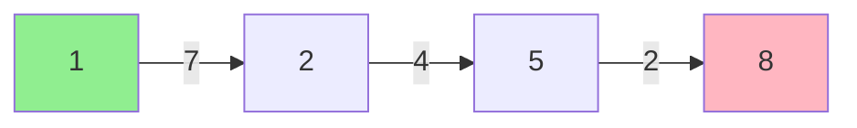

# SYS 304 Homework 4 — Solutions

---

## Question 1 – Linear Programming

### (a) Formulation

Decision variables:
- x1 = number of navigation units produced
- x2 = number of communication units produced

Objective function (maximize profit):

    Maximize Z = 60*x1 + 50*x2

Subject to constraints:

    4*x1 + 3*x2 <= 240    (labor hours)
    2*x1 + 5*x2 <= 200    (testing hours)
    3*x1 + 2*x2 <= 180    (material units)
    x1 >= 0, x2 >= 0       (nonnegativity)

### (b) Solution

We solve by finding the corner points of the feasible region. The constraints define a polygon, and the optimal solution must occur at a vertex.

First, find where constraint lines intersect.

Intersection of labor and testing:
    4*x1 + 3*x2 = 240    ... (1)
    2*x1 + 5*x2 = 200    ... (2)

Multiply (2) by 2: 4*x1 + 10*x2 = 400
Subtract (1): 7*x2 = 160, so x2 = 160/7 = 22.86
From (2): 2*x1 = 200 - 5*(160/7) = 200 - 800/7 = 600/7, so x1 = 300/7 = 42.86

Intersection of labor and material:
    4*x1 + 3*x2 = 240    ... (1)
    3*x1 + 2*x2 = 180    ... (3)

Multiply (1) by 2: 8*x1 + 6*x2 = 480
Multiply (3) by 3: 9*x1 + 6*x2 = 540
Subtract: x1 = 60
From (3): 3(60) + 2*x2 = 180, so x2 = 0

Intersection of testing and material:
    2*x1 + 5*x2 = 200    ... (2)
    3*x1 + 2*x2 = 180    ... (3)

Multiply (2) by 3: 6*x1 + 15*x2 = 600
Multiply (3) by 2: 6*x1 + 4*x2 = 360
Subtract: 11*x2 = 240, so x2 = 240/11 = 21.82
From (3): 3*x1 = 180 - 2*(240/11) = 180 - 480/11 = 1500/11, so x1 = 500/11 = 45.45

Axis intercepts:
- Labor only: x1 = 60, x2 = 0 or x1 = 0, x2 = 80
- Testing only: x1 = 100, x2 = 0 or x1 = 0, x2 = 40
- Material only: x1 = 60, x2 = 0 or x1 = 0, x2 = 90

Corner points of the feasible region and their profit values:

    (0, 0):       Z = 0
    (60, 0):      Z = 60(60) + 50(0) = 3600
    (0, 40):      Z = 60(0) + 50(40) = 2000
    (300/7, 160/7) = (42.86, 22.86):  Z = 60(300/7) + 50(160/7) = 18000/7 + 8000/7 = 26000/7 = 3714.29
    (500/11, 240/11) = (45.45, 21.82): Z = 60(500/11) + 50(240/11) = 30000/11 + 12000/11 = 42000/11 = 3818.18

We need to verify which corner points are actually feasible (satisfy all constraints).

Check (300/7, 160/7):
- Labor: 4(300/7) + 3(160/7) = 1200/7 + 480/7 = 1680/7 = 240 ✓
- Testing: 2(300/7) + 5(160/7) = 600/7 + 800/7 = 1400/7 = 200 ✓
- Material: 3(300/7) + 2(160/7) = 900/7 + 320/7 = 1220/7 = 174.3 <= 180 ✓

Check (500/11, 240/11):
- Labor: 4(500/11) + 3(240/11) = 2000/11 + 720/11 = 2720/11 = 247.3 > 240 ✗ NOT FEASIBLE

Check (60, 0):
- Labor: 4(60) + 3(0) = 240 ✓
- Testing: 2(60) + 5(0) = 120 <= 200 ✓
- Material: 3(60) + 2(0) = 180 ✓

So the feasible corner points and profits are:

    (0, 0):     Z = 0
    (60, 0):    Z = 3600
    (0, 40):    Z = 2000
    (42.86, 22.86): Z = 3714.29

The optimal solution is:

    x1 = 300/7 ≈ 42.86 navigation units
    x2 = 160/7 ≈ 22.86 communication units
    Maximum profit Z = 26000/7 ≈ $3,714.29

### (c) Constraint analysis

At the optimum (300/7, 160/7):

- Labor: 4(300/7) + 3(160/7) = 240. Used = 240, Available = 240. BINDING. All labor hours are fully utilized.
- Testing: 2(300/7) + 5(160/7) = 200. Used = 200, Available = 200. BINDING. All testing hours are fully utilized.
- Material: 3(300/7) + 2(160/7) = 174.3. Used = 174.3, Available = 180. NOT BINDING. There are 5.7 material units of slack.

Operationally, this means labor and testing are the bottleneck resources. Any increase in labor or testing capacity could improve profit. Material capacity has surplus, so acquiring more material would not help.

### (d) Engineering interpretation

This LP model supports engineering production decisions by identifying the profit-maximizing product mix given limited resources. It reveals which resources are bottlenecks (binding constraints) and which have surplus. A production manager can use this to prioritize capacity investments — in this case, expanding labor or testing capacity would increase profit, while adding material capacity would not. The model provides a quantitative basis for resource allocation rather than relying on intuition.

---

## Question 2 – Dynamic Programming

### (a) Stages and states

- Stage 1: State = {1} (starting node)
- Stage 2: States = {2, 3}
- Stage 3: States = {4, 5}
- Stage 4: State = {8} (destination)

The decision at each stage is which node to travel to next.

### (b) Backward recursion

We work backward from the destination (Node 8), computing the minimum cost-to-go f(s) at each node s.

**Stage 4 (destination):**

    f(8) = 0   (already at destination, no further cost)

**Stage 3 (Nodes 4, 5):**

Each node in Stage 3 can only go to Node 8.

    f(4) = cost(4->8) + f(8) = 6 + 0 = 6, go to 8
    f(5) = cost(5->8) + f(8) = 2 + 0 = 2, go to 8

**Stage 2 (Nodes 2, 3):**

Each node can go to Node 4 or Node 5.

    f(2) = min{ cost(2->4) + f(4), cost(2->5) + f(5) }
         = min{ 6 + 6, 4 + 2 }
         = min{ 12, 6 }
         = 6, go to 5

    f(3) = min{ cost(3->4) + f(4), cost(3->5) + f(5) }
         = min{ 3 + 6, 8 + 2 }
         = min{ 9, 10 }
         = 9, go to 4

**Stage 1 (Node 1):**

Node 1 can go to Node 2 or Node 3.

    f(1) = min{ cost(1->2) + f(2), cost(1->3) + f(3) }
         = min{ 7 + 6, 5 + 9 }
         = min{ 13, 14 }
         = 13, go to 2

### (c) Optimal path

Minimum total cost = 13.

Tracing the decisions forward:
- Start at Node 1, go to Node 2 (cost 7)
- From Node 2, go to Node 5 (cost 4)
- From Node 5, go to Node 8 (cost 2)

Optimal path: 1 -> 2 -> 5 -> 8, total cost = 7 + 4 + 2 = 13.

### (d) Explanation

Dynamic programming is appropriate for this problem because it exhibits optimal substructure — the optimal path from Node 1 to Node 8 is composed of optimal sub-paths. If the best route goes through Node 2, then the portion from Node 2 to Node 8 must itself be the cheapest route from Node 2 to Node 8. DP also avoids enumerating all possible paths (which grows exponentially with network size) by solving smaller subproblems once and reusing their solutions. The stage structure (nodes grouped into sequential stages) maps naturally to the DP backward recursion framework.

---

## Question 3 – Goal Programming

### (a) Goal programming formulation

**Decision variables:**
- x = units of Product 1 produced per week
- y = units of Product 2 produced per week

**Deviation variables for Goal 1 (profit >= 1400):**
- d1_plus = amount by which profit exceeds $1,400 (overachievement)
- d1_minus = amount by which profit falls short of $1,400 (underachievement)

**Deviation variables for Goal 2 (minimize unused machine capacity):**

We need deviation variables for each machine's capacity constraint:
- d2_plus = overuse of Machine 1 (infeasible, so this is constrained to 0 by system constraints)
- d2_minus = unused capacity on Machine 1
- d3_plus = overuse of Machine 2
- d3_minus = unused capacity on Machine 2
- d4_plus = overuse of Machine 3
- d4_minus = unused capacity on Machine 3

Since machine capacities are hard constraints (cannot exceed), we have d2_plus = d3_plus = d4_plus = 0. So the machines are system constraints, not goal constraints. For Goal 2, we minimize the slack variables (d2_minus + d3_minus + d4_minus).

**Goal constraints:**

    Goal 1 (profit):
    12*x + 18*y + d1_minus - d1_plus = 1400

    Machine constraints (as goal constraints for Goal 2):
    0.2*x + 0.5*y + d2_minus = 50     (Machine 1)
    0.4*x + 0.2*y + d3_minus = 40     (Machine 2)
    0.3*x + 0.3*y + d4_minus = 45     (Machine 3)

**System constraints:**

    x <= 90      (demand limit)
    y <= 90      (demand limit)
    x >= 0, y >= 0
    all deviation variables >= 0

**Preemptive priority objective function:**

    Minimize:
        P1: d1_minus                              (Priority 1: minimize profit shortfall)
        P2: d2_minus + d3_minus + d4_minus         (Priority 2: minimize unused capacity)

where P1 has absolute priority over P2. We first minimize d1_minus regardless of P2, then within solutions that achieve the best d1_minus, we minimize total unused capacity.

### (b) Deviation variables

**d1_minus** (profit underachievement): the dollar amount by which weekly profit falls below $1,400. This is UNDESIRABLE under Priority 1 because management wants at least $1,400 profit. We want d1_minus = 0.

**d1_plus** (profit overachievement): the dollar amount by which weekly profit exceeds $1,400. This is NOT undesirable — earning more than the target is acceptable. It appears in the goal constraint for balance but is not penalized in the objective.

**d2_minus** (Machine 1 slack): unused hours on Machine 1 per week. UNDESIRABLE under Priority 2 because management wants to minimize idle machine time.

**d3_minus** (Machine 2 slack): unused hours on Machine 2 per week. UNDESIRABLE under Priority 2.

**d4_minus** (Machine 3 slack): unused hours on Machine 3 per week. UNDESIRABLE under Priority 2.

The machine overuse deviations (d2_plus, d3_plus, d4_plus) are not included because machine capacities are hard limits that cannot be exceeded.

### (c) Solution logic

The preemptive priority method solves the problem in a sequence of LP subproblems, one for each priority level:

**Step 1 — Solve for Priority 1:**
Solve an LP that minimizes d1_minus (profit shortfall) subject to all goal constraints, system constraints, and nonnegativity. The machine constraints and demand limits are hard constraints. The solver finds the production plan that comes closest to (or achieves) the $1,400 profit target. Let the result be d1_minus* (the best achievable shortfall, ideally 0).

**Step 2 — Solve for Priority 2:**
Add a new constraint: d1_minus = d1_minus* (lock in the Priority 1 achievement). Then solve a new LP that minimizes d2_minus + d3_minus + d4_minus (total unused machine capacity) subject to all previous constraints plus this new locking constraint. This ensures we never sacrifice profit performance to improve machine utilization.

The key principle is that a lower-priority goal can never degrade a higher-priority goal's achievement. Each priority level is solved independently in sequence, with the result of higher priorities locked as constraints before optimizing the next level.

### (d) Interpretation

Goal programming is more suitable than standard LP here because management has multiple, potentially conflicting objectives with different priority levels. Standard LP can only optimize a single objective function. If we used LP to maximize profit alone, we would ignore the machine utilization goal entirely. If we combined both into a single weighted objective, we would need to assign arbitrary weights that trade off dollars of profit against hours of machine idle time — a comparison that is not meaningful.

Goal programming handles this by allowing the decision maker to specify target levels and priority ordering rather than forcing a single-metric optimization. The preemptive priority structure ensures that the most important goal (profit) is satisfied first, and only then does the solver attempt to improve secondary goals (machine utilization) without compromising the primary goal.

---

## Bonus: Comparison

**Linear Programming:**
- Addresses: single-objective optimization with linear constraints and a linear objective. Finds the best value of one metric (e.g., maximize profit or minimize cost).
- Advantage: computationally efficient (simplex method), guaranteed global optimum, provides sensitivity analysis and shadow prices.
- Limitation: can only handle one objective. All relationships must be linear. Cannot naturally handle sequential or multi-stage decisions.

**Dynamic Programming:**
- Addresses: sequential or multi-stage decision problems where a decision at each stage affects the state and cost of future stages. Finds the optimal policy over a sequence of decisions.
- Advantage: breaks a complex problem into smaller overlapping subproblems, avoids exponential enumeration through the principle of optimality. Handles nonlinear costs and discrete choices naturally.
- Limitation: suffers from the "curse of dimensionality" — the number of states grows exponentially with the number of state variables, making large problems computationally intractable.

**Goal Programming:**
- Addresses: multi-objective decision problems where the decision maker has several (possibly conflicting) goals with different priority levels or weights. Finds solutions that satisfy goals as closely as possible.
- Advantage: handles multiple objectives with priority ordering. Does not require converting all objectives to a common unit. Reflects real-world decision making where managers have ranked targets.
- Limitation: solutions depend heavily on the chosen priority structure and target values. Does not guarantee Pareto optimality. Can be harder to interpret than single-objective LP solutions.
